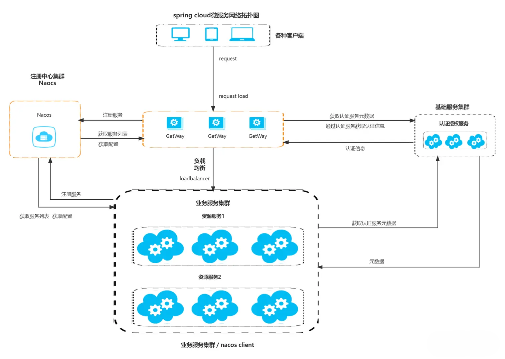
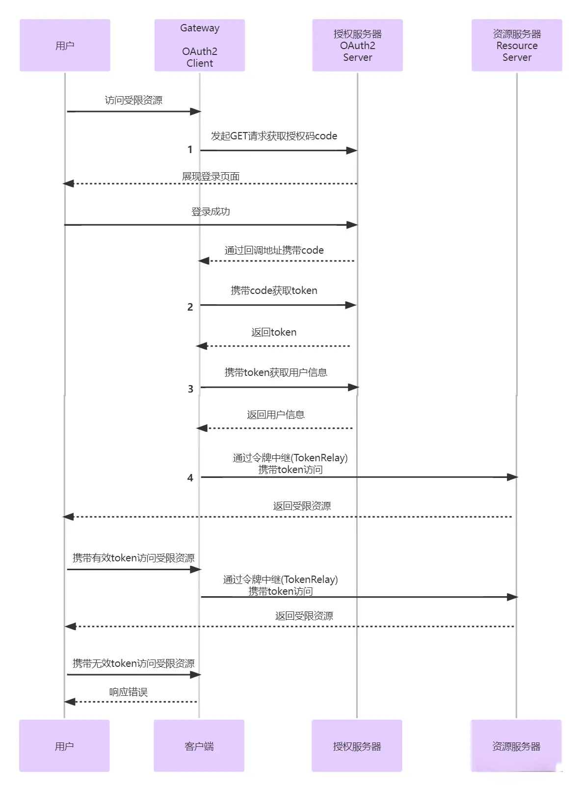

# SpringGateway

* 集成SpringOAuth2,Spring OAuth2 ResourceServer,Spring Client

* 架构图

  

* 流程图

  * 用户请求受限资源
  * 网关检测没有认证信息,通过`RedirectServerAuthenticationEntryPoint`处理并发起OAuth2登录授权申请
  * 授权申请到达认证服务,认证服务检测到未登录重定向至登录页面并展示给用户
  * 用户登录成功后请求重定向至授权申请接口,通过校验后携带Token重定向至回调地址(redirect_uri)
    * 注意:这里回调地址要设置为网关的地址,htttp://{网关ip}:{网关port}/login/oauth2/code/{registrationId},`/login/oauth2/code/{registrationId}`是固定的,由Security OAuth2 Client自带
  * 请求到达网关,由`OAuth2LoginAuthenticationWebFilter`拦截并调用父类`AuthenticationWebFilter`的`filter`方法进行处理
  * `AuthenticationWebFilter`调用`OidcAuthorizationCodeReactiveAuthenticationManager`或`OAuth2LoginReactiveAuthenticationManager`类处理
    * 由授权申请的`scope`决定,包含`openid`就走`OidcAuthorizationCodeReactiveAuthenticationManager`,否则走另一个
  * 在获取AccessToken成功以后调用`ReactiveOAuth2UserService`获取用户信息
  * 获取到用户信息后会解析并将认证信息保存至`ReactiveSecurityContextHolder`中
  * 完成这一系列的认证之后会重定向至最一开始请求的受限资源,这时候就能获取到认证信息了
  * 如果访问的是被网关代理的服务则会通过令牌中继(TokenRelay)携带token访问

  

  

