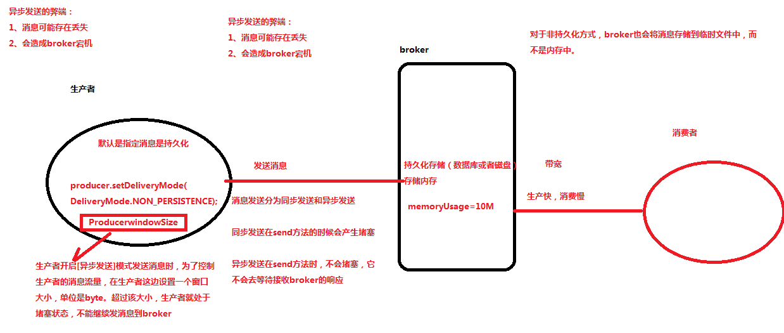
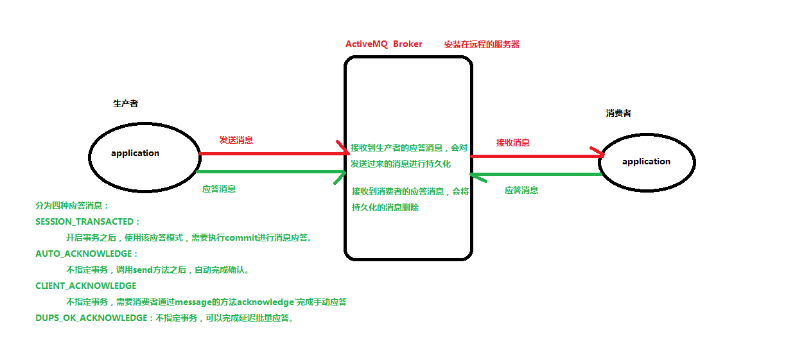
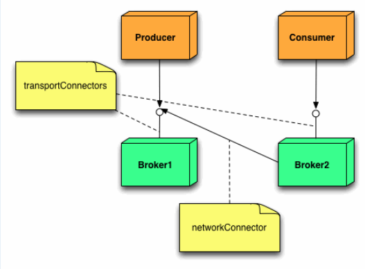

# ActiveMQ


# JMS


## 概述

* JMS的全称是Java Message Service,即Java消息服务,是一种接口规范
* 它包含点对点(Point to Point,PTP)和发布/订阅(Publish/Subscribe,pub/sub)两种消息模型,提供可靠消息传输、事务和消息过滤等机制
* MOM:Message-Oriented Middleware):面向消息的中间件,使用消息中间件来协调消息传输操作.MOM需要提供API和管理工具
  * 客户端调用api, 把消息发送到消息中间件指定的目的地
  * 在消息发送之后,客户端会继续执行其他的工作
  * 接收方收到这个消息确认之前,消息中间件一直保留该消息


## 作用

* 主要用于在生产者和消费者之间进行消息传递,生产者负责产生消息,而消费者负责接收消息
* 在不同应用之间进行通信或者从一个系统传输数据到另外一个系统
* 两个应用程序之间,或分布式系统中发送消息,进行异步通信,完成程序或者应用之间的解耦
* 把它应用到实际的业务需求中的话我们可以在特定的时候利用生产者生成一消息,并进行发送,对应的消费者在接收到对应的消息后去完成对应的业务逻辑


## 应用场景

* 主要可以应用于规模和复杂度较高的分布式系统
* 异步通信:客户发出调用后,不用等待服务对象完成处理并返回结果后就能继续执行
* 客户和服务对象的生命周期解耦合:客户进程和服务对象进程不需要都正常运行
* 如果由于服务对象崩溃或者网络故障导致客户的请求不可达,不会影响客户端想正常响应
* 一对一或者一对多通信:客户的一次调用可以发送给一个或者多个目标对象


## 消息模型


### 点对点

* 基于队列
* 消息的生产者和消费者之间没有时间上的相关性
* 生产者把消息发送到队列中(Queue),可以有多个发送者,但只能被一个消费者消费
* 一个消息只能被一个消费者消费一次
* 消费者无需订阅,当消费者未消费到消息时就会处于阻塞状态


### 发布者/订阅者

* 基于主题
* 生产者和消费者之间有时间上的相关性,订阅一个主题的消费者只能消费自它订阅之后发布的消息
* 生产者将消息发送到主题上(Topic)
* 消费者必须先订阅,JMS规范允许提供客户端创建持久订阅
  * 持久化订阅者:特殊的消费者,告诉主题,我一直订阅着,即使网络断开
  * 消息服务器也记住所有持久化订阅者,如果有新消息,也会知道必定有人会来消费


## 消息发送模式


* JMS消息发送模式有两种:Queue模式(点对点模型)和Topic模式(发布订阅模型)
* JMS消息有四个消息域:Queue region、Topic region、TempQueue域、TempTopic域
* 这两种发送模式各自有对应的Destination(目的地):Queue(队列)和Topic(主题)


### 队列模式

* Queue,对应点对点模型,即一个生产者对应一个消费者,可以有多个生产者,但只能拥有一个消费者
* 一个生产者向一个特定的队列发布消息,一个消费者从该队列中读取消息
* 生产者知道消费者的队列,并直接将消息发送到消费者的队列
* 这种模式被概括为:只有一个消费者将获得消息
* 生产者不需要在接收者消费该消息期间处于运行状态,接收者也同样不需要在消息发送时处于运行状态
* 每一个成功处理的消息都由接收者签收


### 主题模式

* Topic,是一对多的发布/订阅模式.即一个生产者可以对应多个消费者,消费者只需要订阅指定生产者的消息即可
* 发布者/订阅者模式支持向一个特定的消息主题发布消息
* 0或多个订阅者可能对接收来自特定消息主题的消息感兴趣
* 在这种模型下,发布者和订阅者彼此不知道对方.这种模式好比是匿名公告板
* 这种模式被概括为:多个消费者可以获得消息,在发布者和订阅者之间存在时间依赖性
* 发布者需要建立一个订阅(subscription),以便客户能够购订阅
* 订阅者必须保持持续的活动状态以接收消息,除非订阅者建立了持久的订阅.在那种情况下,在订阅者未连接时发布的消息将在订阅者重新连接时重新发布


## 消息组成


* 包含消息头,消息正文,消息属性


### 消息正文

* StreamMessage:Java原始值的数据流
* MapMessage:一套名称-值对
* TextMessage:一个字符串对象
* ObjectMessage:一个序列化的 Java对象
* BytesMessage:一个字节的数据流


## 接口规范


### ConnectionFactory

* 接口,连接工厂
* 用户用来创建到JMS提供者的连接的被管对象
* JMS客户通过可移植的接口访问连接,这样当下层的实现改变时,代码不需要进行修改
* 管理员在JNDI名字空间中配置连接工厂,这样,JMS客户才能够查找到它们
* 根据消息类型的不同,用户将使用队列连接工厂,或者主题连接工厂


### Connection

* 接口,连接
* 连接代表了应用程序和消息服务器之间的通信链路
* 在获得了连接工厂后,就可以创建一个与JMS提供者的连接
* 根据不同的连接类型,连接允许用户创建会话,以发送和接收队列和主题到目标


### Session

* 接口,会话
* 表示一个单线程的上下文,用于发送和接收消息
* 由于会话是单线程的,所以消息是连续的,就是说消息是按照发送的顺序一个一个接收的
* 会话的好处是它支持事务.如果用户选择了事务支持,会话上下文将保存为一组消息,直到事务被提交才发送这些消息
* 在提交事务之前,用户可以使用回滚操作取消这些消息
* 一个会话允许用户创建消息生产者来发送消息,创建消息消费者来接收消息


### Destination

* 接口,目标,即Queue或Topic
* 目标是一个包装了消息目标标识符的被管对象
* 消息目标是指消息发布和接收的地点,或者是队列,或者是主题
* JMS管理员创建这些对象,然后用户通过JNDI发现它们
* 和连接工厂一样,管理员可以创建两种类型的目标,点对点模型的队列,以及发布者/订阅者模型的主题


### MessageConsumer

* 接口,消息消费者
* 由会话创建的对象,用于接收发送到目标的消息
* 消费者可以同步地(阻塞模式),或异步(非阻塞)接收队列和主题类型的消息


### MessageProducer

* 接口,消息生产者
* 由会话创建的对象,用于发送消息到目标
* 用户可以创建某个目标的发送者,也可以创建一个通用的发送者,在发送消息时指定目标


### Message

* 接口,消息
* 是在消费者和生产者之间传送的对象,也就是说从一个应用程序创送到另一个应用程序
* 一个消息有三个主要部分:
  * 消息头:必须.包含用于识别和为消息寻找路由的操作设置
  * 一组消息属性:可选.包含额外的属性,支持其他提供者和用户的兼容.可以创建定制的字段和过滤器(消息选择器)
  * 一个消息体:可选.允许用户创建五种类型的消息(文本消息,映射消息,字节消息,流消息和对象消息)
* 消息接口非常灵活,并提供了许多方式来定制消息的内容


# 概述

* 多种语言和协议编写客户端.包括Java, C, C++,C#,Ruby,Perl,Python,PHP
* 应用协议:OpenWire,Stomp,REST,WS Notification,XMPP,AMQP
* 完全支持JMS1.1和J2EE 1.4规范 (持久化,XA消息,事务)
* 支持多种传输协议:in-VM,TCP,SSL,NIO,UDP,JGroups,JXTA
* 支持通过JDBC和journal提供高速的消息持久化
* 从设计上保证了高性能的集群


# 安装

* apache[官网](http://activemq.apache.org/download-archives.html)下载,解压
* 安装必要的JDK环境
* 启动:cd activemq/bin/,./activemq start
* 访问Active后台:http://192.168.10.135:8161/admin/,用户名和密码默认都是admin
* 主要的配置文件有active的jar包,
* data:ActiveMQ数据默认存储文件夹
* webapps:ActiveMQ网页端监控,配置文件都在conf文件夹中
* bin:该文件夹中有个active脚本,可用来start,stop,status当前active
* conf:该文件中有active的各种配置文件
  * jetty.xml:启动webapps需要配置,类似tomcat的settings.xml
  * jetty-realm.properties:登录网页端配置的用户名和密码等
  * groups,user.properties:Jetty的权限配置文件
  * active.xml:ActiveMQ主要配置文件,集群,端口等在该文件配置


# 组件


## Destination

* 相比于RabbitMQ多了一个Destination,由JMS Provider(消息中间件)负责维护,用于管理Message.而Producer需要指定Destination才能发送消息,Consumer也需要指定Destination才能接收消息


## Producer

* 消息的生产者,发送message到目的地,应用接口为MessageProducer


## Consumer(Receiver)

* 消息消费者,负责从目的地中(处理,监听,订阅)message,应用接口MessageConsumer


## Message

* 消息内容.常见有StreamMessage,BytesMessage,TextMessage,ObjectMessage,MapMessage.若是要实现自己的消息接口,实体类就需要实现Serializable接口


## ConnectionFactory

* 连接工厂,非jdbc的工厂


## Connection

* 链接,创建访问ActiveMQ连接,由工厂创建


## Session

* 会话,一次持久有效有状态的访问,由链接创建


## Queue

* 队列,是Destination的子接口,处在队列中的消息,只能由一个Consumer消费,消费完之后删除


## Topic

* 主题,Destination的子接口,和RabbitMQ中的Topic差不多,可重复处理信息

<!--
    Licensed to the Apache Software Foundation (ASF) under one or more
    contributor license agreements.  See the NOTICE file distributed with
    this work for additional information regarding copyright ownership.
    The ASF licenses this file to You under the Apache License, Version 2.0
    (the "License"); you may not use this file except in compliance with
    the License.  You may obtain a copy of the License at

```xml
http://www.apache.org/licenses/LICENSE-2.0

Unless required by applicable law or agreed to in writing, software
distributed under the License is distributed on an "AS IS" BASIS,
WITHOUT WARRANTIES OR CONDITIONS OF ANY KIND, either express or implied.
See the License for the specific language governing permissions and
limitations under the License.
```
-->
<!-- START SNIPPET: example -->
<beans
  xmlns="http://www.springframework.org/schema/beans"
  xmlns:xsi="http://www.w3.org/2001/XMLSchema-instance"
  xsi:schemaLocation="http://www.springframework.org/schema/beans http://www.springframework.org/schema/beans/spring-beans.xsd
  http://activemq.apache.org/schema/core http://activemq.apache.org/schema/core/activemq-core.xsd">

```xml
<!-- Allows us to use system properties as variables in this configuration file -->
<bean class="org.springframework.beans.factory.config.PropertyPlaceholderConfigurer">
    <property name="locations">
        <value>file:${activemq.conf}/credentials.properties</value>
    </property>
</bean>

<!-- Allows log searching in hawtio console -->
<bean id="logQuery" class="org.fusesource.insight.log.log4j.Log4jLogQuery"
      lazy-init="false" scope="singleton"
      init-method="start" destroy-method="stop">
</bean>

<!--
    The <broker> element is used to configure the ActiveMQ broker.
-->
<broker xmlns="http://activemq.apache.org/schema/core" brokerName="localhost" dataDirectory="${activemq.data}">

    <!-- 安全验证 -->
    <!-- 配置jaas验证插件,登录的用户名密码等在login.conf里配置 -->
     <!--
     <plugins>
        <jaasAuthenticationPlugin configuration="activemq" />
        <authorizationPlugin>
            <map>
                <authorizationMap>
                    <authorizationEntries>
                        topic:表示topic模式,>表示所有的topic请求都验证.admins是用户组,在login.conf中配置
                        <authorizationEntry topic=">" read="admins" write="admins" admin="admins" />
                        <authorizationEntry queue=">" read="admins" write="admins" admin="admins" />
                        active内部自用
                        <authorizationEntry topic="ActiveMQ.Advisory.>" read="admins" write="admins" admin="admins"/>
                        <authorizationEntry queue="ActiveMQ.Advisory.>" read="admins" write="admins" admin="admins"/>
                    </authorizationEntries>
                </authorizationMap>
            </map>
        </authorizationPlugin>
    </plugins>
	-->
    <destinationPolicy>
        <policyMap>
          <policyEntries>
            <policyEntry topic=">" >
                <!-- The constantPendingMessageLimitStrategy is used to prevent
                     slow topic consumers to block producers and affect other consumers
                     by limiting the number of messages that are retained
                     For more information, see:

                     http://activemq.apache.org/slow-consumer-handling.html

                -->
              <pendingMessageLimitStrategy>
                <constantPendingMessageLimitStrategy limit="1000"/>
              </pendingMessageLimitStrategy>
            </policyEntry>
          </policyEntries>
        </policyMap>
    </destinationPolicy>
```


```xml
    <!--
        The managementContext is used to configure how ActiveMQ is exposed in
        JMX. By default, ActiveMQ uses the MBean server that is started by
        the JVM. For more information, see:

        http://activemq.apache.org/jmx.html
    -->
    <managementContext>
        <managementContext createConnector="false"/>
    </managementContext>
   
    <!--
        Configure message persistence for the broker. The default persistence
        mechanism is the KahaDB store (identified by the kahaDB tag).
        For more information, see:

        http://activemq.apache.org/persistence.html
    -->
    <!-- 持久化策略 -->
    <!-- kahadb:一个文件型数据库,使用内存加文件保证数据持久化 -->
    <!-- kahadb是以日志形式存储消息,类似redis持久化的AOF.消息索引是B-Tree结构,支持JMS事务,支持多种恢复机制 -->
    <persistenceAdapter>
    		 <!-- directory:持久化数据目录,journalMaxFileLength:限制每个文件的大小,不是总大小 -->
        <kahaDB directory="${activemq.data}/kahadb" journalMaxFileLength="16mb"/>
    </persistenceAdapter>
    
    <!-- amq 
    <persistenceAdapter>
        <amqPersistenceAdapter directory="${activemq.data}/amq" maxFileLength="32mb"/>
    </persistenceAdapter>
    -->
	<!-- JDBC:数据库持久化,datasource数据源,需要配置一个bean,bean需要写在broker外.若数据库驱动用其他类,需要将jar包复制到active的lib文件夹中.createTablesOnStartup是否在启动mq时创建表,第一次启动时可选true,第2此启动之后就可以改为false 
    <persistenceAdapter>
        <jdbcPersistenceAdapter dataSource="#mysql-ds" createTablesOnStartup="false"/>
    </persistenceAdapter>
	-->
	
      <!--
        The systemUsage controls the maximum amount of space the broker will
        use before disabling caching and/or slowing down producers. For more information, see:
        http://activemq.apache.org/producer-flow-control.html
      -->
      <systemUsage>
        <systemUsage>
            <memoryUsage>
                <memoryUsage percentOfJvmHeap="70" />
            </memoryUsage>
            <storeUsage>
                <storeUsage limit="100 gb"/>
            </storeUsage>
            <tempUsage>
                <tempUsage limit="50 gb"/>
            </tempUsage>
        </systemUsage>
    </systemUsage>

    <!--
        The transport connectors expose ActiveMQ over a given protocol to
        clients and other brokers. For more information, see:

        http://activemq.apache.org/configuring-transports.html
    -->
    <!-- 支持的协议 -->
    <transportConnectors>
        <!-- DOS protection, limit concurrent connections to 1000 and frame size to 100MB -->
        <transportConnector name="openwire" uri="tcp://0.0.0.0:61616?maximumConnections=1000&amp;wireFormat.maxFrameSize=104857600"/>
        <transportConnector name="amqp" uri="amqp://0.0.0.0:5672?maximumConnections=1000&amp;wireFormat.maxFrameSize=104857600"/>
        <transportConnector name="stomp" uri="stomp://0.0.0.0:61613?maximumConnections=1000&amp;wireFormat.maxFrameSize=104857600"/>
        <transportConnector name="mqtt" uri="mqtt://0.0.0.0:1883?maximumConnections=1000&amp;wireFormat.maxFrameSize=104857600"/>
        <transportConnector name="ws" uri="ws://0.0.0.0:61614?maximumConnections=1000&amp;wireFormat.maxFrameSize=104857600"/>
    </transportConnectors>

    <!-- destroy the spring context on shutdown to stop jetty -->
    <shutdownHooks>
        <bean xmlns="http://www.springframework.org/schema/beans" class="org.apache.activemq.hooks.SpringContextHook" />
    </shutdownHooks>

</broker>

<!-- JDBC Datasource configuration 
<bean id="mysql-ds" class="org.apache.commons.dbcp.BasicDataSource" destroy-method="close">
    <property name="driverClassName" value="com.mysql.jdbc.Driver"/>
    <property name="url" value="jdbc:mysql://localhost/activemq"/>
    <property name="username" value="root"/>
    <property name="password" value="root"/>
    <property name="maxActive" value="200"/>
    <property name="poolPreparedStatements" value="true"/>
</bean>
-->

<!--
    Enable web consoles, REST and Ajax APIs and demos
    The web consoles requires by default login, you can disable this in the jetty.xml file

    Take a look at ${ACTIVEMQ_HOME}/conf/jetty.xml for more details
-->
<import resource="jetty.xml"/>
```

</beans>
<!-- END SNIPPET: example -->

Jetty.xml

```xml
<!-- Tcp等ip,端口配置 -->
```


# 生产者消息处理


## 持久化和非持久化

* ActiveMQ默认情况下使用持久传输
* 持久传输时,传输的消息会保存到磁盘中(messages are persisted to disk/database),即存储转发方式
  * 先把消息存储到磁盘中,然后再将消息给订阅者
  * 当Borker宕机恢复后,消息还在(消费者还没有来得及消费的情况下)
* 非持久传输时,发送的消息不会存储到磁盘中,而是存到内存中.当Borker宕机重启后,消息丢失
* 可以通过MessageProducer类的setDeliveryMode方法设置传输模式


## 同步发送和异步发送



* producer发送消息有同步和异步两种模式,在不考虑事务的情况下:

  * producer发送持久化消息是同步发送,发送是阻塞的,直到收到确认
  * producer发送非持久化消息是异步发送,异步发送不会等待broker的确认

* 消息生产者使用持久(persistent)传递模式发送消息时,Producer.send()会被阻塞,直到broker发送一个确认消息给生产者(Ack ),这个确认消息暗示broker已经成功接收到消息并把消息保存到二级存储中.这个过程通常称为同步发送

* 如果容忍一些消息的丢失,可以使用异步发送

* 异步发送不会在收到broker的确认之前一直阻塞Producer.send()

  ```java
  // 可以通过以下方式设置:
  // 设置ConnectionFactory时指定使用异步
  cf=new ActiveMQConnectionFactory("tcp://locahost:61616?jms.useAsyncSend=true");
  // 不在构造函数中指定,而是修改ConnectionFactory的配置
  ((ActiveMQConnectionFactory)connectionFactory).setUseAsyncSend(true);
  // 在实例化后的ActiveMQConnection对象中设置异步发送
  ((ActiveMQConnection)connection).setUseAsyncSend(true);
  ```


## 生产者流量控制


### ProducerWindowSize

* 可以分别对一个共享连接上的各个生产者进行流量控制,而不需要挂起整个连接
* 流量控制意味着当代理(broker)检测到目标(destination)的内存,或临时文件空间或文件存储空间超过了
  限制,消息的流量可以被减慢.生产者将会被阻塞直至资源可用,或者收到一个JMSException异常.这种行为是可配置的
* 当内存限制或限制达到的时候,默认的设置会引起生产者阻塞.这种阻塞行为有时会被误解为挂起的生产者,而事实是生产者只是勤奋地等着空间可用
* 同步发送的消息将会自动对每一个生产者使用流量控制,除非你使能了useAsyncSend标志,否则这将对同
  步发送的持久化消息都适用
* 使用异步发送的生产者(一般来说,就是发送非持久化消息的生产者)不需要等候来自代理的任何确认消息.所以,如果内存限制被超过了,你不会被通知.如果你真的想知道什么时候代理的限制被超过了,需要配置 ProducerWindowSize这一连接选项,这样就算是异步消息也会对每一个生产者进行流量控制
* 每次发送消息之后,都将会导致broker中的 memoryUsage尺寸增加(+message.size),当broker返回
  producerAck 时,memoryUsage尺寸减少(producerAck.size,此size表示先前发送消息的大小)
* 可以通过如下3种方式设置 ProducerWindowSize:
  * ActiveMQConnectionFactory factory = new ActiveMQConnectionFactory(brokerUrl);
    factory.setProducerWindowSize(int producerWindowSize);
  * 在brokerUrl中设置:tcp://localhost:61616?jms.producerWindowSize=1048576,这种设置将会对所有的producer生效
  * 在destinationUri中设置:test-queue?producer.windowSize=1048576,此参数只会对使用此
    Destination实例的producer生效,将会覆盖brokerUrl中的producerWindowSize值
* ProducerWindowSize是一个生产者在等到确认消息之前,可以发送给代理的数据的最大byte数,这个确
  认消息用来告诉生产者,代理已经收到之前发送的消息了.它主要用来约束在异步发送时producer端允许异步发送的(尚未ACK)的消息的尺寸,且只对异步发送有意义.值越大,意味着消耗Broker服务器的内存就越大
* 任何发送到broker消息,broker总会在存储成功后回传ProducerAck信息,并且在ACK中包含消息的size.
* 当producer发送消息时,会首先检测broker中的memoryUsage中是否有足够的空间(根据message.size判断),如果空间足够,则消息正常发送;否则将会阻塞,直到收到producerACK且memoryUsage空间释放足够多.对于持久化消息,只要broker存储消息成功即立即发送ProcuerAck


### alwaysSyncSend

* 如果发送非持久化的消息(该消息默认是异步发送的),并且想要每次都得到队列或者主题的内存限制是否达到,只需将连接工厂配置为alwaysSyncSend.虽然这样会变得稍微慢一点,但是这将保证当出现内存问题时,消息生产者能够及时得到通知

  ```java
  ((ActiveMQConnectionFactory)connectionFactory).setAlwaysSyncSend();
  ```


## 提升消息发送效率


### 消息持久化

* 持久化类型的消息,对broker端性能消耗远远大于非持久化类型,会大大降低系统的性能和吞吐能力
* 持久化意味着消息不丢失(无论过期,还是DLQ),即当broker接收到消息后需要一次强制性磁盘同步(fsync)
* 对于Consumer在消费消息后,也会触发磁盘写入.通常为标记消息已消费,或者移除消息的相关索引信息,这
  个过程通常是延迟写入
* 通常broker端还会开启相关的过期消息检测线程,将存储器中的数据载入内存并检测,这个过程也是内存,磁盘IO消耗的
* 需要根据实际情况选择消息的传输模式(持久化,非持久化),对于数据可靠性要求较低,容忍数据在极端情况下丢失的场景中,尽量使用NON_PERSISTENT


### 消息属性

* 通过Producer发送的消息(Message)中,除了消息本身的负荷体之外(content),还有大量的JMS属性和
  Properties可以设置,比如timestamp、priority等
* 在JMS中,支持对JMS属性和properties使用selector,这些内容会加大和复杂化message header,应尽可能的在properties中携带更少,更小的数据
* 不能传递较大的文本,流数据.尽管activeMQ支持这些特性,但会对broker带来更多消息存储,控制成本
* 需要慎重的使用Priority,这会对底层的存储器带来额外的性能开支


### 异步发送

* 如果消息是非持久化的,或者Session是基于事务的,尽量不要关闭异步发送.这是提升Producer发送效率的重要的策略
* 设定合适的windowSize,开启Broker端Flow Control等,这既可以提高Produer发送效率,还能避免因Producer数据过大造成Broker不稳定的问题


### 事务

* 对于Producer而言,使用事务并不会消耗Broker太多的性能,主要是会占用内存,所有未提交的事务消息,都会保存在内存中,有些基于日志的存储存储器,事务类型的持久化消息暂存在额外的文件中,直到日志提交或者回滚后清除
* Producer端不要在事务中,积压太多的消息,尽可能早的提交事务


### 提升消费速率

* 无论是Queue还是Topic,快速的Consumer,无疑是提升整体效能的最好的手段
* 需要在Consumer个数和消费耗时等多个方面权衡,尽可能通过良好的架构设计,让Consumer的消费速率和Producer的生产速率保持同步


### 选择合适的存储器

* ActiveMQ目前支持JDBC/kahadb/LevelDB三种主要的存储器
* JDBC主要面向基于RDBMS方向,如果消息不仅面向ActiveMQ,还可能被用于第三方平台的操作.JDBC的特点就是透明度高,可扩展方案较多,但扩展成本较高
* kahadb和LevelDB,同属于日志存储+BTree索引,性能很好,对于消息较多(单位尺寸较小),消费速度较快的应用,是最好的选择
* 这两种存储器也是最常用的,其中LevelDB是被推荐使用的


# Broker Server



## 流量控制

* 设置指定队列和主题失效:通过在代理的配置中,将指定目的地策略(policy)中的producerFlowControl标志设置为false,使代理上特定的JMS队列和主题不使用流量控制

  ```xml
  <destinationPolicy>
      <policyMap>
          <policyEntries>
          	<policyEntry topic="FOO.>" producerFlowControl="false"/>
      	</policyEntries>
      </policyMap>
  </destinationPolicy>
  ```

* 生效内存限制:非持久化消息被分流到了临时文件存储中,以此来减少非持久化消息传送使用的内存总量.结果就是,你可能会发现一个队列的内存限制永远达不到,因为游标不需要使用太多的内存.如果想把所有的非持久化消息存放在内存中,并在达到内存限制的时候停掉生产者,配置如下

  ```xml
  <!-- 保证所有的非持久化队列消息都保存在内存中,每一个队列的内存限制为1Mb -->
  <policyEntry queue=">" producerFlowControl="true" memoryLimit="1mb">
      <pendingQueuePolicy>
      	<vmQueueCursor/>
      </pendingQueuePolicy>
  </policyEntry>
  ```

  

## 配置生产者异常

* 应对Broker代理空间不足,而导致不确定的阻塞send()操作的一种替代方案,就是将其配置成客户端抛出的一个异常

* 通过将sendFailIfNoSpace属性设置为true,代理将会引起send()方法失败,并抛出异常,传播到客户端

  ```xml
  <systemUsage sendFailIfNoSpace="true">
      <memoryUsage limit="20 mb"/>
  </systemUsage>
  ```

* 客户端可以捕获javax.jms.ResourceAllocationException异常,稍等一下,并重试send()操作,而不是无限期地傻等下去

* sendFailIfNoSpaceAfterTimeout属性可以导致send()失败,并在客户端抛出异常,但仅当等待了指定时间之后才触发.如果在配置的等待时间过去之后,代理上的空间仍然没有被释放,仅当这个时候send()才会失败,并且在客户端抛出异常

  ```xml
  <systemUsage sendFailIfNoSpaceAfterTimeout="3">
      <memoryUsage limit="20 mb"/>
  </systemUsage>
  ```

* 定义超时的单位是秒,所以上面的配置将会在使send()失败并对客户端抛出异常之前,等待三秒.这个属性的优点是,它仅仅阻塞配置指定的时间,而不是立即令发送失败,或者无限期阻塞.这个属性不仅在代理端提供了
  一个改进,还对客户端提供了一个改进,使得客户端能捕获异常,等待一下并重试send()操作


## 使流量控制无效

* 一个普遍的需求是使流量控制无效,使得消息分发能够持续,直到所有可用的磁盘被挂起(pending)的消息耗尽(无论是持久化的还是配置了非持久化的).要这样做,可以使用消息游标(Message Cursors)
* ActiveMQ的消息游标 分为三种类型:
  * Store-based
  * VM基于虚拟内存
  * File-based基于文件


### store-based

* 默认使用这种类型的游标,他有两种模式:
  * 消费者能够跟上生产者的脚步,这种情况下message会在存储之后直接传递给消费者
  * 消费者处理速度低于生产者,这种情况下message存储之后会在pending cursor保存消息的引用,
    等待消费者消费,虽然一个引用本身并不大,它仍然占用了能够挂起等待发送的消息数的一点限度


### VM Cursor

* 消息引用保存在内存中,需要的时候就传递非分发队列,这种方式速度非常快,但是如果消费较慢的情况会导致pending cursor过多,对内存占用较大,一旦超过设定的最大值,可能会导致一些问题


### File based Cursor

* 基于文件的游标是从虚拟内存中衍生出来的,当代理的内存达到设置的最大值时候,会将消息写入到临时文件中
* 这种类型的游标适用的场景是,消息存储相对要慢,但是消费者要快一些
* 通过在磁盘上做缓冲,消息代理可以在应对消息爆发的时候,不需要从慢存储中读取


## 系统占用

* 可以为非持久化的消息设置内存限制,为持久化消息设置磁盘空间,以及为临时消息设置总的空间,代理将在减慢生产者之前使用这些空间

* 使用默认设置,代理将会一直阻塞send()的调用,直至一些消息被消费,并且代理有了可用空间

  ```xml
  <systemUsage>
      <systemUsage>
          <memoryUsage>
              <memoryUsage limit="64 mb" />
          </memoryUsage>
          <storeUsage>
              <storeUsage limit="100 gb" />
          </storeUsage>
          <tempUsage>
              <tempUsage limit="10 gb" />
          </tempUsage>
      </systemUsage>
  </systemUsage>
  ```


## 消费缓慢及无法消费

* broker中可以单独配置生产者使用的producerSystemUsage和消费者使用的consumerSystemUsage,
  格式跟 systemUsage 一样

* 默认情况下,没有配置producerSystemUsage和consumerSystemUsage,则生产者和消费者都使用
  systemUsage

* 可能会因为生产者线程把内存用完,导致消费者线程处理缓慢甚至无法消费的问题

* 这种情况下,添加消费端的机器和消费者数量可能都无法增加消费的速度

* 解决办法:在broker上设置splitSystemUsageForProducersConsumers=true,使得生产者线程和消费者线程各使用各的内存

* 默认是生产者线程内存:消费者线程内存=6:4,也可以通过如下两个参数设置生产者线程内存和消费者线程内存各一半:producerSystemUsagePortion = 50;consumerSystemUsagePortion = 50

  ```xml
  <broker brokerName="localhost"
          dataDirectory="${activemq.data}" splitSystemUsageForProducersConsumers="true"
          producerSystemUsagePortion="50" consumerSystemUsagePortion="50">
  ```


## 消息定时删除

```xml
<broker xmlns="http://activemq.apache.org/schema/core"
        schedulePeriodForDestinationPurge="10000">
    <destinationPolicy>
        <policyMap>
            <policyEntries>
                <policyEntry topic=">" gcInactiveDestinations="true"
                             inactiveTimoutBeforeGC="30000"/>
            </policyEntries>
        </policyMap>
    </destinationPolicy>
</broker>
```

* 实现定时自动清理无效的Topic和Queue需要设置三个属性
  * schedulePeriodForDestinationPurge:执行清理任务的周期,单位是毫秒
  * gcInactiveDestinations=true:启用清理功能
  * inactiveTimoutBeforeGC=30000:Topic或Queue超时时间,在规定的时间内,无有效订阅,没有入队
    记录,超时后就会被清理


## 持久化存储方式


### KahaDB

* 基于文件的存储,默认的持久化插件

* KahaDb恢复时间远远小于其前身AMQ并且使用更少的数据文件,所以可以完全代替AMQ

* KahaDb的持久化机制同样是基于日志文件,索引和缓存

* 配置如下:

  ```xml
  <!-- directory:指定持久化消息的存储目录 -->
  <!-- journalMaxFileLength:指定保存消息的日志文件大小,具体根据实际应用配置  -->
  <persistenceAdapter>
      <kahaDB directory="${activemq.data}/activemq-data" journalMaxFileLength="16mb"/>
  </persistenceAdapter>
  ```

* KahaDB主要特性:

  * 日志形式存储消息
  * 消息索引以B-Tree结构存储,可以快速更新
  * 完全支持JMS事务
  * 支持多种恢复机制

* KahaDB的结构

  * 消息存储在基于文件的数据日志中
  * 如果消息发送成功,变标记为可删除的
  * 系统会周期性的清除或者归档日志文件
  * 消息文件的位置索引存储在内存中,这样能快速定位到
  * 定期将内存中的消息索引保存到metadata store中,避免大量消息未发送时,消息索引占用过多内存空间


#### Data logs

* Data logs用于存储消息日志,消息的全部内容都在Data logs中

* 同AMQ一样,一个Data logs文件大小超过规定的最大值,会新建一个文件
* 同样是文件尾部追加,写入性能很快
* 每个消息在Data logs中有计数引用,所以当一个文件里所有的消息都不需要了,系统会自动删除文件或放入归档文件夹


#### Metadata cache

* 缓存用于存放在线消费者的消息

* 如果消费者已经快速的消费完成,那么这些消息就不需要再写入磁盘了
* Btree索引会根据MessageID创建索引,用于快速的查找消息
* 这个索引同样维护持久化订阅者与Destination的关系,以及每个消费者消费消息的指针


#### Metadata store

* 在db.data文件中保存消息日志中消息的元数据,以B-Tree结构存储,定时从Metadatacache更新数据

* Metadata store中也会备份一些在消息日志中存在的信息,这样可以让Broker实例快速启动
* 即便Metadata store文件被破坏或者误删除了
* broker可以读取Data logs恢复过来,只是速度会相对较慢些

### AMQ

* 基于文件的存储,性能高于JDBC,写入消息时,会将消息写入日志文件,由于是顺序追加写,性能很高

* 为了提升性能,创建消息主键索引,并且提供缓存机制,进一步提升性能

* 每个日志文件的大小都是有限制的(默认32m,可自行配置)

* 当超过这个大小,系统会重新建立一个文件

* 当所有的消息都消费完成,系统会删除这个文件或者归档(取决于配置)

* 主要的缺点是:AMQ Message会为每一个Destination创建一个索引,如果使用了大量的Queue,索引文件的大小会占用很多磁盘空间

* 而且由于索引巨大,一旦Broker崩溃,重建索引的速度会非常慢

* AMQ性能略高于KahaDB,但由于重建索引时间过长,且索引文件占用磁盘空间过大,不推荐使用

* 配置如下:

  ```xml
  <persistenceAdapter>
      <amqPersistenceAdapter directory="${activemq.data}/activemq-data"maxFileLength="32mb"/>
  </persistenceAdapter>
  ```


### JDBC

* 基于数据库的存储

* 需要把MySql的驱动放到ActiveMQ的Lib目录下

* 修改配置文件

  ```xml
  <persistenceAdapter>
      <jdbcPersistenceAdapter createTablesOnStartup="true" dataSource="#mysql-ds"/>
  </persistenceAdapter>
  ```

  * dataSource:指定持久化数据库的bean
  * createTablesOnStartup:是否在启动的时候创建数据表,默认值是true.一般是第一次启动的时候设置为true,之后改成false

* 在配置文件中的broker节点外增加以下内容

  ```xml
  <bean id="mysql-ds" class="org.apache.commons.dbcp.BasicDataSource" destroy-method="close">
      <property name="driverClassName" value="com.mysql.jdbc.Driver"/>
      <property name="url" value="jdbc:mysql://localhost:3306/activemq?relaxAutoCommit=true"/>
      <property name="username" value="root"/>
      <property name="password" value="root"/>
      <property name="maxActive" value="200"/>
      <property name="poolPreparedStatements" value="true"/>
  </bean>
  ```

* 手动在MySql中增加activemq数据库,名称可以自定义.然后重新启动消息队列,会多3张表:

  * activemq_acks:存储持久订阅的信息
  * activemq_lock:锁表,用来做集群的时候,实现master选举的表
  * activemq_msgs:消息表


### LevelDB

* 目前默认的持久化方式仍然是KahaDB,不过LevelDB持久化性能高于KahaDB,可能是以后的趋势

* 在ActiveMQ 5.9版本提供了基于LevelDB和Zookeeper的数据复制方式,用于Master-slave方式的首选数据复制方案

* 配置如下

  ```xml
  <persistenceAdapter>
      <levelDB directory="${activemq.data}/activemq-data"/>
  </persistenceAdapter>
  ```


### Memory

* 基于内存

* persistent=false:表示不设置持久化存储,直接存储到内存中

* 配置如下:

  ```xml
  <beans>
      <broker brokerName="test-broker" persistent="false"xmlns="http://activemq.apache.org/schema/core">
          <transportConnectors>
              <transportConnector uri="tcp://localhost:61616"/>
          </transportConnectors>
      </broker>
  </beans>
  ```

  


### JDBC Message store with ActiveMQ Journal

* 这种方式克服了JDBC Store的不足,JDBC存储每次消息过来,都需要去写库和读库

* ActiveMQ Journal,使用延迟存储数据到数据库,当消息来到时先缓存到文件中,延迟后才写到数据库中

* 当消费者的消费速度能够及时跟上生产者消息的生产速度时,journal文件能够大大减少需要写入到DB中的消息

* 举个例子,生产者生产了1000条消息,这1000条消息会保存到journal文件,如果消费者的消费速度很快的情况下,在journal文件还没有同步到DB之前,消费者已经消费了90%的以上的消息,那么这个时候只需要同步剩余的10%的消息到DB;如果消费者的消费速度很慢,这个时候journal文件可以使消息以批量方式写到DB.

* JDBC Message store with activeMQ journal不能应用于master/slave模式

* 配置如下,先把原来的jdbc持久化配置去掉

  ```xml
  <persistenceFactory>
      <journalPersistenceAdapterFactory dataSource="#mysql-ds"dataDirectory="${activemq.data}/activemq-data"/>
  </persistenceFactory>
  ```


## 支持的传输协议

* ActiveMQ支持的client-broker通讯协议有:TCP、NIO、UDP、SSL、Http(s)、VM

* 配置Transport Connector的文件在activeMQ安装目录的conf/activemq.xml中的标签之内

  ```xml
  <transportConnectors>
      <transportConnector name="openwire" uri="tcp://0.0.0.0:61616?maximumConnections=1000&wireFormat.maxFrameSize=104857600"/>
      <transportConnector name="amqp" uri="amqp://0.0.0.0:5672?maximumConnections=1000&wireFormat.maxFrameSize=104857600"/>
      <transportConnector name="stomp" uri="stomp://0.0.0.0:61613?maximumConnections=1000&wireFormat.maxFrameSize=104857600"/>
      <transportConnector name="mqtt" uri="mqtt://0.0.0.0:1883?maximumConnections=1000&wireFormat.maxFrameSize=104857600"/>
      <transportConnector name="ws" uri="ws://0.0.0.0:61614?maximumConnections=1000&wireFormat.maxFrameSize=104857600"/></transportConnectors>
  ```


### TCP

* 这是默认的Broker配置,TCP的Client监听端口是61616

* 在网络传输数据前,必须要序列化数据,消息是通过一个叫wire protocol的来序列化成字节流

* 默认情况下,ActiveMQ把wire protocol叫做OpenWire,它的目的是促使网络上的效率和数据快速交互

* TCP连接的URI形式:tcp://hostname:port?key=value&key=value

* TCP传输的优点

  * 可靠性高,稳定性强
  * 高效性:字节流方式传递,效率很高
  * 有效性,可用性:应用广泛,支持任何平台
  * 所有关于Transport协议的可配置参数,参考[如下](http://activemq.apache.org/configuring-version-5-transports.html)

* 配置如下:

  ```xml
  <transportConnector name="openwire" uri="tcp://0.0.0.0:61616?maximumConnections=1000&wireFormat.maxFrameSize=104857600"/>
  ```


### NIO

* NIO协议和TCP协议类似,但NIO更侧重于底层的访问操作

* 它允许开发人员对同一资源可有更多的client调用和服务端有更多的负载

* 适合使用NIO协议的场景:

  * 可能有大量的Client去链接到Broker上一般情况下,大量的Client去链接Broker是被操作系统的线程数所限制的.因此,NIO的实现比TCP需要更少的线程去运行,所以建议使用NIO协议
  * 可能对于Broker有一个很迟钝的网络传输NIO比TCP提供更好的性能

* NIO连接的URI形式:nio://hostname:port?key=value

* 配置如下

  ```xml
  <transportConnectors>
      <transportConnectorname="tcp"uri="tcp://localhost:61616?trace=true" /><transportConnectorname="nio"uri="nio://localhost:61618?trace=true" />
  </transportConnectors>
  ```

  

### UDP

* UDP和TCP的区别

  * TCP是一个原始流的传递协议,意味着数据包是有保证的,数据包是不会被复制和丢失的.UDP是不会保证数据包的传递的
  * TCP也是一个稳定可靠的数据包传递协议,意味着数据在传递的过程中不会被丢失.这样确保了在发送和接收之间能够可靠的传递.相反,UDP仅仅是一个链接协议,所以它没有可靠性之说

* TCP是被用在稳定可靠的场景中使用的;UDP通常用在快速数据传递和不怕数据丢失的场景中

* ActiveMQ通过防火墙时,只能用UDP

* UDP连接的URI形式:udp://hostname:port?key=value

* 配置如下

  ```xml
  <transportConnectors>
      <transportConnectorname="udp"uri="udp://localhost:61618?trace=true" /></transportConnectors>
  ```

  

### SSL

* 连接的URI形式:ssl://hostname:port?key=value

* 配置如下:

  ```xml
  <transportConnectors>
      <transportConnector name="ssl" uri="ssl://localhost:61617?trace=true"/></transportConnectors>
  ```


### HTTP/HTTPS

* 像web和email等服务需要通过防火墙来访问的,Http可以使用这种场合

* 连接的URI形式:http://hostname:port?key=value或者https://hostname:port?key=value

* 配置如下:

  ```xml
  <transportConnectors>
      <transportConnector name="http" uri="http://localhost:8080?trace=true" /></transportConnectors>
  ```

  

### VM

* VM transport允许在VM内部通信,从而避免了网络传输的开销.这时候采用的连接不是socket连接,而是直接的方法调用
* 第一个创建VM连接的客户会启动一个embed VM broker,接下来所有使用相同的broker name的VM连接都会使用这个broker.当这个broker上所有的连接都关闭时,这个broker也会自动关闭
* 连接的URI形式:vm://brokerName?key=value
* Java中嵌入的方式:vm:broker:(tcp://localhost:6000)?brokerName=embeddedbroker&persistent=false,定义了一个嵌入的broker名称为embededbroker以及配置了一个tcptransprotconnector在监听端口6000上
* 使用一个加载一个配置文件来启动broker vm://localhost?brokerConfig=xbean:activemq.xml


# 消费者消息处理


## 持久订阅和非持久订阅

* 持久订阅和非持久订阅针对的消息模型是Pub/Sub,而不是P2P
* 持久订阅需要消费者先执行订阅,然后生产者再发送消息
* 如果消费者宕机,而又不想丢失它宕机期间的消息,就需要开启持久订阅.
* 如果对于同一个消息有多个消费者需要开启持久订阅的情况,则设置的clientId不能相同


## 消息确认

* ACK_TYPE:消费端和broker交换ack指令的时候,还需要告知broker ACK_TYPE
* ACK_TYPE:表示确认指令的类型,broker可以根据不同的ACK_TYPE去针对当前消息做不同的应对策略
* REDELIVERED_ACK_TYPE:broker会重新发送该消息,重发侧策略
* DELIVERED_ACK_TYPE:消息已经接收,但是尚未处理结束
* STANDARD_ACK_TYPE:表示消息处理成功


## 消息Pull,Push

* 默认情况下,mq服务器(broker)采用异步方式向客户端主动推送消息(push)
* broker在向某个消费者会话推送消息后,不会等待消费者响应消息,直到消费者处理完消息以后,主动向broker返回处理结果
* prefetchsize:预取消息数量,broker端一旦有消息,就主动按照默认设置的规则推送给当前活动的消费者
* 每次推送都有一定的数量限制,而这个数量就是prefetchSize
* 假如prefetchSize=0,此时对于consumer来说,就是一个pull模式


# 集群

* [官方文档](http://activemq.apache.org/clustering.html)
* ActiveMQ官方文档中给出了很多ActiveMQ集群的方案:
  * Queue consumer clusters
  * Broker clusters
  * Discovery of brokers
  * Networks of brokers
  * Master Slave
  * Replicated Message Stores
* 主要研究Networks of brokers这种方案




* 上图中箭头的方法并非数据流向,而是调用关系,即:Producer调用Broker1,Consumer调用Broker2...
* Producer将消息发送给Broker1,而Consumer从另一个Broker2接收消息,有点类似数据库读写分离的意思,这样系统的性能可以提升一定程度的提升,但是问题来了,Broker1上的消息,如何同步到Broker2呢,这就依赖networkConnector的配置


## NetworkConnector

* 主要用来配置broker与broker之间的通信连接

* 服务器S1和S2通过NewworkConnector相连,则生产者P1发送消息,消费者C3和C4都可以接收到,而生产者P3发送的消息,消费者C1和 C2同样也可以接收到

* 静态网络连接,修改activemq.xml,增加如下内容

  ```xml
  <networkConnectors>
      <networkConnector uri="static://(tcp://192.168.1.150:61616,tcp://192.168.1.151:61616)"></networkConnector>
  </networkConnectors>
  ```

* 两个Brokers通过一个static的协议来进行网络连接.

* 一个 Consumer连接到BrokerB的一个地址上,当Producer在BrokerA上以相同的地址发送消息时,此时消息会被转移到BrokerB上,也就是说BrokerA会转发消息到BrokerB上


## 丢失的消息

* 一些consumer连接到broker1,消费broker2上的消息

* 消息先被broker1从broker2消费掉,然后转发给这些consumers

* 假设转发消息时broker1重启了,这些consumers发现brokers1连接失败,通过failover连接到broker2

* 但是因为有一部分没有消费的消息被broker2已经分发到broker1上去了,这些消息就好像消失了

* 除非有消费者重新连接到broker1上来消费

* 在destinationPolicy上新增了一个replayWhenNoConsumers属性,这个属性可以用来解决当broker1上有需要转发的消息但是没有消费者时,把消息回流到它原始的broker

* 同时把enableAudit设置为false,为了防止消息回流后被当作重复消息而不被分发

* 配置如下,在activeMQ.xml中,分别在两台服务器都配置,即可完成消息回流处理

  ```xml
  <policyEntry queue=">" enableAudit="false">
  	<networkBridgeFilterFactory>
      	<conditionalNetworkBridgeFilterFactory replyWhenNoConsumers="true" />
      </networkBridgeFilterFactory>
  </policyEntry>
  ```

  


## 集群配置

* 在一台Linux机器上安装两个ActiveMQ

* 端口分配:分别是61616和61617

* 安装步骤:

  * 解压缩:tar -zxf apache-activemq-5.12.0-bin.tar.gz

  * 重命名:mv apache-activemq-5.12.0-bin mq01

  * 修改mq01/conf/activemq.xml,去掉其他的transportConnetor,只保留openwire

  * 复制一个mq02:cp mq01/ mq02 -r

  * 修改mq02/conf/activemq.xml,修改61616端口为61617

    ```xml
    <transportConnectors>
        <transportConnector name="openwire" uri="tcp://0.0.0.0:61617?maximumConnections=1000&wireFormat.maxFrameSize=104857600"/>
    </transportConnectors>
    ```

  * 在broker标签下,添加以下内容

    ```xml
    <networkConnectors>
        <networkConnector uri="static:(tcp://127.0.0.1:61616)" duplex="true"/>
    </networkConnectors>
    ```

  * 修改mq02/conf/jetty.xml,将jetty的端口改为8162

  * 启动mq01和mq02:./mq01/bin/activemq start,./mq02/bin/activemq start


## 高可用

* 通过zookeeper+activemq实现方案(master/slave模型)

* 修改activeMQ

  ```xml
  <persistenceAdapter>
  	<replicatedLevelDB directory="${activemq.data}/levelDB" replicas="2" bind="tcp://0.0.0.0:61615" zkAddress="192.168.1.150:2181,192.168.1.151:2181,192.168.1.152:2181" hostname="192.168.1.150" zkPath="/activamq/levledb"/>
  </persistenceAdapter>
  ```

  * directory:levelDB数据文件存储的位置
  * replicas:计算公式(replicas/2)+1,当replicas的值为2的时候,最终的结果是2.表示集群中至少有2台是启动的
  * bind:用来负责slave和master的数据同步的端口和ip
  * zkAddress:表示zk的服务端地址
  * hostname:本机ip

* 启动zookeeper服务器,启动activeMQ


## Jdbc主从方案

* 基于LOCK锁表的操作来实现master/slave


## 共享文件系统的主从方案

* 挂载网络磁盘,将数据文件保存到指定磁盘上即可完成master/slave模式


# ActiveMQ监控

* ActiveMQ自带的管理界面的功能十分简单,只能查看ActiveMQ当前的Queue和Topics等简单信息,不能监控ActiveMQ自身运行的JMX信息等


## HawtIO

* 一个新的可插入式 HTML5 面板,设计用来监控 ActiveMQ, Camel等系统

* [官网](http://hawt.io/getstarted/index.html)下载

* 复制到ActiveMQ安装目录的webapps目录下,改名为hawtio.war并解压到到hawtio目录下

* 编辑conf/jetty.xml,在第75行添加以下代码

  ```xml
  <bean class="org.eclipse.jetty.webapp.WebAppContext">
      <property name="contextPath" value="/hawtio" />
      <property name="war" value="${activemq.home}/webapps/hawtio" />
      <property name="logUrlOnStart" value="true" />
  </bean>
  ```

* 修改bin/env:

  ```properties
  -Dhawtio.realm=activemq -Dhawtio.role=admins
  -Dhawtio.rolePrincipalClasses=org.apache.activemq.jaas.GroupPrincipal1
  ```

* -Dhawtio的三个设定必须放在ACTIVEMQ_OPTS设置的最前面(在内存参数设置之后),否则会出现验证无法通过的错误(另外,ACTIVEMQ_OPTS的设置语句不要回车换行)

* 启动activeMQ服务,访问http://ip:8161/hawtio.consumer