# ApacheDruid


# 概述


* [官网](http://www.apache-druid.cn/)
* Apache Druid是一个开源、分布式、高性能的实时`数据分析`的数据存储系统,能快速的实现查询与数据分析,具有高可用、高拓展的能力,类似于HDFS
* Druid的常用应用领域包括: 
  * 点击流分析(web和移动分析)
  * 网络遥测分析(网络性能监控)
  * 服务器指标存储
  * 供应链分析(制造指标)
  * 应用程序性能度量
  * 数字营销/广告分析
  * 商业智能/联机分析处理
* Druid可以运行在任意的商业硬件上,可以部署在云上也可以内部部署,同时也能够与诸如Hadoop、Spark、Kafka、Storm、Flink、Samza等数据系统进行集成


## 应用场景


- 插入频繁,但很少更新
- 大多数查询都是聚合和报告性质的查询(group by查询)
- 查询延迟要求为100毫秒到几秒
- 数据中有一个时间组件,Druid包括具体与时间相关的优化和设计选择
- 有高基数数据列(例如URL,用户ID),需要对它们进行快速计数和排名
  - 高基数数据,有一列或多列包含大量的唯一值.例如,用户名、电子邮件地址和银行帐号
- 希望从Kafka,HDFS,文件或对象存储(如Amazon S3)中加载数据


## 特点


* Druid的核心架构结合了数据仓库,时间序列数据库和日志搜索系统的创意
* 列式存储格式: Druid使用面向列的存储,这意味着它只需要加载特定的查询所需的精确列.这为仅查看几列的查询提供了巨大的速度提升。此外,每列都针对其特定数据类型进行了优化,支持快速扫描和聚合
* 可扩展的分布式系统: Druid通常部署在数十到数百台服务器的集群中,可以提供数百万条记录/秒的摄取率,保留数万亿条记录,以及亚秒级到几秒钟的查询延迟
* 大规模并行处理: Druid可以在整个集群中并行处理查询
* 实时或批量采集: Druid可以实时流式采集数据(采集的数据可立即用于查询)或批量采集
* 自愈,自平衡,易于操作: 作为运营商,要将群集扩展或缩小,只需添加或删除服务器,群集将在后台自动重新平衡,无需任何停机时间。如果任何Druid服务器发生故障,系统将自动绕过损坏路由,直到可以更换这些服务器。Druid旨在全天候运行,无需任何原因计划停机,包括配置更改和软件更新
* 云本机,容错架构,不会丢失数据: 一旦Druid采集了您的数据,副本就会安全地存储在[深层存储](通常是云存储,HDFS或共享文件系统)中。即使每个Druid服务器都出现故障,您的数据也可以从深层存储中恢复。对于仅影响少数Druid服务器的更有限的故障,复制可确保在系统恢复时仍可进行查询
* 用于快速过滤的索引: Druid使用[CONCISE]或 [Roaring]压缩bitmap索引来创建索引,这些索引可以跨多个列进行快速过滤和搜索
* 基于时间的分区: Druid首先按时间划分数据,并且可以基于其他字段进行额外划分。这意味着基于时间的查询将仅访问与查询的时间范围匹配的分区。这导致基于时间的数据的显着性能改进
* 近似算法: Druid包括用于近似count-distinct的算法,近似排序以及近似直方图和分位数的计算的算法。这些算法提供有限的内存使用,并且通常比精确计算快得多。对于精度比速度更重要的情况,Druid还提供精确的count-distinct以及精确的排序
* 在采集时自动汇总: Druid可选择在采集时支持数据汇总。提前预聚合数据,可以节省大量存储成本并提高性能


## 进程和服务


* Druid是一个多进程、分布式的架构,每个Druid进程都可以独立配置和扩展,在集群上提供最大的灵活性
* Druid有以下几个进程: 
  * **Coordinator**:  管理集群上的数据可用性
  * **Overlord**:  控制数据摄取工作负载的分配
  * **Broker**:  处理来自外部客户端的查询请求
  * **Router**:  可选进程,可以将请求路由到Brokers, Coordinators, and Overlords
  * **Historical**:  存储历史查询到的数据
  * **MiddleManager**:  负责摄取数据
* Druid进程可以按任何方式部署,但是为了便于部署,建议将它们组织成三种服务器类型:主服务器(Master)、查询服务器(Query)和数据服务器(Data)
  * Master: 运行Coordinator和Overlord进程,管理数据可用性和摄取
  * Query: 运行Broker和可选的Router进程,处理来自外部客户端的查询
  * Data: 运行Historical和MiddleManager进程,运行数据的采集以及存储所有历史查询数据负载


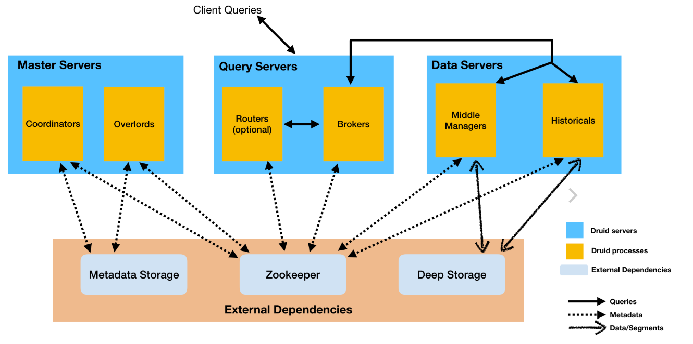


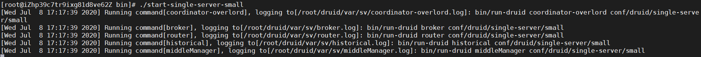


## 数据结构


* Druid中的所有数据都被组织成`段`,这些段是数据文件,通常每个段最多有几百万行。在Druid中加载数据称为`摄取`,它包括从源系统读取数据并基于该数据创建段。在大多数摄取方法中,加载数据的工作由MiddleManager进程完成
* Druid数据存储在`数据源`中,与传统关系型数据库中的`表`类似
* Druid把数据集分为三个部分: 
  * Timestamp column(时间戳):将时间字段单独处理,是因为Druid的所有查询都是围绕时间轴进行的
  * Dimension columns(维度列): 维度列是数据的属性,是按原样存储的列,可以在查询时以特殊方式对维度进行分组、筛选或应用聚合器
  * Metric columns(指标列):指标列是以聚合形式存储的列,用来做数据的聚合计算。指标列一般是可以衡量的数据,一般可以做count、sum等操作


# 安装


## jdk安装


```shell
# 解压命令
tar -zxf jdk-8u191-linux-x64.tar.gz -C /usr/local/
# 修改配置命令
vi /etc/profile

# 添加内容: 
export JAVA_HOME=/usr/local/jdk1.8.0_191
export PATH=$JAVA_HOME/bin:$PATH

# 配置生效命令
source /etc/profile
#查看java版本命令
java -version
```


## zookeeper安装


```shell
# 启动容器
docker run -id --name my_zookeeper -p 2181:2181 -v /etc/localtime:/etc/localtime zookeeper:3.4.14
# 查看容器运行情况
docker logs -f my_zookeeper
```


## kafka安装


```shell
# 拉取镜像
docker pull wurstmeister/kafka
# 启动容器
docker run -id --name kafka -p 9092:9092
# 在kafka集群中,每个kafka都有一个BROKER_ID来区分自己
-e KAFKA_BROKER_ID=0 
# 配置zookeeper管理kafka的路径
-e KAFKA_ZOOKEEPER_CONNECT=68.79.63.42:2181 
# 把kafka的地址端口注册给zookeeper
-e KAFKA_ADVERTISED_LISTENERS=PLAINTEXT://68.79.63.42:9092
# 配置kafka的监听端口
-e KAFKA_LISTENERS=PLAINTEXT://0.0.0.0:9092 
 # 容器时间同步虚拟机的时间
-v /etc/localtime:/etc/localtime wurstmeister/kafka

# 查看容器运行情况: 
docker logs -f kafka

# 验证
# 进入kafka容器
docker exec -it kafka /bin/bash
# 进入bin目录
cd /opt/kafka_2.12-2.5.0/bin/
# 执行命令,创建名称为test的队列,此队列有一个副本,一个分区
./kafka-topics.sh --create --zookeeper 68.79.63.42:2181 --replication-factor 1 --partitions 1 --topic test
# 查看刚刚创建的队列
./kafka-topics.sh -list -zookeeper 68.79.63.42:2181

# 消息发送和接收
# 执行命令,启动消费端,监听test队列
./kafka-console-consumer.sh --bootstrap-server 68.79.63.42:9092 --topic test --from-beginning
# 新开一个命令窗口,启动生产者,向test队列发送消息
./kafka-console-producer.sh --broker-list 68.79.63.42:9092 --topic test
# 测试完成后按Ctrl+C退出
```


## druid安装


```shell
# 下载压缩包
cd /root
wget https://archive.apache.org/dist/incubator/druid/0.15.0-incubating/apache-druid-0.15.0-incubating-bin.tar.gz

# 解压安装
tar -zxvf apache-druid-0.15.0-incubating-bin.tar.gz
mv apache-druid-0.15.0-incubating druid
#此时druid已经安装在/root目录下,根目录为/root/druid
```


### 配置


```shell
# 因为使用了本地zk,所以需要去掉2181端口的检测
vi /root/druid/bin/verify-default-ports
my @ports = (1527, 8081, 8082, 8083, 8090, 8091, 8200, 9095);

# 注释Zookeeper配置
vi /root/druid/conf/supervise/single-server/small.conf
#!p10 zk bin/run-zk conf

# 修改公共配置
vi /root/druid/conf/druid/single-server/small/_common/common.runtime.properties
# Hostname
druid.host=127.0.0.1

# Zookeeper
druid.zk.service.host=127.0.0.1
druid.zk.paths.base=/druid

# 设置各组件时区
vi /root/druid/conf/druid/single-server/small/broker/jvm.config -Duser.timezone=UTC+8
vi /root/druid/conf/druid/single-server/small/coordinator-overlord/jvm.config -Duser.timezone=UTC+8
vi /root/druid/conf/druid/single-server/small/historical/jvm.config -Duser.timezone=UTC+8
vi /root/druid/conf/druid/single-server/small/middleManager/jvm.config -Duser.timezone=UTC+8
vi /root/druid/conf/druid/single-server/small/router/jvm.config -Duser.timezone=UTC+8
```


### 启动


* /root/druid/bin/start-single-server-small
* 启动完成后访问: http://{druid服务ip}:8888

- 停止: ctrl+C停止进程即可


# 摄取数据


## 前置条件


* 启动zk,端口2181
* 启动kafka,端口9092
* 启动druid


## 从本地文件摄取数据


### 案例一


* 访问druid控制台http://{druid服务ip}:8888/


* 点击Load data进入加载数据页面,并输入下面相关参数


* 在 `Base directory` 中输入 `quickstart/tutorial/`, 在 `File filter` 中输入 `wikiticker-2015-09-12-sampled.json.gz`
* 点击Next:Parse data进入下个页面


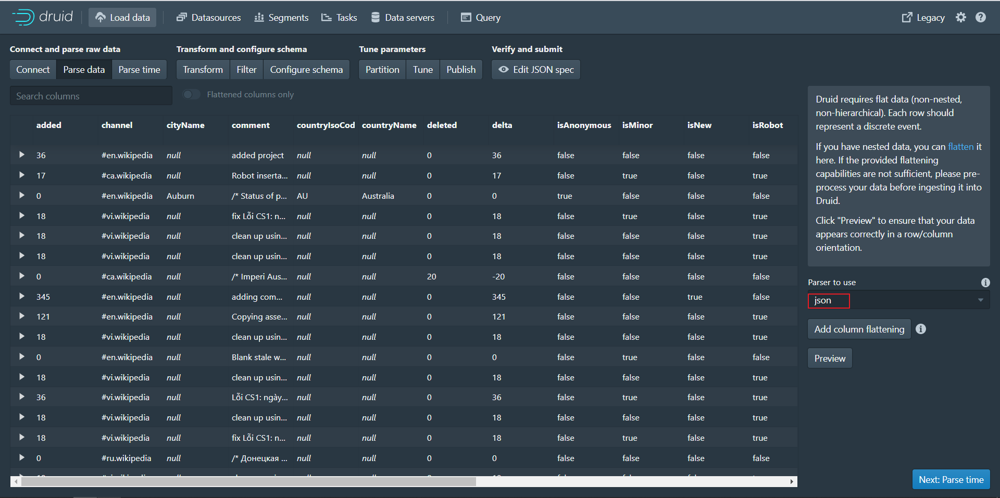


* 点击Next:Parse time进入下个页面


* 点击Next:Transform进入下个页面


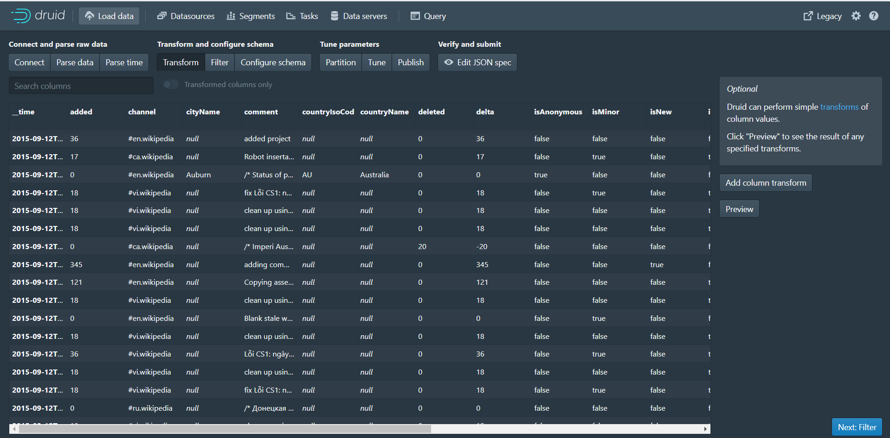


* 点击Next:Filter进入下个页面


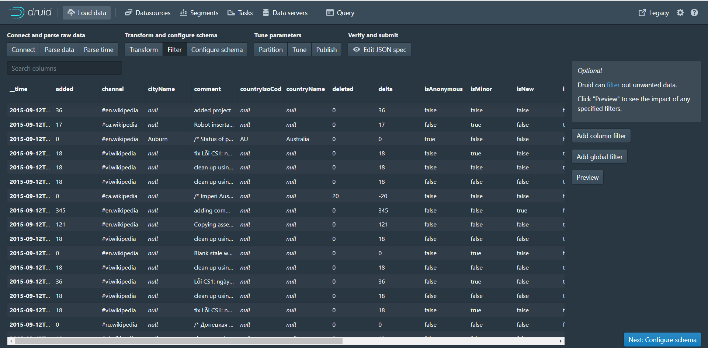


* 点击Next:Configure schema进入下个页面


* 点击Next:Partition进入下个页面


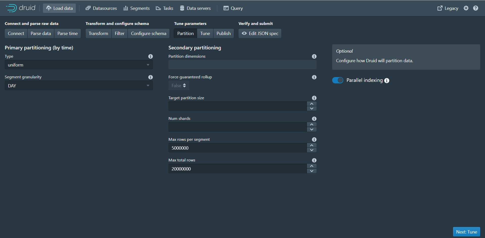


* 点击Next:Tune进入下个页面


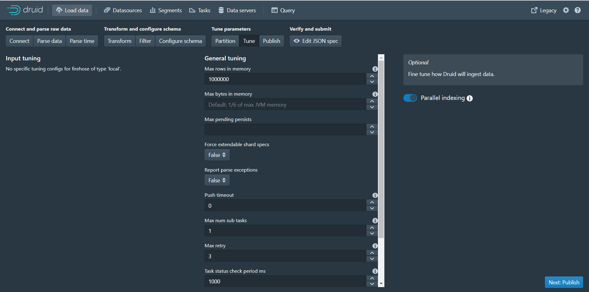


* 点击Next:Publish进入下个页面


* 点击Next:Edit JSON spec进入下个页面


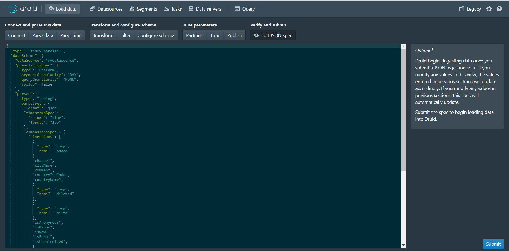


* 可以看到本页面展示的json数据其实就是数据摄取规范,根据前面每个页面设置的参数最终生成了当前的json数据
* 数据摄取任务规范可以手动编写,也可以通过Druid控制台里内置的数据加载器编写.数据加载器可以通过采样摄入的数据并配置各种摄入参数来帮助您生成摄取任务规范.数据加载器当前仅支持本地批处理提取(将来的版本中将提供对流的支持,包括存储在Apache Kafka和AWS Kinesis中的数据).目前只能通过手动书写摄入规范来进行流式摄入
* 点击Submit按钮进行任务提交,跳转到任务页面


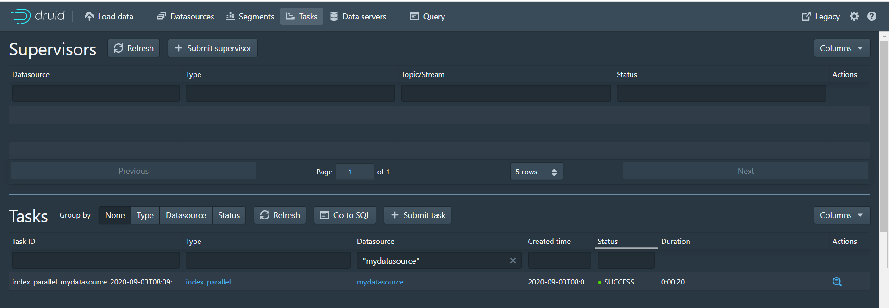


* 任务执行完成后,点击Datasources进入数据源页面,可以看到mydatasource数据源


* 点击Query进入数据查询页面,可以查询数据


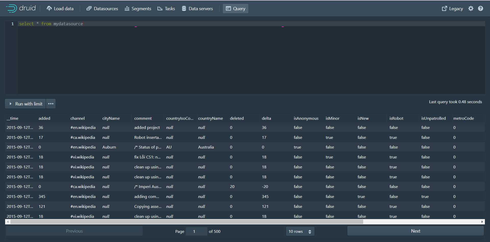


### 案例二


第一步: 访问druid控制台,点击Tasks进入任务页面


第二步: 点击Submit task按钮,选择Raw JSON task


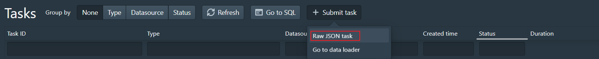


第三步: 在弹出的编辑窗口中输入下面数据摄取规范


```json
{
  "type" : "index",
  "spec" : {
    "dataSchema" : {
      "dataSource" : "ipmsg",
      "parser" : {
        "type" : "string",
        "parseSpec" : {
          "format" : "json",
          "dimensionsSpec" : {
            "dimensions" : [
              "srcIP",
              "dstIP"
            ]
          },
          "timestampSpec": {
            "column": "timestamp",
            "format": "iso"
          }
        }
      },
      "metricsSpec" : [
        { "type" : "count", "name" : "count" },
        { "type" : "longSum", "name" : "packets", "fieldName" : "packets" },
        { "type" : "longSum", "name" : "bytes", "fieldName" : "bytes" }
      ],
      "granularitySpec" : {
        "type" : "uniform",
        "segmentGranularity" : "week",
        "queryGranularity" : "minute",
        "intervals" : ["2018-01-01/2018-01-03"],
        "rollup" : true
      }
    },
    "ioConfig" : {
      "type" : "index",
      "firehose" : {
        "type" : "local",
        "baseDir" : "quickstart/tutorial",
        "filter" : "rollup-data.json"
      },
      "appendToExisting" : false
    },
    "tuningConfig" : {
      "type" : "index",
      "maxRowsPerSegment" : 5000000,
      "maxRowsInMemory" : 25000
    }
  }
}
```


第四步: 点击Submit提交任务,任务执行完成后点击Query进入查询页面进行数据查询


 

原始数据(rollup-data.json文件中的数据,共9条数据): 


存储到druid的数据(共5条数据): 


可以看到原始json文件中的数据是9条,存储到druid后的数据变为5条,这是因为数据摄取时按照设置的指标进行了数据聚合,并且还进行了count和longsum的计算


### 案例三


第一步: 访问druid控制台,点击Tasks进入任务页面


第二步: 点击Submit task按钮,选择Raw JSON task


第三步: 在弹出的编辑窗口中输入下面数据摄取规范

```json
{
  "type" : "index",
  "spec" : {
    "dataSchema" : {
      "dataSource" : "mydatasource2",
      "parser" : {
        "type" : "string",
        "parseSpec" : {
          "format" : "json",
          "dimensionsSpec" : {
            "dimensions" : [
              "animal",
              { "name": "location", "type": "long" }
            ]
          },
          "timestampSpec": {
            "column": "timestamp",
            "format": "iso"
          }
        }
      },
      "metricsSpec" : [
        { "type" : "count", "name" : "count" },
        { "type" : "longSum", "name" : "number", "fieldName" : "number" },
        { "type" : "longSum", "name" : "triple-number", "fieldName" : "triple-number" }
      ],
      "granularitySpec" : {
        "type" : "uniform",
        "segmentGranularity" : "week",
        "queryGranularity" : "minute",
        "intervals" : ["2018-01-01/2018-01-03"],
        "rollup" : true
      },
      "transformSpec": {
        "transforms": [
          {
            "type": "expression",
            "name": "animal",
            "expression": "concat('super-', animal)"
          },
          {
            "type": "expression",
            "name": "triple-number",
            "expression": "number * 3"
          }
        ],
        "filter": {
          "type":"or",
          "fields": [
            { "type": "selector", "dimension": "animal", "value": "super-mongoose" },
            { "type": "selector", "dimension": "triple-number", "value": "300" },
            { "type": "selector", "dimension": "location", "value": "3" }
          ]
        }
      }
    },
    "ioConfig" : {
      "type" : "index",
      "firehose" : {
        "type" : "local",
        "baseDir" : "quickstart/tutorial",
        "filter" : "transform-data.json"
      },
      "appendToExisting" : false
    },
    "tuningConfig" : {
      "type" : "index",
      "maxRowsPerSegment" : 5000000,
      "maxRowsInMemory" : 25000
    }
  }
}
```


第四步: 点击Submit提交任务,任务执行完成后点击Query进入查询页面进行数据查询


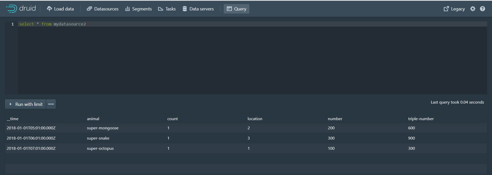

 

原始数据(transform-data.json文件中的数据,共4条数据): 


存储到druid的数据(共3条数据): 


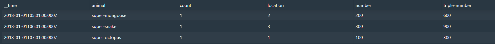


可以看到原始json文件中的数据是4条,存储到druid后的数据变为3条,这是因为数据摄取时进行了过滤,并且进行了数据加工处理。


## 从Kafka摄取数据


```shell
# 进入kafka容器
docker exec -it kafka /bin/bash
# 进入bin目录
cd /opt/kafka_2.12-2.5.0/bin/
# 执行命令,创建名称为test的队列,此队列有一个副本,一个分区
./kafka-topics.sh --create --zookeeper 68.79.63.42:2181 --replication-factor 1 --partitions 1 --topic ip_msg
# 查看刚刚创建的队列
./kafka-topics.sh -list -zookeeper 68.79.63.42:2181
```

 

第一步: 访问druid控制台http://{druid服务ip}:8888/

第二步: 点击Tasks按钮进入任务页面


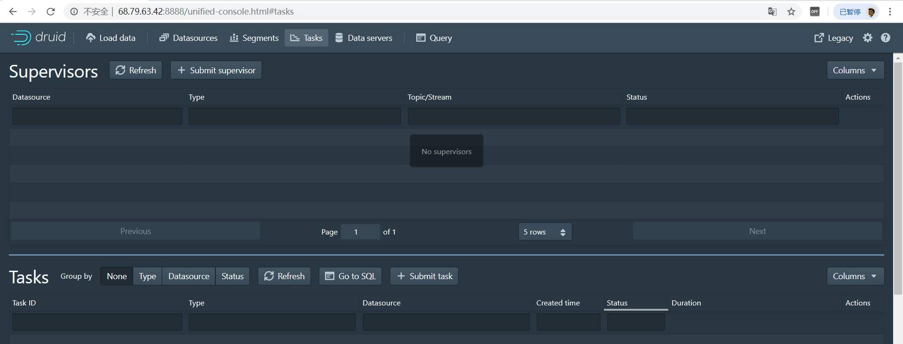


第三步: 点击Submit supervisor按钮弹出窗口


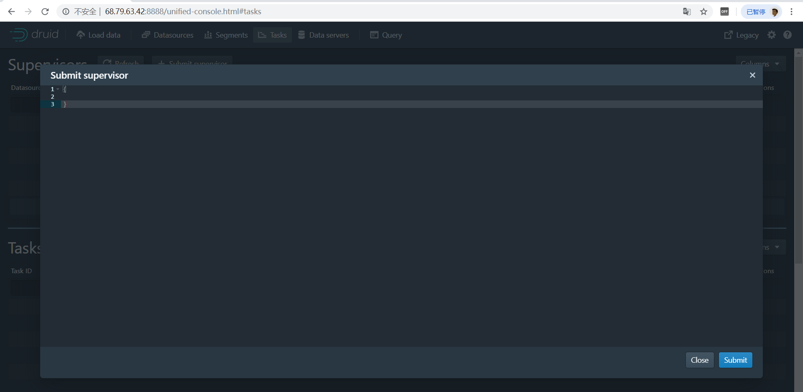


第四步: 在弹出窗口中输入如下内容,用于配置数据摄取策略(从kafka的ip_msg队列中摄取数据)

```json
{
  "type": "kafka",
  "dataSchema": {
    "dataSource": "ip_msg",
    "parser": {
      "type": "string",
      "parseSpec": {
        "format": "json",
        "timestampSpec": {
          "column": "timestamp",
          "format": "iso"
        },
        "dimensionsSpec": {
          "dimensions": [
            "srcIP",
            "dstIP"
          ]
        }
      }
    },
    "metricsSpec" : [
        { "type" : "count", "name" : "count" },
        { "type" : "longSum", "name" : "packets", "fieldName" : "packets" },
        { "type" : "longSum", "name" : "bytes", "fieldName" : "bytes" }
    ],
    "granularitySpec": {
      "type": "uniform",
      "segmentGranularity": "week",
      "queryGranularity": "minute",
      "rollup": true
    }
  },
  "tuningConfig": {
    "type": "kafka",
    "reportParseExceptions": false
  },
  "ioConfig": {
    "topic": "ip_msg",
    "replicas": 1,
    "taskDuration": "PT10M",
    "completionTimeout": "PT20M",
    "consumerProperties": {
      "bootstrap.servers": "39.99.56.166:9092"
    }
  }
}
```


第五步: 执行命令,向kafka队列发送消息

```shell
# 启动生产者,向ip_msg队列发送消息
./kafka-console-producer.sh --broker-list 68.79.63.42:9092 --topic ip_msg
```


消息内容如下: 

```shell
{"timestamp":"2018-01-01T01:01:35Z","srcIP":"1.1.1.1", "dstIP":"2.2.2.2","packets":20,"bytes":9024}
{"timestamp":"2018-01-01T01:01:51Z","srcIP":"1.1.1.1", "dstIP":"2.2.2.2","packets":255,"bytes":21133}
{"timestamp":"2018-01-01T01:01:59Z","srcIP":"1.1.1.1", "dstIP":"2.2.2.2","packets":11,"bytes":5780}
{"timestamp":"2018-01-01T01:02:14Z","srcIP":"1.1.1.1", "dstIP":"2.2.2.2","packets":38,"bytes":6289}
{"timestamp":"2018-01-01T01:02:29Z","srcIP":"1.1.1.1", "dstIP":"2.2.2.2","packets":377,"bytes":359971}
{"timestamp":"2018-01-01T01:03:29Z","srcIP":"1.1.1.1", "dstIP":"2.2.2.2","packets":49,"bytes":10204}
{"timestamp":"2018-01-02T21:33:14Z","srcIP":"7.7.7.7", "dstIP":"8.8.8.8","packets":38,"bytes":6289}
{"timestamp":"2018-01-02T21:33:45Z","srcIP":"7.7.7.7", "dstIP":"8.8.8.8","packets":123,"bytes":93999}
{"timestamp":"2018-01-02T21:35:45Z","srcIP":"7.7.7.7", "dstIP":"8.8.8.8","packets":12,"bytes":2818}
```


第六步: 在druid控制台的Query页面查询数据


# Java操作druid


```xml
<dependency>
    <groupId>org.apache.calcite.avatica</groupId>
    <artifactId>avatica-core</artifactId>
    <version>1.15.0</version>
</dependency>
<dependency>
    <groupId>org.apache.calcite.avatica</groupId>
    <artifactId>avatica</artifactId>
    <version>1.15.0</version>
</dependency>
```


```java
public static void main(String[] args) throws Exception{
    Class.forName("org.apache.calcite.avatica.remote.Driver");
    Connection connection = DriverManager.getConnection("jdbc:avatica:remote:url=http://68.79.63.42:8888/druid/v2/sql/avatica/");
    Statement st = null;
    ResultSet rs = null;
    try {
        st = connection.createStatement();
        rs = st.executeQuery("select create_time,username,phone,lat,lng from tb_order_location");
        ResultSetMetaData rsmd = rs.getMetaData();
        List<Map> resultList = new ArrayList();
        while (rs.next()) {
            Map map = new HashMap();
            for (int i = 0; i < rsmd.getColumnCount(); i++) {
                String columnName = rsmd.getColumnName(i + 1);
                map.put(columnName, rs.getObject(columnName));
            }
            resultList.add(map);
        }
        System.out.println(resultList);
    } catch (Exception e) {
        e.printStackTrace();
    } finally {
        try {
            connection.close();
        } catch (SQLException e) {
        }
    }
}
```