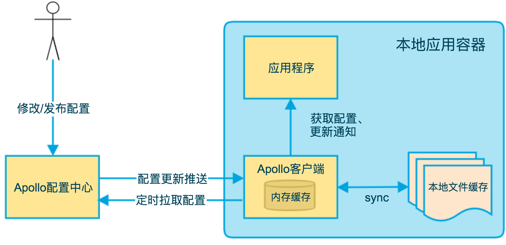
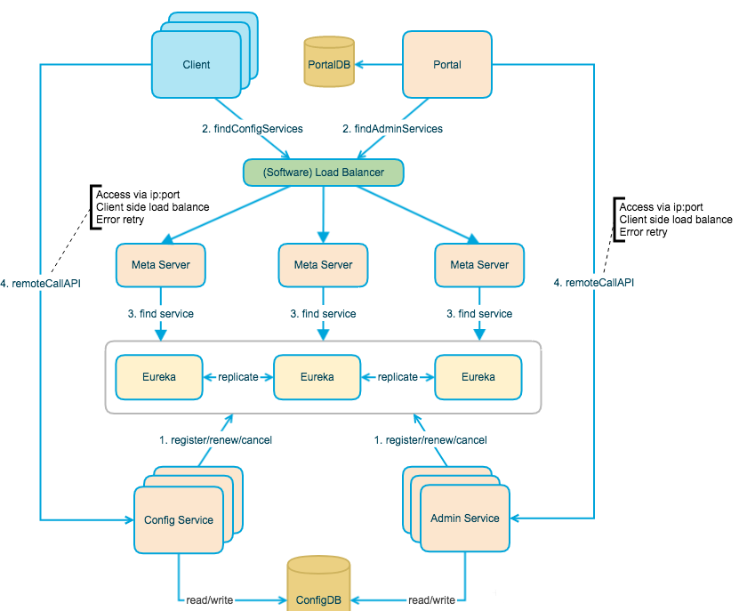

# Apollo


# 概述

* 配置中心


# 安装

* 从Github下载项目自己进行编译打包或从[Apollo](https://github.com/nobodyiam/apollo-build-scripts)直接下载已经编译好的Jar
* 创建数据库.Apollo服务端共需要两个数据库:ApolloPortalDB和ApolloConfigDB,把数据库,表的创建和样例数据sql文件导入数据库即可
  * apolloportaldb.sql:导入成功后,使用sql验证:`select Id, AppId, Name from ApolloPortalDB.App;`
  * apolloconfigdb.sql:导入成功后,使用sql验证:`select NamespaceId,Key,Value,Comment from ApolloConfigDB.Item;`
* 修改startup.sh,修改ApolloPortalDB和ApolloConfigDB两个数据库的连接信息.配置的用户需要具有对ApolloPortalDB和ApolloConfigDB数据库的读写权限

```properties
#apollo config db info
apollo_config_db_url=jdbc:mysql://localhost:3306/ApolloConfigDB?characterEncoding=utf8
apollo_config_db_username=用户名
apollo_config_db_password=密码

# apollo portal db info
apollo_portal_db_url=jdbc:mysql://localhost:3306/ApolloPortalDB?characterEncoding=utf8
apollo_portal_db_username=用户名
apollo_portal_db_password=密码
```

* 启动Apollo配置中心,执行脚本`./demo.sh start` (里面会启动三个服务,启动会比较慢)
* 启动成功后,访问:http://ip:8070,登录账号默认是:apollo/admin
* Config-service:8080端口;Admin-service:8090端口;Portal管控台:8070端口

```shell
./startup.sh start 
==== starting service ====
Service logging file is ./service/apollo-service.log
Started [1498]
Waiting for config service startup.
......
Config service started. You may visit http://localhost:8080 for service status now!
Waiting for admin service startup.
Admin service started
==== starting portal ====
Portal logging file is ./portal/apollo-portal.log
Started [1719]
Waiting for portal startup......
Portal started. You can visit http://localhost:8070 now!
```


# 应用开发

* Apollo阿波罗分布式配置中心属于客户端-服务端模式,我们的应用程序是客户端,Apollo阿波罗是服务端
* 在项目中添加apollo的依赖

```xml
<dependency>
    <groupId>com.ctrip.framework.apollo</groupId>
    <artifactId>apollo-client</artifactId>
    <version>1.9.1</version>
</dependency>
```

* Apollo客户端依赖于AppId,Apollo Meta Server等环境信息来工作,需要做如下配置:
  * AppId:AppId是应用的身份信息,是从服务端获取配置的一个重要信息
  * application.yml添加配置:`app.id=YOUR-APP-ID`
  * 在项目的classpath:/META-INF/app.properties文件中添加:`app.id=YOUR-APP-ID`
* Apollo Meta Server:元数据服务器
  * 在application.yml中指定apollo.meta=http://config-service-url
  * app.properties中指定apollo.meta=http://config-service-url
* 在启动类上添加注解:`@EnableApolloConfig`

 

# 本地缓存路径

* Apollo客户端会把从服务端获取到的配置在本地文件系统缓存一份,用于在遇到服务不可用,或网络不通的时候,依然能从本地恢复配置,不影响应用正常运行
* 本地缓存路径默认位于以下路径,所以请确保/opt/data或C:\opt\data\目录存在,且应用有读写权限
  * Mac/Linux: /opt/data/{appId}/config-cache
  * Windows: C:\opt\data\{appId}\config-cache
  * {appId}+{cluster}+{namespace}.properties


# 客户端原理




* 客户端和服务端保持了一个长连接,从而能第一时间获得配置更新的推送(通过Http Long Polling实现)
* 客户端还会定时从Apollo配置中心服务端拉取应用的最新配置,这是一个fallback机制,为了防止推送机制失效导致配置不更新
* 客户端定时拉取会上报本地版本,一般情况下,对于定时拉取的操作,服务端都会返回304 - Not Modified
* 定时任务默认5分钟拉取一次,客户端也可以在运行时指定System Property:apollo.refreshInterval来覆盖,单位为分钟
* 客户端从Apollo配置中心服务端获取到应用的最新配置后,会保存在内存中
* 客户端会把从服务端获取到的配置在本地文件系统缓存一份
* 在遇到服务不可用,或网络不通的时候,依然能从本地恢复配置
* 应用程序可以从Apollo客户端获取最新的配置,订阅配置更新通知


# Apollo配置中心设计




Apollo的总体设计,从下往上看分别是:

* Config Service提供配置的读取,推送等功能,服务对象是Apollo客户端
* Admin Service提供配置的修改,发布等功能,服务对象是Apollo Portal(管理界面)
* Config Service和Admin Service都是多实例,无状态部署,所以需要将自己注册到Eureka并保持心跳
* 在Eureka之上架了一层Meta Server用于封装Eureka的服务发现接口
* Client通过域名访问Meta Server获取Config Service服务列表(IP+Port),而后直接通过IP+Port访问服务,同时在Client侧会做load balance,错误重试
* Portal通过域名访问Meta Server获取Admin Service服务列表(IP+Port),而后直接通过IP+Port访问服务,同时在Portal侧会做load balance,错误重试
* 为了简化部署,实际上会把Config Service,Eureka和Meta Server三个逻辑角色部署在同一个JVM进程中

 

## Apollo


### Config Service

* 提供配置获取接口
* 提供配置更新推送接口(基于Http long polling)
* 服务端使用Spring DeferredResult实现异步化,从而大大增加长连接数量
* 目前使用的tomcat embed默认配置是最多10000个连接(可以调整),使用了4C8G的虚拟机实测可以支撑10000个连接,所以满足需求(一个应用实例只会发起一个长连接)
* 接口服务对象为Apollo客户端


### Admin Service

* 提供配置管理接口
* 提供配置修改,发布等接口
* 接口服务对象为Portal


### Meta Server

* Portal通过域名访问Meta Server获取Admin Service服务列表(IP+Port)
* Client通过域名访问Meta Server获取Config Service服务列表(IP+Port)
* Meta Server从Eureka获取Config Service和Admin Service的服务信息,相当于是一个Eureka Client
* 增设一个Meta Server的角色主要是为了封装服务发现的细节,对Portal和Client而言,永远通过一个Http接口获取Admin Service和Config Service的服务信息,而不需要关心背后实际的服务注册和发现组件
* Meta Server只是一个逻辑角色,在部署时和Config Service是在一个JVM进程中的,所以IP,端口和Config Service一致


### Eureka

* 基于Eureka和Spring Cloud Netflix提供服务注册和发现
* Config Service和Admin Service会向Eureka注册服务,并保持心跳
* 为了简单起见,目前Eureka在部署时和Config Service是在一个JVM进程中的(通过Spring Cloud Netflix)


### Portal

* 提供Web界面供用户管理配置
* 通过Meta Server获取Admin Service服务列表(IP+Port),通过IP+Port访问服务
* 在Portal侧做load balance,错误重试


### Client

* Apollo提供的客户端程序,为应用提供配置获取,实时更新等功能
* 通过Meta Server获取Config Service服务列表(IP+Port),通过IP+Port访问服务
* 在Client侧做load balance,错误重试