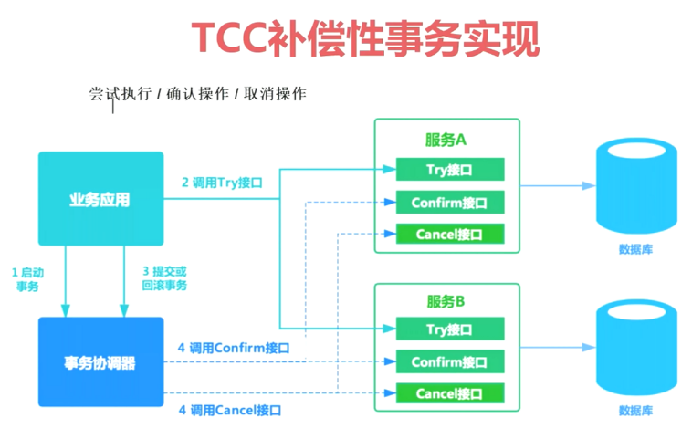
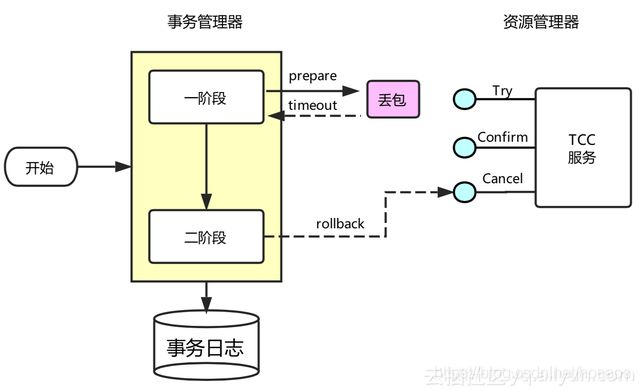
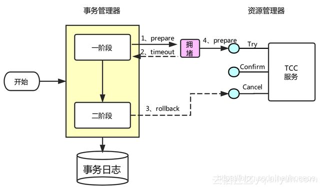
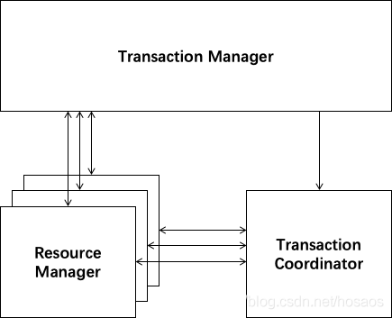
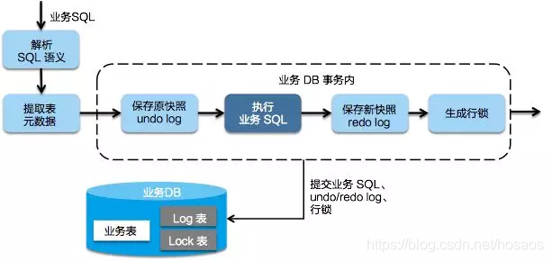

# Transaction


# 分布式事务

* 单个程序访问不同的数据库或多个服务之间相互调用产生的事务一致性问题
* 若某个系统内部出现跨多个库的操作,是不合规的,应该每个服务只操作自己对应的数据库
* 若需要操作别的服务对应的库,不允许直连别的服务的库,违反微服务架构的规范
* 若随意交叉访问,服务是没法管理的,数据可能经常被别人改错,自己的库被别人写挂
* 若要操作其他服务的库,必须通过调用该服务的接口来实现,绝对不允许交叉访问别人的数据


# 分布式唯一ID


## 概述

* 全局唯一性,不可出现重复id数据
* 需要防止恶意用户根据id规则来获取数据
* 保证下一个id一定大于上一个id


## 实现


### UUID

* 优点:代码实现简单,不占用宽带,数据迁移不受影响
* 缺点:无序,无法保证递增趋势,字符存储,传输以及查询慢,不可读


### SnowFlake

* 雪花算法,实现方式是用64位的二进制分别表示不同的含义:
  * 从左到右的第1位为0,固定
  * 第2位到42位,总共41位,表示二进制的毫秒时间戳
  * 第43位到47位,总共5位,表示二进制的机房编号
  * 第48位到52位,总共5位,表示二进制的机器编号
  * 第53位到64位,总共12位,表示二进制的数据编号,顺序生成
* 优点:代码实现简单,不占用宽带,数据迁移不受影响,低位趋势递增
* 缺点:强依赖时钟(多台服务器时间一定要一样),无序无法保证趋势递增


### Redis

* 集群缩减版本:年份+当前这天属于这一年的第多少天+小时+redis自增:2+3+2+6=13位.调用intr方法

* 优点:不依赖数据,灵活方便,性能优于数据库自增长,没有单点故障
* 缺点:需要占用网络资源,性能要比本地生成慢,需要增加redis集群


### Zookeeper

* 集群环境下生成方式同Redis,调用的是InterProcessMutex方法
* 优缺点同Redis差不多


# 分布式锁


## Redis

* nx方法,若key存在则返回nil,若key不存在则设置值
* 需要使用到特定的脚本才行,详见官网的set方法


## Redisson

* Redis封装的专门用于分布式的各种锁,信号量等机制的框架


## Zookeeper

* 临时节点的新增删除,集群中同一时间只能有一个节点进行新增


# 两阶段提交/XA


* 两阶段提交,有一个事务管理器(TM),管理器负责协调多个数据库的事务
  * TM先访问各个数据库进行操作,数据库如果都返回成功,TM通知各个事务进行提交
  * 若各个事务提交都返回成功,则事务成功.如果有一个事务返回失败,则回滚其他事务
  * TM发消息给各个事务利用本地日志进行事务回滚
* 这种分布式事务方案,比较适合单块应用里,跨多个库的分布式事务
* 因为严重依赖于数据库层面来搞定复杂的事务,效率很低,不适合高并发的场景
* 基于Spring + JTA的组合可以实现该事务
* XA规范的实现
  * 内部XA:单机情况下, 由binlog充当TM的角色.一个事务过来,写入redo.log和undo.log日志.事务提交时,同时写入redo.log和binlog,保证redo.log和binlog一致,如果事务撤销,则根据undo.log进行撤销
  * 外部XA:分布式集群的情况下,一般加代理层来充当TM的角色,实现对事务的支持
* 缺陷
  * 单点故障:协调者出错,网络问题,事务提交可能会失败
  * 阻塞资源:占用数据库连接,性能低
  * 数据不一致:二阶段回滚出错,数据不一致


# TCC

 

* TCC的全称是:Try->Confirm->Cancel
* 这个其实是用到了补偿的概念,分为了三个阶段:
  * Try:对各个服务的资源做检测以及对资源进行锁定或者预留
  * Confirm:在各个服务中执行实际的操作
  * Cancel:若任何一个服务的业务方法出错,就需要进行补偿,将已经执行成功的业务逻辑回滚
* 例如跨银行银行转账,若用TCC方案解决如下
  * Try:先把两个银行账户中的资金给它冻结住就不让操作了
  * Confirm:执行实际的转账操作,A银行账户的资金扣减,B银行账户的资金增加
  * Cancel:若任何一个银行的操作失败,就需要回滚进行补偿.比如A银行账户如果已经扣减了,但是B银行账户资金增加失败了,那么就得把A银行账户资金给加回去
* 这种方案几乎很少使用,因为这个事务回滚严重依赖于自己写代码来回滚和补偿,会造成补偿代码巨大
* 一般来说跟钱,交易相关的场景可以用TCC,严格保证分布式事务,要么全部成功,要么全部自动回滚


## 幂等控制

* 使用TCC时要注意3个操作的**幂等控制**,网络或重试都有可能导致这几个操作的重复执行

* 业务实现过程中需重点关注幂等实现,如银行转账

  * A通过银行向B转账1000,在confirm()中,A余额-1000,冻结余额-1000,这一步是实现幂等性的关键
  * 在操作资金账户时,为了防止并发情况下数据不一致的出现,肯定会避免出现这种代码

  ```java
  //根据userId查到账户
  Account account = accountMapper.selectById(userId);
  //取出当前资金
  int availableMoney = account.getAvailableMoney();
  account.setAvailableMoney(availableMoney-1000);
  //更新剩余资金
  accountMapper.update(account);
  ```

  * 上述操作本质上是一个读-改-写的过程,不是原子的,在并发情况下会出现数据不一致问题
  * 所以最简单的做法是直接update

  ```sql
  update account set available_money = available_money-1000 where user_id=#{userId}
  ```

  * 这利用了数据库行锁特性解决了并发情况下的数据不一致问题,但是TCC中,单纯使用这个方法不行
  * 该方法能解决并发单次操作下的扣减余额问题,但是不能解决多次操作带来的多次扣减问题,假设我执行了两次,按这种方案,用户账户就少了2000块
  * 分布式下可以引入转账订单状态来做判断,若订单状态为已支付,则直接return
  * 或者新建一张去重表,用订单id做唯一键,若插入报错返回也可以


## 空回滚

* 事务协调器在调用TCC服务的一阶段Try操作时,可能会出现因为丢包而导致的网络超时,此时事务协调器会触发二阶段回滚,调用TCC服务的Cancel操作
* TCC服务在未收到Try请求的情况下收到Cancel请求,这种场景被称为空回滚;TCC服务在实现时应当允许空回滚的执行



* 如果try()没执行,那么订单一定没创建,所以cancle()里可以加一个判断,如果上下文中订单编号orderNo不存在或者订单不存在,直接return

```java
if(orderNo==null || order==null){
	return;
}
```

* 核心思想就是**回滚请求处理时,如果对应的具体业务数据为空,则返回成功**
* 这种问题也可以通过中间件层面来实现.如在第一阶段try()执行完后,向一张事务表中插入一条数据(包含事务id,分支id),cancle()执行时,判断如果没有事务记录则直接返回,但是现在还不支持


## 防悬挂



* 事务协调器在调用TCC服务的一阶段Try操作时,可能会出现因网络拥堵而导致的超时,此时事务协调器会触发二阶段回滚,调用TCC服务的Cancel操作;在此之后,拥堵在网络上的一阶段Try数据包被TCC服务收到,出现了二阶段Cancel请求比一阶段Try请求先执行的情况
* 用户在实现TCC服务时,应当允许空回滚,但是要拒绝执行空回滚之后到来的一阶段Try请求
* 可以在二阶段执行时插入一条事务控制记录,状态为已回滚,这样当一阶段执行时,先读取该记录,如果记录存在,就认为二阶段回滚操作已经执行,不再执行try方法


# 本地消息表


* 消息队列+本地事件表+定时任务

* A系统在自己本地一个事务里操作,同时插入一条数据到消息表,接着A系统将这个消息发送到MQ中去
* B系统接收到消息之后,在一个事务里,往自己本地消息表里插入一条数据,同时执行其他的业务操作,如果这个消息已经被处理过了,那么此时这个事务会回滚,这样保证不会重复处理消息
* B系统执行成功之后,就会更新自己本地消息表的状态以及A系统消息表的状态
* 如果B系统处理失败了,那么就不会更新消息表状态,那么此时A系统会定时扫描自己的消息表,如果有没处理的消息,会再次发送到MQ中去,让B再次处理
* 这个方案保证了最终一致性,哪怕B事务失败了,但是A会不断重发消息,直到B成功为止
* 这个方案最大的问题就在于严重依赖于数据库的消息表来管理事务.完全无法胜任高并发场景,也不好扩展


# RocketMQ最终一致性

 

* 不用本地的消息表,直接基于MQ来实现事务
* A系统先发送一个prepared消息到mq,如果这个prepared消息发送失败那么就直接取消操作别执行了
* 如果这个消息发送成功了,接着执行本地事务.成功则告诉mq发送确认消息,失败则告诉mq回滚消息
* 如果发送了确认消息,那么此时B系统会接收到确认消息,然后执行本地的事务
* mq会自动定时轮询所有prepared消息回调接口,确认本地事务处理是否失败.若失败,是继续重试还是回滚
* 该方案里,若B服务的事务失败了如何解决:
  * 重试,自动不断重试直到成功,最好设置重试次数,尽量不影响业务的正常运行
  * 实在无法成功,事务回滚.比如B系统本地回滚后,通知系统A也回滚;或者发送报警手工回滚和补偿
* 对于事务不是特别严谨的场景比较合适,但是会存在资源浪费


# MQ最大努力通知


* 系统A本地事务执行完之后,发送消息到MQ
* 这里会有个专门消费MQ的最大努力通知服务,该服务会消费MQ然后写入数据库中记录下来,或者是放入个内存队列,接着调用系统B的接口
* 若系统B执行成功就事务完成.若系统B执行失败了,那么最大努力通知服务就定时尝试重新调用系统B,反复N次,最后还是不行就放弃,同时通知A服务进行回滚
* 该方式和可靠消息最终一致性类似


# Seata


阿里的分布式事务框架,支持AT,XA,TCC等,详见官网


## 安装

* 每一个微服务必须创建undo_Log,安装事务协调器:seate-server
 * 导入依赖,解压并启动seata-server
 * registry.conf:注册中心配置,修改registry:nacos
 * 所有想要用到分布式事务的微服务使用seata DataSourceProxy代理自己的数据源
 * 每个微服务都必须导入registry.conf,file.conf,vgroup_mapping.{application.name}-fescar-server-group="default"


## AT


### 概述



 * AT模式是基于XA事务演进而来的一个分布式事务中间件,XA是一个基于数据库实现的分布式事务协议,本质上和两阶段提交一样,需要数据库支持,Mysql5.6以上版本支持XA协议
 * Transaction Coordinator(TC):事务协调器,维护全局事务的运行状态,负责协调并驱动全局事务的提交或回滚
 * Transaction Manager(TM):控制全局事务的边界,负责开启一个全局事务,并最终发起全局提交或全局回滚的决议
 * Resource Manager(RM):控制分支事务,负责分支注册,状态汇报,并接收事务协调器的指令,驱动分支(本地)事务的提交和回滚
 * Seata有一个重要的机制:**回滚日志**
    * 每个分支事务对应的数据库中都需要有一个回滚日志表 UNDO_LOG,在真正修改数据库记录之前,都会先记录修改前的记录值,以便之后回滚
    * 在收到回滚请求后,会根据 UNDO_LOG 生成回滚操作的 SQL 语句来执行
    * 如果收到的是提交请求,就把 UNDO_LOG 中的相应记录删除掉
 * RM是通过**监控拦截JDBC**实现自动和 TC 交互的.例如监控到开启本地事务了,就会自动向TC注册、生成回滚日志、向TC汇报执行结果
 * 如果二阶段回滚失败,例如有某个微服务挂掉了,那么所有正常的微服务也都不会执行回滚,当这个微服务重新正常运行后,TC 会重新执行全局回滚


### 第一阶段

* Seata的JDBC数据源代理通过对业务 SQL 的解析,把业务数据在更新前后的数据镜像组织成回滚日志,利用 本地事务的ACID 特性,将业务数据的更新和回滚日志写入在同一个本地事务中提交.这样可以保证任何提交的业务数据的更新一定有相应的回滚日志存在



* 基于这样的机制,分支的本地事务便可以在全局事务的第一阶段提交,并马上释放本地事务锁定的资源
* 这也是Seata和XA事务的不同之处,两阶段提交往往对资源的锁定需要持续到第二阶段实际的提交或者回滚操作,而有了回滚日志之后,可以在第一阶段释放对资源的锁定,降低了锁范围,提高效率,即使第二阶段发生异常需要回滚,只需找对undolog中对应数据并反解析成sql来达到回滚目的
* 同时Seata通过代理数据源将业务sql的执行解析成undolog来与业务数据的更新同时入库,达到了对业务无侵入的效果


### 第二阶段

* 如果决议是全局提交,此时分支事务已经完成提交,不需要同步协调处理(只需要异步清理回滚日志),Phase2 可以非常快速地完成


* 如果决议是全局回滚,RM 收到协调器发来的回滚请求,通过 XID 和 Branch ID 找到相应的回滚日志记录,**通过回滚记录生成反向的更新 SQL 并执行**,以完成分支的回滚


### SpringCloud


* 在SpringCloud的编程中,需要给分布式大事务的入口标注@GlobalTransactional,每一个远程的小事务用@Trabsactional
* 在程序中,业务接口(Business)需要通过注解来标识他是一个全局事务,此时该接口就是TM
* Business会请求 TC,说明自己要开启一个全局事务,TC 会生成一个全局事务ID(XID),并返回给业务接口
* 业务接口得到XID 后,开始调用微服务Storage
* Storage收到 XID,知道自己的事务属于这个全局事务,Storage 执行自己的业务逻辑,操作本地数据库
* Storage会把自己的事务注册到 TC,作为这个XID下面的一个**分支事务**,并且把自己的事务执行结果也告诉 TC.此时Storage的角色是RM(资源管理者),资源是指本地数据库
* Order、Account的执行逻辑与 Storage 一致
* 在各个微服务都执行完成后,TC可以知道XID下各个分支事务的执行结果,Business也就知道了
* Business如果发现各个微服务的本地事务都执行成功了,就请求 TC 对这个 XID 提交,否则回滚
* TC 收到请求后,向 XID 下的所有分支事务发起相应请求
* 各个微服务收到 TC 的请求后,执行相应指令,并把执行结果上报 TC


## TCC


* `@LocalTCC`:TCC事务注解,必须写在接口上
* `@TwoPhaseBusinessAction`:TCC服务参与者注解,配置在接口方法上,必须在`@LocalTCC`修饰的接口中使用
  * `name`:指定被调用的微服务名称
  * `commitMethod`:指定事务成功时的提交方法
  * `rollbackMethod`:指定事务失败时的回滚方法
* 其他同AT模式,也需要在具体的调用方法上加`@GlobalTransactional`和`@Trabsactional`

