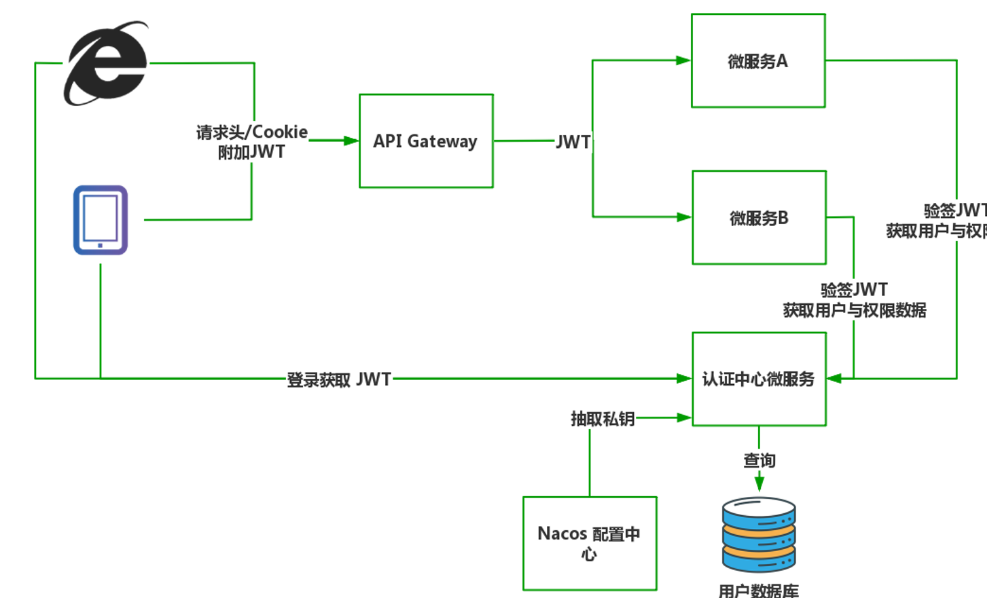
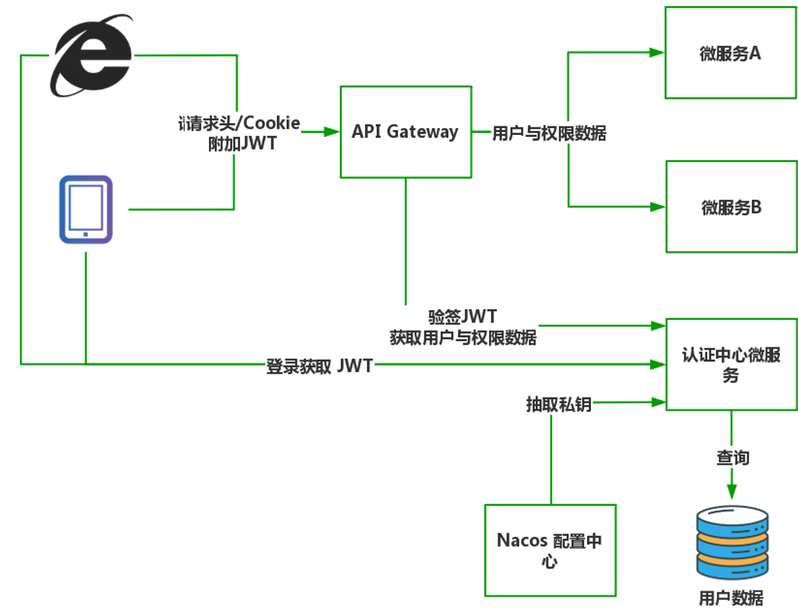
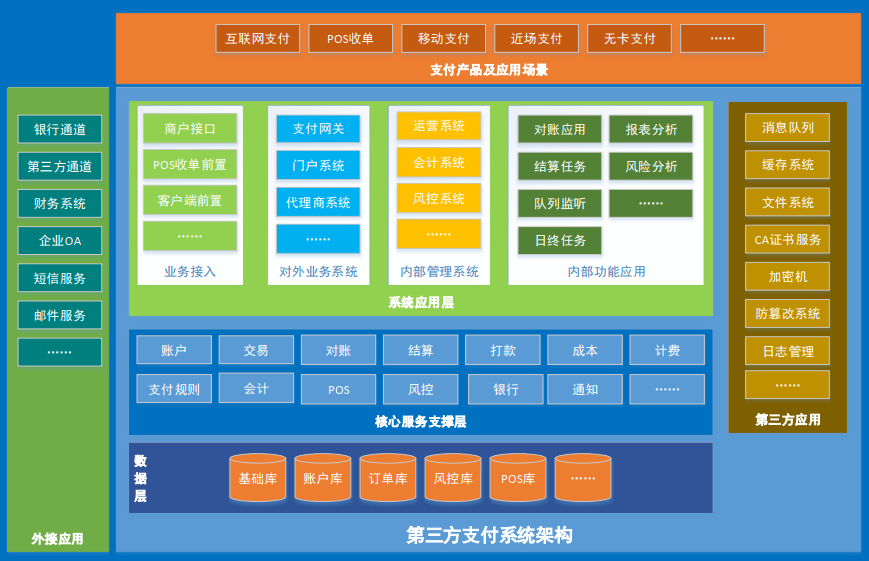
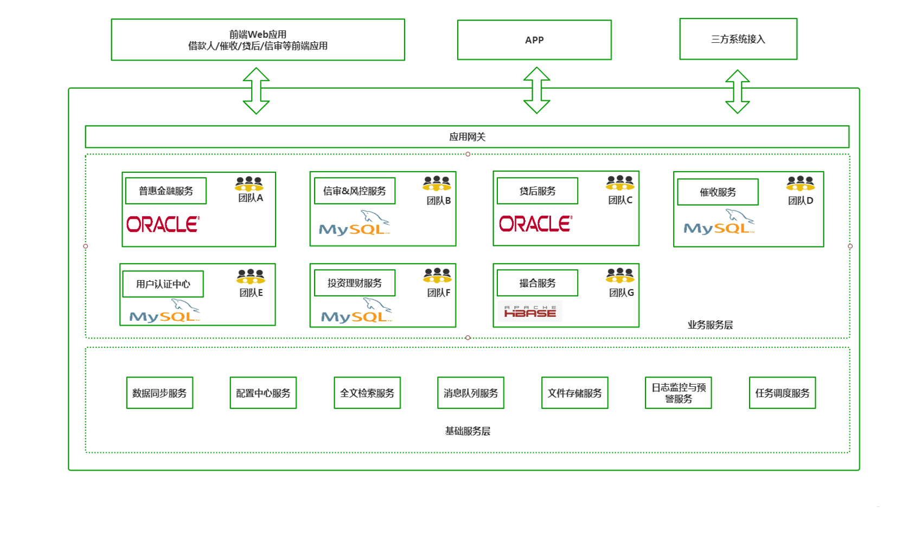
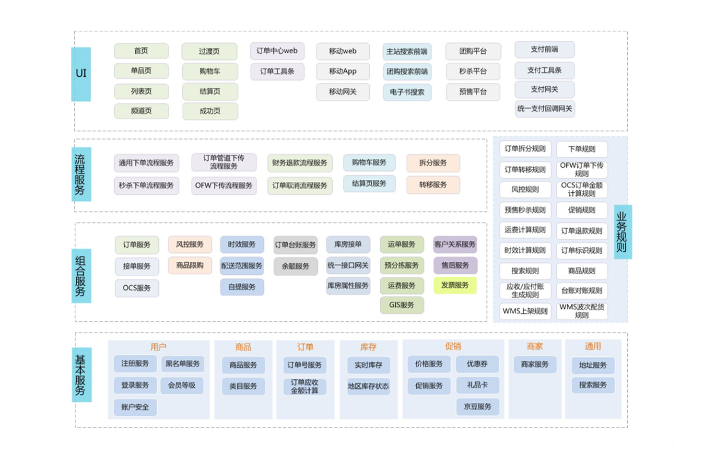

# Distributed


# 分布式系统


# 微服务划分


## 单一职责原则


* 每一个微服务只做好一件事,体现出高内聚,低耦合,尽量减少对外界环境的依赖
* 比如,在公司创业之初,完全可将订单与仓储服务进行合并.因为订单与仓储在业务与数据上紧密相关,如果强行拆分会导致出现跨进程通信带来的数据一致性难题.随着业务的发展,仓储的业务职责扩展,派生出许多与订单无紧密联系的功能,到时再将其剥离形成独立的仓储服务


## 服务依赖原则


* 避免服务间的循环引用,在设计时就要对服务进行分级,区分核心服务与非核心服务
* 比如订单服务与短信服务,显然短信服务是非核心服务,服务间调用要遵循核心服务到非核心服务的方向,不允许出现反向调用
* 同时,对于核心服务要做好保护,避免非核心服务出现问题影响核心服务的正常运行


## Two Pizza Team


* 让团队保持在两个比萨能让队员吃饱的小规模的概念
* 团队要小到让每个成员都能做出显著的贡献,并且相互依赖,有共同目标,以及统一的成功标准
* 一个微服务团队应涵盖从设计到发布运维的完整生命周期,使团队内部便可以解决大部分任务,4~6人是比较理想的规模


## 明确微服务使命


* 一套标准的微服务叙述模板,集中体现只做好一件事的原则

  ```
  XX 微服务用来
  在出现痛点场景的情况下
  解决现有的 XX 问题
  从而达到了 XXX 的效果
  体现了微服务的价值
  示例
  商品检索微服务用来
  在商品数据全量多维度组合查询的情况下
  解决了 MySQL 数据库全表扫描查询慢的问题
  从而让查询响应降低到 50ms 以下
  有效提升了用户体验
  ```

* 通过这种描述,服务的职责与边界就十分明确,团队便以此为目标确认职责

* 经过漫长时间沉淀,系统中出现了类似于商品检索服务,订单检索服务等多个小服务,这时可以对这些服务形成聚合生成新的通用检索服务,以此来控制微服务的整体规模

* 对于庞大的服务,可以考虑拆分为多个小服务进行细粒度的管理

* 拆与合是伴随着公司业务的演进而变化的,一切以解决问题为准


## 确保独立的数据存储


* 不同的微服务对数据存储的需求是不同的
* 如订单服务需要 MySQL 数据保存订单与订单明细;新闻服务需要Elasticsearch提供全文检索支持;朋友圈需要图数据库表达现实世界人际关系;文件存储服务则需要分布式文件系统
* 如果将所有数据都揉在 MySQL 中使用会变得十分蹩脚,应该为每个微服务提供符合自身业务特性的数据库


## 服务间通信


* 优先采用聚合器模式.在微服务间通信时存在两种消息传递模式:链式模式与聚合器模式
* 链式模式:请求按业务流程传递,采用串联模式,调用的整体成功率等于单个服务成功率的乘积
* 假设每个服务可靠性为 90%,一个业务在 4 个服务执行后的最终成功率只有 90%*90%*90%*90%≈66%,有将近一半的请求会处理失败
* 链式模式因默认采用同步方式传输,在服务处理完成前应用会一直处于阻塞状态,当调用链较长时,系统整体性能会严重下滑
* 聚合器模式则是通过服务作为入口,组装其他服务的调用
* 以订单流程服务为例,将订单,支付,库存服务进行聚合,一个服务实现了下单,支付,减库存的完整流程


## 不要强行微服务化


* 微服务也不过是一种方案,没必要盲从.它也没有违背架构的基本规律:架构是解决当前需求和痛点而演进的,在满足需要的前提下,选择合适的而不是选择最好的,合理降低成本才是好架构师该考虑的事情


## 尽量避免分布式事务


* 分布式事务处理起来相对复杂,很容易出现数据不一致问题,应尽量避免


## 接口粒度设计


* 服务接口尽可能大粒度,每个服务方法应代表一个功能,而不是某功能的一个步骤,否则将面临分布式事务问题,同时也可以减少系统间的网络交互
* 服务接口建议以业务场景为单位划分,并对相近业务做抽象,防止接口数量爆炸
* 不建议使用过于抽象的通用接口,如:Map query(Map),这样的接口没有明确语义,会给后期维护带来不便
* 每个接口都应定义版本号,为后续不兼容升级提供可能
* 服务接口增加方法,或服务模型增加字段,可向后兼容;删除方法或删除字段,将不兼容,枚举类型新增字段也不兼容,需通过变更版本号升级
* 必要的接口输入参数校验


## 异常处理原则


* 建议使用异常汇报错误,而不是返回错误码,异常信息能携带更多信息,以及语义更友好
* 如果担心性能问题,在必要时,可以通过override掉异常类的fillInStackTrace()方法为空方法,使其不拷贝栈信息
* 查询方法不建议抛出checked异常,否则调用方在查询时将过多的try...catch,并且不能进行有效处理
* 服务提供方不应将DAO或SQL等异常抛给消费方,应在服务实现中对消费方不关心的异常进行包装,否则可能出现消费方无法反序列化相应异常


# 应用场景


* 新规划的大型业务系统
* 敏捷的小团队系统
* 历史的大型留存业务系统.重构时可以将某一个部分剥离为微服务独立运行,确保无误后再继续剥离出下一个服务,逐步将原有大系统剥离为若干子服务
* 微型项目,系统压力很小,需求变化也不大,使用分布式反而增加了复杂度,不适合使用微服务
* 对数据响应要求高的系统,不适合微服务


# 基于网关的统一用户认证


## 服务端自主验签





* 认证中心微服务负责用户认证任务,在启动时从 Nacos 配置中心抽取 JWT 加密用私钥
* 用户在登录页输入用户名密码,客户端向认证中心服务发起认证请求
* 认证中心服务根据输入在用户数据库中进行认证校验,如果校验成功则返回认证中心将生成用户的JSON数据并创建对应的 JWT 返回给客户端
* 在收到上述 JSON 数据后,客户端将其中 token 数据保存在 cookie 或者本地缓存中
* 随后客户端向具体某个微服务发起新的请求,这个 JWT 都会附加在请求头或者 cookie 中发往 API 网关,网关根据路由规则将请求与JWT数据转发至具体的微服务,中间过程网关不对 JWT 做任何处理
* 微服务接收到请求后,发现请求附带 JWT 数据,于是将 JWT 再次转发给用户认证服务,此时用户认证服务对 JWT 进行验签,验签成功提取其中用户编号,查询用户认证与授权的详细数据
* 具体的微服务收到上述 JSON 后,对当前执行的操作进行判断,检查是否拥有执行权限,权限检查通过执行业务代码,权限检查失败返回错误响应


## API 网关统一验签





* API 网关统一验签与服务端验签最大的区别是在 API 网关层面就发起 JWT 验签,之后路由过程中附加的是从认证中心返回的用户与权限数据,其他的操作步骤与方案一完全相同
* 服务端验签的时机是在业务代码执行前,控制的粒度更细.比如微服务 A 提供了商品查询与创建订单两个功能,前者不需要登录用户就可以使用,因此不需要向认证中心额外发起验签工作;而后者是登录后的功能,因此必须验签后才可执行
* 服务端验签是方法层面上的,所以可以精确控制方法是否验签,但需要在所有业务方法上声明是否需要额外验签,尽管可以通过 AOP+注解的方式无侵入实现,但这也需要程序员额外关注,分散了开发业务的精力
* 服务端验签的缺点是 API 网关验签的优势.API 网关不关心后端的服务逻辑,只要请求附带 JWT,就自动向认证中心进行验签.这种策略让模块耦合有所降低,但也带来了性能问题,因为只要请求包含 JWT 就会产生认证中心的远程通信,如果没有对 JWT 进行精确控制,很可能带来大量多余的认证操作
* 服务端验签控制力度更细,适合应用在低延迟,高并发的应用,例如导航,实时交易系统,军事应用
* API 统一网关则更适合用在传统的企业应用,可以让程序员专心开发业务逻辑,同时程序也更容易维护
* JWT 生成后失效期是固定的,很多业务需要实现 JWT 的续签功能,但这单靠JWT自身无法做到,因为 JWT 的设计本身就不允许生成完全相同的字符串.为解决这个问题,可以将生成的JWT设为永久生效,再利用Redis 的 Expire 特性在后端控制 JWT 的时效性.强制 JWT 立即失效,动态 JWT 有效期都可以使用该方法解决
* 对于上面两种认证方案,还有优化的空间.比如在服务A第一次对某个 JWT 进行验签后获取用户与权限数据,那在 JWT 的有效期内便可将数据在本地内存或者 Redis 中进行缓存,这样下一次同样的 JWT 访问时直接从缓存中提取即可,可以节省大量服务间通信时间.但引入缓存后也要时刻关注缓存与用户数据的一致性问题


# 分布式支付系统(Dubbo)





## 应用架构


* 服务子系统:账户,交易,对账,结算,打款,风控……
* 内部管理应用:运营,风控,会计……
* 对外业务应用:门户,代理商系统……
* 对外接入应用:网关,前置,交易接口……
* 定时任务应用:结算,日终,统计分析……
* 其它应用:对账,消息队列处理……
* 服务子系统:Dubbo服务提供者
* 其它类型的应用:Dubbo服务消费者


## 系统架构


* 消息队列:RocketMQ,RabbitMQ,Kafka
* 分布式缓存:Redis
* 分布式文件系统:FastDFS,HDFS
* 反向代理服务器:Nginx
* 集群与负载均衡:Keepalived,HAproxy,LVS
* 应用服务器:Tomcat
* 数据库:MySQL,Oracle
* 数据库分布式处理系统(集群,分库,分表):MyCat
* 容器引擎:Docker,K8S
* 系统日志管理:ELK
* 分布式系统监控:Zabbix
* 其它:CA证书,密码键盘,防篡改系统……
* 高可用,高性能,可扩展,便于运维管理,符合系统检测要求……


# 金融借贷





# 京东商城


