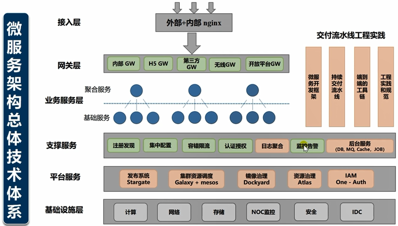
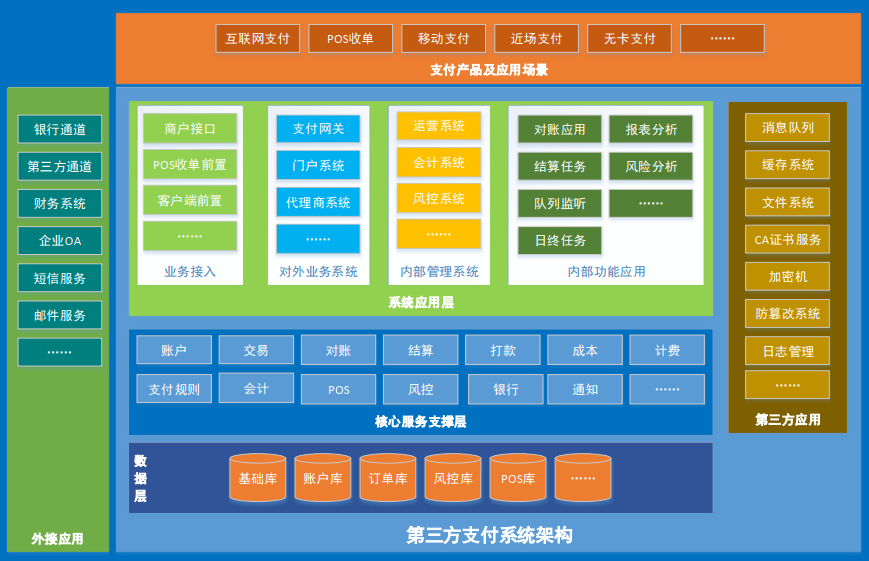

# Distributed

# 分布式系统

# 分布式支付系统(Dubbo)

## 应用架构

* 服务子系统:账户,交易,对账,结算,打款,风控……
* 内部管理应用:运营,风控,会计……
* 对外业务应用:门户,代理商系统……
* 对外接入应用:网关,前置,交易接口……
* 定时任务应用:结算,日终,统计分析……
* 其它应用:对账,消息队列处理……
* 服务子系统:Dubbo服务提供者
* 其它类型的应用:Dubbo服务消费者

## 系统架构

* 消息队列:RocketMQ,RabbitMQ,Kafka
* 分布式缓存:Redis
* 分布式文件系统:FastDFS,HDFS
* 反向代理服务器:Nginx
* 集群与负载均衡:Keepalived,HAproxy,LVS
* 应用服务器:Tomcat
* 数据库:MySQL,Oracle
* 数据库分布式处理系统(集群,分库,分表):MyCat
* 容器引擎:Docker,K8S
* 系统日志管理:ELK
* 分布式系统监控:Zabbix
* 其它:CA证书,密码键盘,防篡改系统……
* 高可用,高性能,可扩展,便于运维管理,符合系统检测要求……