# Nacos


# 概述

* [官方地址](https://nacos.io)
* [github地址](https://github.com/alibaba/nacos)
* 是一个构建云原生应用的动态服务发现,配置管理和服务管理平台
* 常见的注册中心:Eureka,Zookeeper,Consul,Nacos
* Nacos=Spring Cloud Eureka + Spring Cloud Config
* Nacos可以与Spring,Spring Boot,Spring Cloud集成,并能代替Spring Cloud Eureka,Spring Cloud Config

- 通过Nacos Server和spring-cloud-starter-alibaba-nacos-config 实现配置的动态变更
- 通过Nacos Server和spring-cloud-starter-alibaba-nacos-discovery 实现服务的注册与发现
- Nacos是以服务为主要服务对象的中间件,Nacos支持所有主流的服务发现,配置和管理
- Nacos用于服务发现和服务健康监测,动态配置服务,动态DNS服务,务及其元数据管理
- Nacos在1.0之后即支持AP,也支持CP模式,默认使用AP模式


# 快速开始


## 下载及安装

你可以通过源码和发行包两种方式来获取Nacos

您可以从[最新稳定版本](https://github.com/alibaba/nacos/releases)下载 `nacos-server-$version.zip` 包


## 启动服务


### 单机启动


* 不需要修改任何配置,直接startup.sh -m standalone或cmd startup.cmd -m standalone
* 访问:http://localhost:8848/nacos,用户名密码:nacos/nacos


### 集群启动


* 数据持久化:新建数据库,将conf/nacos-mysql.sql导入数据库中
* 在conf/application.properties中填入mysql相关信息
* 复制conf/cluster.conf.example并改名为cluster.conf,填入集群地址信息
* cluster.conf中的ip不能写127.0.0.1以及localhost,要写真实的ip
* 集群启动:startup.sh -m cluster
* 访问:http://localhost:8848/nacos,用户名密码:nacos/nacos


## 数据支持

* 单机模式时Nacos默认使用嵌入式数据库存储数据,若想使用其他存储方式,需要进行配置
* MySQL中新建nacos_config数据库,Nacos初始化MySQL的文件在nacos/conf/nacos-mysql.sql
* 修改nacos/conf/application.properties,增加支持MySQL数据源配置

```properties
spring.datasource.platform=mysql
db.num=1
db.url.0=jdbc:mysql://localhost:3306/nacos_config?characterEncoding=utf8&connectTimeout=1000&socketTimeout=3000&autoReconnect=true
db.username=root
db.password=root
```

* 配置完成后重启Nacos


# 集群


## 节点


* Nacos集群采用Raft算法实现,用于选举出Nacos集群中重要的leader节点
* 在 Nacos 集群中,每个节点都拥有以下三种角色中的一种
  * Leader:领导者,集群中最重要的角色,用于向其他节点下达指令
  * Candidate:参选者,参与竞选Leader的节点
  * Follower:跟随者,用于接收来自Leader或者Candidate的请求并进行处理
* 在集群中选举出 Leader 是最重要的工作,产生选举的时机有三个:
  * 在 Nacos 节点启动后,还没有产生Leader时选举
  * 集群成员总量变更时重新选举
  * 当 Leader 停止服务后重新选举
* Raft 算法将时间划分成为任意不同长度的任期(Term),任期用连续的数字进行表示.每一个任期的开始都是一次选举(Election),一个或多个候选人会试图成为 Leader
  * 当最开始的时候,所有 Nacos 节点都没有启动.角色默认为 Follower(跟随者),任期都是 0
  * 当第一个节点启动后,节点角色会变为 Candidate,第一个节点在每一个任期开始时便会尝试向其他节点发出投票请求,征求自己能否成为 Leader节点
  * 只有算上自己获得超过半数的选票,这个 Candidate 才能转正为 Leader
  * 因为第一个节点发起选举投票,但第二和第三两个节点不在线,尽管第一个节点会投自己一票,但在总3票中未过半数,因此无法成为 Leader
  * 因为第一次选举没有产生 Leader,过段时间在下一个任期开始时,第一个节点任期自增加 1,同时会再次向其他节点发起投票请求争取其他节点同意,直到同意票过半
  * 在Raft中,成为 Leader 的必要条件是某个Candidate获得过半选票,如果第二个节点上线,遇到 第一个节点再次发起投票,第二个节点投票给第一个节点,第一个节点获得两票超过半数就会成为Leader,第二个节点自动成为 Follower.之后第三个节点上线,因为集群中已有 Leader,因此自动成为 Follower
  * 当Leader宕机或停止服务,会在剩余 2 个 Nacos 节点中产生新的 Leader.如第一个节点故障,第三个节点获得两票成为 Leader,第二个节点成为 Follower,第一个节点已经下线但角色暂时仍为Leader
  * 之后第一个节点恢复上线,但此时Nacos集群已有 Leader,第一个节点自动变为Follower,且任期归0
  * 对于 Nacos 集群来说,只要 UP 状态节点不少于`1+N/2`,集群就能正常运行.但少于`1+N/2`,集群仍然可以提供基本服务,但已无法保证 Nacos 各节点数据一致性


## 数据同步


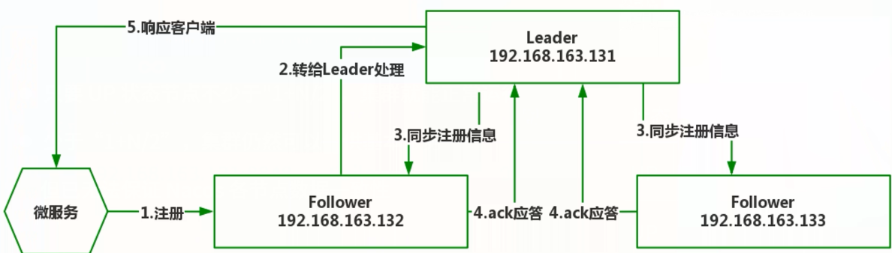


* 在 Raft 算法中,只有 Leader 才拥有数据处理与信息分发的权利.因此当微服务启动时.假如注册中心指定为 Follower 节点.则步骤如下:
  * 第一步:Follower 会自动将注册心跳包转给 Leader 节点
  * 第二步:Leader 节点完成实质的注册登记工作
  * 第三步:完成注册后向其他 Follower 节点发起同步注册日志的指令
  * 第四步:所有可用的 Follower 在收到指令后进行Ack应答,通知 Leader 消息已收到
  * 第五步:当 Leader 接收过半数 Follower 节点的Ack应答后,返回给微服务注册成功的响应信息
  * 对于其他无效的 Follower 节点,Leader 仍会不断重新发送,直到所有 Follower 的状态与 Leader 保持同步
* 对于脑裂问题,可以在Raft算法中增加Leader lease机制


# 注册中心

首先创建两个工程:生产者->nacos-provider,消费者->nacos-consumer


## 生产者

ProviderController:

```java
@RestController
public class ProviderController {

    @Value("${myName}")
    private String name;

    @GetMapping("hello")
    public String hello(){
        return "hello " + name;
    }
}
```

application.properties配置如下:

```properties
server.port=18070
# 自定义参数
myName=nacos
```


## 注册到nacos

* 添加依赖:spring-cloud-starter-alibaba-nacos-discovery及springCloud

* 在application.properties中配置nacos服务地址和应用名

  ```yaml
  server.port=8070
  spring.application.name=nacos-provider
  # nacos服务地址
  spring.cloud.nacos.discovery.server-addr=127.0.0.1:8848
  # 自定义参数
  myName=nacos
  ```

* 通过Spring Cloud原生注解@EnableDiscoveryClient开启服务注册发现功能

  ```java
  @SpringBootApplication
  @EnableDiscoveryClient
  public class NacosProviderApplication {
      public static void main(String[] args) {
          SpringApplication.run(NacosProviderApplication.class, args);
      }
  }
  ```

* 页面查看如下

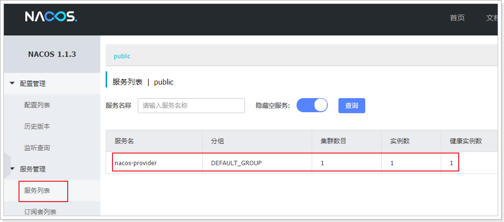


## 消费端

ConsumerController:

```java
@RestController
public class ConsumerController {

    @GetMapping("hi")
    public String hi() {
        return "hi provider!";
    }
}
```

application.properties:

```properties
server.port=18080
```

注册到Nacos的步骤同生产者,注册成功后在Nacos管理界面有会2个服务


## 使用feign调用服务


在消费者的NacosConsumerApplication类上添加@EnableFeignClients注解:

```java
@SpringBootApplication
@EnableDiscoveryClient
@EnableFeignClients
public class NacosConsumerApplication {

    public static void main(String[] args) {
        SpringApplication.run(NacosConsumerApplication.class, args);
    }

}
```

编写ProviderFeign如下:

```java
@FeignClient("nacos-provider")
public interface ProviderFeign {

    @RequestMapping("hello")
    public String hello();
}
```

在Controller中使用feignClient:

```java
@RestController
public class ConsumerController {

    @Autowired
    private ProviderFeign providerFeign;

    @GetMapping("hi")
    public String hi() {
        return this.providerFeign.hello();
    }
}
```

测试访问成功


## 心跳机制


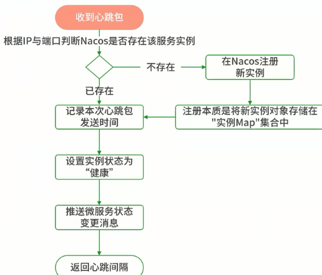


* 微服务每5秒向注册中心发送一次心跳,包含ip,权重,名称等信息


# 配置中心


* Nacos配置中心:系统配置的集中管理,包括编辑,存储,分发,动态更新不重启,回滚配置(变更管理,历史版本管理,变更审计)等所有与配置相关的活动
* Nacos配置中心的作用等同于SpringCloudConfig


## 热部署


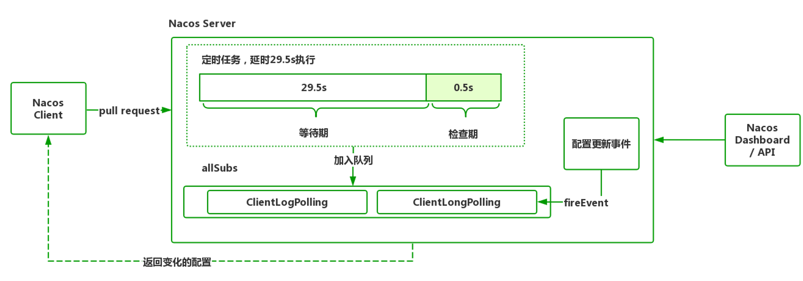


* Nacos 采用的是 Pull 拉取模式,是一种长轮训机制
* 客户端采用长轮训的方式定时发起 Pull 请求,检查服务端配置信息是否发生了变更,如果发生了变更,则客户端会根据变更的数据获得最新的配置
* 如果客户端发起 Pull 请求后,发现服务端的配置和客户端的配置是保持一致的,那么服务端会先Hold住这个请求,也就是服务端在指定的时间段内一直不返回结果,直到这段时间内配置发生变化或超时,服务端会把原来Hold住的请求进行返回
* Nacos 服务端收到请求之后,先检查配置是否发生了变更,如果没有,则设置一个定时任务,延期 29.5s 执行,并且把当前的客户端长轮询连接加入 allSubs 队列.这时候有两种方式触发该连接结果的返回:
  * 第一种:在等待 29.5s 后触发自动检查机制,这时候不管配置有没有发生变化,都会把结果返回客户端.而 29.5s 就是这个长连接保持的时间
  * 第二种:在 29.5s 内任意一个时刻,配置进行了修改,这会触发一个事件机制,监听到该事件的任务会遍历 allSubs 队列,找到发生变更的配置项对应的ClientLongPolling 任务,将变更的数据通过该任务中的连接进行返回
* 这样既能够保证客户端实时感知配置的变化,也降低了服务端的压力.其中,这个长连接的会话超时时间默认为 30s


## 创建配置

进入配置管理->配置列表->新建配置

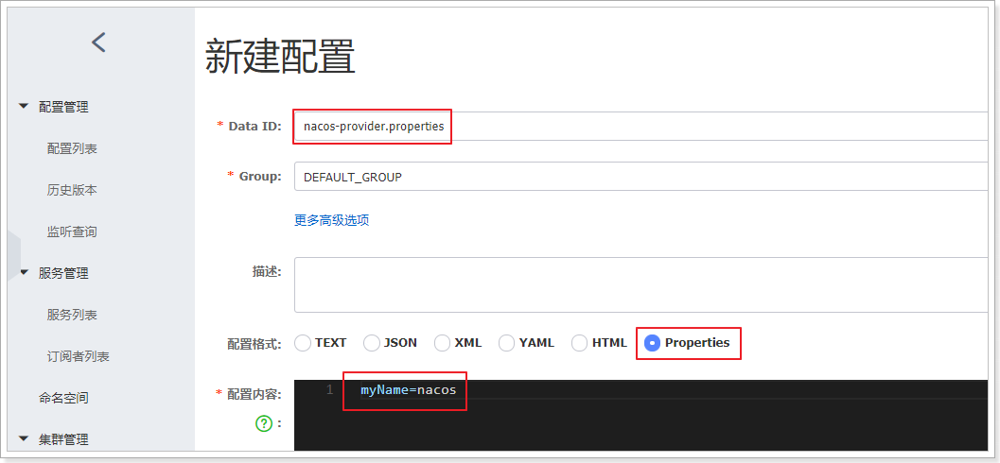

* dataId:完整格式如下->${prefix}-${spring.profile.active}.${file-extension}

- prefix:默认为所属工程配置spring.application.name的值,即nacos-provider,也可以通过配置项spring.cloud.nacos.config.prefix来配置
- spring.profile.active:当前环境对应的profile,详情可以参考 
- 当spring.profile.active为空时,dataId变成${prefix}.${file-extension}
- file-exetension:配置内容的数据格式,通过配置项spring.cloud.nacos.config.file-extension来配置


## 读配置


* 引入依赖:spring-cloud-starter-alibaba-nacos-config
* 在bootstrap.properties中配置Nacos server的地址和应用名,注意必须是bootstrap文件

```properties
spring.cloud.nacos.config.server-addr=127.0.0.1:8848
# 该配置影响统一配置中心中的dataId,之前已经配置过
spring.application.name=nacos-provider
```

* 之所以需要配置spring.application.name,是因为它是构成Nacos配置管理dataId字段的一部分
* 通过Spring Cloud注解@RefreshScope实现配置自动更新:

```java
@RestController
@RefreshScope
public class ProviderController {@Value("${myName}"){
    private String name;

    @RequestMapping("hello")
    public String hello(){
        return "hello " + name;
    }
}
```


## 命名空间

* 开发环境较多时(默认只有public),可以根据不同环境来创建不同的namespce,进行多环境的隔离

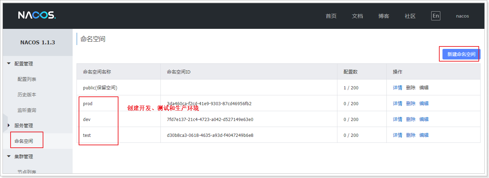

* 当有多个命名空间时,切换到配置列表页面,可以看到最上面所有的命名空间,点击可查看他们的id
* 在配置列表页面,只有public是默认存在的,其他都是自己新建的
* 默认情况下,项目会到public下找服务名.properties文件
* 在dev名称空间中也添加一个nacos-provider.properties配置.这时有两种方式:
  * 切换到dev名称空间,添加一个新的配置文件.缺点:每个环境都要重复配置类似的项目
  * 直接通过clone方式添加配置,并修改即可

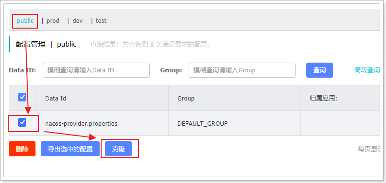

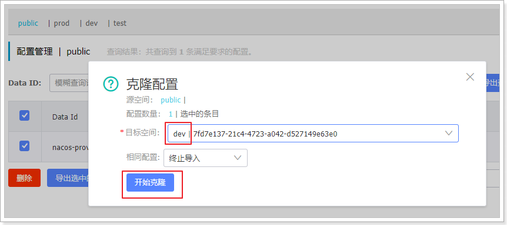

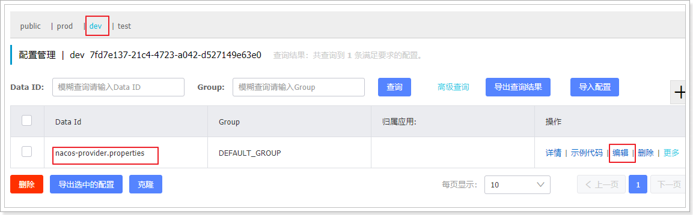

* 点击编辑:修改配置内容,以作区分
* 在服务提供方nacos-provider中切换命名空间,修改bootstrap.properties添加如下配置

```properties
# 该值为配置管理->配置列表各个配置下的uuid
spring.cloud.nacos.config.namespace=7fd7e137-21c4-4723-a042-d527149e63e0
```

* namespace的值为:

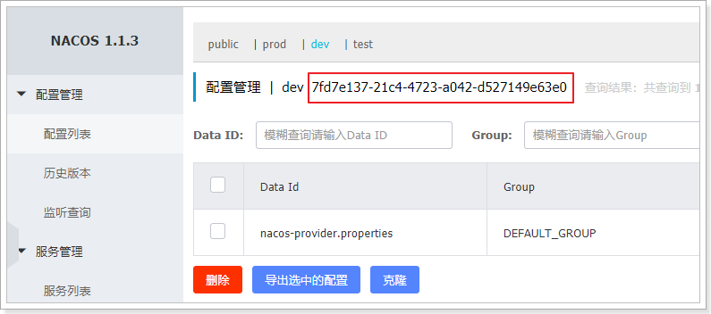


## 回滚配置

* **目前版本该功能有bug,回滚之后配置消失.**
* 配置中心点击更多可查看,回滚配置只需要两步:
  * 查看历史版本
  * 回滚到某个历史版本


## 多配置文件

* 加载多个配置文件,使用extension-configs
* 主配置文件优先级最高,即同属性以服务名开头的配置文件为准

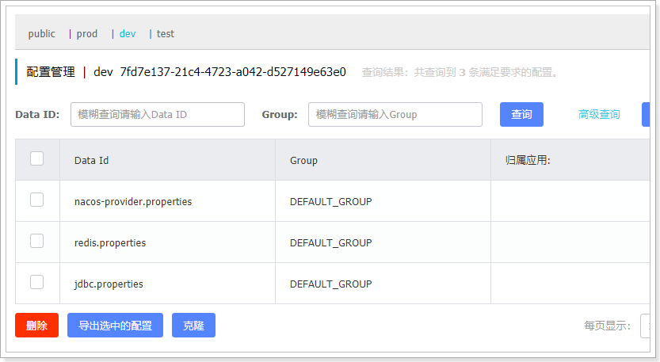

nacos-provider.properties默认加载,在bootstrap.properties文件中添加如下配置:

```properties
# 加载扩展配置,若配置中有属性相同,扩展配置config下标越大优先级越高.文件后缀要注意加上
spring.cloud.nacos.config.ext-config[0].data-id=redis.properties
# 开启动态刷新配置,否则配置文件修改,工程无法感知
spring.cloud.nacos.config.ext-config[0].refresh=true
spring.cloud.nacos.config.ext-config[1].data-id=jdbc.properties
spring.cloud.nacos.config.ext-config[1].refresh=true
```

修改ProviderController使用redis.properties和jdbc.properties配置文件中的参数:

```java
@RestController
@RefreshScope
public class ProviderController {

    @Value("${myName}")
    private String name;

    @Value("${jdbc.url}")
    private String jdbcUrl;

    @Value("${redis.url}")
    private String redisUrl;

    @RequestMapping("hello")
    public String hello(){
        return "hello"+name+",redis-url="+redisUrl+",jdbc-url=" + jdbcUrl;
    }
}
```


## 配置分组

* 在实际开发中,除了不同的环境外,不同的微服务或者业务功能,可能有不同的redis及mysql数据库
* 区分不同的环境我们使用namespace,区分不同的微服务或功能,使用group(分组)

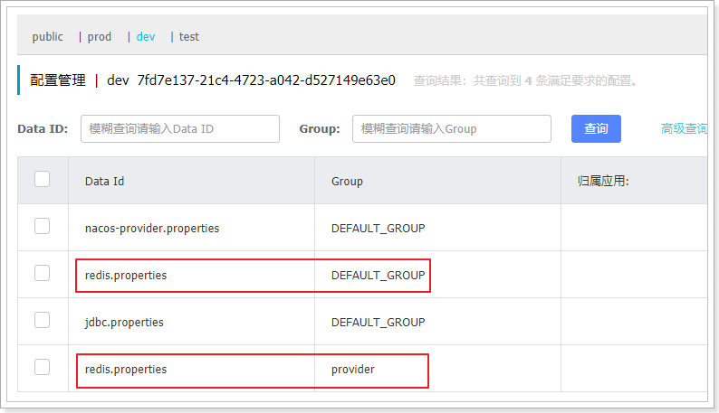

* 现在开发环境中有两个redis.propertis配置文件,一个是DEFAULT_GROUP,一个是provider
* 默认从DEFAULT_GROUP读取redis配置,如果要切换到provider分组,需要添加如下配置

```properties
# 指定分组
spring.cloud.nacos.config.ext-config[0].group=provider
```

