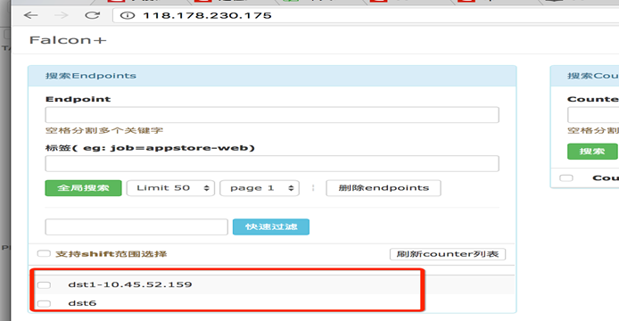
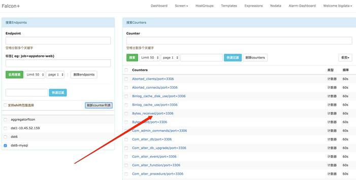
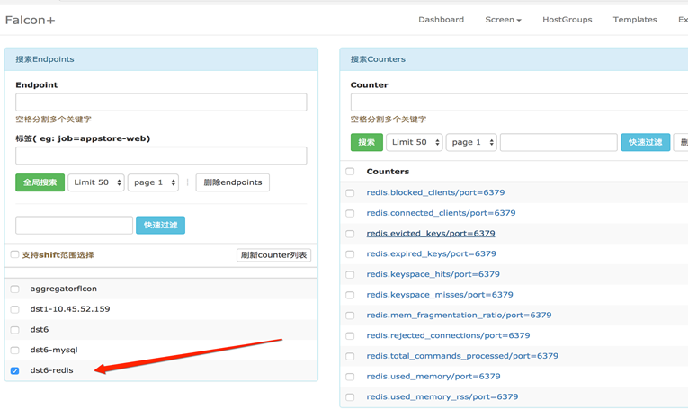

# Open-Falcon


# 概述


* 监控系统,事前及时预警发现故障,事后提供翔实的数据用于追查定位问题
* 强大灵活的数据采集:自动发现,支持falcon-agent,snmp,支持用户主动push,用户自定义插件支持,opentsdb data model like(timestamp,endpoint,metric,key-value tags)
* 水平扩展能力:支持每个周期上亿次的数据采集,告警判定,历史数据存储和查询
* 高效率的告警策略管理:高效的portal,支持策略模板,模板继承和覆盖,多种告警方式,支持callback调用
* 人性化的告警设置:最大告警次数,告警级别,告警恢复通知,告警暂停,不同时段不同阈值,支持维护周期
* 高效率的graph组件:单机支撑200万metric的上报,归档,存储(周期为1分钟)
* 高效的历史数据query组件:采用rrdtool的数据归档策略,秒级返回上百个metric一年的历史数据
* dashboard:多维度的数据展示,用户自定义Screen
* 高可用:整个系统无核心单点,易运维,易部署,可水平扩展
* 开发语言: 整个系统的后端,全部golang编写,portal和dashboard使用python编写

 

# 架构


* 每台服务器,都有安装falcon-agent,falcon-agent是一个golang开发的daemon程序,用于自发现的采集单机的各种数据和指标,这些指标包括不限于以下几个方面,共计200多项指标:如CPU相关,磁盘相关,IO,Load,内存相关,网络相关,端口存活,进程存活,ntp offset(插件),某个进程资源消耗(插件),netstat,ss 等相关统计项采集,机器内核配置参数
* 只要安装了falcon-agent的机器,就会自动开始采集各项指标,主动上报,不需要用户在server做任何配置(这和zabbix有很大的不同),这样做的好处,就是用户维护方便,覆盖率高.当然这样做也会server端造成较大的压力,不过open-falcon的服务端组件单机性能足够高,同时都可以水平扩展,所以自动多采集足够多的数据,反而是一件好事情,对于SRE和DEV来讲,事后追查问题,不再是难题
* falcon-agent提供了一个proxy-gateway,用户可以方便的通过http接口,push数据到本机的gateway,gateway会帮忙高效率的转发到server端


## transfer


* 接收客户端发送的数据,做一些数据规整,检查之后,转发到多个后端系统去处理
* 在转发到每个后端业务系统的时候,transfer会根据一致性hash算法,进行数据分片,来达到后端业务系统的水平扩展

* transfer 提供jsonRpc接口和telnet接口两种方式,transfer自身是无状态的,挂掉一台或者多台不会有任何影响,同时transfer性能很高,每分钟可以转发超过500万条数据
* transfer目前支持的业务后端,有三种,judge,graph,opentsdb.judge是我们开发的高性能告警判定组件,graph是我们开发的高性能数据存储,归档,查询组件,opentsdb是开源的时间序列数据存储服务.可以通过transfer的配置文件来开启
* transfer的数据来源,一般有三种:
  * falcon-agent采集的基础监控数据
  * falcon-agent执行用户自定义的插件返回的数据
  * client library:线上的业务系统,都嵌入使用了统一的perfcounter.jar,对于业务系统中每个RPC接口的qps,latency都会主动采集并上报
  * 上面这三种数据,都会先发送给本机的proxy-gateway,再由gateway转发给transfer
* 基础监控是指只要是个机器能加的监控,比如cpu mem net io disk等,这些监控采集的方式固定,不需要配置,也不需要用户提供额外参数指定,只要agent跑起来就可以直接采集上报上去
* 非基础监控则相反,比如端口监控,这类监控需要用户配置后才会开始采集上报的监控(包括类似于端口监控的配置触发类监控,以及类似于mysql的插件脚本类监控),一般就不算基础监控的范畴了

 

## 报警


* 报警判定,是由judge组件来完成.用户在web portal来配置相关的报警策略,存储在MySQL中
* heartbeat server 会定期加载MySQL中的内容,judge也会定期和heartbeat server保持沟通,来获取相关的报警策略
* heartbeat sever不仅仅是单纯的加载MySQL中的内容,根据模板继承,模板项覆盖,报警动作覆盖,模板和hostGroup绑定,计算出最终关联到每个endpoint的告警策略,提供给judge组件来使用
* transfer转发到judge的每条数据,都会触发相关策略的判定,来决定是否满足报警条件,如果满足条件,则会发送给alarm,alarm再以邮件,短信,米聊等形式通知相关用户,也可以执行用户预先配置好的callback地址
* 用户可以很灵活的来配置告警判定策略,比如连续n次都满足条件,连续n次的最大值满足条件,不同的时间段不同的阈值,如果处于维护周期内则忽略 等等
* 另外也支持突升突降类的判定和告警

 

## API


* 到这里,数据已经成功的存储在了graph里.如何快速的读过去1小时的,过去1天的,过去一月的,过去一年的,都需要在1秒之内返回
* 这些都是靠graph和API组件来实现的,transfer会将数据往graph组件转发一份,graph收到数据以后,会以rrdtool的数据归档方式来存储,同时提供查询RPC接口
* API面向终端用户,收到查询请求后,会去多个graph里面,查询不同metric的数据,汇总后统一返回给用户

 

## 存储


* 数据按照用途分成两类,一类是用来绘图的,一类是用户做数据挖掘的
* 对于绘图的数据来讲,查询要快是关键,同时不能丢失信息量
* 对于用户要查询100个metric,在过去一年里的数据时,数据量本身就在那里了,很难1秒之类能返回.就算返回了,前端也无法渲染这么多的数据,还得采样,造成很多无谓的消耗和浪费
* 参考rrdtool的理念,在数据每次存入的时候,会自动进行采样,归档.归档策略如下,历史数据保存5年.同时为了不丢失信息量,数据归档的时候,会按照平均值采样,最大值采样,最小值采样存三份


# 安装


* 安装redis
* 安装mysql
* 初始化mysql数据库
  * cd /tmp/ && git clone https://github.com/open-falcon/falcon-plus.git
  * cd /tmp/falcon-plus/scripts/mysql/db_schema/
  * mysql -h 127.0.0.1 -u root -proot < 1_uic-db-schema.sql
  * mysql -h 127.0.0.1 -u root -proot < 2_portal-db-schema.sql
  * mysql -h 127.0.0.1 -u root -proot < 3_dashboard-db-schema.sql
  * mysql -h 127.0.0.1 -u root -proot < 4_graph-db-schema.sql
  * mysql -h 127.0.0.1 -u root -proot < 5_alarms-db-schema.sql
* 下载open-falcon压缩包,解压:`wget https://github.com/open-falcon/falcon-plus/releases/download/v0.2.1/open-falcon-v0.2.1.tar.gz`
* 修改所有配置文件的数据库用户名和密码
* 启动:./open-falcon start,所有模块都在open-falcon下
* 检查所有模块的运行状况:./open-falcon check
* 其他命令:./open-falcon [start|stop|restart|check|monitor|reload] module,如./open-falcon check agent
* dashboard安装:`git clone https://github.com/open-falcon/dashboard.git`
* 安装依赖:yum install -y python-virtualenv python-devel openldap-devel mysql-devel 
* yum groupinstall "Development tools"
* cd dashboard/,运行`virtualenv ./env`,`./env/bin/pip install -r pip_requirements.txt -i https://pypi.douban.com/simple`
* 如果执行上面有问题,就直接执行`./env/bin/pip install -r pip_requirements.txt`
* 修改dashboard的配置文件:rrd/config.py:
  * 修改API_ADDR,后端api组件的地址,如API_ADDR = "http://127.0.0.1:8080/api/v1
  * 修改PORTAL_DB_*,数据库用户名密码,默认用户名为root,默认密码为空
  * 修改ALARM_DB_*,数据库用户名和密码,默认用户名为root,默认密码为空
* bash control start:启动,可访问`http://127.0.0.1:8081 in your browser`
* bash control stop:停止


# Agent


## 概述


* agent用于采集机器负载监控指标,比如cpu.idle,load.1min,disk.io.util等,每隔60秒push给Transfer
* agent与Transfer建立了长连接,数据发送速度比较快,agent提供了一个http接口/v1/push用于接收用户手工push的一些数据,然后通过长连接迅速转发给Transfer
* agent需要部署到所有要被监控的机器上,比如公司有10台机器,那就要部署10个agent.agent本身资源消耗很少


## 安装


* 进入open-falcon/,拷贝agent到需要监控的服务器上面:`scp -r agent/ root@admin:/app/softwrae/open-falcon`
* 拷贝open-falcon到需要监控的服务器上面:`scp -r open-falcon root@admin:/app/softwrae/open-falcon`
* 修改配置文件,配置文件必须叫cfg.json:
* ./open-falcon start agent:启动进程
* ./open-falcon stop agent:停止进程
* ./open-falcon monitor agent:查看日志
* ./falcon-agent --check:检查agent是否运行正常
* 看var目录下的log是否正常,或者浏览器访问其1988端口


## 配置


```json
{
  "debug": true, # 控制一些debug信息的输出,生产环境通常设置为false
  "hostname": "", # 采集的数据发给transfer,默认通过hostname获取,如果配置了hostname,就用配置中的
  "ip": "", # 与hbs心跳的时候会把ip地址发给hbs,agent会自动探测本机ip,如果不想让agent自动探测,可以手工修改该配置
  "plugin": {
    "enabled": false, # 默认不开启插件机制
    "dir": "./plugin", # 把放置插件脚本的git repo clone到这个目录
    "git": "https://github.com/open-falcon/plugin.git", # 放置插件脚本的git repo地址
    "logs": "./logs" # 插件执行的log,如果插件执行有问题,可以去这个目录看log
  },
  "heartbeat": {
    "enabled": true, # 此处enabled要设置为true
    "addr": "127.0.0.1:6030", # hbs的地址,端口是hbs的rpc端口
    "interval": 60, # 心跳周期,单位是秒
    "timeout": 1000 # 连接hbs的超时时间,单位是毫秒
  },
  "transfer": {
    "enabled": true, 
    "addrs": [
      "127.0.0.1:18433" # transfer地址,端口是transfer的rpc端口,可以写多个transfer的地址,agent会保证HA
    ],
    "interval": 60, # 采集周期,单位是秒,即agent一分钟采集一次数据发给transfer
    "timeout": 1000 # 连接transfer的超时时间,单位是毫秒
  },
  "http": {
   	"enabled": true, # 是否要监听http端口
   	"listen": ":1988",
  	"backdoor": false
  },
  "collector": {
   	"ifacePrefix": ["eth", "em"], # 默认只会采集网卡名前缀是eth,em的流量,为空就会采集所有的.可以从/proc/net/dev看到各个网卡的流量信息
    "mountPoint": []
  },
  "default_tags": {
  },
  "ignore": { # 默认采集了200多个metric,可以通过ignore设置为不采集
   	"cpu.busy": true,
    "df.bytes.free": true,
    "df.bytes.total": true,
    "df.bytes.used": true,
    "df.bytes.used.percent": true,
    "df.inodes.total": true,
    "df.inodes.free": true,
    "df.inodes.used": true,
    "df.inodes.used.percent": true,
    "mem.memtotal": true,
    "mem.memused": true,
    "mem.memused.percent": true,
    "mem.memfree": true,
    "mem.swaptotal": true,
    "mem.swapused": true,
    "mem.swapfree": true
  }
}
```


# Transfer


## 概述


* transfer是数据转发服务,它接收agent上报的数据,然后按照哈希规则进行数据分片,并将分片后的数据分别push给graph&judge等组件


## 安装


* 同Agent

* 修改配置vim cfg.json
* 启动服务:`./open-falcon start transfer`
* 校验服务:`curl -s "127.0.0.1:6060/health"`
* 停止服务:`./open-falcon stop transfer`
* 查看日志:`./open-falcon monitor transfer`
* 部署完成transfer组件后,要修改agent,graph,judge的配置,使其指向正确的transfer地址


## 配置


* debug: true/false, 如果为true,日志中会打印debug信息
* minStep: 30, 允许上报的数据最小间隔,默认为30秒
* http:
  * enabled: true/false, 是否开启该http端口,该端口为控制端口,主要用来对transfer发送控制命令,统计命令,debug命令等
  * listen: 表示监听的http端口
* rpc:
  * enabled: true/false, 表示是否开启该jsonrpc数据接收端口, Agent发送数据使用的就是该端口
  * listen: 表示监听的http端口
* judge:
  - enabled: true/false, 表示是否开启向judge发送数据
  - batch: 数据转发的批量大小,可以加快发送速度,建议保持默认值
  - connTimeout: 单位是毫秒,与后端建立连接的超时时间,可以根据网络质量微调,建议保持默认
  - callTimeout: 单位是毫秒,发送数据给后端的超时时间,可以根据网络质量微调,建议保持默认
  - pingMethod: 后端提供的ping接口,用来探测连接是否可用,必须保持默认
  - maxConns: 连接池相关配置,最大连接数,建议保持默认
  - maxIdle: 连接池相关配置,最大空闲连接数,建议保持默认
  - replicas: 这是一致性hash算法需要的节点副本数量,建议不要变更,保持默认即可
  - cluster: k-v形式的字典,表示后端的judge列表,其中key代表后端judge名字,value代表的是具体的ip:port
* graph
  - enabled: true/false, 表示是否开启向graph发送数据
  - batch: 数据转发的批量大小,可以加快发送速度,建议保持默认值
  - connTimeout: 单位是毫秒,与后端建立连接的超时时间,可以根据网络质量微调,建议保持默认
  - callTimeout: 单位是毫秒,发送数据给后端的超时时间,可以根据网络质量微调,建议保持默认
  - pingMethod: 后端提供的ping接口,用来探测连接是否可用,必须保持默认
  - maxConns: 连接池相关配置,最大连接数,建议保持默认
  - maxIdle: 连接池相关配置,最大空闲连接数,建议保持默认
  - replicas: 这是一致性hash算法需要的节点副本数量,建议不要变更,保持默认即可
  - cluster: key-value形式的字典,表示后端的graph列表,其中key代表后端graph名字,value代表的是具体的ip:port(多个地址用逗号隔开, transfer会将同一份数据发送至各个地址,利用这个特性可以实现数据的多重备份)
* tsdb
  * enabled: true/false, 表示是否开启向open tsdb发送数据
  * batch: 数据转发的批量大小,可以加快发送速度
  * connTimeout: 单位是毫秒,与后端建立连接的超时时间,可以根据网络质量微调,建议保持默认
  * callTimeout: 单位是毫秒,发送数据给后端的超时时间,可以根据网络质量微调,建议保持默认
  * maxConns: 连接池相关配置,最大连接数,建议保持默认
  * maxIdle: 连接池相关配置,最大空闲连接数,建议保持默认
  * retry: 连接后端的重试次数和发送数据的重试次数
  * address: tsdb地址或者tsdb集群vip地址, 通过tcp连接tsdb


# Graph


## 概述


* graph是存储绘图数据的组件.graph组件接收transfer组件推送上来的监控数据,同时处理api组件的查询请求,返回绘图数据


## 安装


* 同Agent

* 修改配置文件vim cfg.json
* 启动服务:`./open-falcon start graph`
* 停止服务:`./open-falcon stop graph`
* 查看日志:`./open-falcon monitor graph`


## 配置


```json
{
    "debug": false, //true/false, 是否开启debug日志
    "http": {
        "enabled": true, //true/false, 表示是否开启该http端口,该端口为控制端口,主要用来对graph发送控制命令,统计命令,debug命令
        "listen": "0.0.0.0:6071" //表示监听的http端口
    },
    "rpc": {
        "enabled": true, //true or false, 表示是否开启该rpc端口,该端口为数据接收端口
        "listen": "0.0.0.0:6070" //表示监听的rpc端口
    },
    "rrd": {
        "storage": "./data/6070" // 历史数据的文件存储路径
    },
    "db": {
        "dsn": "root:@tcp(127.0.0.1:3306)/graph?loc=Local&parseTime=true", // MySQL的连接信息,默认用户名是root,密码为空,host为127.0.0.1,database为graph
        "maxIdle": 4 //MySQL连接池配置,连接池允许的最大连接数,保持默认即可
    },
    "callTimeout": 5000, //RPC调用超时时间,单位ms
    "migrate": { //扩容graph时历史数据自动迁移
        "enabled": false, //true or false, 表示graph是否处于数据迁移状态
        "concurrency": 2, //数据迁移时的并发连接数,建议保持默认
        "replicas": 500, //这是一致性hash算法需要的节点副本数量,保持默认即可(必须和transfer的配置中保持一致)
        "cluster": { //未扩容前老的graph实例列表
            "graph-00" : "127.0.0.1:6070"
        }
    }
}
```


##  数据不一致





* 如果上图红框中出现同一台服务器的不同名字的配置,则进入数据库,进行如下操作:
* 进入数据库,选择数据库graph,查询表endpoint,删除不需要的数据:`delete from endpoint where id=153;`
* 如下可以不操作:可以一起删除falcon_portal库中的host表中的无用数据

 

# API


## 概述


* api组件,提供统一的restAPI操作接口.比如:api组件接收查询请求,根据一致性哈希算法去相应的graph实例查询不同metric的数据,然后汇总拿到的数据,最后统一返回给用户


## 安装


* 同Agent

* 修改配置cfg.json,注意graph集群的配置,要确保api组件的 `graphs` 的内容与transfer的配置完全一致
* 启动服务:`./open-falcon start api`
* 停止服务:`./open-falcon stop api`
* 查看日志:`./open-falcon monitor api`
* 部署完成api组件后,要修改dashboard组件的配置,使其能够正确寻址到api组件

 

## 配置


```json
{
    "log_level": "debug",
    "db": {  //数据库相关的连接配置信息
        "faclon_portal": "root:@tcp(127.0.0.1:3306)/falcon_portal?charset=utf8&parseTime=True&loc=Local",
        "graph": "root:@tcp(127.0.0.1:3306)/graph?charset=utf8&parseTime=True&loc=Local",
        "uic": "root:@tcp(127.0.0.1:3306)/uic?charset=utf8&parseTime=True&loc=Local",
        "dashboard": "root:@tcp(127.0.0.1:3306)/dashboard?charset=utf8&parseTime=True&loc=Local",
        "alarms": "root:@tcp(127.0.0.1:3306)/alarms?charset=utf8&parseTime=True&loc=Local",
        "db_bug": true
    },
    "graphs": {  // graph模块的部署列表信息
        "cluster": {
            "graph-00": "127.0.0.1:6070"
        },
        "max_conns": 100,
        "max_idle": 100,
        "conn_timeout": 1000,
        "call_timeout": 5000,
        "numberOfReplicas": 500
    },
    "metric_list_file": "./api/data/metric",
    "web_port": ":8080",  // http监听端口
    "access_control": true, // 如果设置为false,那么任何用户都可以具备管理员权限
    "salt": "pleaseinputwhichyouareusingnow",  //数据库加密密码的时候的salt
    "skip_auth": false, //如果设置为true,那么访问api就不需要经过认证
    "default_token": "default-token-used-in-server-side",  //用于服务端各模块间的访问授权
    "gen_doc": false,
    "gen_doc_path": "doc/module.html"
}
```


# HBS


## 概述


* 心跳服务器,每分钟发一次心跳请求
* Portal的数据库中有一个host表,维护了项目所有机器的信息,比如hostname、ip等.这个表中的数据通过HBS完成:agent发送心跳信息给HBS的时候,会把hostname、ip、agent version等信息告诉HBS,HBS负责更新host表


## 安装


* 同Agent
* 启动:`./open-falcon start hbs`
* 停止:`./open-falcon stop hbs`
* 查看日志:`./open-falcon monitor hbs`
* 如果先部署了agent,后部署hbs,那部署完hbs之后需要回去修改agent的配置,把agent配置中的heartbeat部分enabled设置为true,addr设置为hbs的rpc地址.如果hbs的配置文件维持默认,rpc端口就是6030,http端口是6031,agent中应该配置为hbs的rpc端口


## 配置


```json
{
    "debug": true,
    "database": "root:password@tcp(127.0.0.1:3306)/falcon_portal?loc=Local&parseTime=true", # Portal的数据库地址
    "hosts": "", # portal数据库中有个host表,如果表中数据是从其他系统同步过来的,此处配置为sync,否则就维持默认,留空即可
    "maxIdle": 100,
    "listen": ":6030", # hbs监听的rpc地址
    "trustable": [""],
    "http": {
        "enabled": true,
        "listen": "0.0.0.0:6031" # hbs监听的http地址
    }
}
```


# Judge


## 概述


* Judge用于告警判断,agent将数据push给Transfer,Transfer会转发给Graph来绘图,还会转发给Judge用于判断是否触发告警
* 因为监控系统数据量比较大,一台机器显然是搞不定的,所以必须要有个数据分片方案
* Transfer通过一致性哈希来分片,每个Judge就只需要处理一小部分数据就可以了.所以判断告警的功能不能放在直接的数据接收端Transfer,而应该放到Transfer后面的组件里
* Judge监听了一个http端口,提供了一个http接口:/count,访问可以得悉当前Judge实例处理了多少数据量.推荐的做法是一个Judge实例处理50万~100万数据,用个5G~10G内存,如果所用物理机内存比较大,比如有128G,可以在一个物理机上部署多个Judge实例


## 安装


* 同Agent
* 启动:`./open-falcon start judge`
* 停止:`./open-falcon stop judge`
* 查看日志:`./open-falcon monitor judge`


## 配置


```json
{
    "debug": true,
    "debugHost": "nil",
    "remain": 11, # 指定judge内存中针对某个数据存多少个点,比如host01这个机器的cpu.idle的值在内存中最多存多少个,配置报警的时候比如all(#3),这个#后面的数字不能超过remain-1,一般维持默认
    "http": {
        "enabled": true,
        "listen": "0.0.0.0:6081"
    },
    "rpc": {
        "enabled": true,
        "listen": "0.0.0.0:6080"
    },
    "hbs": {
        "servers": ["127.0.0.1:6030"], # hbs最好放到lvs vip后面,所以此处最好配置为vip:port
        "timeout": 300,
        "interval": 60
    },
    "alarm": {
        "enabled": true,
        "minInterval": 300, # 连续两个报警之间至少相隔的秒数,维持默认即可
        "queuePattern": "event:p%v",
        "redis": {
            "dsn": "127.0.0.1:6379", # 与alarm、sender使用一个redis
            "maxIdle": 5,
            "connTimeout": 5000,
            "readTimeout": 5000,
            "writeTimeout": 5000
        }
    }
}
```

 

# Alarm


## 概述


* Alarm模块是处理报警event的,judge产生的报警event写入redis,alarm从redis读取处理,并进行不同渠道的发送
* 报警event的处理逻辑并非仅仅是发邮件,发短信这么简单,为了能够自动化对event做处理,alarm需要支持在产生event的时候回调用户提供的接口;有的时候报警短信,邮件太多,对于优先级比较低的报警,希望做报警合并,这些逻辑都是在alarm中做的
* 在配置报警策略的时候配置了报警级别,比如P0/P1/P2等,每个及别的报警都会对应不同的redis队列.alarm去读取这个数据的时候希望先读取P0的数据,再读取P1的数据,最后读取P5的数据,因为希望先处理优先级高的,于是用了redis的brpop指令
* 已经发送的告警信息,alarm会写入MySQL中保存,这样用户就可以在dashboard中查阅历史报警,同时针对同一个策略发出的多条报警,在MySQL存储的时候,会聚类;历史报警保存的周期,是可配置的,默认为7天
* 如果某个核心服务挂了,可能会造成大面积报警,为了减少报警短信数量,可以做报警合并功能.把报警信息写入dashboard模块,然后dashboard返回一个url地址给alarm,alarm将这个url链接发给用户,这样用户只要收到一条短信(里边是个url地址),点击url进去就是多条报警内容
* highQueues中配置的几个event队列中的事件是不会做报警合并的,因为那些是高优先级的报警,报警合并只是针对lowQueues中的事件.如果所有的事件都不想做报警合并,就把所有的event队列都配置到highQueues中即可


## 安装


* 同Agent,但是只需要部署单个
* 启动:`./open-falcon start alarm`
* 停止:`./open-falcon stop alarm`
* 查看日志:`./open-falcon monitor alarm`


## 配置


```json
{
    "log_level": "debug",
    "http": {
        "enabled": true,
        "listen": "0.0.0.0:9912"
    },
    "redis": {
        "addr": "127.0.0.1:6379",
        "maxIdle": 5,
        "highQueues": [
            "event:p0",
            "event:p1",
            "event:p2"
        ],
        "lowQueues": [
            "event:p3",
            "event:p4",
            "event:p5",
            "event:p6"
        ],
        "userIMQueue": "/queue/user/im",
        "userSmsQueue": "/queue/user/sms",
        "userMailQueue": "/queue/user/mail"
    },
    "api": {
        "im": "http://127.0.0.1:10086/wechat", //微信发送网关地址
        "sms": "http://127.0.0.1:10086/sms", //短信发送网关地址
        "mail": "http://127.0.0.1:10086/mail", //邮件发送网关地址
        "dashboard": "http://127.0.0.1:8081", //dashboard模块的运行地址
        "plus_api":"http://127.0.0.1:8080",  //falcon-plus api模块的运行地址
        "plus_api_token": "default-token-used-in-server-side" //用于和falcon-plus api模块服务端之间的通信认证token
    },
    "falcon_portal": {
        "addr": "root:@tcp(127.0.0.1:3306)/alarms?charset=utf8&loc=Asia%2FChongqing",
        "idle": 10,
        "max": 100
    },
    "worker": {
        "im": 10,
        "sms": 10,
        "mail": 50
    },
    "housekeeper": {
        "event_retention_days": 7, //报警历史信息的保留天数
        "event_delete_batch": 100
    }
}
```


# Nodata


## 概述


* nodata用于检测监控数据的上报异常
* nodata和实时报警judge模块协同工作,过程为: 配置了nodata的采集项超时未上报数据,nodata生成一条默认的模拟数据;用户配置相应的报警策略,收到mock数据就产生报警.采集项上报异常检测,作为judge模块的一个必要补充,能够使judge的实时报警功能更加可靠、完善


## 安装


* 同安装Agent
* 启动服务:`./open-falcon start nodata`
* 停止服务:`./open-falcon stop nodata`
* 检查日志:`./open-falcon monitor nodata`

 

## 配置


```json
{
    "debug": true,
    "http": {
        "enabled": true,
        "listen": "0.0.0.0:6090"
    },
    "plus_api":{
        "connectTimeout": 500,
        "requestTimeout": 2000,
        "addr": "http://127.0.0.1:8080",  #falcon-plus api模块的运行地址
        "token": "default-token-used-in-server-side"  #用于和falcon-plus api模块的交互认证token
    },
    "config": {
        "enabled": true,
        "dsn": "root:@tcp(127.0.0.1:3306)/falcon_portal?loc=Local&parseTime=true&wait_timeout=604800",
        "maxIdle": 4
    },
    "collector":{
        "enabled": true,
        "batch": 200,
        "concurrent": 10
    },
    "sender":{
        "enabled": true,
        "connectTimeout": 500,
        "requestTimeout": 2000,
        "transferAddr": "127.0.0.1:6060",  #transfer的http监听地址,一般形如"domain.transfer.service:6060"
        "batch": 500
    }
}
```

 

# Aggregator


## 概述


* 集群聚合模块,聚合某集群下的所有机器的某个指标的值,提供一种集群视角的监控体验


## 安装


* 同Agent
* 启动服务:`./open-falcon start aggregator`
* 检查log:`./open-falcon monitor aggregator`
* 停止服务:`./open-falcon stop aggregator`

 

## 配置


```json
{
    "debug": true,
    "http": {
        "enabled": true,
        "listen": "0.0.0.0:6055"
    },
    "database": {
        "addr": "root:@tcp(127.0.0.1:3306)/falcon_portal?loc=Local&parseTime=true",
        "idle": 10,
        "ids": [1, -1],
        "interval": 55
    },
    "api": {
        "connect_timeout": 500,
        "request_timeout": 2000,
        "plus_api": "http://127.0.0.1:8080",  #falcon-plus api模块的运行地址
        "plus_api_token": "default-token-used-in-server-side", #和falcon-plus api 模块交互的认证token
        "push_api": "http://127.0.0.1:1988/v1/push"  #push数据的http接口,这是agent提供的接口
    }
}
```


# MySQL监控


## 概述


* open-falcon可以去采集任何系统的监控指标数据,只要将监控数据组织为open-falcon规范的格式就OK了
* MySQL的数据采集可以通过[mymon](https://github.com/open-falcon/mymon)来做
* mymon是一个cron,每分钟跑一次,配置文件中配置了数据库连接地址,mymon连到该数据库,采集一些监控指标,比如global status, global variables, slave status等等,然后组装为open-falcon规定的格式的数据,post给本机的falcon-agent
* falcon-agent提供了一个http接口,使用方法可以参考数据采集中的例子


## 安装


* 下载地址:https://github.com/open-falcon/mymon

* 设置相关参数

  ```shell
  # 设置$GOPATH：
  export $GOPATH =/src/
  mkdir -p $GOPATH/src/github.com/open-falcon
  cd $GOPATH/src/github.com/open-falcon
  git clone https://github.com/open-falcon/mymon.git
  cd mymon
  go get ./...
  go build -o mymon
  echo '* * * * * cd $GOPATH/src/github.com/open-falcon/mymon && ./mymon -c etc/mon.cfg' > /etc/cron.d/mymon
  ```

* 执行go get ./…的时候出现如下错误:

  ```
  package golang.org/x/crypto/ssh/terminal: unrecognized import path "golang.org/x/crypto/ssh/terminal" (https fetch: Get https://golang.org/x/crypto/ssh/terminal?go-get=1: dial tcp 216.239.37.1:443: i/o timeout)
  
  package golang.org/x/sys/unix: unrecognized import path "golang.org/x/sys/unix" (https fetch: Get https://golang.org/x/sys/unix?go-get=1: dial tcp 216.239.37.1:443: i/o timeout)
  ```

* 解决办法:

  * 方法一:直接下载文件,然后把解压出来的文件夹放在src里,下载地址:https://pan.baidu.com/s/1boVAtJp

  * 方法二:直接从git上下载对应文件放到src下面

    ```shell
    mkdir -p $GOPATH/src/golang.org/x
    cd $GOPATH/src/golang.org/x
    git clone https://github.com/golang/crypto.git
    git clone https://github.com/golang/sys.git
    ```

* 修改配置文件:/src/github.com/open-falcon/mymon/etc/mon.cfg

```ini
[default]
log_file=mymon.log # 日志路径和文件名
# Panic 0
# Fatal 1
# Error 2
# Warn 3
# Info 4
# Debug 5
log_level=4 # 日志级别

falcon_client=http://127.0.0.1:1988/v1/push # falcon agent连接地址

#自定义endpoint
endpoint=127.0.0.1 #若不设置则使用OS的hostname

[mysql]
user=root # 数据库用户名
password= # 数据库密码
host=127.0.0.1 # 数据库连接地址
port=3306 # 数据库端口
```





# Redis监控


## 概述


* Redis的数据采集可以通过采集脚本[redis-monitor](https://github.com/iambocai/falcon-monit-scripts/tree/master/redis) 或者 [redismon](https://github.com/ZhuoRoger/redismon)来做

* redis-monitor是一个cron,每分钟跑一次采集脚本redis-monitor.py,其中配置了redis服务的地址,redis-monitor连到redis实例,采集一些监控指标,比如connected_clients、used_memory等等,然后组装为open-falcon规定的格式的数据,post给本机的falcon-agent.falcon-agent提供了一个http接口,使用方法可以参考数据采集中的例子

  

## 安装


* 下载地址:https://github.com/iambocai/falcon-monit-scripts

* 进入目录:/app/software/falcon-monit-scripts-master/redis

* 修改配置文件:vi redis-monitor.py

  ```python
  #!/bin/env python
  #-*- coding:utf-8 -*-
  
  # 修改对应连接到agent的地址(特别是红颜色部分注意修改)
  __author__ = 'iambocai'
  
  import json
  import time
  import socket
  import os
  import re
  import sys
  import commands
  import urllib2, base64
  
  class RedisStats:
  
      # 如果是自己编译部署到redis,请将下面的值替换为你到redis-cli路径
      _redis_cli = '/usr/local/redis/redis-cli'
      _stat_regex = re.compile(ur'(\w+):([0-9]+\.?[0-9]*)\r')
      def __init__(self, port='6379', passwd=None, host='127.0.0.1'):
          self._cmd = '%s -h %s -p %s info' % (self._redis_cli, host, port)
          if passwd not in ['', None]:
              self._cmd = '%s -h %s -p %s -a %s info' % (self._redis_cli, host, port, passwd)
  
              def stats(self):
                  ' Return a dict containing redis stats '
                  info = commands.getoutput(self._cmd)
                  return dict(self._stat_regex.findall(info))
  
              def main():
                  ip = "dst6-redis"
                  timestamp = int(time.time())
                  step = 60
                  # inst_list中保存了redis配置文件列表,程序将从这些配置中读取port和password,建议使用动态发现的方法获得,如：
                  # inst_list = [ i for i in commands.getoutput("find /etc/ -name 'redis*.conf'" ).split('\n') ]
                  insts_list = [ '/usr/local/redis/redis.conf' ]
                  p = []
  
                  monit_keys = [
                      ('connected_clients','GAUGE'), 
                      ('blocked_clients','GAUGE'), 
                      ('used_memory','GAUGE'),
                      ('used_memory_rss','GAUGE'),
                      ('mem_fragmentation_ratio','GAUGE'),
                      ('total_commands_processed','COUNTER'),
                      ('rejected_connections','COUNTER'),
                      ('expired_keys','COUNTER'),
                      ('evicted_keys','COUNTER'),
                      ('keyspace_hits','COUNTER'),
                      ('keyspace_misses','COUNTER'),
                      ('keyspace_hit_ratio','GAUGE'),
                  ]
  
                  for inst in insts_list:
                      port = commands.getoutput("sed -n 's/^port *\([0-9]\{4,5\}\)/\\1/p' %s" % inst)
                      passwd = commands.getoutput("sed -n 's/^requirepass *\([^ ]*\)/\\1/p' %s" % inst)
                      metric = "redis"
                      endpoint = ip
                      tags = 'port=%s' % port
                      try:
                          conn = RedisStats(port, passwd)
                          stats = conn.stats()
                          except Exception,e:
                              continue
  
                              for key,vtype in monit_keys:
                                  #一些老版本的redis中info输出的信息很少,如果缺少一些我们需要采集的key就跳过
                                  if key not in stats.keys():
                                      continue
                                      #计算命中率
                                      if key == 'keyspace_hit_ratio':
                                          try:
                                              value = float(stats['keyspace_hits'])/(int(stats['keyspace_hits']) + int(stats['keyspace_misses']))
                                              except ZeroDivisionError:
                                                  value = 0
                                                  #碎片率是浮点数
                                                  elif key == 'mem_fragmentation_ratio':
                                                      value = float(stats[key])
                                                      else:
                                                          #其他的都采集成counter,int
                                                          try:
                                                              value = int(stats[key])
                                                              except:
                                                                  continue      
                                                                  i = {
                                                                      'Metric': '%s.%s' % (metric, key),
                                                                      'Endpoint': endpoint,
                                                                      'Timestamp': timestamp,
                                                                      'Step': step,
                                                                      'Value': value,
                                                                      'CounterType': vtype,
                                                                      'TAGS': tags
                                                                  }
                                                                  p.append(i)
  
                                                                  print json.dumps(p, sort_keys=True,indent=4)
                                                                  method = "POST"
                                                                  handler = urllib2.HTTPHandler()
                                                                  opener = urllib2.build_opener(handler)
                                                                  url = 'http://127.0.0.1:1988/v1/push'
                                                                  request = urllib2.Request(url, data=json.dumps(p) )
                                                                  request.add_header("Content-Type",'application/json')
                                                                  request.get_method = lambda: method
                                                                  try:
                                                                      connection = opener.open(request)
                                                                      except urllib2.HTTPError,e:
                                                                          connection = e
  
                                                                          # check. Substitute with appropriate HTTP code.
                                                                          if connection.code == 200:
                                                                              print connection.read()
                                                                              else:
                                                                                  print '{"err":1,"msg":"%s"}' % connection
                                                                                  if __name__ == '__main__':
                                                                                      proc = commands.getoutput(' ps -ef|grep %s|grep -v grep|wc -l ' % os.path.basename(sys.argv[0]))
                                                                                      sys.stdout.flush()
                                                                                      if int(proc) < 5:
                                                                                          main()
  ```

* 启动测试:python redis-monitor.py



* 将脚本加入crontab执行即可
* 查看服务状态:service crond status
* crontab –e:`*/1 * * * * python /app/software/falcon-monit-scripts-master/redis/redis-monitor.py`
* 重启服务:service crond restart 


## 汇报字段


* 如需增减字段,修改monit_keys变量

| **key**                        | **tag** | **type** | **note**                                                 |
| ------------------------------ | ------- | -------- | -------------------------------------------------------- |
| redis.connected_clients        | port    | GAUGE    | 已连接客户端的数量                                       |
| redis.blocked_clients          | port    | GAUGE    | 正在等待阻塞命令(BLPOP,BRPOP,BRPOPLPUSH)的客户端数量     |
| redis.used_memory              | port    | GAUGE    | 由  Redis 分配器分配的内存总量,以字节（byte）为单位      |
| redis.used_memory_rss          | port    | GAUGE    | 从操作系统的角度,返回 Redis 已分配的内存总量(常驻集大小) |
| redis.mem_fragmentation_ratio  | port    | GAUGE    | used_memory_rss 和 used_memory 之间的比率                |
| redis.total_commands_processed | port    | COUNTER  | 采集周期内执行命令总数                                   |
| redis.rejected_connections     | port    | COUNTER  | 采集周期内拒绝连接总数                                   |
| redis.expired_keys             | port    | COUNTER  | 采集周期内过期key总数                                    |
| redis.evicted_keys             | port    | COUNTER  | 采集周期内踢出key总数                                    |
| redis.keyspace_hits            | port    | COUNTER  | 采集周期内key命中总数                                    |
| redis.keyspace_misses          | port    | COUNTER  | 采集周期内key拒绝总数                                    |
| redis.keyspace_hit_ratio       | port    | GAUGE    | 访问命中率                                               |

 

# Nginx监控


## 概述


* ngx_metric是借助lua-nginx-module的log_by_lua功能实现nginx请求的实时分析,然后借助ngx.shared.DICT存储中间结果,最后通过外部python脚本取出中间结果加以计算,格式化并输出.按falcon格式输出的结果可直接push到falcon agent
* ngx_metric(Nginx-Metric):Open-Falcon的Nginx Web Server请求数据采集工具,主要包括流量大小,响应时间,异常请求统计等


## 安装


* 下载地址:https://github.com/GuyCheung/falcon-ngx_metric

* 下载:cd /app/software,git clone https://github.com/GuyCheung/falcon-ngx_metric.git

* lua文件部署:

  ```shell
  cd /usr/local/nginx/
  mkdir modules
  cp -r /app/software/falcon-ngx_metric/lua/* /usr/local/nginx/modules
  # nginx配置文件加载
  cp /app/software/falcon-ngx_metric/ngx_metric.conf /usr/local/nginx/conf/conf.d
  # 启动测试
  python nginx_collect.py --format=falcon –service=dst6-nginx
  # 将启动脚本加入到crontab
  ```


## nginx_collect.py参数


* --use-ngx-host:使用nginx配置里的`service_name`作为采集项的endpoint
* --service:手动设置`endpoint`值,当指定`--use-ngx-host`时,该参数无效
* --format:采集数据输出格式,对接falcon请使用--format=falcon
* `--falcon-step`: falcon step设置,请设置为python脚本调用频率,默认是60
* `--falcon-addr`: falcon push接口设置,设置该参数数据直接推送,不再输出到终端,需要安装`requests`模块


## 汇报字段


* api tag:即nginx request uri,各统计项按照uri区分
* 当api为保留字serv时,代表nginx所有请求的综合统计error_count、upstream统计项根据实际情况,如果没有则不会输出

| **key**                          | **tag**     | **type** | **note**                                |
| -------------------------------- | ----------- | -------- | --------------------------------------- |
| query_count                      | api         | GAUGE    | nginx 正常请求(status code < 400)数量   |
| error_count                      | api,errcode | GAUGE    | nginx 异常请求(status code >= 400)数量  |
| error_rate                       | api         | GAUGE    | nginx 异常请求比例                      |
| latency_{50,75,95,99}th          | api         | GAUGE    | nginx 请求平均响应时间,按百分位统计     |
| upstream_contacts                | api         | GAUGE    | nginx upstream 请求次数                 |
| upstream_latency_{50,75,95,99}th | api         | GAUGE    | nginx upstream平均响应时间,按百分位统计 |


# RabbitMQ监控


## 概述


* RMQ的数据采集可以通过脚本rabbitmq-monitor来做
* rabbitmq-monitor是一个cron,每分钟跑一次脚本rabbitmq-monitor.py,其中配置了RMQ的用户名&密码等,脚本连到该RMQ实例,采集一些监控指标,比如messages_ready、messages_total、deliver_rate、publish_rate等等,然后组装为open-falcon规定的格式的数据,post给本机的falcon-agent


## 安装


* 下载地址:https://github.com/iambocai/falcon-monit-scripts/tree/master/rabbitmq
* 修改配置:vi rabbitmq-monitor.py
  * 根据实际部署情况,修改rabbitmq-server管理端口和登录用户名密码
  * 确认配置中的的rabbitmq用户有想监控的queue/vhosts的权限
  * 将脚本加入crontab即可
* vi rabbitmq_cron:`\* * * * * root (cd /app/software/falcon-monit-scripts-master/rabbitmq && python rabbitmq-monitor.py > /dev/null)`
* `cp rabbitmq_cron /etc/cron.d/`


## 汇报字段


| **key**                          | **tag**       | **type** | **note**                                                     |
| -------------------------------- | ------------- | -------- | ------------------------------------------------------------ |
| rabbitmq.messages_ready          | name(Queue名) | GAUGE    | 队列中处于等待被消费状态消息数                               |
| rabbitmq.messages_unacknowledged | name(Queue名) | GAUGE    | 队列中处于消费中状态的消息数                                 |
| rabbitmq.messages_total          | name(Queue名) | GAUGE    | 队列中所有未完成消费的消息数,等于messages_ready+messages_unacknowledged |
| rabbitmq.ack_rate                | name(Queue名) | GAUGE    | 消费者ack的速率                                              |
| rabbitmq.deliver_rate            | name(Queue名) | GAUGE    | deliver的速率                                                |
| rabbitmq.deliver_get_rate        | name(Queue名) | GAUGE    | deliver_get的速率                                            |
| rabbitmq.publish_rate            | name(Queue名) | GAUGE    | publish的速率                                                |

 

# 邮件发送接口


* 邮件发送http接口:

  ```
  method: post
  params:
    - content: 邮件内容
    - subject: 邮件标题
    - tos: 使用逗号分隔的多个邮件地址
  ```

* 代码地址:https://github.com/open-falcon/mail-provider

* 下载然后进行编译:git clone https://github.com/open-falcon/mail-provider

* cd mail-provider

* 先配置安装go环境:yum install golang

* 配置gopath指向mail-provider的目录

* export GOPATH= /app/software/mail-provider/

* 执行命令: ./control build (编译)

* 执行命令: ./control pack (打包)

* 启动 ./control start

* 停止 ./control stop

* 重启 ./control restart

* 状态 ./control status

* 测试:`curl http://127.0.0.1:4000/sender/mail -d "tos=邮箱地址&subject=xx&content=yy"`


# 短信发送接口


* 短信发送http接口：

  ```
  method: post
  params:
    - content: 短信内容
    - tos: 使用逗号分隔的多个手机号
  ```

* 需要根据open-falcon支持的短信平台进行配置

* 测试:https://www.linkedsee.com/alarm/falcon_sms/保存的token