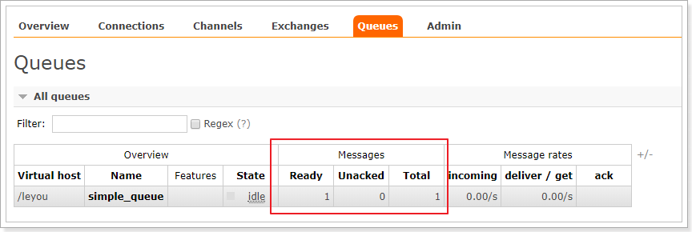
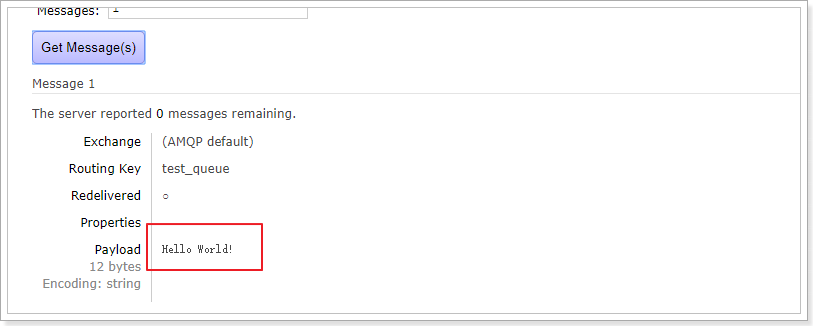
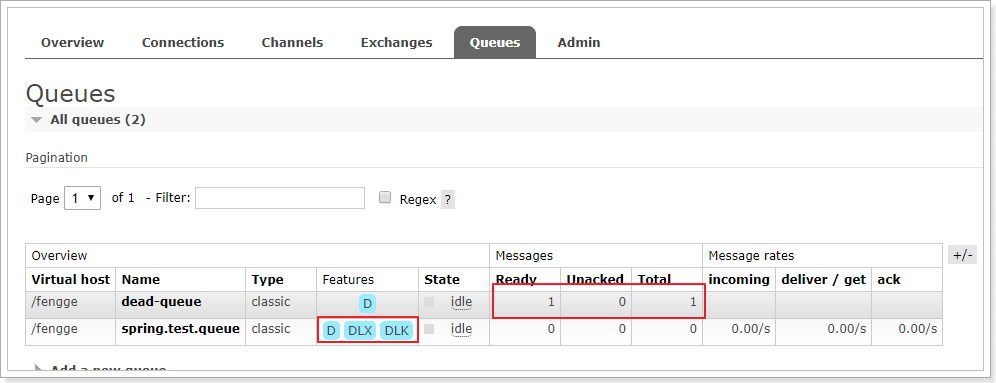
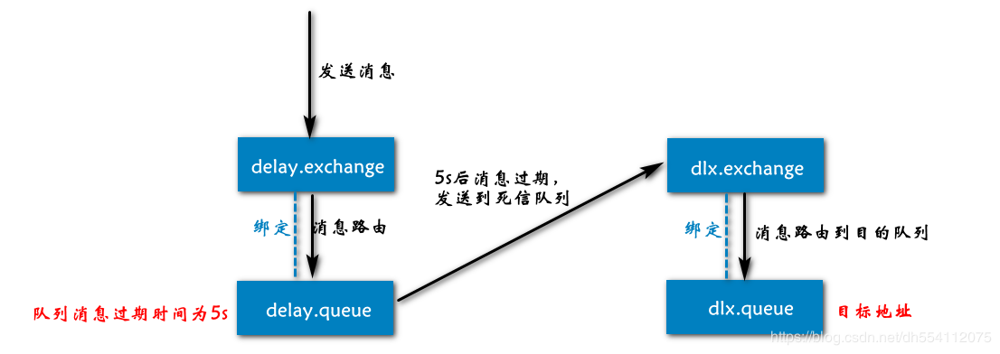
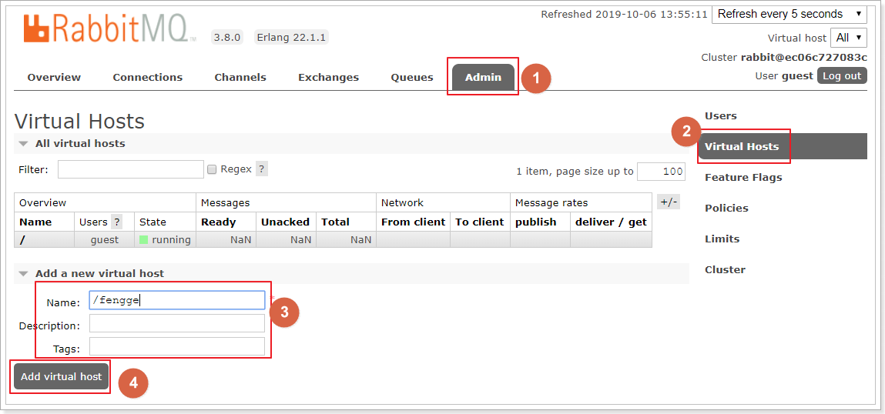
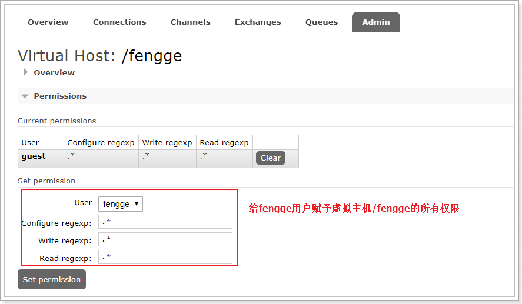

# RabbitMQ


# AMQP和JMS


* MQ是消息通信的模型,并不是具体实现.实现MQ的有两种主流方式:AMQP,JMS

- JMS定义了统一的接口来对消息操作进行统一;AMQP是通过规定协议来统一数据交互的格式
- JMS限定了必须使用Java语言;AMQP只是协议,不规定实现方式,因此是跨语言的
- JMS规定了两种消息模型;而AMQP的消息模型更加丰富
- 常见MQ产品:
  - ActiveMQ:基于JMS
  - RabbitMQ:基于AMQP协议,erlang语言开发,稳定性好
  - RocketMQ:基于JMS,阿里巴巴产品,目前交由Apache基金会
  - Kafka:分布式消息系统,高吞吐量,常用于大数据


# 概述


* [官网](http://www.rabbitmq.com/)
* Message:消息,不具名,由消息头,消息体组成,不透明,而消息头则由一系列可选属性组成,包括RoutingKey(路由键),priority(相对于其他消息的优先权),DeliveryMode(是否持久性)等
* Publisher:消息生产者,向交换器发布消息的客户端程序
* Exchange:交换器,用来接收生产者发送的消息并将这些消息路由给服务器中的队列.
  * direct:点对点模式,默认,发布订阅的routingkey要完全一样
  * fanout:广播,不处理路由键,只要是发送到交换器的消息都会转发到绑定的队列上
  * topic:主题,匹配模式,根据路由键指定的字符串和队列进行匹配.路由键中的通配符为#,\*.#表示0个或以上的字符,\*匹配一个单词
  * headers:匹配AMQP消息的header而不是路由键,和direct交换器一样,但是性能差,几乎不用
* Queue:消息队列,用来保存消息直到发送给消费者,一个消息可投入一个或多个队列,在队列里等待消费者连接队列取走
* Bingding:绑定,用于消息队列和交换器之间的关联,一个绑定就是基于路由键将交换器和消息队列连接起来的路由规则.Exchange和queue的绑定可以是多对多的
* Connection:连接,比如TCP
* Channel:信道,类似NIO(非阻塞线程)中的多路复用双向流数据流通道,建立在tcp连接上
* Consumer:消费者,从消息队列中取走消息
* VirtualHost:虚拟主机,表示一批交换器,消息队列和相关对象.rabbitmq的默认vhost是/
* routing-key:路由键,rabbitmq决定消息该投递到那个队列的规则
* Broker:消息队列服务器实体


# 运行机制

* Amqp中消息的路由过程和JMS存在一些差别,Amqp中增加了Exchange和Binding
* 生产者把消息发布到Exchange上,消息最终到达队列并被消费者消费,而Binding决定交互器的消息应该发送到那个队列


# 消息模式


## 基本消息模型


* P:一个生产者,一个发送消息的用户应用程序
* C:一个消费者,接收消息的用户应用程序
* 队列:红色区域,只有一个,实质上是一个大的消息缓冲区,消息都存储在队列中
* 不需要交换机或使用默认交换机
* 生产者将消息发送到队列中,消费者直接从队列中取消息,每条消息只能被消费一次
* 样例详见**dream-study-microsevice-amqp/com/wy/rabbitmq/simple**
* Web管理界面,此时消息还没被消费






## Work


* 工作模式或竞争模式,一个生产者,多个消费者,每条消息只能被消费一次,不需要交换机或默认交换机

* 多个消费者会轮询获取消息,若是不进行轮询,而是某个队列处理完之后立刻处理下一个,则需要手动返回ACK状态,默认ACK状态是自动确认

* 该模式可以稍微缓解消息堆积

* 样例见**dream-study-microsevice-amqp/com/wy/rabbitmq/work**

* 控制台输出,两个消费者各自消费了25条消息,而且各不相同,这就实现了任务的分发

  

* 可以发现消费者1比消费者2的效率要低,一次任务的耗时较长,然而两人最终消费的消息数量是一样的,消费者2大量时间处于空闲状态,消费者1一直忙碌,正确的做法应该是消费越快的人,消费的越多

* 可以使用channel.basicQos(1)和prefetchCount = 1设置

* 该参数告诉RabbitMQ一次不要向工作人员发送多于一条消息,即不要向工作人员发送新消息,直到它处理并确认了前一个消息;相反,它会将其分派给不是仍然忙碌的下一个工作人员


## Publish/Subscribe


* 发布/订阅,有多种模式,默认消息模式为ExchangeTypes.FANOUT(广播)
* 一个生产者,多个消费者,每个队列的消费者实例可以消费一次消息,多个队列会消费多次消息
* 每一个消费者都有自己的一个队列,而一个队列可以对应多个消费者实例
* 生产者没有将消息直接发送到队列,而是发送到了交换机,每个队列都要绑定到交换机
* 生产者发送的消息,经过交换机到达队列,实现一个消息被多个消费者获取的目的

* 交换器中的消息默认是不保留的,若发生故障就会消失,最好是开启持久化


## Fanout


* 广播模式,可以有多个消费者,每个消费者有自己的Queue
* 每个队列都要绑定到Exchange(交换机),生产者和消费者的Exchange要完全匹配,不需要路由键
* 生产者发送的消息,只能发送到交换机,交换机来决定要发给哪个队列,生产者无法决定
* 交换机把消息发送给绑定过的所有队列
* 队列的消费者都能拿到消息,实现一条消息被多个消费者消费
* 生产者声明Exchange,不再声明Queue.同时消息发送到Exchange,不再发送到Queue
* 样例见**dream-study-microsevice-amqp/com/wy/rabbitmq/fanout**


## Direct


* 定向模式,对应的消息模式为ExchangeTypes.DIRECT
* 在交换机的基础上又增加了一个路由键(routingkey),即从广播中取出符合路由键的消息进行消费
* 生产者和消费者的exchange和routeingkey需要完全匹配
* 生产者是将消息发送到交换器(exchange),而每个队列(queue)需要将自己绑定到交换器上
* 样例见**dream-study-microsevice-amqp/com/wy/rabbitmq/direct**


## Topic


* 订阅模式,将路由键和特定的规则进行匹配
* Topic类型的Exchange与Direct相比,只不过是routingkey可以使用通配符
* 队列需要绑定到特定的规则上
  * #:匹配一个或多个词
  * *:匹配一个词
* 样例见**dream-study-microsevice-amqp/com/wy/rabbitmq/topic**


# 持久化

* 当消费者挂掉,但是生产者仍在发送消息的时候,若是队列只是一个临时队列,那么消息就会丢失

* 临时队列只在消费者存在的时候才会存在,消费者挂掉,临时队列就删除

* 实现消息的持久化,注解方式中需要将autoDelete设置为false,原生方式需要将durable设置为true

  ```java
  // exchange持久化,第3个参数,默认false不持久化
  channel.exchangeDeclare(EXCHANGE_NAME, "direct",true);
  // queue持久化,第2个参数,默认false不持久化
  channel.queueDeclare("queue_name", true, false, false, null);
  ```


# 死信队列

* 死信队列是RabbitMQ中的一种消息机制,若队列里的消息出现以下情况被称为死信消息:
* 消息被否定确认,使用channel.basicNack或channel.basicReject,并且此时requeue被设置为false
* 消息在队列的存活时间超过设置的TTL时间
* 消息队列的消息数量已经超过最大队列长度
* 死信消息会被RabbitMQ进行特殊处理,如果配置了死信队列信息,那么该消息将会被丢进死信队列中,如果没有配置,则该消息将会被丢弃
* 死信的队列的使用,大概可以分为以下步骤
  * 配置业务队列,绑定到业务交换机上
  * 为业务队列配置死信交换机(DLX和路由key
  * 为死信交换机配置死信队列(DLQ)
* 样例见**paradise-study-microservice-amqp/com/wy/rabbitmq/DeadQueueConfig.java**
* 


# 延时队列

* 消息的TTL就是消息的存活时间,RabbitMQ可以对队列和消息分别设置TTL

* 对队列设置就是队列没有消费者连接的保留时间,也可以对每一个单独的消息做单独的设置.超过了这个时间,就可以认为这个消息死了,称之为死信

* 如果队列和消息都设置了TLL,那么就会取小的

* 可以通过设置消息的expiration字段或者x-message-ttl属性来设置时间

* 延时队列的原理其实就是将消息放入到一个普通队列A中,但是A没有任何消费者进行监听,一旦超过TTL之后,将队列中的消息通过一个Exchange放到另外一个队列B中,而B是被监听的,且放到B中的消息必然是经过了30分钟的

* 用于死信队列3个设置:x-dead-letter-exchange->该队列中的死信应该交给的下一个路由名;x-dead-letter-routing-key:路由键;x-message-ttl:队列所有消息的过期时间

* 队列设置TTL:

  ```java
  Map<String, Object> args = new HashMap<String, Object>();
  args.put("x-message-ttl", 6000);
  channel.queueDeclare(queueName, durable, exclusive, autoDelete, args);
  ```

* 消息设置TTL,这条消息的过期时间被设置成了6s:

  ```java
  AMQP.BasicProperties.Builder builder = new AMQP.BasicProperties.Builder();
  builder.expiration("6000");
  AMQP.BasicProperties properties = builder.build();
  channel.basicPublish(exchangeName, routingKey, mandatory, properties, "msg body".getBytes());
  ```

* 但这两种方式是有区别的:

  * 如果设置了队列的TTL属性,那么一旦消息过期,就会被队列丢弃
  * 而第二种方式,消息即使过期,也不一定会被马上丢弃,因为消息是否过期是在即将投递到消费者之前判定的,如果当前队列有严重的消息积压情况,则已过期的消息也许还能存活较长时间
  * 如果不设置TTL,表示消息永远不会过期,如果将TTL设置为0,则表示除非此时可以直接投递该消息到消费者,否则该消息将会被丢弃

* 使用场景:

  * 订单在十分钟之内未支付则自动取消
  * 新创建的店铺,如果在十天内都没有上传过商品,则自动发送消息提醒
  * 账单在一周内未支付,则自动结算
  * 用户注册成功后,如果三天内没有登陆则进行短信提醒
  * 用户发起退款,如果三天内没有得到处理则通知相关运营人员
  * 预定会议后,需要在预定的时间点前十分钟通知各个与会人员参加会议

* 样例见**paradise-study-microsevice-amqp/com/wy/rabbitmq/DeadQueueConfig**

  


# ACK

* 消息确认机制,见**paradise-study-microsevice-amqp/com/wy/rabbitmq/simple**

* 生产者也有消息确认机制,但是有很大的性能问题,特别是在高并发下,不建议使用

* 消费者在处理消息的时候,若是服务器发生异常,那该消息可能就没有完成消息消费,数据就会丢失

* 生产者会无限重试发送消息,而消费者无法消费消息

* 为了确保消息不丢失,消息被消费者消费之后,需反馈给RabbitMQ是否处理成功,RabbitMQ收到反馈才会从队列中删除消息

* 消息的ACK机制默认是打开的,但同时会有一个问题,即当消费者挂掉之后,RabbitMQ仍在一直发送消息,这样很可能就会造成内存泄漏,解决的办法是开启RabbitMQ的重试机制,设置重试的次数

* ACK机制默认是自动提交的,若是需要手动提交,需要修改配置文件进行全局修改.若只修改某个queue或exchange,则需要打开相应的参数durable,设置为true

* SpringBoot手动确认消费消息

  ```java
  @Component
  public class Receiver3 {
  
  	@RabbitHandler
  	public void receiveMsg(Channel channel, Message message, String msg) {
  		try {
  			// Ack手动确认消息已经被消费,false表示只确认当前的消息,true表示队列中所有的消息都被确认
  			channel.basicAck(message.getMessageProperties().getDeliveryTag(), false);
  			/**
  			 * Ack返回false,第2个参数表示是否确认当前消息,true表示该队列中所有消息,false表示当前消息
  			 * 第3个参数表示丢弃消息或重新回到队列中,true表示重新回到队列,false表示丢弃
  			 */
  			channel.basicNack(message.getMessageProperties().getDeliveryTag(), false, true);
  			// Ack拒绝消息,第2个参数true重新发消息,false丢弃或进入死信队列
  			channel.basicReject(message.getMessageProperties().getDeliveryTag(), true);
  		} catch (IOException e1) {
  			e1.printStackTrace();
  		}
  		System.out.println(msg);
  	}
  }
  ```

  


# 消息丢失

* 消息发送出去,由于网络或其他问题没有抵达服务器
  * 做好容错方法(try-catch),发送失败后要有重试机制,可记录到数据库,并且定期扫描重发
  * 做好日志记录,每个消息状态是否都被服务器收到应用记录
* 消息到达Broker,Broker要将消息写入磁盘时宕机
  * publisher也必须加入确认回调机制,确认消息成功,修改数据库休息状态
* 自动ACK状态下,消费者受到消息,但是没有消费就宕机
  * 若是重要消息,必须开启手动确认ACK机制


# 消息重复

* 消息消费成功,但是ACK时宕机,导致ACK不成功
* 消费者的业务消费接口应该设置为幂等性的
* 使用防重表(redis/mysql),发送消息每一个都有业务的唯一标识
* RabbitMQ的每个消息都有redelivered字段,可以获取是否被重新投递过来的,而不是第一次投递


# 消息挤压

* 消费者宕机挤压
* 消费者消费能力不足
* 发送者发送流量太大
* 上线更多的消费者,进行正常消费
* 上线专门的队列消费服务,将消息先批量取出来,记录数据库,离线慢慢处理


# Linux安装


* [官网](https://www.rabbitmq.com/install-rpm.html)下载RabbitMQ安装包,在同页面可找到对应版本的Erlang下载地址
* 安装Erlang:rpm -Uvh erlang.noarch.rpm,安装完成后可修改sha加密值,也可不修改
* 安装RabbitMQ Server
* 启动RabbitMQ
* 安装RabbitMQ Web管理界面
* 设置RabbitMQ远程登录(可选)

```shell
# 下载Erlang并安装
wget https://packages.erlang-solutions.com/erlang-solutions-2.0-1.noarch.rpm
rpm -Uvh erlang-solutions-2.0-1.noarch.rpm
# 修改sha值,可选
cd /var/cache/yum/x86_64/6/erlang-solutions
# 会得到一个sha值
sha1sum primary.xml.gz 
vim repomd.xml
# 修改primary标签下的checksum
# <data type="primary">
# 	<checksum type="sha">结果为sha1sum命令结果</checksum>
yum install erlang
# 查看erlang版本
erl -version
# 下载安装RabbitMQ,在Centos8上安装
wget https://github.com/rabbitmq/rabbitmq-server/releases/download/v3.8.19/rabbitmq-server-3.8.19-1.el8.noarch.rpm
rpm --import https://github.com/rabbitmq/signing-keys/releases/download/2.0/rabbitmq-release-signing-key.asc
yum install rabbitmq-server-3.8.19-1.el8.noarch.rpm
# 开机启动
chkconfig rabbitmq-server on
/sbin/service rabbitmq-server start/status/stop
# 安装Web管理界面插件
rabbitmq-plugins enable rabbitmq_management
# 设置RabbitMQ远程ip登录,专门设置一个账号
rabbitmqctl add_user rabbitmq_test 123456
# 设置角色
rabbitmqctl set_user_tags rabbitmq_test administrator
# 设置用户权限
rabbitmqctl set_permissions -p "/" rabbitmq_test ".*" ".*" ".*"
# 设置完成后可以查看当前用户和角色(需要开启服务)
rabbitmqctl list_users
# 浏览器输入:serverip:15672,其中serverip是RabbitMQ-Server所在主机的ip
```

* IPV4 forwarding is disabled错误

```shell
vi  /usr/lib/sysctl.d/00-system.conf
# 添加如下代码
net.ipv4.ip_forward=1
# 重启network服务
systemctl restart network
```


## 日志与监控


* RabbitMQ默认日志存放路径:/var/log/rabbitmq/rabbit@xxx.log
* 日志包含了RabbitMQ的版本号,Erlang的版本号,RabbitMQ服务节点名称,cookie的hash值,RabbitMQ配置文件地址,内存限制,磁盘限制,默认账户guest的创建以及权限配置等等
* rabbitmqctl管理和监控
  * rabbitmqctl list_queues:查看队列
  * rabbitmqctl list_exchanges:查看exchanges
  * rabbitmqctl list_users:查看用户
  * rabbitmqctl list_connections:查看连接
  * rabbitmqctl list_consumers:查看消费者信息
  * rabbitmqctl environment:查看环境变量
  * rabbitmqctl list_queues name messages_unacknowledged:查看未被确认的队列
  * rabbitmqctl list_queues name memory:查看单个队列的内存使用
  * rabbitmqctl list_queues name messages_ready:查看准备就绪的队列
* 可以通过RabbitMQ的Web控制台直接查看相关信息


## 消息追踪


* 在使用任何消息中间件的过程中,难免会出现某条消息异常丢失的情况
* 对于RabbitMQ而言,产生消息丢失的情况可能是:
  * 生产者或消费者与RabbitMQ断开了连接,而它们与RabbitMQ又采用了不同的确认机制
  * 交换器与队列之间不同的转发策略
  * 交换器并没有与任何队列进行绑定,生产者又不感知或者没有采取相应的措施
  * RabbitMQ本身的集群策略也可能导致消息的丢失
* 在RabbitMQ中可以使用Firehose和rabbitmq_tracing插件功能来实现消息追踪


### Firehose


* firehose的机制是将生产者投递给rabbitmq的消息, rabbitmq投递给消费者的消息按照指定的格式发送到默认的exchange上,这个默认的exchange的名为amq.rabbitmq.trace,一个topic类型的exchange.该交换机由RabbitMQ自动生成
* 发送到这个exchange上的routing key为 publish.exchangename 和deliver.queuename;exchangename和queuename为实际exchange和queue的名称,分别对应生产者投递到exchange的消息和消费者从queue上获取的消息
* 打开 trace 会影响消息写入功能,适当打开后请关闭
* rabbitmqctl trace_on:开启Firehose命令
* rabbitmqctl trace_off:关闭Firehose命令


### Rabbitmq_tracing


* Rabbitmq_tracing和Firehose类似,只不过Rabbitmq_tracing可以在Web管理界面查看,更容易使用和管理
* 要使用该功能,需要启用插件:rabbitmq-plugins enable rabbitmq_tracing
* 启用插件后可以在Web管理界面的右边看到Tracing选项.点击进入设置name,其他默认即可
* 当RabbitMQ有消息发送或接收时,会从Trace log files中查看到信息


# Docker

* docker安装可网上搜索,因为国内安装erlang和rabbitmq太慢,直接在docker中安装更快

* 下载rabbitmq:management,否则没有web管理页面,若不带management为latest版本,没有web页面

* docker中运行rabbitmq:

  ```shell
  docker run -d --hostname my-rabbit --name rabbit -e RABBITMQ_DEFAULT_USER=guest -e RABBITMQ_DEFAULT_PASS=guest  -p 15672:15672 -p 5672:5672 -p 25672:25672 -p 61613:61613 -p 1883:1883 -v /app/rabbitmq/etc:/etc/rabbitmq --privileged=true -v  /app/rabbitmq/lib:/var/lib/rabbitmq --privileged=true  -v /app/rabbitmq/log:/var/log/rabbitmq  --privileged=true rabbitmq:management
  ```

  * -d:后台运行
  * --hostname:指定容器主机名,可自定义
  * --name:运行的rabbitmq的名称,可自定义,可以同时运行多个相同版本的rabbitmq,每个的名称不一样
  * -e RABBITMQ_DEFAULT_USER=admin:定义web页面登录的用户名为admin,若不指定,默认为guest
  * -e RABBITMQ_DEFAULT_PASS=admin:定义web页面登录的密码为admin,若不指定,默认为guest
  * -p:端口映射,前面的是linux端口,后面的是docker端口
  * -v:将docker中运行的rabbitmq的文件映射到linux中,前面的参数是linux中地址,后面的是docker中的地址
  * 注意在映射本地文件时,需要给权限,否则创建文件时会失败

* docker exec -it rabbit bash:进入正在运行的名为rabbit的容器中,也可以用containerid

* docker logs rabbit:查看容器的运行情况

* 在web上运行ip:15672,能成功打开页面表示安装运行成功,默认登录用户名和密码都是guest

* 5672为通讯端口,spring连接rabbit时需要的端口;15672是rabbitMq管理界面端口;25672是rabbitMq集群的端口

* 若无法打开web页面,则利用docker exec -it rabbit bash进入rabbit的控制台,输入命令:rabbitmq-plugins enable rabbitmq_management即可


## 管理页面

* overview:概览
* connections:无论生产者还是消费者,都需要与RabbitMQ建立连接后才可以完成消息的生产和消费,在这里可以查看连接情况
* channels:通道,建立连接后,会形成通道,消息的投递获取依赖通道
* Exchanges:交换机,用来实现消息的路由
* Queues:队列,即消息队列,消息存放在队列中,等待消费,消费后被移除队列


## 添加用户

* 如果不使用guest,可以自己创建一个用户:


* 超级管理员(administrator):可登陆管理控制台,可查看所有的信息,并且可以对用户,策略(policy)进行操作
* 监控者(monitoring):可登陆管理控制台,同时可以查看rabbitmq节点的相关信息(进程数,内存使用情况,磁盘使用情况等)
* 策略制定者(policymaker):可登陆管理控制台,同时可以对policy进行管理,但无法查看节点的相关信息(上图红框标识的部分)
* 普通管理者(management):仅可登陆管理控制台,无法看到节点信息,也无法对策略进行管理
* 其他:无法登陆管理控制台,通常就是普通的生产者和消费者

 

## 创建Virtual Hosts

虚拟主机:类似于mysql中的database.他们都是以"/"开头




## 设置权限





# 集群


## 普通集群


* 多台服务器中,只有一台服务器上有queue的元数据和真实数据,元数据相当于配置文件.其他服务器只有元数据

* 当消费数据时,若是请求到只有元数据的服务器,该服务器将和主服务器通讯请求数据,再将数据返回

* 若主服务器挂了,那么该集群就不可用了,只能用做高并发的访问

* 该模式适用于消息无需持久化的场景,如日志队列

  ```shell
  # rabbit1操作作为主节点
  # 先停止rabbitmq,再重置,再启动
  rabbitmqctl -n rabbit1 stop_app  
  rabbitmqctl -n rabbit1 reset	 
  rabbitmqctl -n rabbit1 start_app
  
  # rabbit2操作为从节点
  rabbitmqctl -n rabbit2 stop_app
  rabbitmqctl -n rabbit2 reset
  # hostname为从节点的域名或ip:port
  rabbitmqctl -n rabbit2 join_cluster rabbit1@'hostname' 
  rabbitmqctl -n rabbit2 start_app
  ```


## 镜像集群


* 基于普通集群添加一些其他策略

* 每台服务器上都有queue的元数据以及真实数据

* 该集群模式实现了高可用,但是并不是分布式的,因为每个服务器的数据都是一样的

* 设置的镜像队列可以通过开启的网页的管理端Admin->Policies,也可以通过命令:`rabbitmqctl set_policy my_ha "^" '{"ha-mode":"all"}'`

* 通过网页开启

  * Name:策略名称
  * Pattern:匹配的规则,如果是匹配所有的队列,是^
  * Definition:使用ha-mode模式中的all,即同步所有匹配的队列,问号链接帮助文档

  


## 负载均衡-HAProxy


* HAProxy提供高可用性,负载均衡以及基于TCP和HTTP应用的代理
* HAProxy实现了一种事件驱动、单一进程模型,此模型支持非常大的并发连接数


### 安装


```shell
# 下载依赖包
yum install gcc vim wget
# 上传haproxy源码包,解压
tar -zxvf haproxy-1.6.5.tar.gz -C /usr/local
# 进入目录、进行编译、安装
cd /usr/local/haproxy-1.6.5
make TARGET=linux31 PREFIX=/usr/local/haproxy
make install PREFIX=/usr/local/haproxy
mkdir /etc/haproxy
# 赋权
groupadd -r -g 149 haproxy
useradd -g haproxy -r -s /sbin/nologin -u 149 haproxy
# 创建haproxy配置文件
mkdir /etc/haproxy
vim /etc/haproxy/haproxy.cfg
```


### 配置


* 配置文件路径:/etc/haproxy/haproxy.cfg

```shell
#logging options
global
	log 127.0.0.1 local0 info
	maxconn 5120
	chroot /usr/local/haproxy
	uid 99
	gid 99
	daemon
	quiet
	nbproc 20
	pidfile /var/run/haproxy.pid

defaults
	log global
	
	mode tcp

	option tcplog
	option dontlognull
	retries 3
	option redispatch
	maxconn 2000
	contimeout 5s
   
     clitimeout 60s

     srvtimeout 15s	
#front-end IP for consumers and producters

listen rabbitmq_cluster
	bind 0.0.0.0:5672
	
	mode tcp
	#balance url_param userid
	#balance url_param session_id check_post 64
	#balance hdr(User-Agent)
	#balance hdr(host)
	#balance hdr(Host) use_domain_only
	#balance rdp-cookie
	#balance leastconn
	#balance source //ip
	
	balance roundrobin
	
        server node1 192.168.1.150:5673 check inter 5000 rise 2 fall 2
        server node2 192.168.1.151:5673 check inter 5000 rise 2 fall 2

listen stats
	bind 172.16.98.133:8100
	mode http
	option httplog
	stats enable
	stats uri /rabbitmq-stats
	stats refresh 5s
```


```shell
# 启动HAproxy负载
/usr/local/haproxy/sbin/haproxy -f /etc/haproxy/haproxy.cfg
# 查看haproxy进程状态
ps -ef | grep haproxy

# 访问如下地址对mq节点进行监控
http://172.16.98.133:8100/rabbitmq-stats
```


* 代码中访问mq集群地址,变为访问haproxy地址:5672


## 命令


* rabbitmqctl join_cluster {cluster_node} [–ram]:将节点加入指定集群中,执行前需要停止RabbitMQ并重置节点
* rabbitmqctl cluster_status:显示集群的状态
* rabbitmqctl change_cluster_node_type {disc|ram}:修改集群节点的类型,执行前需要停止RabbitMQ
* rabbitmqctl forget_cluster_node [–offline]:将节点从集群中删除,允许离线执行
* rabbitmqctl update_cluster_nodes {clusternode}:在集群中的节点应用启动前咨询clusternode节点的最新信息,并更新相应的集群信息.和join_cluster不同的是,它不加入集群.可能出现的情况中,节点A和B都在集群中,当节点A离线了,节点C又和节点B组成了一个集群,然后节点B又离开了集群,当A醒来的时候,它会尝试联系节点B,但是这样会失败,因为节点B已经不在集群中了
* rabbitmqctl cancel_sync_queue [-p vhost] {queue}:取消队列queue同步镜像的操作
* rabbitmqctl set_cluster_name {name}:设置集群名称.集群名称在客户端连接时会通报给客户端.Federation和Shovel插件也会用到集群名称.集群名称默认是集群中第一个节点的名称,通过这个命令可以重新设置


# Springcloud stream

	主要是对rabbit和kafuka的简化使用,不必配置更多的配置来使用中间件