# RocketMQ


# 概述


* Producer:生产者.会和NameServer集群中的随机一台建立长连接,获取当前要发送的Topic存在哪台Broker Master上,然后再与其建立长连接,支持多种负载均衡
* Producer Group:生产者组,是一类Producer的集合,这类Producer通常发送一类消息,且发送逻辑一致
* Consumer:消费者.同Producer,只不过会同时获取Slave的地址
* Consumer Group:同Producer Group
* Broker:类似于服务器,队列存储在Broker中,负责消息的存储,查询消费.一个Master可对应多个Slave ,Master支持读写,Slave只负责读.Broker会向集群中的每一台NameServer注册自己的路由信息
* NameServer:一个很简单的Topic路由注册中心,支持Broker的动态注册和发现,保存Topic和Broker之间的关系.集群中的NameServer不会进行相互通讯,各NameServer都有完整的路由信息
* Topic:区分消息的种类,一个发送者可以发送消息给一个或多个Topic,一个消费者可以接收一个或多个Topic
* Message Queue:相当于Topic的分区,用于并行发送和接收消息


# 核心


* 先启动NameServer集群,各NameServer之间无任何数据交互,Broker启动之后会向所有NameServer定期(30s)发送心跳包,包括IP,Port,TopicInfo,NameServer会定期扫描Broker存活列表,如果超过120S没有心跳则移除此Broker信息,代表下线
* Producer上线从NameServer获取它要发送的某Topic消息在哪个Broker上,并与其建立长连接,发送消息
* Consumer上线同Producer
* Topic:主题.不同类型的消息以不同的Topic进行区分,相当于消息的一级分类
* Push:服务端(Broker)向消费者主动推送消息.实际上底层仍然是pull模式.Consumer把轮询过程封装并注册MessageListener监听器,取到消息后,唤醒MessageListener的consumeMessage()来消费,对用户来说,感觉像是消息被推送的
* Pull:消费者向服务器(Broker)定时拉取消息.取消息的过程需要用户实现.先通过打算消费的Topic拿到MessageQueue的集合,遍历该集合,然后针对每个MessageQueue批量取消息,一次取完后,记录该队列下一次要取的开始offset,直到取完,再换另一个MessageQueue
* 长轮询:为保持消息的实时性,Consumer和Broker之间建立了长轮询.如果Broker没有消息更新,则将连接挂起,直到Broker推送新的数据.客户端象传统轮询一样从Broker请求数据,Broker会阻塞请求不会立刻返回,直到有数据或超市才返回给Consumer,然后关闭连接,Consumer处理完响应信息后再想Broker发送新的请求
* RocketMQ消息存储是由ConsumeQueue和CommitLog共同完成,CommitLog是真正存储数据的文件,ConsumeQueue是索引文件


## 消息的存储和发送


### 消息存储


* 磁盘如果使用得当,磁盘的速度完全可以匹配上网络的数据传输速度,但是磁盘随机写的速度只有大概100KB/s,和顺序写的性能相差6000倍.RocketMQ的消息用顺序写,保证了消息存储的速度


### 消息发送


* Linux操作系统分为用户态和内核态,文件操作、网络操作需要涉及这两种形态的切换,免不了进行数据复制
* 一台服务器 把本机磁盘文件的内容发送到客户端,一般分为两个步骤:
* read: 读取本地文件内容
* write: 将读取的内容通过网络发送出去
* 这两个看似简单的操作,实际进行了4 次数据复制,分别是:
  * 从磁盘复制数据到内核态内存
  * 从内核态内存复 制到用户态内存
  * 然后从用户态 内存复制到网络驱动的内核态内存
  * 最后是从网络驱动的内核态内存复 制到网卡中进行传输


* 通过使用mmap的方式,可以省去向用户态的内存复制,提高速度.这种机制在Java中是通过MappedByteBuffer实现.但是采用MappedByteBuffer这种内存映射的方式有几个限制,其中之一是一次只能映射1.5~2G 的文件至用户态的虚拟内存,这也是为何RocketMQ默认设置单个CommitLog日志数据文件为1G的原因
* RocketMQ充分利用了上述特性,也就是所谓的“零拷贝”技术,提高消息存盘和网络发送的速度


### 消息存储结构


* RocketMQ消息的存储是由ConsumeQueue和CommitLog配合完成的
* CommitLog: 存储消息的元数据,消息真正的物理存储文件
* ConsumerQueue: 消息的逻辑队列,类似数据库的索引文件,存储的是指向物理存储的地址.每 个Topic下的每个Message Queue都有一个对应的ConsumeQueue文件
* IndexFile: 为了消息查询提供了一种通过key或时间区间来查询消息的方法,这种通过IndexFile来查找消息的方法不影响发送与消费消息的主流程


## 刷盘机制


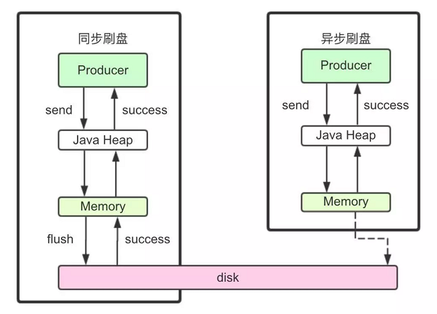


* RocketMQ的消息是存储到磁盘上的,这样既能保证断电后恢复, 又可以让存储的消息量超出内存的限制.消息在通过Producer写入RocketMQ的时候,有两种写磁盘方式,分布式同步刷盘和异步刷盘
* 同步刷盘:在返回写成功状态时,消息已经被写入磁盘.具体流程是,消息写入内存的PAGECACHE后,立刻通知刷盘线程刷盘, 然后等待刷盘完成,刷盘线程执行完成后唤醒等待的线程,返回消息写成功的状态
* 异步刷盘:在返回写成功状态时,消息可能只是被写入了内存的PAGECACHE,写操作的返回快,吞吐量大;当内存里的消息量积累到一定程度时,统一触发写磁盘动作,快速写入
* 配置:同步还是异步刷盘,都是通过Broker配置文件里的flushDiskType 设置,该参数可配置为SYNC_FLUSH/ASYNC_FLUSH


## 消息发送读取高可用


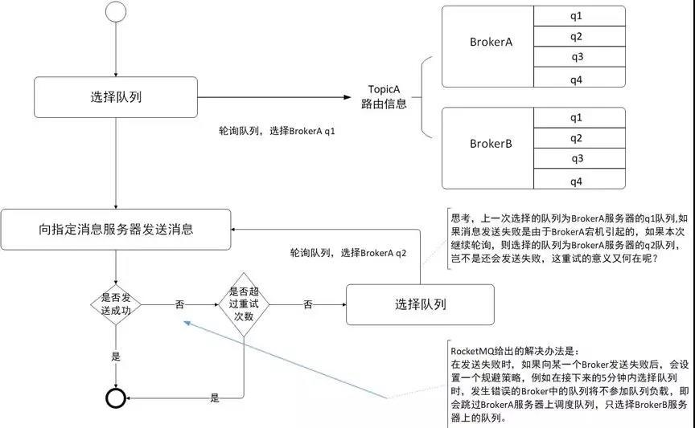


- 在Consumer的配置文件中,并不需要设置是从Master还是从Slave 读,当Master不可用时,Consumer会被自动切换到Slave 读
- 在创建Topic的时候,把Topic的多个Queue创建在多个Broker组上(相同Broker名称,不同 brokerId的机器组成一个Broker组),这样当一个Broker组的Master不可用后,其他组的Master仍然可用,Producer仍然可以发送消息.
- RocketMQ目前还不支持把Slave自动转成Master,如果需要把Slave转成Master,则要手动停止Slave角色的Broker,更改配置文件,用新的配置文件启动Broker


## 负载均衡


### Producer负载均衡


* Producer端,每个实例在发消息的时候,默认会轮询所有的message queue发送,以达到让消息平均落在不同的queue上.而由于queue可以散落在不同的broker,所以消息就发送到不同的broker下


### Consumer负载均衡


#### 集群模式


* 在集群消费模式下,每条消息只需要投递到订阅这个topic的Consumer Group下的一个实例即可
* RocketMQ采用主动拉取的方式拉取并消费消息,在拉取的时候需要明确指定拉取哪一条message queue
* 每当实例的数量有变更,都会触发一次所有实例的负载均衡,这时候会按照queue的数量和实例的数量平均分配queue给每个实例
* 默认的分配算法是AllocateMessageQueueAveragely


* 另外一种平均的算法是AllocateMessageQueueAveragelyByCircle,也是平均分摊每一条queue,只是以环状轮流分queue的形式


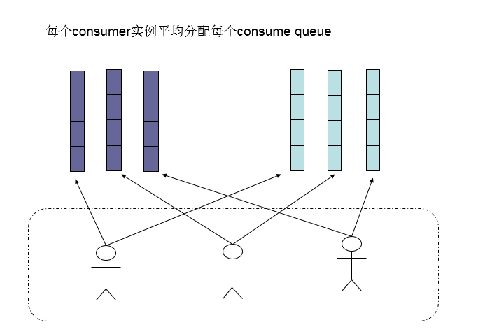


* 集群模式下,queue都是只允许分配一个实例,如果多个实例同时消费一个queue的消息,那样会导致同一个消息在不同的实例下被消费多次,所以算法上都是一个queue只分给一个consumer实例,一个consumer实例可以允许同时分到不同的queue
* 通过增加consumer实例去分摊queue的消费,可以起到水平扩展的消费能力的作用.而有实例下线的时候,会重新触发负载均衡,这时候原来分配到的queue将分配到其他实例上继续消费
* 如果consumer实例的数量比message queue的总数量还多的话,多出来的consumer实例将无法分到queue,也就无法消费到消息,也就无法起到分摊负载的作用了,所以需要控制让queue的总数量大于等于consumer的数量


#### 广播模式


* 广播模式下要求一条消息需要投递到一个消费组下面所有的消费者实例,所以也就没有消息被分摊消费的说法
* consumer分配queue的时候,所有consumer都分到所有的queue,即一条消息可以被消费多次


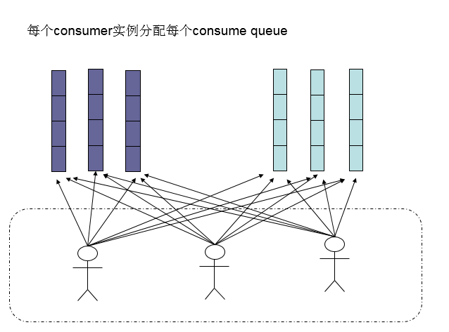


# 顺序消息


* 消息有序指的是可以按照消息的发送顺序来消费(FIFO)
* RocketMQ可以严格的保证消息有序,可以分为分区有序或者全局有序
* 在默认的情况下消息发送会采取Round Robin轮询方式把消息发送到不同的queue(分区队列);而消费消息的时候从多个queue上拉取消息,这种情况发送和消费是不能保证顺序.但是如果控制发送的顺序消息只依次发送到同一个queue中,消费的时候只从这个queue上依次拉取,则就保证了顺序
* 当发送和消费参与的queue只有一个,则是全局有序;如果多个queue参与,则为分区有序,即相对每个queue,消息都是有序的


# 消息重试


## 顺序消息的重试


* 对于顺序消息,当消费者消费消息失败后,消息队列 RocketMQ 会自动不断进行消息重试(每次间隔为 1 秒),这时,应用会出现消息消费被阻塞的情况.因此,在使用顺序消息时,务必保证应用能够及时监控并处理消费失败的情况,避免阻塞现象的发生


## 无序消息的重试


* 对于无序消息(普通、定时、延时、事务消息),当消费者消费消息失败时,可以通过设置返回状态达到消息重试的结果
* 无序消息的重试只针对集群消费方式生效,广播方式不提供失败重试特性,即消费失败后,失败消息不再重试,继续消费新的消息


## 重试次数


* 消息队列 RocketMQ 默认允许每条消息最多重试 16 次,每次重试的间隔时间如下:

| 第几次重试 | 与上次重试的间隔时间 | 第几次重试 | 与上次重试的间隔时间 |
| :--------: | :------------------: | :--------: | :------------------: |
|     1      |        10 秒         |     9      |        7 分钟        |
|     2      |        30 秒         |     10     |        8 分钟        |
|     3      |        1 分钟        |     11     |        9 分钟        |
|     4      |        2 分钟        |     12     |       10 分钟        |
|     5      |        3 分钟        |     13     |       20 分钟        |
|     6      |        4 分钟        |     14     |       30 分钟        |
|     7      |        5 分钟        |     15     |        1 小时        |
|     8      |        6 分钟        |     16     |        2 小时        |

* 如果消息重试 16 次后仍然失败,消息将不再投递.如果严格按照上述重试时间间隔计算,某条消息在一直消费失败的前提下,将会在接下来的 4 小时 46 分钟之内进行 16 次重试,超过这个时间范围消息将不再重试投递
* 一条消息无论重试多少次,这些重试消息的 Message ID 不会改变


### 配置方式


* 集群消费方式下,消息消费失败后期望消息重试,需要在消息监听器接口的实现中明确进行配置,三种方式任选一种
  * 返回 Action.ReconsumeLater ,推荐
  * 返回 Null
  * 抛出异常

```java
public class MessageListenerImpl implements MessageListener {
    @Override
    public Action consume(Message message, ConsumeContext context) {
        //处理消息
        doConsumeMessage(message);
        //方式1：返回 Action.ReconsumeLater,消息将重试
        return Action.ReconsumeLater;
        //方式2：返回 null,消息将重试
        return null;
        //方式3：直接抛出异常, 消息将重试
        throw new RuntimeException("Consumer Message exceotion");
    }
}
```


* 集群消费方式下,消息失败后期望消息不重试,需要捕获消费逻辑中可能抛出的异常,最终返回 Action.CommitMessage,此后这条消息将不会再重试

```java
public class MessageListenerImpl implements MessageListener {
    @Override
    public Action consume(Message message, ConsumeContext context) {
        try {
            doConsumeMessage(message);
        } catch (Throwable e) {
            //捕获消费逻辑中的所有异常,并返回 Action.CommitMessage;
            return Action.CommitMessage;
        }
        //消息处理正常,直接返回 Action.CommitMessage;
        return Action.CommitMessage;
    }
}
```


* RocketMQ 允许 Consumer 启动的时候设置最大重试次数,重试时间间隔将按照如下策略:
  * 最大重试次数小于等于 16 次,则重试时间间隔同上表描述
  * 最大重试次数大于 16 次,超过 16 次的重试时间间隔均为每次 2 小时

```java
Properties properties = new Properties();
//配置对应 Group ID 的最大消息重试次数为 20 次
properties.put(PropertyKeyConst.MaxReconsumeTimes,"20");
Consumer consumer =ONSFactory.createConsumer(properties);
```


- 消息最大重试次数的设置对相同 Group ID 下的所有 Consumer 实例有效
- 如果只对相同 Group ID 下两个 Consumer 实例中的其中一个设置了 MaxReconsumeTimes,那么该配置对两个 Consumer 实例均生效
- 配置采用覆盖的方式生效,即最后启动的 Consumer 实例会覆盖之前的启动实例的配置
- 消费者收到消息后,可按照如下方式获取消息的重试次数

```java
public class MessageListenerImpl implements MessageListener {
    @Override
    public Action consume(Message message, ConsumeContext context) {
        //获取消息的重试次数
        System.out.println(message.getReconsumeTimes());
        return Action.CommitMessage;
    }
}
```


# 死信队列


* 当一条消息初次消费失败,消息队列 RocketMQ 会自动进行消息重试;达到最大重试次数后,若消费依然失败,消息队列不会立刻将消息丢弃,而是将其发送到该消费者对应的特殊队列中
* 在消息队列中,这种正常情况下无法被消费的消息称为死信消息(Dead-Letter Message),存储死信消息的特殊队列称为死信队列Dead-Letter Queue


## 死信特性


- 不会再被消费者正常消费
- 有效期与正常消息相同,均为 3 天,3 天后会被自动删除
- 一个死信队列对应一个 Group ID, 而不是对应单个消费者实例
- 如果一个 Group ID 未产生死信消息,消息队列 RocketMQ 不会为其创建相应的死信队列
- 一个死信队列包含了对应 Group ID 产生的所有死信消息,不论该消息属于哪个 Topic


## 查看死信信息


* 在控制台查询出现死信队列的主题信息


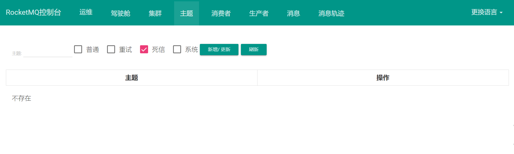


* 在消息界面根据主题查询死信消息


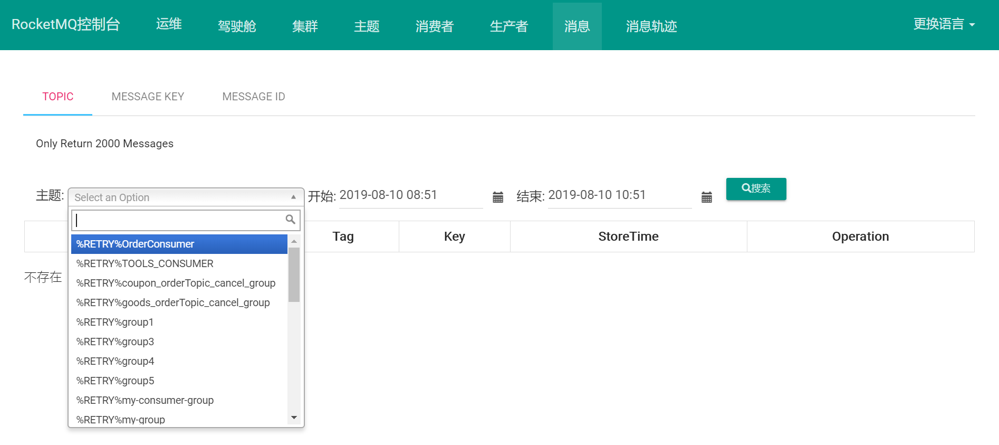


* 选择重新发送消息:可以在消息队列 RocketMQ 控制台重新发送该消息,让消费者重新消费一次


# 消费幂等


* 消息队列 RocketMQ 消费者在接收到消息以后,有必要根据业务上的唯一 Key 对消息做幂等处理的必要性


## 必要性


* 尤其在网络不稳定的情况下,消息队列 RocketMQ 的消息有可能会出现重复,这个重复简单可以概括为以下情况:

- 发送时消息重复.当一条消息已被成功发送到服务端并完成持久化,此时出现了网络闪断或者客户端宕机,导致服务端对客户端应答失败.此时生产者意识到消息发送失败并尝试再次发送消息,消费者后续会收到两条内容相同并且 Message ID 也相同的消息

- 投递时消息重复.消息消费的场景下,消息已投递到消费者并完成业务处理,当客户端给服务端反馈应答的时候网络闪断.为了保证消息至少被消费一次,消息队列 RocketMQ 的服务端将在网络恢复后再次尝试投递之前已被处理过的消息,消费者后续会收到两条内容相同并且 Message ID 也相同的消息

- 负载均衡时消息重复(包括但不限于网络抖动、Broker 重启以及订阅方应用重启).当消息队列 RocketMQ 的 Broker 或客户端重启、扩容或缩容时,会触发 Rebalance,此时消费者可能会收到重复消息


## 处理方式


* 因为 Message ID 有可能出现冲突（重复）的情况,所以真正安全的幂等处理,不建议以 Message ID 作为处理依据。 最好的方式是以业务唯一标识作为幂等处理的关键依据,而业务的唯一标识可以通过消息 Key 进行设置

```java
Message message = new Message();
message.setKey("ORDERID_100");
SendResult sendResult = producer.send(message);
```

* 订阅方收到消息时可以根据消息的 Key 进行幂等处理

```java
consumer.subscribe("ons_test", "*", new MessageListener() {
    public Action consume(Message message, ConsumeContext context) {
        String key = message.getKey()
        // 根据业务唯一标识的 key 做幂等处理
    }
});
```


# 过滤消息


## ||过滤


* 生产者发送消息时除了传递Topic之外还是TAG
* 消费者消费消息时TAG参数可以传*,表示消费TOPIC下所有类型的消息
* ||:表示或,如TAG1 || TAG2表示消费TAG1和TAG2类型的消息


## SQL过滤


* RocketMQ只定义了一些基本语法来支持这个特性
  * 数值比较:`>,>=,<,<=,BETWEEN,=`
  * 字符比较:`=,<>,IN`
  * IS NULL 或 IS NOT NULL
  * 逻辑符号:`AND,OR,NOT`
* 常量支持类型为:
  * 数值:比如:123,3.1415
  * 字符符:比如:'abc',必须用单引号包裹起来
  * NULL:特殊的常量
  * 布尔值:TRUE / FALSE
* 只有使用push模式的消费者才能用使用SQL92标准的sql语句,接口如下

```java
public void subscribe(finalString topic, final MessageSelector messageSelector)
```


# 事务消息


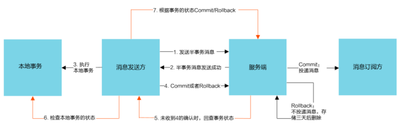


* RocketMQ提供了事务消息,通过事务消息就能达到分布式事务的最终一致
* 半事务消息:暂不能投递的消息,发送方已经成功地将消息发送到了RocketMQ服务端,但是服务端未收到生产者对该消息的二次确认,此时该消息被标记成`暂不能投递`状态,处于该种状态下的消息即半事务消息
* 消息回查:由于网络闪断,生产者应用重启等原因,导致某条事务消息的二次确认丢失,RocketMQ服务端通过扫描发现某条消息长期处于`半事务消息`时,需主动向生产者询问该消息的最终状态(Commit是Rollback),该询问过程即消息回查
* 事务消息发送:

  * 发送方将半事务消息发送至RocketMQ服务端
  * RocketMQ服务端将消息持久化之后,向发送方返回Ack确认消息发送成功,此时消息为半事务消息
  * 发送方开始执行本地事务逻辑
  * 发送方根据本地事务执行结果向服务端提交二次确认(Commit或Rollback),服务端收到Commit 状态则将半事务消息标记为可投递,订阅方最终将收到该消息;服务端收到 Rollback 状态则删除半事务消息,订阅方将不会接受该消息
* 事务消息回查:

  * 在断网或者是应用重启的特殊情况下,上述步骤4提交的二次确认最终未到达服务端,经过固定时间后服务端将对该消息发起消息回查
  * 发送方收到消息回查后,需要检查对应消息的本地事务执行的最终结果
  * 发送方根据检查得到的本地事务的最终状态再次提交二次确认,服务端仍按照步骤4对半事务消息进行操作
* 事务消息共有三种状态:提交,回滚,中间状态:
  * TransactionStatus.CommitTransaction:提交事务,它允许消费者消费此消息
  * TransactionStatus.RollbackTransaction:回滚事务,它代表该消息将被删除,不允许被消费
  * TransactionStatus.Unknown:中间状态,它代表需要检查消息队列来确定状态


## 使用限制


* 事务消息不支持延时消息和批量消息
* 事务性消息可能不止一次被检查或消费
  * 为了避免单个消息被检查太多次而导致半队列消息累积,默认将单个消息的检查次数限制为 15 次
  * 通过 Broker 配置文件的 `transactionCheckMax` 修改此限制
  * 如果已经检查某条消息超过 N 次(N = `transactionCheckMax` ),则 Broker 将丢弃此消息,并在默认情况下同时打印错误日志,可以通过重写 `AbstractTransactionCheckListener` 修改这个行为
* 事务消息将在 Broker 配置文件中的参数 transactionMsgTimeout 这样的特定时间长度之后被检查.当发送事务消息时,用户还可以通过设置 CHECK_IMMUNITY_TIME_IN_SECONDS 来改变这个限制,该参数优先于 `transactionMsgTimeout`
* 提交给用户的目标主题消息可能会失败,目前这依日志的记录而定.它的高可用性通过 RocketMQ 本身的高可用性机制来保证,如果希望确保事务消息不丢失,并且事务完整性得到保证,建议使用同步的双重写入机制
* 事务消息的生产者 ID 不能与其他类型消息的生产者 ID 共享.与其他类型的消息不同,事务消息允许反向查询、MQ服务器能通过它们的生产者 ID 查询到消费者


# 安装


## 服务安装


* 要求JDK1.8,Maven3.2,[下载地址](http://archive.apache.org/dist/rocketmq),按需下载版本,解压到/app/rocketmq中
* 修改bin/runserver.sh,根据服务器情况调整内存大小

```shell
set "JAVA_OPT=%JAVA_OPT% -server -Xms512m -Xmx512m -Xmn512m -XX:MetaspaceSize=128m -XX:MaxMetaspaceSize=320m" 
```

* 修改bin/runbroker.sh,调整磁盘利用率大小,默认磁盘空间超过85%不再接收消息

```shell
set "JAVA_OPT=%JAVA_OPT% -server -Drocketmq.broker.diskSpaceWarningLevelRatio=0.85 -Xms512m -Xmx512m -Xmn512m -XX:MetaspaceSize=128m -XX:MaxMetaspaceSize=320m"
```

* 启动NameServer:nohup sh mqnamesrv &

* 启动Broker:sh mqbroker -n 127.0.0.1:9876,-n指定nameserver的地址

* 查看NameServer日志:tail -f ~/logs/rocketmqlogs/namesrv.log

* 查看Broker日志:tail -f ~/logs/rocketmqlogs/broker.log

* 配置环境变量:vi /etc/profile,修改后source /etc/profile

  ```shell
  ROCKETMQ_HOME=/usr/local/rocketmq/rocketmq-all-4.4.0-bin-release
  PATH=$PATH:$ROCKETMQ_HOME/bin
  export ROCKETMQ_HOME PATH
  ```

* 发送消息

  ```sh
  # 设置环境变量
  export NAMESRV_ADDR=localhost:9876
  # 使用安装包的Demo发送消息
  sh bin/tools.sh org.apache.rocketmq.example.quickstart.Producer
  ```


* 接收消息

  ```shell
  # 设置环境变量
  export NAMESRV_ADDR=localhost:9876
  # 接收消息
  sh bin/tools.sh org.apache.rocketmq.example.quickstart.Consumer
  ```

* 关闭RocketMQ:sh bin/mqshutdown namesrv,sh bin/mqshutdown broker

* 防火墙设置:RocketMQ默认使用3个端口:9876,10911,11011

  * `nameserver` 默认使用 9876 端口
  * `master` 默认使用 10911 端口
  * `slave` 默认使用11011 端口


## Web界面安装


* [下载](https://github.com/apache/rocketmq-externals/tree/master/rocketmq-console),解压,是一个springboot的源码程序
* 修改application.properties中的rocketmq.config.namesrvAddr为RocketMQ服务的端口
* 打包成Jar:mvn clean package -Dmaven.test.skip=true
* 运行Jar包,访问ip:port


## 配置文件


* conf目录下有多个配置文件:

  * 2m-2s-async:双主双从异步复制模式
  * 2m-2s-sync:双主双从同步双写模式
  * 2m-noslave:双主模式

* 双主模式:需要在broker-a.properties 与 broker-b.properties 末尾追加 NameServer 集群的地址

  ```properties
  # broker-a.properties
  # 集群名称,同一个集群下的 broker 要求统一
  brokerClusterName=DefaultCluster
  # broker名称,不同配置文件不一样
  brokerName=broker-a
  # brokerId=0 代表主节点,大于零代表从节点
  brokerId=0
  # 删除日志文件时间点,默认凌晨2点
  deleteWhen=02
  # 日志文件保留时间,默认48小时
  fileReservedTime=48
  # Broker的角色:ASYNC_MASTER->异步复制Master;SYNC_MASTER->同步双写Master;SLAVE->从节点
  brokerRole=SYNC_MASTER
  # 刷盘方式:ASYNC_FLUSH->异步刷盘,性能好宕机会丢数;SYNC_FLUSH->同步刷盘,性能较差不会丢数
  flushDiskType=SYNC_FLUSH
  # 末尾追加,NameServer节点列表,使用分号分割
  namesrvAddr=192.168.1.200:9876;192.168.1.201:9876
  # 在发送消息时,自动创建服务器不存在的topic,默认创建的队列数
  defaultTopicQueueNums=4
  # 是否允许 Broker 自动创建Topic,建议线下开启,线上关闭
  autoCreateTopicEnable=true
  # 是否允许 Broker 自动创建订阅组,建议线下开启,线上关闭
  autoCreateSubscriptionGroup=true
  # Broker 对外服务的监听端口
  listenPort=10911
  # commitLog每个文件的大小默认1G
  mapedFileSizeCommitLog=1073741824
  # ConsumeQueue每个文件默认存30W条,根据业务情况调整
  mapedFileSizeConsumeQueue=300000
  # destroyMapedFileIntervalForcibly=120000
  # redeleteHangedFileInterval=120000
  # 检测物理文件磁盘空间,超过该值不继续提供写服务
  diskMaxUsedSpaceRatio=88
  # 存储路径
  storePathRootDir=/app/data/rocketmq/store
  # commitLog 存储路径
  storePathCommitLog=/app/data/rocketmq/store/commitlog
  # 消费队列存储路径存储路径
  storePathConsumeQueue=/app/data/rocketmq/store/consumequeue
  # 消息索引存储路径
  storePathIndex=/app/data/rocketmq/store/index
  # checkpoint 文件存储路径
  storeCheckpoint=/app/data/rocketmq/store/checkpoint
  # abort 文件存储路径
  abortFile=/app/data/rocketmq/store/abort
  # 限制的消息大小
  maxMessageSize=65536
  # commitLog刷盘方式
  #flushCommitLogLeastPages=4
  #flushConsumeQueueLeastPages=2
  #flushCommitLogThoroughInterval=10000
  #flushConsumeQueueThoroughInterval=60000
  #checkTransactionMessageEnable=false
  # 发消息线程池数量
  #sendMessageThreadPoolNums=128
  # 拉消息线程池数量
  #pullMessageThreadPoolNums=128
  ```

  ```properties
  # broker-b.properties,只有brokerName不同,其他一样
  # 集群名称,同一个集群下的 broker 要求统一
  brokerClusterName=DefaultCluster
  # broker名称
  brokerName=broker-b
  # brokerId=0 代表主节点,大于零代表从节点
  brokerId=0
  # 删除日志文件时间点,默认凌晨2点
  deleteWhen=02
  # 日志文件保留时间,默认48小时
  fileReservedTime=48
  # Broker的角色:ASYNC_MASTER->异步复制Master;SYNC_MASTER->同步双写Master
  brokerRole=SYNC_MASTER
  # 刷盘方式:ASYNC_FLUSH->异步刷盘,性能好宕机会丢数;SYNC_FLUSH->同步刷盘,性能较差不会丢数
  flushDiskType=SYNC_FLUSH
  # 末尾追加,NameServer节点列表,使用分号分割
  namesrvAddr=192.168.1.200:9876;192.168.1.201:9876
  ```

  ```shell
  # 从节点配置broker-a-s.properties,broker-b-s.properties和a差不多,只有brokerName不同
  brokerClusterName=DefaultCluster
  # broker名字,注意此处的名称要和所属主节点名称相同
  brokerName=broker-a
  brokerId=1
  namesrvAddr=192.168.1.200:9876;192.168.1.201:9876
  defaultTopicQueueNums=4
  autoCreateTopicEnable=true
  autoCreateSubscriptionGroup=true
  listenPort=11011
  deleteWhen=02
  fileReservedTime=48
  mapedFileSizeCommitLog=1073741824
  mapedFileSizeConsumeQueue=300000
  diskMaxUsedSpaceRatio=88
  storePathRootDir=/app/data/rocketmq/store
  storePathCommitLog=/app/data/rocketmq/store/commitlog
  storePathConsumeQueue=/app/data/rocketmq/store/consumequeue
  storePathIndex=/app/data/rocketmq/store/index
  storeCheckpoint=/app/data/rocketmq/store/checkpoint
  abortFile=/app/data/rocketmq/store/abort
  maxMessageSize=65536
  # 从节点此处为SLAVE
  brokerRole=SLAVE
  flushDiskType=ASYNC_FLUSH
  ```

* 根据需求修改启动脚本中的内存使用大小

  ```shell
  # runserver.sh
  JAVA_OPT="${JAVA_OPT} -server -Xms256m -Xmx256m -Xmn128m -XX:MetaspaceSize=128m -XX:MaxMetaspaceSize=320m"
  ```

* 双主启动:在a,b的broker上执行:-c表示使用哪个配置文件

  ```shell
  # 启动master-a
  nohup sh mqbroker -c rocketmq/conf/2m-2s-syncbroker-a.properties &
  # 启动slave-b
  nohup sh mqbroker -c rocketmq/conf/2m-2s-sync/broker-b-s.properties &
  # 启动master-b
  nohup sh mqbroker -c rocketmq/conf/2m-2s-sync/broker-b.properties &
  # 启动slave-a
  nohup sh mqbroker -c rocketmq/conf/2m-2s-sync/broker-a-s.properties &
  ```

* 查看集群状态:`sh mqadmin clusterList -n nameserverip:port`

* 使用RocketMQ自带的tools.sh工具通过生成演示数据来测试MQ生产者实际的运行情况

  ```shell
  export NAME_ADDR = 192.168.0.150:9876(nameserver地址)
  sh tools.sh org.apache.rocketmq.example.quickstart.Producer
  ```

* 如果broker-a,broker-b交替出现,说明集群已经生效

* 测试消费者

  ```shell
  export NAME_ADDR = 192.168.0.150:9876(nameserver地址)
  sh tools.sh org.apache.rocketmq.example.quickstart.Consumer
  ```


## mqadmin管理工具


* 进入RocketMQ安装位置,在bin目录下执行`./mqadmin {command} {args}`


### Topic相关


* mqadmin updateTopic []:创建更新Topic配置
  * -b:Broker 地址,表示 topic 所在Broker,只支持单台Broker,地址为ip:port
  * -c:cluster 名称,表示 topic 所在集群,集群可通过clusterList 查询
  * -h:帮助
  * -n:NameServer服务地址,格式 ip:port
  * -p:指定新topic的读写权限( W=2|R=4|WR=6 )
  * -r:可读队列数,默认为 8
  * -w:可写队列数,默认为 8
  * -t:topic 名称.名称只能使用字符^[a-zA-Z0-9_-]+$
* mqadmin deleteTopic []:删除Topic
  * -c:cluster 名称,表示删除某集群下的某个 topic ,集群可通过 clusterList 查询
  * -h:帮助
  * -n:NameServer服务地址
  * -t:topic 名称
* mqadmin topicList []:查看Topic列表信息
  * -c:不配置-c只返回topic列表,增加-c返回clusterName,topic,consumerGroup信息,即topic的所属集群和订阅关系,没有参数
  * -n:NameServer服务地址
* mqadmin topicRoute []:查看Topic路由信息
  * -n:NameServer服务地址
  * -t:topic 名称
* mqadmin topicStauts []:查看Topic消息队列offset
  * -n:NameServer服务地址
  * -t:topic 名称
* mqadmin topicClusterList []:查看 Topic 所在集群列表
  * -n:NameServer服务地址
  * -t:topic 名称
* mqadmin updateTopicPerm []:更新 Topic 读写权限
  * -n:NameServer服务地址
  * -t:topic 名称
  * -b:Broker 地址,表示 topic 所在Broker,只支持单台Broker,地址为ip:port
  * -c:cluster 名称,表示 topic 所在集群,-b优先,如果没有-b,则对集群中所有Broker执行命令
  * -p:指定新topic的读写权限( W=2|R=4|WR=6 )
* mqadmin updateOrderConf []:从NameServer上创建、删除、获取特定命名空间的kv配置
  * -n:NameServer服务地址
  * -t:topic 名称,键
  * -v:orderConf,值
  * -m:method,可用get,put,delete
* mqadmin allocateMQ []:以平均负载算法计算消费者列表负载消息队列的负载结果
  * -n:NameServer服务地址
  * -t:topic 名称
  * -i:ipList,用逗号分隔,计算这些ip去负载Topic的消息队列
* mqadmin statsAll []:打印Topic订阅关系、TPS、积累量、24h读写总量等信息
  * -n:NameServer服务地址
  * -t:topic 名称
  * -a:是否只打印活跃Topic


### Cluster相关


* mqadmin clusterList []:查看集群信息,集群、BrokerName、BrokerId、TPS等信息

  * -n:NameServer服务地址

  * -i:打印间隔,单位秒

  * -m:打印更多信息 (增加打印出如下信息 #InTotalYest, #OutTotalYest, #InTotalToday ,#OutTotalToday)

* mqadmin clusterListRT []:发送消息检测集群各Broker RT,消息发往${BrokerName} Topic

  * -n:NameServer服务地址

  * -p: 是否打印格式化日志,以|分割,默认不打印

  * -a:amount,每次探测的总数,RT = 总时间 / amount
  * -s: 消息大小,单位B
  * -c: 探测哪个集群
  * -m: 所属机房,打印使用
  * -i:发送间隔,单位秒


### Broker相关


* mqadmin updateBrokerConfig []: 更新 Broker 配置文件,会修改Broker.conf

  * -n:NameServer服务地址

  * -b: Broker 地址,格式为ip:port

  * -c: cluster名称
  * -k: key值
  * -v: value值

* mqadmin  brokerStatus []: 查看 Broker 统计信息、运行状态

  * -n:NameServer服务地址

  * -b: Broker 地址,格式为ip:port

* mqadmin brokerConsumeStats []: Broker中各个消费者的消费情况,按Message Queue维度返回Consume Offset,Broker Offset,Diff,TImestamp等信息

  * -n:NameServer服务地址
  * -b: Broker 地址,格式为ip:port

  * -t: 请求超时时间

  * -l: diff阈值,超过阈值才打印
  * -o: 是否为顺序topic,一般为false

* mqadmin getBrokerConfig []: 获取Broker配置

  * -n:NameServer服务地址

  * -b: Broker 地址,格式为ip:port

* mqadmin  wipeWritePerm []: 从NameServer上清除 Broker写权限

  * -n:NameServer服务地址

  * -b: Broker 地址,格式为ip:port

* mqadmin cleanExpiredCQ []: 清理Broker上过期的Consume Queue,如果手动减少对列数可能产生过期队列

  * -n:NameServer服务地址

  * -b: Broker 地址,格式为ip:port
  * -c: cluster名称

* mqadmin cleanUnusedTopic []: 清理Broker上不使用的Topic,从内存中释放Topic的Consume Queue,如果手动删除Topic会产生不使用的Topic

  * -n:NameServer服务地址

  * -b: Broker 地址,格式为ip:port

  * -c: cluster名称

* mqadmin  sendMsgStatus []: 向Broker发消息,返回发送状态和RT

  * -n:NameServer服务地址

  * -b: BrokerName

  * -s: 消息大小,单位B
  * -c: 发送次数


### 消息相关


* mqadmin queryMsgById []: 清根据offsetMsgId查询msg,如果使用开源控制台,应使用offsetMsgId,此命令还有其他参数,具体作用请阅读QueryMsgByIdSubCommand

  * -n: NameServer服务地址

  * -i: msgId

* mqadmin  queryMsgByKey []: 根据消息 Key 查询消息

  * -n:NameServer服务地址

  * -k: msgKey

  * -t: Topic名称

* mqadmin queryMsgByOffset []: 根据 Offset 查询消息

  * -n:NameServer服务地址

  * -b: Broker 名称

  * -i: query队列id
  * -o: offset值
  * -t: Topic名称

* mqadmin  queryMsgByUniqueKey  []: 根据msgId查询

  * -n:NameServer服务地址

  * -i: unique msg id

  * -t: Topic名称
  * -g: consumerGroup
  * -d: clientId

* mqadmin checkMsgSendRT []: 检测向topic发消息的RT,功能类似clusterRT

  * -n:NameServer服务地址

  * -t: Topic名称

  * -s: 消息大小,单位B
  * -a: 发送次数

* mqadmin  sendMessage []: 发送一条消息,可以根据配置发往特定Message Queue,或普通发送

  * -n:NameServer服务地址

  * -b: BrokerName

  * -t: Topic名称
  * -p: body,消息体
  * -k: keys
  * -c: tags
  * -i: queueId

* mqadmin consumeMessage []: 消费消息.可以根据offset、开始&结束时间戳、消息队列消费消息,配置不同执行不同消费逻辑,详见ConsumeMessageCommand

  * -n: NameServer服务地址

  * -b: BrokerName

  * -t: Topic名称
  * -i: queueId
  * -o: offset值
  * -g: consumerGroup
  * -s: 开始时间戳,格式详见-h
  * -d: 结束时间戳
  * -c: 消费多少条消息

* mqadmin  printMsg []: 从Broker消费消息并打印,可选时间段

  * -n:NameServer服务地址

  * -t: Topic名称

  * -c: 字符集,如UTF-8
  * -s: subExpress,过滤表达式
  * -b: 开始时间戳,格式详见-h
  * -e: 结束时间戳
  * -d: 是否打印消息体

* mqadmin printMsgByQueue []: 类似printMsg,但指定Message Queue

  * -n: NameServer服务地址

  * -i: queueId

  * -t: Topic名称
  * -a: BrokerName
  * -c: 字符集,如UTF-8
  * -s: subExpress,过滤表达式
  * -b: 开始时间戳,格式详见-h
  * -e: 结束时间戳
  * -p: 是否打印消息
  * -d: 是否打印消息体
  * -f: 是否统计tag数量并打印

* mqadmin  resetOffsetByTime []: 按时间戳重置offset,Broker和consumer都会重置

  * -n: NameServer服务地址

  * -g: 消费者分组
  * -t: Topic名称

  * -s: 重置为此时间戳对应的offset
  * -f: 是否强制重置,如果false,只支持回溯offset,如果true,不管时间戳对应offset与consumeOffset关系
  * -c: 是否重置c++客户端offset


### 消费者、消费组相关


* mqadmin  consumerProgress []: 查看订阅组消费状态,可以查看具体的client IP的消息积累量

  * -n: NameServer服务地址

  * -g: 消费者分组

  * -s: 是否打印client IP

* mqadmin  consumerStatus []: 查看消费者状态,包括同一个分组中是否都是相同的订阅,分析Process Queue是否堆积,返回消费者jstack结果,内容较多,参见ConsumerStatusSubCommand

  * -n: NameServer服务地址

  * -g: 消费者分组
  * -i: ClientId

  * -s: 是否执行jstack

* mqadmin  getConsumerStatus []: 获取 Consumer 消费进度

  * -n: NameServer服务地址

  * -g: 消费者分组
  * -t: Topic名称

  * -i: Consumer 客户端 ip

* mqadmin  updateSubGroup []: 更新或创建订阅关系

  * -n: NameServer服务地址
  * -b: Broker地址
  * -c: 集群名称

  * -g: 消费者分组
  * -s: 分组是否允许消费

  * -m: 是否从最小offset开始消费
  * -d: 是否是广播模式
  * -q: 重试队列数量
  * -r: 最大重试次数
  * -i: 当slaveReadEnable开启时有效,且还未达到从slave消费时建议从哪个BrokerId消费,可以配置备机id,主动从备机消费
  * -w: 如果Broker建议从slave消费,配置决定从哪个slave消费,配置BrokerId,例如1
  * -a: 当消费者数量变化时是否通知其他消费者负载均衡

* mqadmin  deleteSubGroup []: 从Broker删除订阅关系

  * -n: NameServer服务地址
  * -b: Broker地址
  * -c: 集群名称

  * -g: 消费者分组

* mqadmin  cloneGroupOffset []: 在目标群组中使用源群组的offset

  * -n: NameServer服务地址

  * -d: 目标消费者组
  * -t: Topic名称

  * -s: 源消费者组


### 连接相关


* mqadmin  consumerConnection []: 查询 Consumer 的网络连接

  * -n: NameServer服务地址

  * -g: 消费者分组名

* mqadmin  producerConnection []: 查询 Producer 的网络连接

  * -n: NameServer服务地址

  * -g: 生产者所属组名
  * -t: Topic名称


### NameServer相关


* mqadmin  updateKvConfig []: 更新NameServer的kv配置

  * -n: NameServer服务地址

  * -s: 命名空间
  * -k: Key

  * -v: Value

* mqadmin  deleteKvConfig []: 删除NameServer的kv配置

  * -n: NameServer服务地址

  * -s: 命名空间
  * -k: Key

* mqadmin  getNamesrvConfig []: 获取NameServer配置

  * -n: NameServer服务地址

* mqadmin  updateNamesrvConfig []: 修改NameServer配置

  * -n: NameServer服务地址

  * -k: Key

  * -v: Value


### 其他


* mqadmin  startMonitoring []: 开启监控进程,监控消息误删、重试队列消息数等
  * -n: NameServer服务地址


# 集群


## 集群特点


- NameServer是一个几乎无状态节点,可集群部署,节点之间无任何信息同步

- Broker分为Master与Slave,一个Master可以对应多个Slave,但是一个Slave只能对应一个Master,Master与Slave的对应关系通过指定相同的BrokerName,不同的BrokerId来定义,BrokerId为0表示Master,非0表示Slave.Master也可以部署多个.每个Broker与NameServer集群中的所有节点建立长连接,定时注册Topic信息到所有NameServer
- Master角色的Broker支持读写,Slave角色的Broker仅支持读,也就是 Producer只能和Master角色的Broker连接写入消息;Consumer可以连接 Master角色的Broker,也可以连接Slave角色的Broker来读取消息
- Producer与NameServer集群中的其中一个节点(随机选择)建立长连接,定期从NameServer取Topic路由信息,并向提供Topic服务的Master建立长连接,且定时向Master发送心跳.Producer完全无状态,可集群部署
- Consumer与NameServer集群中的其中一个节点(随机选择)建立长连接,定期从NameServer取Topic路由信息,并向提供Topic服务的Master、Slave建立长连接,且定时向Master、Slave发送心跳.Consumer既可以从Master订阅消息,也可以从Slave订阅消息,订阅规则由Broker配置决定


## 多Master 


* 最简单的模式,同时也是使用最多的形式
* 优点是单个 Master 宕机或重启维护对应用无影响,在磁盘配置为 RAID10 时,即使机器宕机不可恢复情况下,由于 RAID10 磁盘非常可靠,同步刷盘消息也不会丢失,性能也是最高的
* 缺点是单台机器宕机期间,这台机器上未被消费的消息在机器恢复之前不可订阅,消息实时性会受到影响


## 多Master多Slave异步复制


* 每个 Master 配置一个 Slave,有多对 Master-Slave,HA 采用异步复制方式,主备有短暂消息毫秒级延迟,即使磁盘损坏只会丢失少量消息,且消息实时性不会受影响
* 同时 Master 宕机后,消费者仍然可以从 Slave 消费,而且此过程对应用透明,不需要人工干预,性能同多 Master 模式几乎一样
* 缺点是 Master 宕机,磁盘损坏情况下会丢失少量消息


## 多Master多Slave同步双写


* HA 采用同步双写方式,即只有主备都写成功,才向应用返回成功,该模式数据与服务都无单点故障
* Master 宕机情况下,消息无延迟,服务可用性与数据可用性都非常高
* 缺点是性能比异步复制模式低 10% 左右,发送单个消息的执行时间会略高,且目前版本在主节点宕机后,备机不能自动切换为主机


## 集群工作流程


* 启动NameServer,NameServer起来后监听端口,等待Broker、Producer、Consumer连上来,相当于一个路由控制中心
* Broker启动,跟所有的NameServer保持长连接,定时发送心跳包.心跳包中包含当前Broker信息(IP+端口等)以及存储所有Topic信息.注册成功后,NameServer集群中就有Topic跟Broker的映射关系
* 收发消息前,先创建Topic,创建Topic时需要指定该Topic要存储在哪些Broker上,也可以在发送消息时自动创建Topic
* Producer发送消息,启动时先跟NameServer集群中的其中一台建立长连接,并从NameServer中获取当前发送的Topic存在哪些Broker上,轮询从队列列表中选择一个队列,然后与队列所在的Broker建立长连接从而向Broker发消息
* Consumer跟Producer类似,跟其中一台NameServer建立长连接,获取当前订阅Topic存在哪些Broker上,然后直接跟Broker建立连接通道,开始消费消息


# 案例


## 电商下单支付


### 下单


1. 用户请求订单系统下单
2. 订单系统通过RPC/HTTP调用订单服务下单
3. 订单服务调用优惠券服务,扣减优惠券
4. 订单服务调用调用库存服务,校验并扣减库存
5. 订单服务调用用户服务,扣减用户余额
6. 订单服务完成确认订单


### 支付


1. 用户请求支付系统
2. 支付系统调用第三方支付平台API进行发起支付流程
3. 用户通过第三方支付平台支付成功后,第三方支付平台回调通知支付系统
4. 支付系统调用订单服务修改订单状态
5. 支付系统调用积分服务添加积分
6. 支付系统调用日志服务记录日志


### 关键点1


* 用户提交订单后,扣减库存成功、扣减优惠券成功、使用余额成功,但是在确认订单操作失败,需要对库存、库存、余额进行回退
* 如何保证数据的完整性
* 使用MQ保证在下单失败后系统数据的完整性


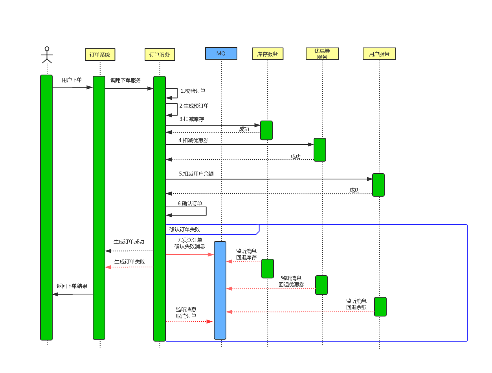


### 关键点2


* 用户通过第三方支付平台(支付宝、微信)支付成功后,第三方支付平台要通过回调API异步通知商家支付系统用户支付结果,支付系统根据支付结果修改订单状态、记录支付日志和给用户增加积分
* 商家支付系统如何保证在收到第三方支付平台的异步通知时,如何快速给第三方支付凭条做出回应


* 通过MQ进行数据分发,提高系统处理性能


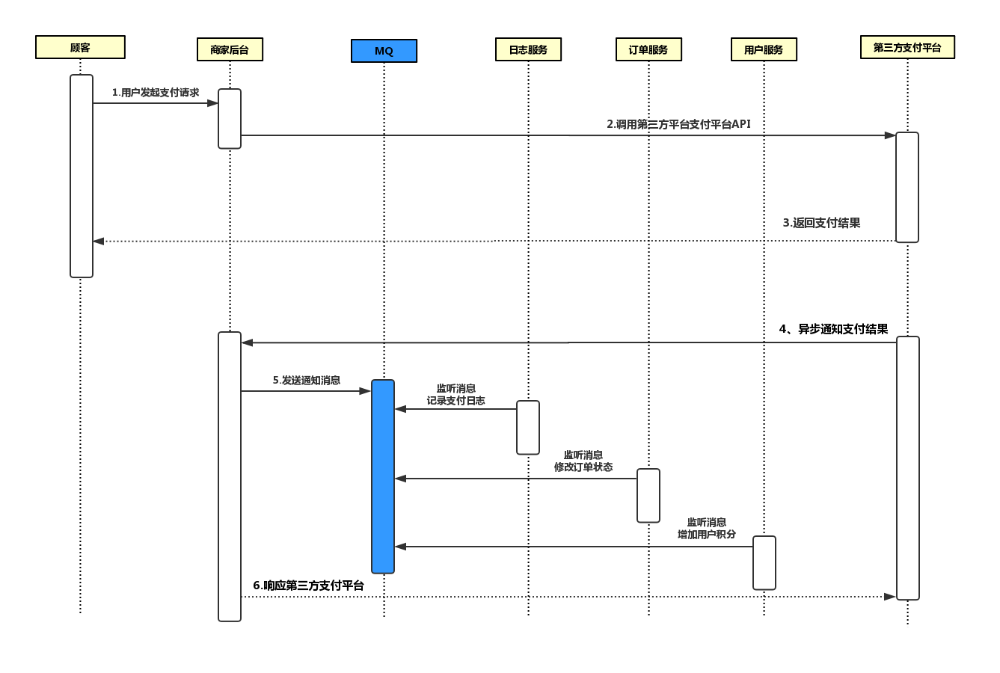


### 新下单


#### 下单流程


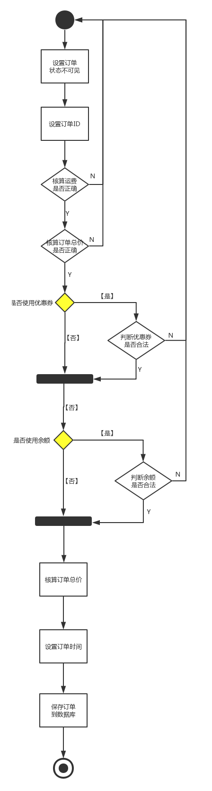


* 校验订单
  * 校验订单是否存在
  * 校验订单中的商品是否存在
  * 校验下单用户是否存在
  * 校验商品单价是否合法
  * 校验订单商品数量是否合法

* 生成预订单
  * 设置订单状态为不可见
  * 核算运费是否正确
  * 计算订单总价格是否正确
  * 判断优惠券信息是否合法
  * 判断余额是否正确
  * 计算订单支付总价
  * 设置订单添加时间
  * 保存预订单
* 扣减库存
* 扣减优惠券
* 扣减用户余额


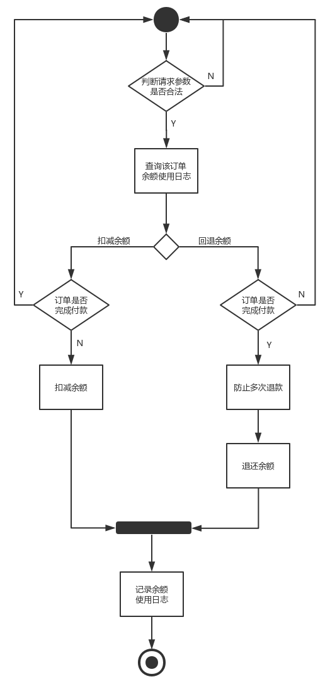


* 确认订单


#### 失败补偿


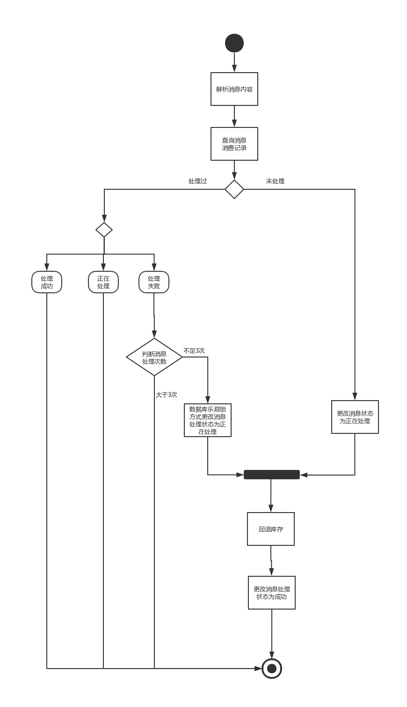


* 回退库存
* 回退优惠券
* 回退余额
* 取消订单


### 支付


#### 创建支付订单


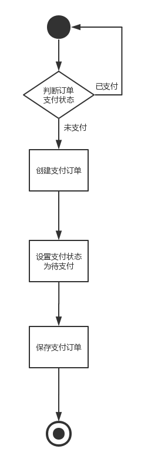


#### 支付回调


* 支付成功后,支付服务payService发送MQ消息,订单服务、用户服务、日志服务需要订阅消息进行处理
* 订单服务修改订单状态为已支付
* 日志服务记录支付日志
* 用户服务负责给用户增加积分

* 接受订单支付成功消息

