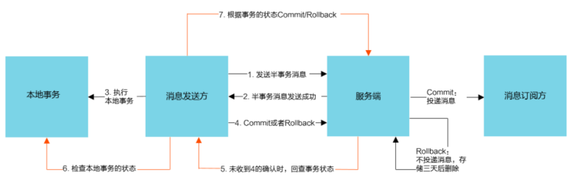

# RocketMQ


# 概述


* Producer:生产者.会和NameServer集群中的随机一台建立长连接,获取当前要发送的Topic存在哪台Broker Master上,然后再与其建立长连接,支持多种负载均衡
* Producer Group:生产者组,是一类Producer的集合,这类Producer通常发送一类消息,且发送逻辑一致
* Consumer:消费者.同Producer,只不过会同时获取Slave的地址
* Consumer Group:同Producer Group
* Broker:类似于服务器,队列存储在Broker中,负责消息的存储,查询消费.一个Master可对应多个Slave ,Master支持读写,Slave只负责读.Broker会向集群中的每一台NameServer注册自己的路由信息
* NameServer:一个很简单的Topic路由注册中心,支持Broker的动态注册和发现,保存Topic和Broker之间的关系.集群中的NameServer不会进行相互通讯,各NameServer都有完整的路由信息


# 核心


* 先启动NameServer集群,各NameServer之间无任何数据交互,Broker启动之后会向所有NameServer定期(30s)发送心跳包,包括IP,Port,TopicInfo,NameServer会定期扫描Broker存活列表,如果超过120S没有心跳则移除此Broker信息,代表下线
* Producer上线从NameServer获取它要发送的某Topic消息在哪个Broker上,并与其建立长连接,发送消息
* Consumer上线同Producer
* Topic:主题.不同类型的消息以不同的Topic进行区分,相当于消息的一级分类
* Push:服务端(Broker)向消费者主动推送消息.实际上底层仍然是pull模式.Consumer把轮询过程封装并注册MessageListener监听器,取到消息后,唤醒MessageListener的consumeMessage()来消费,对用户来说,感觉像是消息被推送的
* Pull:消费者向服务器(Broker)定时拉取消息.取消息的过程需要用户实现.先通过打算消费的Topic拿到MessageQueue的集合,遍历该集合,然后针对每个MessageQueue批量取消息,一次取完后,记录该队列下一次要取的开始offset,直到取完,再换另一个MessageQueue
* 长轮询:为保持消息的实时性,Consumer和Broker之间建立了长轮询.如果Broker没有消息更新,则将连接挂起,直到Broker推送新的数据.客户端象传统轮询一样从Broker请求数据,Broker会阻塞请求不会立刻返回,直到有数据或超市才返回给Consumer,然后关闭连接,Consumer处理完响应信息后再想Broker发送新的请求


# 安装


## 服务安装

* 要求JDK1.8,Maven3.2,[下载地址](http://archive.apache.org/dist/rocketmq),按需下载版本,解压到/app/rocketmq中
* 修改bin/runserver.sh,根据服务器情况调整内存大小

```shell
set "JAVA_OPT=%JAVA_OPT% -server -Xms512m -Xmx512m -Xmn512m -XX:MetaspaceSize=128m -XX:MaxMetaspaceSize=320m" 
```

* 修改bin/runbroker.sh,调整磁盘利用率大小,默认磁盘空间超过85%不再接收消息

```shell
set "JAVA_OPT=%JAVA_OPT% -server -Drocketmq.broker.diskSpaceWarningLevelRatio=0.98 -Xms512m -Xmx512m -Xmn512m"
```

* 启动NameServer:sh mqnamesrv
* 启动Broker:sh mqbroker -n 127.0.0.1:9876,-n指定nameserver的地址


## Web界面安装


* [下载](https://github.com/apache/rocketmq-externals/tree/master/rocketmq-console),解压,是一个springboot的源码程序
* 修改application.properties中的rocketmq.config.namesrvAddr为RocketMQ服务的端口
* 打包成Jar:mvn clean package -Dmaven.test.skip=true
* 运行Jar包,访问ip:port


## 配置文件


* conf目录下有多个配置文件:

  * 2m-2s-async:双主双从异步复制模式
  * 2m-2s-sync:双主双从同步双写模式
  * 2m-noslave:双主模式

* 双主模式:需要在broker-a.properties 与 broker-b.properties 末尾追加 NameServer 集群的地址

  ```properties
  # broker-a.properties
  # 集群名称,同一个集群下的 broker 要求统一
  brokerClusterName=DefaultCluster
  # broker名称
  brokerName=broker-a
  # brokerId=0 代表主节点,大于零代表从节点
  brokerId=0
  # 删除日志文件时间点,默认凌晨2点
  deleteWhen=02
  # 日志文件保留时间,默认48小时
  fileReservedTime=48
  # Broker的角色:ASYNC_MASTER->异步复制Master;SYNC_MASTER->同步双写Master
  brokerRole=ASYNC_MASTER
  # 刷盘方式:ASYNC_FLUSH->异步刷盘,性能好宕机会丢数;SYNC_FLUSH->同步刷盘,性能较差不会丢数
  flushDiskType=ASYNC_FLUSH
  # 末尾追加,NameServer节点列表,使用分号分割
  namesrvAddr=192.168.31.200:9876;192.168.31.201:9876
  ```

  ```properties
  # broker-b.properties,只有brokerName不同,其他一样
  # 集群名称,同一个集群下的 broker 要求统一
  brokerClusterName=DefaultCluster
  # broker名称
  brokerName=broker-b
  # brokerId=0 代表主节点,大于零代表从节点
  brokerId=0
  # 删除日志文件时间点,默认凌晨2点
  deleteWhen=02
  # 日志文件保留时间,默认48小时
  fileReservedTime=48
  # Broker的角色:ASYNC_MASTER->异步复制Master;SYNC_MASTER->同步双写Master
  brokerRole=ASYNC_MASTER
  # 刷盘方式:ASYNC_FLUSH->异步刷盘,性能好宕机会丢数;SYNC_FLUSH->同步刷盘,性能较差不会丢数
  flushDiskType=ASYNC_FLUSH
  # 末尾追加,NameServer节点列表,使用分号分割
  namesrvAddr=192.168.31.200:9876;192.168.31.201:9876
  ```

* 双主启动:在a,b的broker上执行:`sh bin/mqbroker -c ./conf/2m-noslave/broker-a.properties`,-c表示使用哪个配置文件

* 查看集群状态:`sh mqadmin clusterList -n nameserverip:port`

* 使用RocketMQ自带的tools.sh工具通过生成演示数据来测试MQ生产者实际的运行情况

  ```shell
  export NAME_ADDR = 192.168.0.150:9876(nameserver地址)
  sh tools.sh org.apache.rocketmq.example.quickstart.Producer
  ```

* 如果broker-a,broker-b交替出现,说明集群已经生效

* 测试消费者

  ```shell
  export NAME_ADDR = 192.168.0.150:9876(nameserver地址)
  sh tools.sh org.apache.rocketmq.example.quickstart.Consumer
  ```

  

# 事务消息


* RocketMQ提供了事务消息,通过事务消息就能达到分布式事务的最终一致

* 事务消息交互流程

  

* 半事务消息:暂不能投递的消息,发送方已经成功地将消息发送到了RocketMQ服务端,但是服务端未收到生产者对该消息的二次确认,此时该消息被标记成`暂不能投递`状态,处于该种状态下的消息即半事务消息

* 消息回查:由于网络闪断,生产者应用重启等原因,导致某条事务消息的二次确认丢失,RocketMQ服务端通过扫描发现某条消息长期处于`半事务消息`时,需主动向生产者询问该消息的最终状态(Commit是Rollback),该询问过程即消息回查

* 事务消息发送:

  * 发送方将半事务消息发送至RocketMQ服务端
  * RocketMQ服务端将消息持久化之后,向发送方返回Ack确认消息发送成功,此时消息为半事务消息
  * 发送方开始执行本地事务逻辑
  * 发送方根据本地事务执行结果向服务端提交二次确认(Commit或Rollback),服务端收到Commit 状态则将半事务消息标记为可投递,订阅方最终将收到该消息;服务端收到 Rollback 状态则删除半事务消息,订阅方将不会接受该消息

* 事务消息回查:

  * 在断网或者是应用重启的特殊情况下,上述步骤4提交的二次确认最终未到达服务端,经过固定时间后服务端将对该消息发起消息回查
  * 发送方收到消息回查后,需要检查对应消息的本地事务执行的最终结果
  * 发送方根据检查得到的本地事务的最终状态再次提交二次确认,服务端仍按照步骤4对半事务消息进行操作


# 集群


## 多Master 


* 最简单的模式,同时也是使用最多的形式
* 优点是单个 Master 宕机或重启维护对应用无影响,在磁盘配置为 RAID10 时,即使机器宕机不可恢复情况下,由于 RAID10 磁盘非常可靠,同步刷盘消息也不会丢失,性能也是最高的
* 缺点是单台机器宕机期间,这台机器上未被消费的消息在机器恢复之前不可订阅,消息实时性会受到影响


## 多Master多Slave异步复制


* 每个 Master 配置一个 Slave,有多对 Master-Slave,HA 采用异步复制方式,主备有短暂消息毫秒级延迟,即使磁盘损坏只会丢失少量消息,且消息实时性不会受影响
* 同时 Master 宕机后,消费者仍然可以从 Slave 消费,而且此过程对应用透明,不需要人工干预,性能同多 Master 模式几乎一样
* 缺点是 Master 宕机,磁盘损坏情况下会丢失少量消息


## 多Master多Slave同步双写


* HA 采用同步双写方式,即只有主备都写成功,才向应用返回成功,该模式数据与服务都无单点故障
* Master 宕机情况下,消息无延迟,服务可用性与数据可用性都非常高
* 缺点是性能比异步复制模式低 10% 左右,发送单个消息的执行时间会略高,且目前版本在主节点宕机后,备机不能自动切换为主机
