# RocketMQSource


# 源码拉取


* 从官方仓库 <https://github.com/apache/rocketmq> `clone`或者`download`源码
* 源码目录结构:
  * broker: broker 模块.broke 启动进程
  * client : 消息客户端,包含消息生产者、消息消费者相关类
  * common : 公共包
  * dev : 开发者信息,非源代码
  * distribution : 部署实例文件夹,非源代码
  * example: RocketMQ 例代码
  * filter : 消息过滤相关基础类
  * filtersrv: 消息过滤服务器实现相关类,Filter启动进程
  * logappender: 日志实现相关类
  * namesrv: NameServer实现相关类,NameServer启动进程
  * openmessageing: 消息开放标准
  * remoting: 远程通信模块,给予Netty
  * srcutil: 服务工具类
  * store: 消息存储实现相关类
  * style: checkstyle相关实现
  * test: 测试相关类
  * tools: 工具类,监控命令相关实现类
* 根据官方文档,导入IDE中之后进行调试


# 调试


## 启动Nameserver


* 进入rocketmq目录,执行`clean install -Dmaven.test.skip=true`
* 创建`conf`配置文件夹,从`distribution`拷贝`broker.conf`和`logback_broker.xml`和`logback_namesrv.xml`
* 展开namesrv模块,右键NamesrvStartup.java进行启动,此时启动不成功
* 打开Run Configuration,找到NamesrvStartup启动项,点击找到Environment,添加:`ROCKETMQ_HOME=当前源码目录`
* 重启NamesrvStartup.java


## 启动Broker


* 修改broker.conf

  ```shell
  brokerClusterName = DefaultCluster
  brokerName = broker-a
  brokerId = 0
  # namesrvAddr地址
  namesrvAddr=127.0.0.1:9876
  deleteWhen = 04
  fileReservedTime = 48
  brokerRole = ASYNC_MASTER
  flushDiskType = ASYNC_FLUSH
  autoCreateTopicEnable=true
  
  # 存储路径
  storePathRootDir=E:\\RocketMQ\\data\\rocketmq\\dataDir
  # commitLog路径
  storePathCommitLog=E:\\RocketMQ\\data\\rocketmq\\dataDir\\commitlog
  # 消息队列存储路径
  storePathConsumeQueue=E:\\RocketMQ\\data\\rocketmq\\dataDir\\consumequeue
  # 消息索引存储路径
  storePathIndex=E:\\RocketMQ\\data\\rocketmq\\dataDir\\index
  # checkpoint文件路径
  storeCheckpoint=E:\\RocketMQ\\data\\rocketmq\\dataDir\\checkpoint
  # abort文件存储路径
  abortFile=E:\\RocketMQ\\data\\rocketmq\\dataDir\\abort
  ```

* 启动BrokerStartup.java,失败

* 在Run Configuration的Arguments的Program Arguments中添加`broker.conf`地址:`-c rocket源码地址\conf\broker.conf`

* 在Run Configuration中配置`broker.conf`和`ROCKETMQ_HOME`,同配置NamesrvStartup

* 再次启动BrokerStartup.java


## 发送消息


* 进入example模块的`org.apache.rocketmq.example.quickstart`
* 指定Namesrv地址

```java
DefaultMQProducer producer = new DefaultMQProducer("please_rename_unique_group_name");
producer.setNamesrvAddr("127.0.0.1:9876");
```

* 运行`main`方法,发送消息


## 消费消息


* 进入example模块的`org.apache.rocketmq.example.quickstart`
* 指定Namesrv地址

```java
DefaultMQPushConsumer consumer = new DefaultMQPushConsumer("please_rename_unique_group_name_4");
consumer.setNamesrvAddr("127.0.0.1:9876");
```

* 运行`main`方法,消费消息


# NameServer


## 架构设计


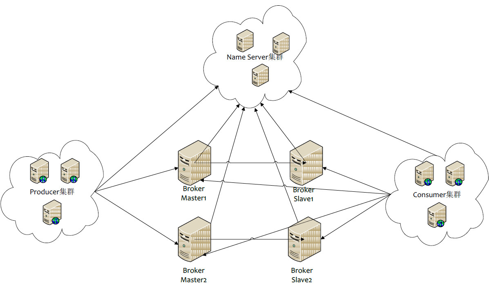


* 消息中间件的设计思路一般是基于主题订阅发布的机制,Producer发送某一个主题到消息服务器,消息服务器负责将消息持久化存储,Consumer订阅该兴趣的主题,消息服务器根据订阅信息(路由信息)将消息推送到消费者(Push模式)或者消费者主动向消息服务器拉去(Pull模式),从而实现消息生产者与消息消费者解耦
* Broker消息服务器在启动的时向所有NameServer注册,Producer在发送消息时之前先从NameServer获取Broker服务器地址列表,然后根据负载均衡算法从列表中选择一台服务器进行发送
* NameServer与每台Broker保持长连接,并间隔30S检测Broker是否存活,如果检测到Broker宕机,则从路由注册表中删除.但是路由变化不会马上通知消息生产者,这样是为了降低NameServer实现的复杂度,在消息发送端提供容错机制保证消息发送的可用性
* NameServer本身的高可用是通过部署多台NameServer来实现,但彼此之间不通讯,也就是NameServer服务器之间在某一个时刻的数据并不完全相同,但这对消息发送并不会造成任何影响


## 启动流程


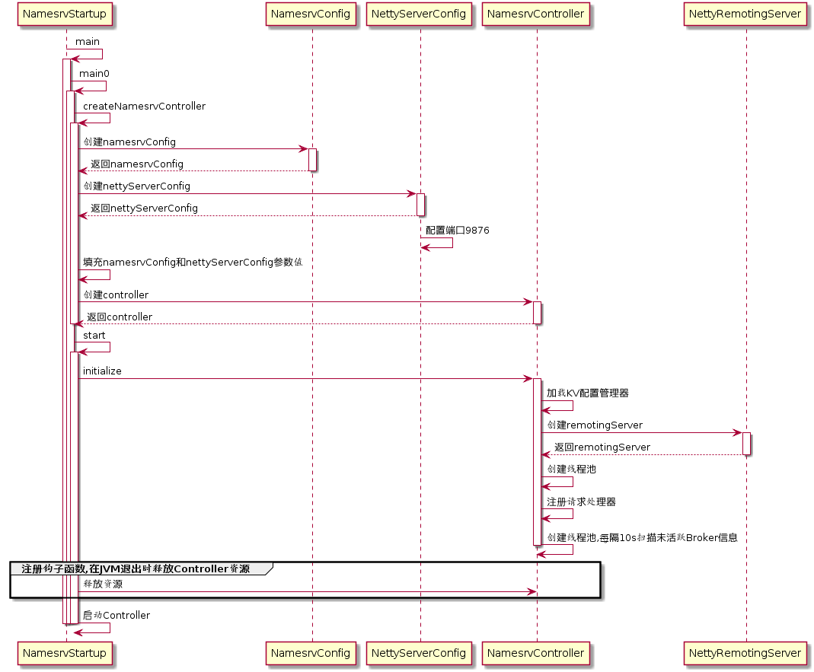


* rocketmq-all/rocketmq-namesrv: NamesrvStartup->启动类
* rocketmq-all/rocketmq-namesrv: NamesrvStartup#createNamesrvController->解析配置文件,填充NameServerConfig、NettyServerConfig属性值,并创建NamesrvController
* rocketmq-all/rocketmq-common: NamesrvConfig->配置文件
* rocketmq-all/rocketmq-remoting: NettyServerConfig->Netty配置文件
* rocketmq-all/rocketmq-namesrv: NamesrvController#initialize:根据启动属性创建NamesrvController实例,并初始化该实例.NameServerController实例为NameServer核心控制器
* rocketmq-all/rocketmq-namesrv: NamesrvStartup#start: 启动线程


## 路由管理


* NameServer的主要作用是为消息的生产者和消息消费者提供关于主题Topic的路由信息,那么NameServer需要存储路由的基础信息,还要管理Broker节点,包括路由注册、路由删除等

* rocketmq-all/rocketmq-namesrv: RouteInfoManager: 路由元信息


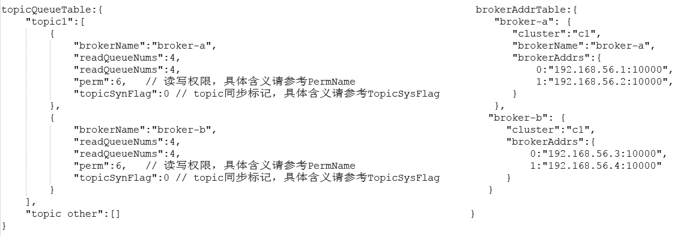


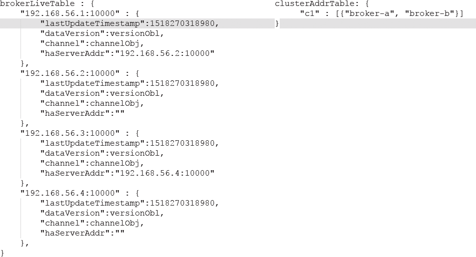


### 路由注册


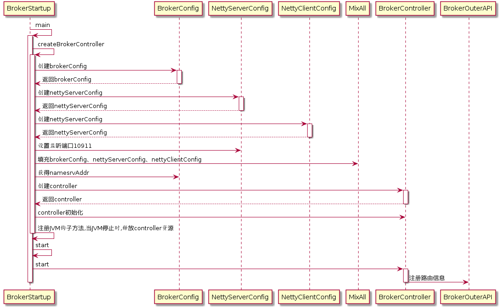


* rocketmq-all/rocketmq-broker: BrokerController#start:->发送心跳包.RocketMQ路由注册是通过Broker与NameServer的心跳功能实现的.Broker启动时向集群中所有的NameServer发送心跳信息,每隔30s向集群中所有NameServer发送心跳包,NameServer收到心跳包时会更新brokerLiveTable缓存中BrokerLiveInfo的lastUpdataTimeStamp信息,然后NameServer每隔10s扫描brokerLiveTable,如果连续120S没有收到心跳包,NameServer将移除Broker的路由信息同时关闭Socket连接

* rocketmq-all/rocketmq-broker: BrokerController#registerBrokerAll->注册

* rocketmq-all/rocketmq-broker: BrokerController#doRegisterBrokerAll->注册

* rocketmq-all/rocketmq-broker: BrokerOuterAPI#registerBrokerAll

* rocketmq-all/rocketmq-broker: BrokerOutAPI#registerBroker

  

### 处理心跳包


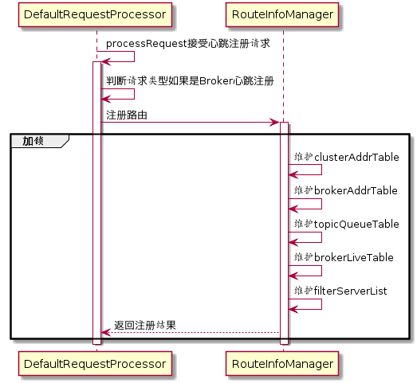


* rocketmq-all/rocketmq-namesrv: DefaultRequestProcessor->网路处理类解析请求类型,如果请求类型是为REGISTER_BROKER,则将请求转发到`RouteInfoManager#regiesterBroker`
* rocketmq-all/rocketmq-namesrv: DefaultRequestProcessor#processRequest
* rocketmq-all/rocketmq-namesrv: DefaultRequestProcessor#registerBroker
* rocketmq-all/rocketmq-namesrv: RouteInfoManager#registerBroker: 维护路由信息
* rocketmq-all/rocketmq-namesrv: RouteInfoManager#createAndUpdateQueueData


### 路由删除


* Broker每隔30s向NameServer发送一个心跳包,心跳包包含BrokerId,Broker地址,Broker名称,Broker所属集群名称,Broker关联的FilterServer列表.NameServer会每隔10s扫描brokerLiveTable状态表,如果BrokerLive的lastUpdateTimestamp的时间戳距当前时间超过120s,则认为Broker失效,移除该Broker,关闭与Broker连接,同时更新topicQueueTable`、`brokerAddrTable`、`brokerLiveTable`、`filterServerTable

* RocketMQ有两个触发点来删除路由信息:
  * NameServer定期扫描brokerLiveTable检测上次心跳包与当前系统的时间差,如果时间超过120s,则需要移除broker
  * Broker在正常关闭的情况下,会执行unregisterBroker指令
* 这两种方式路由删除的方法都是一样的,就是从相关路由表中删除与该broker相关的信息


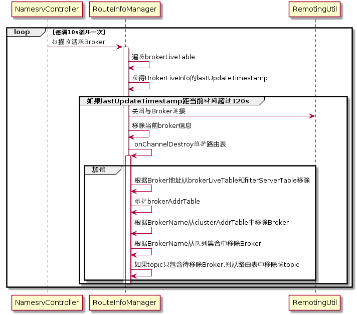


* rocketmq-all/rocketmq-namesrv: NamesrvController#initialize
* rocketmq-all/rocketmq-namesrv: RouteInfoManager#scanNotActiveBroker
* rocketmq-all/rocketmq-namesrv: RouteInfoManager#onChannelDestroy


### 路由发现


* RocketMQ路由发现是非实时的,当Topic路由出现变化后,NameServer不会主动推送给客户端,而是由客户端定时拉取
* rocketmq-all/rocketmq-namesrv: DefaultRequestProcessor#getRouteInfoByTopic


# Producer


* 消息生产者的代码都在client模块中,相对于RocketMQ来讲,消息生产者就是客户端,也是消息的提供者
* rocketmq-all/rocketmq-client :MQAdmin
* rocketmq-all/rocketmq-client :MQProducer
* rocketmq-all/rocketmq-client :DefaultMQProducer


## 启动流程


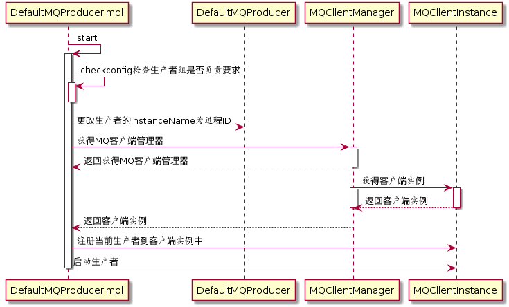


* DefaultMQProducerImpl#start
* 整个JVM中只存在一个MQClientManager实例,维护一个MQClientInstance缓存表

```java
ConcurrentMap<String/* clientId */, MQClientInstance> factoryTable = new ConcurrentHashMap<String,MQClientInstance>();
```

* 同一个clientId只会创建一个MQClientInstance,MQClientInstance封装了RocketMQ网络处理API,是消息生产者和消息消费者与NameServer、Broker打交道的网络通道
* MQClientManager#getAndCreateMQClientInstance
* DefaultMQProducerImpl#start


## 消息发送


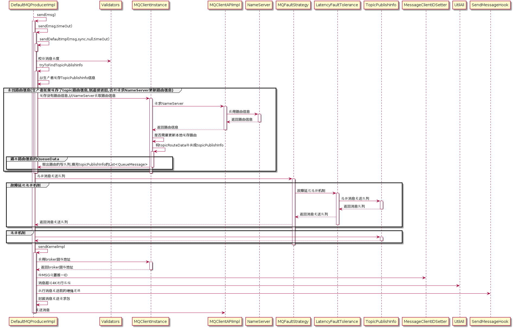


* DefaultMQProducerImpl#send(Message msg): 发送消息
* DefaultMQProducerImpl#send(Message msg,long timeout): 发送消息,默认超时时间为3s
* DefaultMQProducerImpl#sendDefaultImpl


### 验证消息


* Validators#checkMessage


### 查找路由


* DefaultMQProducerImpl#tryToFindTopicPublishInfo
* TopicPublishInfo
* MQClientInstance#updateTopicRouteInfoFromNameServer
* MQClientInstance#topicRouteData2TopicPublishInfo


### 选择队列


* 默认不启用Broker故障延迟机制

* TopicPublishInfo#selectOneMessageQueue(lastBrokerName)

* TopicPublishInfo#selectOneMessageQueue()

* MQFaultStrategy#selectOneMessageQueue(): 启用Broker故障延迟机制

* LatencyFaultTolerance: 延迟机制接口规范

* LatencyFaultToleranceImpl.FaultItem: 失败条目
* MQFaultStrategy: 消息失败策略
* DefaultMQProducerImpl#sendDefaultImpl
* 如果上述发送过程出现异常,则调用`DefaultMQProducerImpl#updateFaultItem`
* MQFaultStrategy#updateFaultItem
* MQFaultStrategy#computeNotAvailableDuration
* LatencyFaultToleranceImpl#updateFaultItem


### 发送消息


* DefaultMQProducerImpl#sendKernelImpl: 消息发送API核心入口


## 批量消息发送


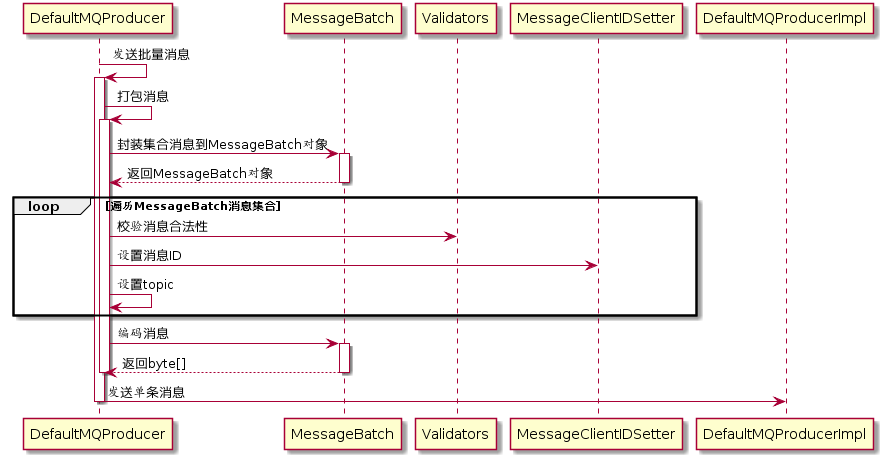


* 批量消息发送是将同一个主题的多条消息一起打包发送到消息服务端,减少网络调用次数,提高网络传输效率,但是并不是在同一批次中发送的消息数量越多越好,其判断依据是单条消息的长度,如果单条消息内容比较长,则打包多条消息发送会影响其他线程发送消息的响应时间,并且单批次消息总长度不能超过`DefaultMQProducer#maxMessageSize`
* 批量消息发送要解决的问题是如何将这些消息编码以便服务端能够正确解码出每条消息的消息内容
* DefaultMQProducer#send
* DefaultMQProducer#batch


# 消息存储


* RocketMQ的存储文件包括消息存储文件Commitlog,消息消费队列文件ConsumerQueue,Hash索引文件IndexFile,监测点文件checkPoint,关闭异常文件abort
* 单个Commitlog,ConsumerQueue,IndexFile文件长度固定,以便使用内存映射机制进行文件的读写操作
* RocketMQ组织文件以文件的起始偏移量来命令文件,这样根据偏移量能快速定位到真实的物理文件
* RocketMQ基于内存映射文件机制提供了同步刷盘和异步刷盘两种机制,异步刷盘是指在消息存储时先追加到内存映射文件,然后启动专门的刷盘线程定时将内存中的文件数据刷写到磁盘
* RocketMQ为了保证消息发送的高吞吐量,采用单一文件存储所有主题消息,保证消息存储是完全的顺序写,但这样给文件读取带来了不便,为此RocketMQ为了方便消息消费构建了消息消费队列文件,基于主题与队列进行组织,同时RocketMQ为消息实现了Hash索引,可以为消息设置索引键,根据所以能够快速从CommitLog文件中检索消息
* 当消息达到CommitLog后,会通过ReputMessageService线程接近实时地将消息转发给ConsumerQueue文件与IndexFile文件,为了安全起见,RocketMQ引入abort文件,记录Broker的停机是否是正常关闭,在重启Broker时为保证CommitLog文件,ConsumerQueue与IndexFile文件的正确性,分别采用不同策略来恢复文件
* RocketMQ不会永久CommitLog,ConsumerQueue文件,而是启动文件过期机制并在磁盘空间不足或者默认凌晨4点删除过期文件,文件默认保存72小时,并且在删除文件时并不会判断该消息文件上的消息是否被消费


## 核心类


* DefaultMessageStore#putMessage


## 消息存储流程


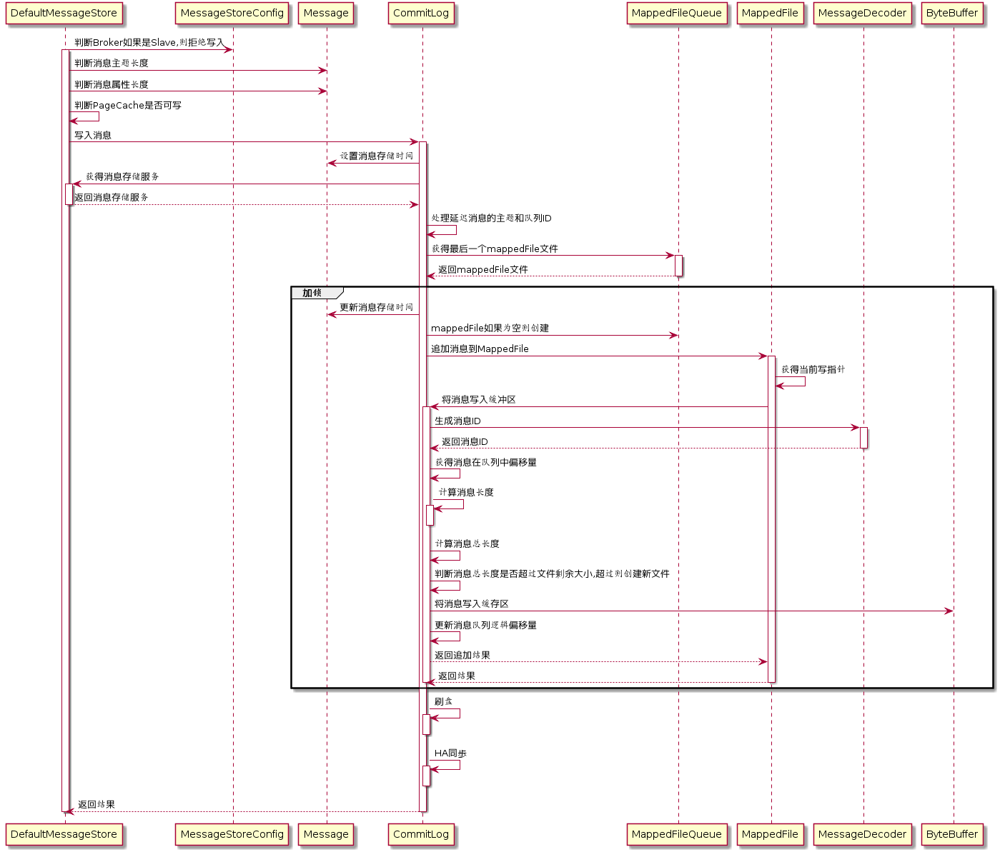


## 存储文件


- commitLog:消息存储目录
- config:运行期间一些配置信息
- consumerqueue:消息消费队列存储目录,存储以主题为目录的索引文件,快速找到commitLog中的信息
- index:消息索引文件存储目录
- abort:如果存在改文件寿命Broker非正常关闭,即判断Broker是否正常关闭
- checkpoint:文件检查点,存储CommitLog文件最后一次刷盘时间戳、consumerquueue最后一次刷盘时间,index索引文件最后一次刷盘时间戳


## 内存映射


* RocketMQ通过使用内存映射文件提高IO访问性能,无论是CommitLog、ConsumerQueue还是IndexFile,单个文件都被设计为固定长度,一个文件写满以后再创建一个新文件,文件名就为该文件第一条消息对应的全局物理偏移量


### MappedFileQueue


* rocket-all/rocket-store: MappedFileQueue


### MappedFile


* rocket-all/rocket-store: MappedFile
* 刷写磁盘`rocket-all/rocket-store: MappedFile#flush`


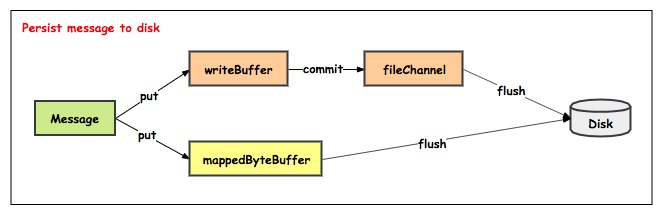


### TransientStorePool


* rocket-all/rocket-store: TransientStorePool


## 实时更新消息


* 消息消费队列文件、消息属性索引文件都是基于CommitLog文件构建的,当生产者的消息存储在CommitLog文件中,ConsumerQueue、IndexFile需要及时更新,否则消息无法及时被消费
* RocketMQ通过开启一个线程ReputMessageService来准实时转发CommitLog文件更新事件,相应的任务处理器根据转发的消息及时更新ConsumerQueue、IndexFile文件
* rocket-all/rocket-store: DefaultMessageStore#start


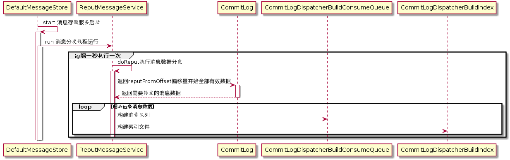


### 转发到ConsumerQueue


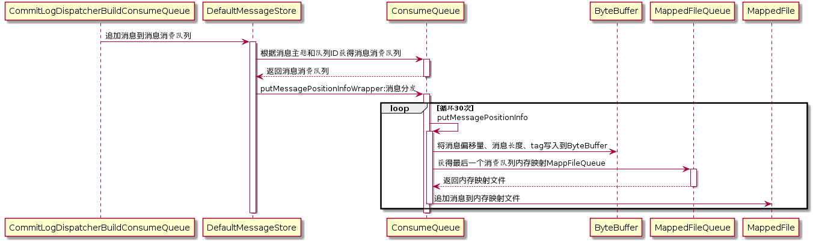


* rocket-all/rocket-store: DefaultMessageStore.CommitLogDispatcherBuildConsumeQueue#dispatch


### 转发到Index


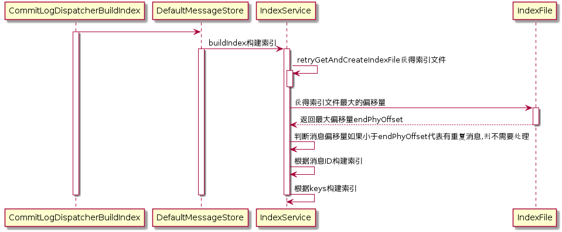


* rocket-all/rocket-store: DefaultMessageStore.CommitLogDispatcherBuildIndex#dispatch


## 消息队列和索引文件恢复


* RocketMQ首先将消息存储在CommitLog文件中,然后异步更新ConsumerQueue和Index文件,如果消息成功存储到CommitLog文件中,异步更新未成功,此时若消息服务器Broker宕机,导致CommitLog、ConsumerQueue、IndexFile文件数据不一致,此时会有一部分消息即便在CommitLog中文件中存在,但由于没有转发到ConsumerQueue,这部分消息将永远复发被消费者消费


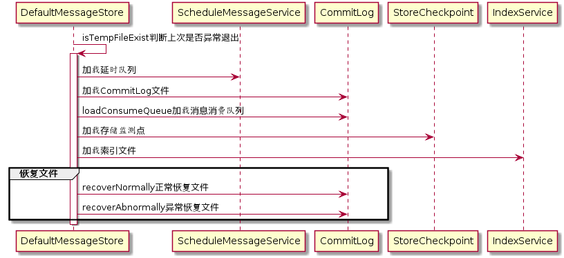


* rocket-add/rocket-store: DefaultMessageStore#load
* rocket-add/rocket-store: CommitLog#recoverNormally->正常恢复文件
* rocket-add/rocket-store: CommitLog#recoverAbnormally->异常恢复文件,步骤与正常停止文件恢复流程基本相同,其主要差别有两个:
  * 正常停止默认从倒数第三个文件开始进行恢复,而异常停止则需要从最后一个文件往前走,找到第一个消息存储正常的文件
  * 如果CommitLog目录没有消息文件,如果消息消费队列目录下存在文件,则需要销毁


## 刷盘


* RocketMQ的存储是基于JDK NIO的内存映射机制(MappedByteBuffer)的,消息存储首先将消息追加到内存,再根据配置的刷盘策略在不同时间进行刷写磁盘
* rocket-all/rocket-store: CommitLot#handleDiskFlush(),由DefaultMessageStore#putMessage()调用


### 同步刷盘


* 消息追加到内存后,立即将数据刷写到磁盘文件


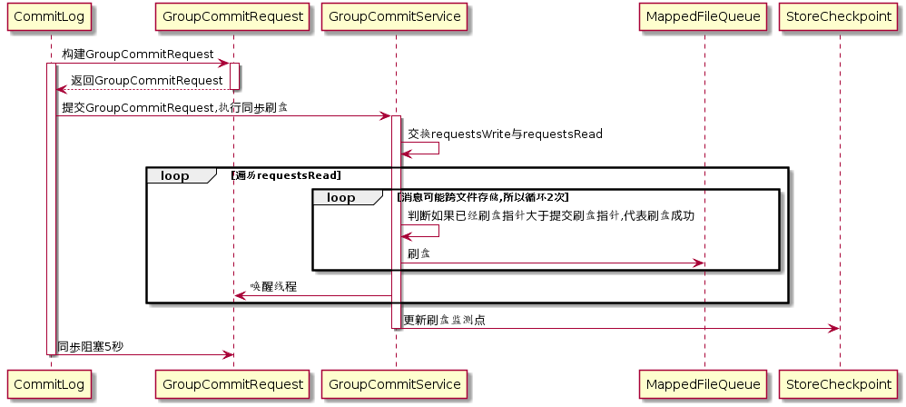


### 异步刷盘


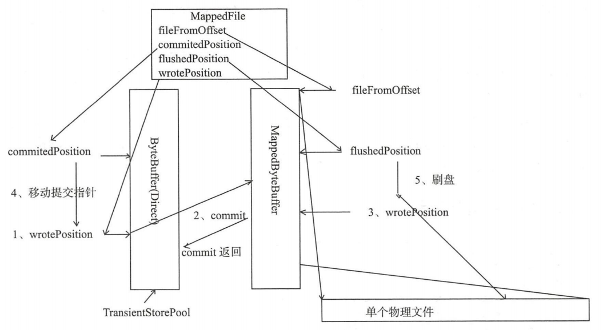


* 在消息追加到内存后,立即返回给消息发送端
* 如果开启transientStorePoolEnable,RocketMQ会单独申请一个与目标commitLog同样大小的堆外内存,该堆外内存将使用内存锁定,确保不会被置换到虚拟内存中去,消息首先追加到堆外内存,然后提交到物理文件的内存映射中,然后刷写到磁盘
* 如果未开启transientStorePoolEnable,消息直接追加到物理文件直接映射文件中,然后刷写到磁盘中

* 开启transientStorePoolEnable后异步刷盘步骤:
  * 将消息直接追加到ByteBuffer(堆外内存)
  * CommitRealTimeService线程每隔200ms将ByteBuffer新追加内容提交到MappedByteBuffer中
  * MappedByteBuffer在内存中追加提交的内容,wrotePosition指针向后移动
  * commit操作成功返回,将committedPosition位置恢复
  * FlushRealTimeService线程默认每500ms将MappedByteBuffer中新追加的内存刷写到磁盘
* rocket-all/rocket-store: CommitLog$CommitRealTimeService#run()
* rocket-all/rocket-store: CommitLog$FlushRealTimeService#run()


## 过期文件删除


* RocketMQ操作CommitLog、ConsumerQueue文件是基于内存映射机制,为了避免内存与磁盘的浪费,所以要引入一种机制来删除已过期的文件
* RocketMQ顺序写CommitLog、ConsumerQueue文件,所有写操作全部落在最后一个CommitLog或者ConsumerQueue文件上,之前的文件在下一个文件创建后将不会再被更新
* RocketMQ清除过期文件的方法时:如果当前文件在在一定时间间隔内没有再次被消费,则认为是过期文件,可以被删除,RocketMQ不会关注这个文件上的消息是否全部被消费
* 默认每个文件的过期时间为72小时,通过在Broker配置文件中设置fileReservedTime来改变过期时间,单位为小时
* 删除文件操作的条件:
  * 指定删除文件的时间点,RocketMQ通过deleteWhen设置一天的固定时间执行一次删除过期文件操作,默认4点
  * 磁盘空间如果不充足,删除过期文件
  * 预留,手工触发
* rocket-all/rocket-store: DefaultMessageStore#start
* rocket-all/rocket-store: DefaultMessageStore#addScheduleTask
* rocket-all/rocket-store: DefaultMessageStore#cleanFilesPeriodically
* rocket-all/rocket-store: DefaultMessageStore#deleteExpiredFiles
* rocket-all/rocket-store: CleanCommitLogService#isSpaceToDelete.当磁盘空间不足时执行删除过期文件
* rocket-all/rocket-store: MappedFileQueue#deleteExpiredFileByTime.执行文件销毁和删除


# Consumer


* 消息消费以组的模式开展,一个消费组内可以包含多个消费者,每一个消费者组可订阅多个主题,消费组之间有集群模式和广播模式两种消费模式:
  * 集群模式:主题下的同一条消息只允许被其中一个消费者消费
  * 广播模式:主题下的同一条消息,将被集群内的所有消费者消费一次

* 消息服务器与消费者之间的消息传递也有两种模式:推模式、拉模式:
  * 拉模式:消费端主动拉起拉消息请求
  * 推模式:消息达到消息服务器后,推送给消息消费者
* RocketMQ消息推模式的实现基于拉模式,在拉模式上包装一层,一个拉取任务完成后开始下一个拉取任务
* 集群模式下,多个消费者队列负载机制:一个消息队列同一个时间只允许被一个消费者消费,一个消费者可以消费多个消息队列
* RocketMQ支持局部顺序消息消费,也就是保证同一个消息队列上的消息顺序消费.不支持消息全局顺序消费,如果要实现某一个主题的全局顺序消费,可以将该主题的队列数设置为1,牺牲高可用性
* 消息队列负载由RebalanceService线程默认每隔20s进行一次消息队列负载,根据当前消费者组内消费者个数与主题队列数量按照某一种负载算法进行队列分配,分配原则为同一个消费者可以分配多个消息消费队列,同一个消息消费队列同一个时间只会分配给一个消费者
* 消息拉取由PullMessageService线程根据RebalanceService线程创建的拉取任务进行拉取,默认每次拉取32条消息,提交给消费者消费线程后继续下一次消息拉取.如果消息消费过慢产生消息堆积会触发消息消费拉取流控。
* 并发消息消费指消费线程池中的线程可以并发对同一个消息队列的消息进行消费,消费成功后,取出消息队列中最小的消息偏移量作为消息消费进度偏移量存储在于消息消费进度存储文件中,集群模式消息消费进度存储在Broker(消息服务器),广播模式消息消费进度存储在消费者端
* 顺序消息一般使用集群模式,是指对消息消费者内的线程池中的线程对消息消费队列只能串行消费.并发消息消费最本质的区别是消息消费时必须成功锁定消息消费队列,在Broker端会存储消息消费队列的锁占用情况


## 消息推模式


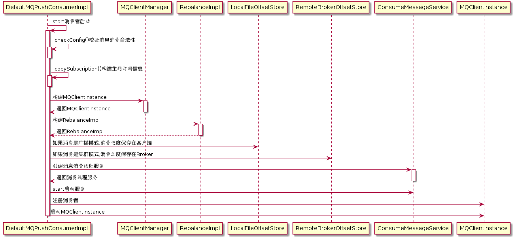


* rocket-all/rokcet-client: MQPushConsumer
* rocket-all/rocket-client: DefaultMQPushConsumer#start
* rocket-all/rocket-client: DefaultMQPushConsumerImpl#start


## 消息拉取


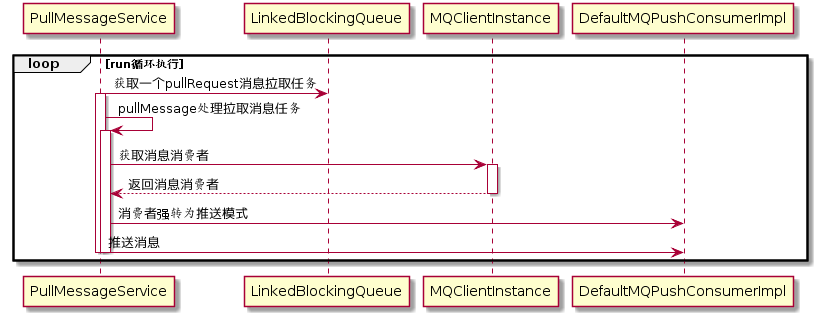


* rocket-all/rocket-client: DefaultMQPushConsumer#start()->mQclientFactory.start()
* rocket-all/rocket-client: MQClientInstance#start()
* rocket-all/rocket-client: PullMessageService#run()


### 客户端发起拉取请求


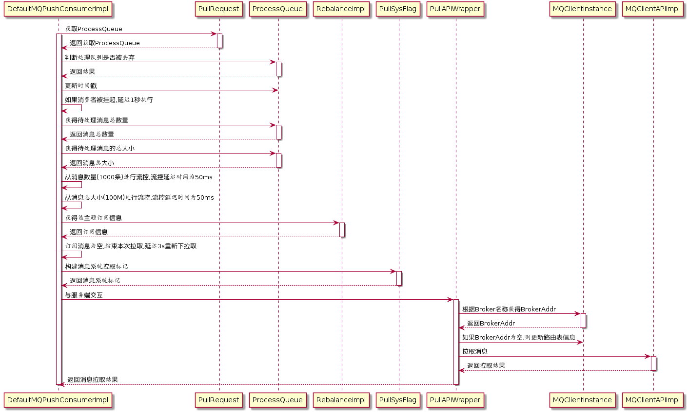


* rocket-all/rocket-client: DefaultMQPushConsumerImpl#pullMessage()


### Broker组装消息


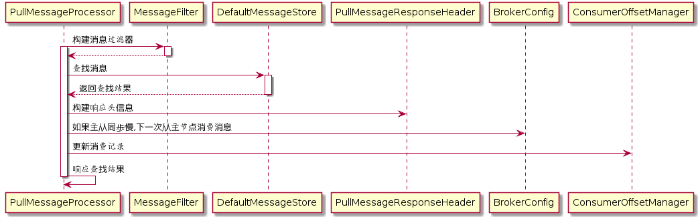


* rocket-all/rocket-broker: PullMessageProcessor#processRequest()
* rocket-all/rocket-store: DefaultMessageStore#getMessage()
* rocket-all/rocket-broker: PullMessageProcessor#processRequest()


### 拉取客户端消息


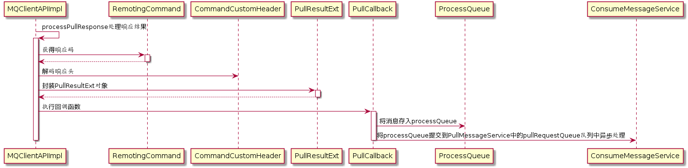


* rocket-all/rocket-client: MQClientAPIImpl#processPullResponse()
* rocket-all/rocket-client: DefaultMQPushConsumerImpl$PullCallback#OnSuccess


### 消息拉取核心


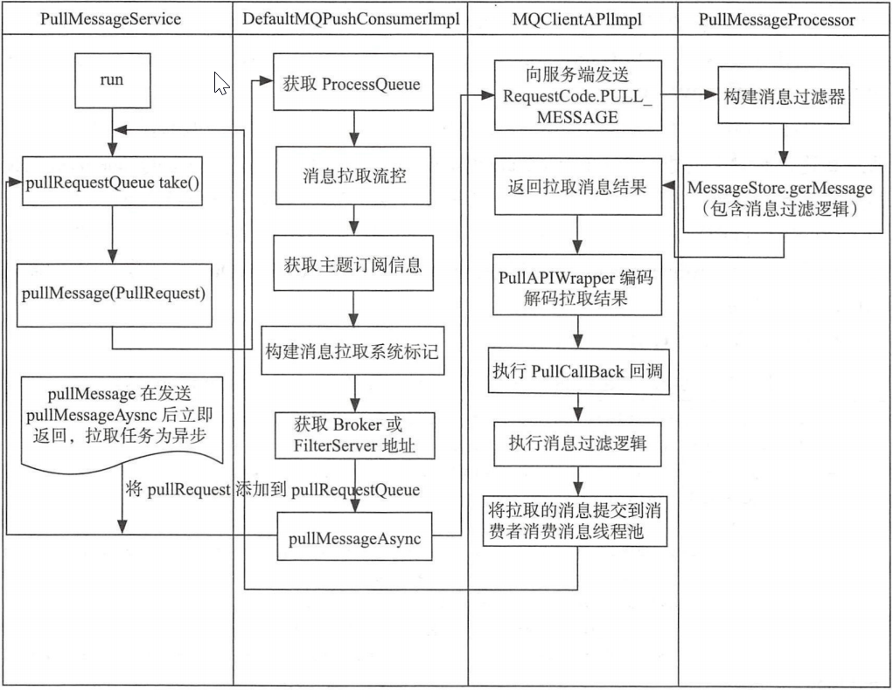


### 消息拉取长轮询


* RocketMQ未真正实现消息推模式,而是消费者主动向消息服务器拉取消息,推模式是循环向消息服务端发起消息拉取请求
* 如果消息消费者向RocketMQ拉取消息时,消息未到达消费队列时,如果不启用长轮询机制,则会在服务端等待shortPollingTimeMills时间后(挂起)再去判断消息是否已经到达指定消息队列
* 如果消息仍未到达则提示拉取消息客户端PULL—NOT—FOUND(消息不存在)
* 如果开启长轮询模式,RocketMQ一方面会每隔5s轮询检查一次消息是否可达,同时一有消息达到后立马通知挂起线程再次验证消息是否是自己感兴趣的消息,如果是则从CommitLog文件中提取消息返回给消息拉取客户端,否则直到挂起超时
* 超时时间由消息拉取方在消息拉取时封装在请求参数中,PUSH模式为15s,PULL模式通过DefaultMQPullConsumer#setBrokerSuspendMaxTimeMillis设置
* RocketMQ通过在Broker客户端配置longPollingEnable为true来开启长轮询模式
* rocket-all/rocket-broker: PullMessageProcessor#processRequest
* rocket-all/rocket-broker: PullRequestHoldService#suspendPullRequest
* rocket-all/rocket-broker: PullRequestHoldService#run
* rocket-all/rocket-broker: PullRequestHoldService#checkHoldRequest
* rocket-all/rocket-broker: PullRequestHoldService#notifyMessageArriving
* 如果开启了长轮询,PullRequestHoldService会每5s被唤醒去检测是否有新消息,或者直到超时才给客户端进行响应,消息实时性比较差,为了避免这种情况,RocketMQ引入另外一种机制:当消息到达时唤醒挂起线程触发一次检查
* rocket-all/rocket-store: DefaultMessageStore$ReputMessageService
* rocket-all/rocket-store: DefaultMessageStore#start:长轮询入口
* rocket-all/rocket-store: DefaultMessageStore$ReputMessageService#run
* rocket-all/rocket-store: DefaultMessageStore$ReputMessageService#deReput
* rocket-all/rocket-broker: NotifyMessageArrivingListener#arriving


## 负载与重新分布


* rocket-all/rocket-client: MQClientInstance#start()
* rocket-all/rocket-client: RebalanceService#start()->RebalanceService#run()
* rocket-all/rocket-client: RebalanceImpl#doRebalance


## 消息消费过程


* PullMessageService负责对消息队列进行消息拉取,从远端服务器拉取消息后存储在ProcessQueue中,然后调用ConsumeMessageService#submitConsumeRequest消费消息,使用线程池来消费消息
* ConsumeMessageService支持顺序消息和并发消息


### 并发消息消费


* rocket-all/rocket-client: ConsumeMessageConcurrentlyService#submitConsumeRequest()
* rocket-all/rocket-client: ConsumeMessageConcurrentlyService$ConsumeRequest#run()


### 定时消息机制


* 消息发送到Broker后,并不立即被消费者消费而是要等到特定的时间后才能被消费
* RocketMQ并不支持任意的时间精度,只支持特定级别的延迟消息
* 消息延迟级别在Broker端通过messageDelayLevel配置,默认为1s 5s 10s 30s 1m 2m 3m 4m 5m 6m 7m 8m 9m 10m 20m 30m 1h 2h,delayLevel=1表示延迟消息1s,delayLevel=2表示延迟5s,依次类推
* RocketMQ定时消息实现类为ScheduleMessageService,该类在DefaultMessageStore中创建.通过在DefaultMessageStore中调用load方法加载该类并调用start方法启动
* rocket-all/rocket-store: DefaultMessageStore#load()
* rocket-all/rocket-store: ScheduleMessageService#load()
* rocket-all/rocket-store: ScheduleMessageService#start()


#### 调度机制


* ScheduleMessageService#start()启动后,会为每一个延迟级别创建一个调度任务,每一个延迟级别对应SCHEDULE_TOPIC_XXXX主题下的一个消息消费队列
* rocket-all/rocket-store: ScheduleMessageService$DeliverDelayedMessageTimerTask#executeOnTimeup


### 顺序消息


* rocket-all/rocket-client: ConsumeMessageOrderlyService#start()
* rocket-all/rocket-client: ConsumeMessageOrderlyService#submitConsumeRequest()
* rocket-all/rocket-client: ConsumeMessageOrderlyService$ConsumeRequest#run()
