# Sentinel

# 概述

* [官网](https://github.com/alibaba/Sentinel/wiki)
* 同Hystrix,主要作用是服务的限流,降级,熔断等操作
* 资源:是Sentinel的关键概念,它可以是Java程序中的任何内容.例如,由应用程序提供的服务,或由应用程序调用的其它应用提供的服务,甚至可以是一段代码
* 只要通过SentinelAPI定义的代码,就是资源,能够被 Sentinel 保护起来.大部分情况下,可以使用方法签名,URL,甚至服务名称作为资源名来标示资源
* 规则:围绕资源的实时状态设定的规则,可以包括流量控制规则,熔断降级规则以及系统保护规则
* 所有规则可以通过Dashboard动态实时调整


# Dashborad


* [下载地址](https://github.com/alibaba/Sentinel/releases)
* 启动:`java -jar -Dserver.port=8080 -Dcsp.sentinel.dashborad.server=localhost:8080 sentinel-dashboard-xxx.jar`
* 在浏览器中访问sentinel控制台,默认用户名和密码:sentinel/sentinel
* 刚进页面为空,是因为还没有监控任何服务
* sentinel是懒加载的,如果服务没有被访问,也看不到该服务信息


# 整合SpringBoot


* 去官网下载对应版本的SentinelDashboard控制台的jar包到本地,通过控制台启动jar包
* 项目中导入依赖spring-cloud-starter-alibaba-sentinel
* 在项目中配置SentinelDashboard的地址信息.控制台是懒加载,只有发送了请求才有数据
* 在控制台调整参数,默认所有的流控设置保存在内存中,重启失效
* 每个微服务中都导入spring-actuator,放开监控限制
* 编写Sentinel的配置,使用WebCallbackManager类自定义流控

```yaml
# 指定dashboard地址
spring.cloud.sentinel.transport.dashboard=localhost:8080
# 启动该服务,会在应用程序的相应服务器上启动HTTP Server,并且该服务器将与dashboard进行交互
spring.cloud.sentinel.transport.port=8719
# 整合feign,开启sentinel的监控功能
feign.sentinel.enabled=true
```


## 熔断Feign

* 使用Sentinel保护feign远程调用的熔断,需要feign指定fallback方法
* 调用方的熔断保护,需要开启feign的sentinel监控:配置文件中添加feign.sentinel.enabled=true
* 调用方手动指定远程调用服务失败后的降级策略:需要在sentinel的web管理界面操作
* 超大浏览的时候,必须牺牲一些远程服务,在服务的提供方(远程服务)指定降级策略


## 限流Gateway

* 添加相关依赖,在Sentinel的管理界面中可以看到网关的管理界面,和其他服务不同


## 自定义保护资源

* 可以在方法上使用注解@SentinelResource("自定义资源的名称")

  ```java
  @SentinelResource(value="自定义资源的名称",blockHandler="限流之后的处理方法名")
  public void test(){
  }
  ```

* 或者将需要保护的资源放入到try-catch块中,同时在try中定义资源,作用和注解相同如

  ```java
  try(Entry entry = SphU.entry("自定义资源的名称")){
  }catch{
  }
  ```

* 当该资源被调用过之后,会自动添加到Sentinel的管理界面中

* 可以手动添加限流或降级的资源,只需要名称和自定义资源的名称相同即可


# 限流


## 概述

* 流量控制用于调整网络包的发送数据,从系统稳定性角度考虑,在处理请求的速度上,也有非常多的讲究.任意时间到来的请求往往是随机不可控的,而系统的处理能力是有限的,此时需要根据系统的处理能力对流量进行控制
* 流量控制有以下几个角度:
  * 资源的调用关系,例如资源的调用链路,资源和资源之间的关系
  * 运行指标,例如 QPS,线程数等
  * 控制的效果,例如直接限流(快速失败),冷启动(Warm Up),匀速排队(排队等待)等


## 配置

 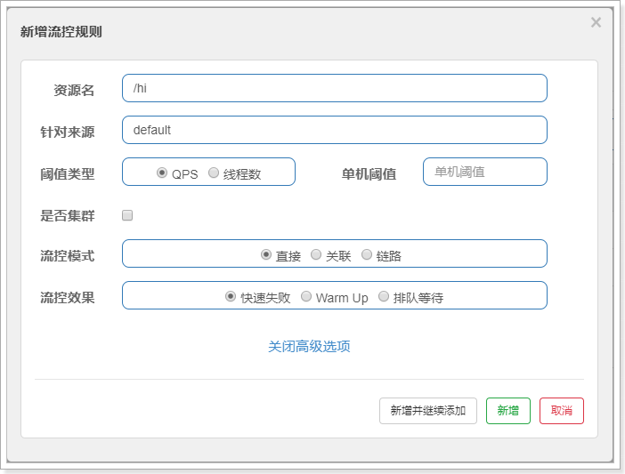


## QPS流量控制


* 当 QPS 超过某个阈值的时候,则采取措施进行流量控制,流量控制的效果包括以下几种:
  * 直接拒绝
  * Warm Up,预热
  * 匀速排队


### 直接拒绝

* 直接拒绝(`RuleConstant.CONTROL_BEHAVIOR_DEFAULT`)方式是默认的流量控制方式,当QPS超过任意规则的阈值后,新的请求就会被立即拒绝,拒绝方式为抛出FlowException
* 这种方式适用于对系统处理能力确切已知的情况下,比如通过压测确定了系统的准确水位时

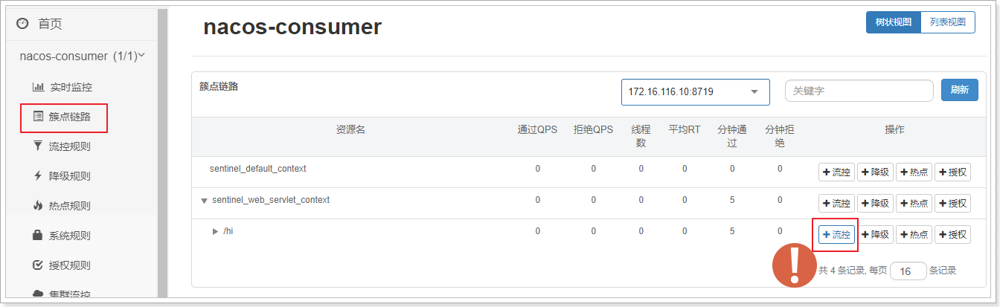

 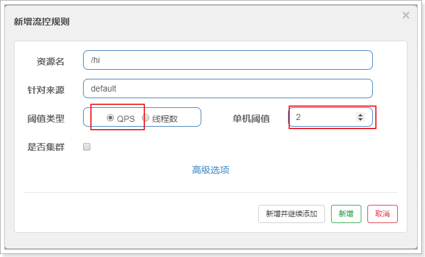

* 这里做一个最简单的配置:阈值类型选择->QPS,单机阈值->2
* 综合起来的配置效果就是,该接口的限流策略是每秒最多允许2个请求进入
* 点击新增按钮之后,可以看到如下界面:

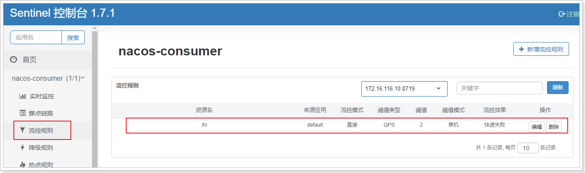

* 在浏览器疯狂刷新http://localhost:18080/hi,出现如下信息:Blocked By Sentinel(flow limit)


### Warm Up


* Warm Up(`RuleConstant.CONTROL_BEHAVIOR_WARM_UP`):预热/冷启动方式
* 当系统长期处于低水位的情况下,流量突然增加时,直接把系统拉升到高水位可能瞬间把系统压垮.通过冷启动,让通过的流量缓慢增加,在一定时间内逐渐增加到阈值上限,给冷系统一个预热的时间,避免冷系统被压垮
* 它从开始阈值到最大QPS阈值会有一个缓冲阶段,一开始的阈值是最大QPS阈值的1/3,然后慢慢增长,直到最大阈值,适用于将突然增大的流量转换为缓步增长的场景

 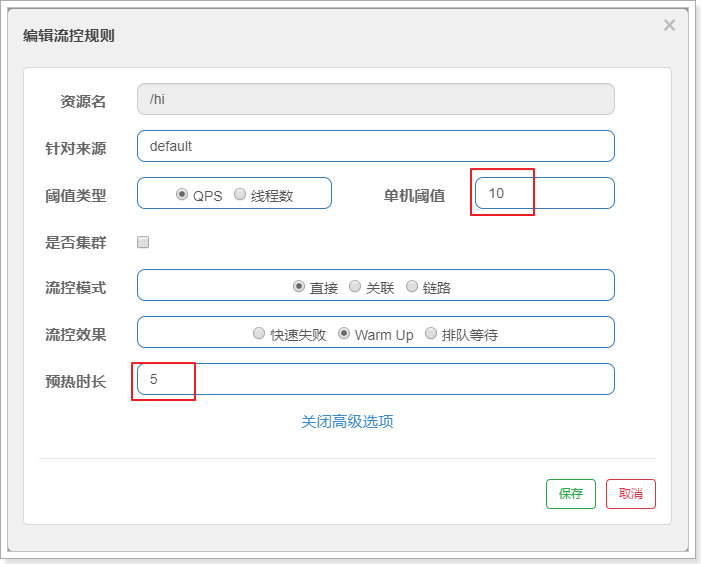

* 疯狂访问:http://localhost:18080/hi,可以发现前几秒会发生熔断,几秒钟之后就完全没有问题了


### 匀速排队


* `RuleConstant.CONTROL_BEHAVIOR_RATE_LIMITER`:会严格控制请求通过的间隔时间,也即是让请求以均匀的速度通过,对应的是漏桶算法
* 还可以设置一个超时时间,当请求超过超时间时间还未处理,则会被丢弃  
* 测试配置如下:1s处理一个请求,排队等待,等待时间20s

 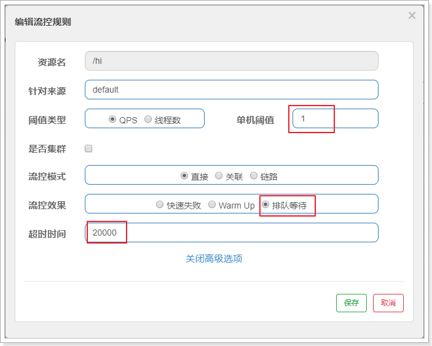

* 在postman中使用run模式,每100ms请求该uri,http://localhost:18080/hi,发20次
* 查看控制台,可以看到基本每隔1s打印一次


## 关联限流

* 关联限流:当关联的资源请求达到阈值时,就限流自己
* 配置如下:/hi2的关联资源/hi,并发数超过2时,/hi2就限流自己

 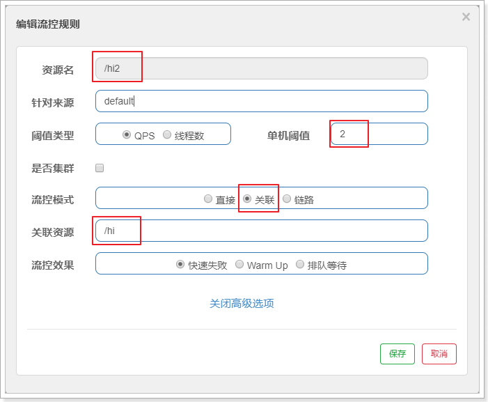

* 给消费者添加一个controller方法:


```java
public class ConsumerCrl{
	@Autowired
    private ProviderClient providerClient;
    
    @GetMapping("hi2")
    public String hi2(){
        return prividerClient.hello() + "hi2";
    }
}
```

* 用postman配置如下:每个400ms发送一次请求,一共发送50个,每秒钟超过了2次
* 在浏览器中访问/hi2已经被限流:Blocked by Sentinel(flow limiting)


## 链路限流

一棵典型的调用树如下图所示:

```
     	          machine-root
                    /       \
                   /         \
             Entrance1     Entrance2
                /             \
               /               \
      DefaultNode(nodeA)   DefaultNode(nodeA)
```

上图中来自入口Entrance1和Entrance2的请求都调用到了资源NodeA,Sentinel允许只根据某个入口的统计信息对资源限流

配置如下:表示只针对Entrance1进来的请求做限流限制

 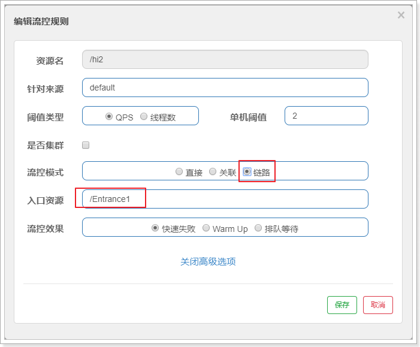


## 线程数限流

* 并发线程数限流用于保护业务线程数不被耗尽
* 例如,当应用所依赖的下游应用由于某种原因导致服务不稳定,响应延迟增加,对于调用者来说,意味着吞吐量下降和更多的线程数占用,极端情况下甚至导致线程池耗尽
* 为应对太多线程占用的情况,业内有使用隔离的方案,比如通过不同业务逻辑使用不同线程池来隔离业务自身之间的资源争抢(线程池隔离)
* 这种隔离方案虽然隔离性比较好,但是代价就是线程数目太多,线程上下文切换的 overhead 比较大,特别是对低延时的调用有比较大的影响
* Sentinel 并发线程数限流不负责创建和管理线程池,而是简单统计当前请求上下文的线程数目,如果超出阈值,新的请求会被立即拒绝,效果类似于信号量隔离
* 配置如下:如果请求的并发数超过一个就限流

 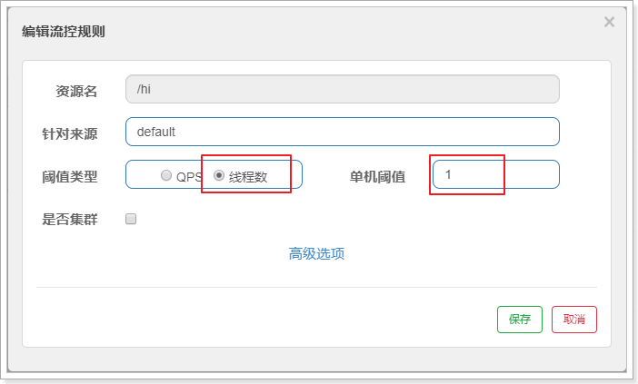


改造controller中的hi方法:


## 流控规则


* 流量控制,其原理是监控应用流量的QPS(每秒查询率) 或并发线程数等指标,当达到指定的阈值时对流量进行控制,以避免被瞬时的流量高峰冲垮,从而保障应用的高可用性
* 点击簇点链路,可以看到访问过的接口地址,然后点击对应的流控按钮,进入流控规则配置页面
  * 资源名:唯一名称,默认是请求路径,可自定义
  * 针对来源:指定对哪个微服务进行限流,默认指default,意思是不区分来源,全部限制
  * 阈值类型/单机阈值:
    * QPS:每秒请求数量,当调用该接口的QPS达到阈值的时候,进行限流
    * 线程数:当调用该接口的线程数达到阈值的时候,进行限流
  * 是否集群:暂不需要集群
* 配置流控模式
  * 点击上面设置流控规则的编辑按钮,然后在编辑页面点击高级选项,会看到有流控模式一栏
  * Sentinel共有三种流控模式:
    * 直接:默认,接口达到限流条件时,开启限流
    * 关联:当关联的资源达到限流条件时,开启限流 [适合做应用让步]
    * 链路:当从某个接口过来的资源达到限流条件时,开启限流
  * 直接流控模式:最简单的模式,当指定的接口达到限流条件时开启限流
  * 关联流控模式:当指定关联的接口达到限流条件时,开启对指定接口开启限流
    * 流控模式选择关联,关联资源填上需要限制的接口地址
  * 链路流控模式:当从某个接口过来的资源达到限流条件时,开启限流.它的功能有点类似于针对来源配置项,区别在于针对来源是针对上级微服务,而链路流控是针对上级接口,也就是说它的粒度更细


# 熔断降级


* Sentinel熔断降级会在调用链路中某个资源出现不稳定状态时(例如调用超时或异常比例升高),对这个资源的调用进行限制,让请求快速失败,避免影响到其它的资源而导致级联错误
* 当资源被降级后,在接下来的降级时间窗口内,对该资源的调用都自动熔断(默认抛出`DegradeException`)
* Sentinel和Hystrix的原则是一致的:当调用链路中某个资源出现不稳定,例如,表现为 timeout,异常比例升高的时候,则对这个资源的调用进行限制,并让请求快速失败,避免影响到其它的资源,最终产生雪崩的效果
* 通过并发线程数进行限制
  * Sentinel 通过限制资源并发线程的数量来减少不稳定资源对其它资源的影响.当某个资源出现不稳定的情况下,例如响应时间变长,对资源的直接影响就是会造成线程数的逐步堆积.当线程数在特定资源上堆积到一定的数量之后,对该资源的新请求就会被拒绝.堆积的线程完成任务后才开始继续接收请求

* 通过响应时间对资源进行降级
  * Sentinel 通过响应时间来快速降级不稳定的资源.当依赖的资源出现响应时间过长后,所有对该资源的访问都会被直接拒绝,直到过了指定的时间窗口之后才重新恢复

* 系统负载保护
  * Sentinel 同时提供系统维度的自适应保护能力.当系统负载较高的时候,如果还持续让请求进入可能会导致系统崩溃,无法响应.在集群环境下,会把本应这台机器承载的流量转发到其它的机器上去.如果这个时候其它的机器也处在一个边缘状态的时候, Sentinel 提供了对应的保护机制,让系统的入口流量和系统的负载达到一个平衡,保证系统在能力范围之内处理最多的请求  

* 限流降级指标有三个:平均响应时间(RT);异常比例;异常数


## 平均响应时间(RT)


* 平均响应时间 (`DEGRADE_GRADE_RT`):当资源的平均响应时间超过阈值(`DegradeRule`中的 `count`,单位为ms,默认上限是4900ms)之后,资源进入准降级状态
* 如果1s之内持续进入 5 个请求,它们的RT都持续超过这个阈值,那么在接下来的时间窗口(`DegradeRule`中的timeWindow,单位为s)之内,对这个方法的调用都会自动地返回(抛出 `DegradeException`)
* 在下一个时间窗口到来时, 会接着再放入5个请求, 再重复上面的判断
* 配置如下:超时时间100ms,熔断时间10s

 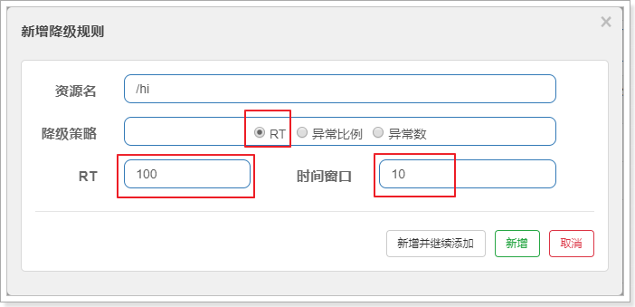


## 异常比例

异常比例(`DEGRADE_GRADE_EXCEPTION_RATIO`):当资源的每秒请求量 >= 5,且每秒异常总数占通过量的比值超过阈值(`DegradeRule`中的`count`)之后,资源进入降级状态,即在接下的时间窗口(`DegradeRule`中的 `timeWindow`,单位为s)之内,对这个方法的调用都会自动地返回.异常比率的阈值范围是 `[0.0, 1.0]`,代表 0% - 100%


## 异常数

异常数(`DEGRADE_GRADE_EXCEPTION_COUNT`):当资源近1分钟的异常数目超过阈值之后会进行熔断


## 降级规则


* 平均响应时间:RT,当资源的平均响应时间超过阈值(以ms为单位)之后,资源进入准降级状态
  * 新增降级规则->降级策略->RT
  * 填写RT和时间窗口的值,RT单位为ms,时间窗口单位为s
  * 如RT为10,时间窗口为10,表示如果平均响应时间大于10ms时,接下来的10s内服务降级,10s后恢复正常,进行下一轮判断
* 异常比例:当资源的每秒异常总数占通过量的比值超过阈值之后,资源进入降级状态,即在接下的时间窗口(以 s为单位)之内,对这个方法的调用都会自动地返回.异常比率的阈值范围是[0,1]
  * 新增降级规则->降级策略->异常比例
  * 填写异常比例和时间窗口的值,异常比例范围从0到1,时间窗口单位为s
* 异常数:当资源近1分钟的异常数目超过阈值之后会进行服务降级.由于统计时间窗口是分钟级别的,若时间窗口小于 60s,则结束熔断状态后仍可能再进入熔断状态
  * 新增降级规则->降级策略->异常数
  * 填写异常数和时间窗口的值,时间窗口单位为s


## 热点规则


* 热点参数流控规则是一种更细粒度的流控规则,它允许将规则具体到参数上

  ```java
  @RequestMapping("/order/message3")
  @SentinelResource("message3")// 这里必须使用这个注解标识,否则热点规则不生效
  public String message3(String name, Integer age) {
      return name + age;
  }
  ```

* 配置热点规则

  * 资源名:同代码中`@SentinelResource`的值
  * 参数索引:限制方法的指定索引位置的参数,从0开始.此处填0表示限制name的访问次数
  * 单机阈值:访问次数限制
  * 统计窗口时长:统计时长

* 增强使用:编辑时参数例外项允许对一个参数的具体值进行流控

  * 编辑热点规则,点击参数例外项
  * 参数类型:填写完成的参数类型,如java.lang.String
  * 参数值:被限制的参数的值


## 授权规则


* 根据调用来源来判断该次请求是否允许放行,可以使用Sentinel的来源访问控制的功能

* 来源访问控制根据资源的请求来源限制资源是否通过:

  * 若配置白名单,则只有请求来源位于白名单内时才可通过
  * 若配置黑名单,则请求来源位于黑名单时不通过,其余的请求通过

* 需要实现`RequestOriginParser`接口来实现授权规则控制

  ```java
  @Component
  public class RequestOriginParserDefinition implements RequestOriginParser{
      @Override
      public String parseOrigin(HttpServletRequest request) {
          // 参数是指定当该参数为某个或某些值时不能访问
          return request.getParameter("serviceName");
      }
  }
  ```

* 配置授权规则

  * 资源名:需要限制的资源名
  * 流控应用:添加serviceName的值为某个特定值时,不能/能访问
  * 授权应用:选择黑名单(不能访问),白名单(可以访问)


## 系统规则


* 系统保护规则是从应用级别的入口流量进行控制,从单台机器的总体 Load,RT,入口QPS,CPU使用率和线程数五个维度监控应用数据,让系统尽可能跑在最大吞吐量的同时保证系统整体的稳定性

* 系统保护规则是应用整体维度的,而不是资源维度的,并且仅对入口流量(进入应用的流量)生效

* Load:仅对 Linux/Unix-like生效.当系统 load1 超过阈值,且系统当前的并发线程数超过系统容量时才会触发系统保护.系统容量由系统的`maxQps * minRt`计算得出,参考值一般是 `CPU cores * 2.5`

* RT:当单台机器上所有入口流量的平均 RT 达到阈值即触发系统保护,单位是毫秒

* 线程数:当单台机器上所有入口流量的并发线程数达到阈值即触发系统保护

* 入口 QPS:当单台机器上所有入口流量的 QPS 达到阈值即触发系统保护

* CPU使用率:当单台机器上所有入口流量的 CPU使用率达到阈值即触发系统保护

* 自定义异常返回

  ```java
  @Component
  public class ExceptionHandlerPage implements UrlBlockHandler {
      // BlockException异常接口包含Sentinel的五个异常
      // FlowException 限流异常
      // DegradeException 降级异常
      // ParamFlowException 参数限流异常
      // AuthorityException 授权异常
      // SystemBlockException 系统负载异常
      @Override
      public void blocked(HttpServletRequest request, HttpServletResponse
                          response, BlockException e) throws IOException {
          response.setContentType("application/json;charset=utf-8");
          ResponseData data = null;
          if (e instanceof FlowException) {
              data = new ResponseData(-1, "接口被限流了...");
          } else if (e instanceof DegradeException) {
              data = new ResponseData(-2, "接口被降级了...");
          } 
          response.getWriter().write(JSON.toJSONString(data));
      }
  } 
  
  @Data
  @AllArgsConstructor
  @NoArgsConstructor
  class ResponseData {
      private int code;
      private String message;
  }
  ```

  


# 规则持久化


## 流控规则持久化


* 默认情况下规则是保存在内存中的,为避免宕机等原因,需要将规则持久化

* 利用nacos进行持久化,引入依赖

  ```xml
  <dependency>
      <groupId>com.alibaba.csp</groupId>
      <artifactId>sentinel-datasource-nacos</artifactId>
  </dependency>
  ```

* 添加配置:

  ```properties
  # 这里datasource后的consumer是数据源名称,可以随便写,推荐使用服务名
  spring.cloud.sentinel.datasource.consumer.nacos.server-addr=localhost:8848
  spring.cloud.sentinel.datasource.consumer.nacos.dataId=${spring.application.name}-sentinel-rules
  spring.cloud.sentinel.datasource.consumer.nacos.groupId=SENTINEL_GROUP
  spring.cloud.sentinel.datasource.consumer.nacos.data-type=json
  # 规则类型,取值见:org.springframework.cloud.alibaba.sentinel.datasource.RuleType
  spring.cloud.sentinel.datasource.consumer.nacos.rule_type=flow
  ```

* nacos中创建流控规则

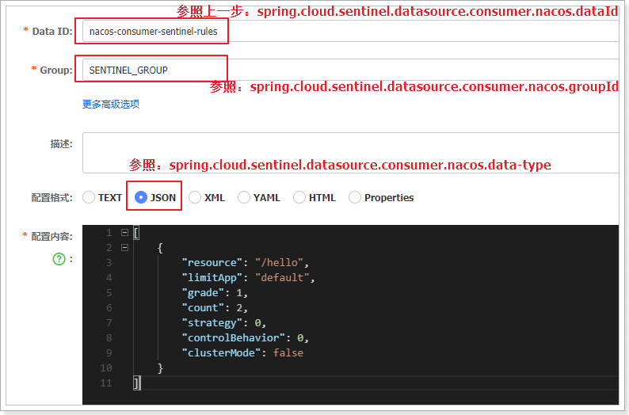

* 配置内容如下:

  ```json
  [
      {
          "resource": "/hello",
          "limitApp": "default",
          "grade": 1,
          "count": 2,
          "strategy": 0,
          "controlBehavior": 0,
          "clusterMode": false
      }
  ]
  ```

  * resource:资源名称,说明对那个URI进行流控

  * limitApp:限流应用,默认default,用默认就可以

  * grade:阈值类型.0表示线程数,1表示QPS

  * count:单机阈值.2表示超过2个QPS就被限流

  * strategy:流控模式.0-直接,1-关联, 2-链路

  * controlBehavior:流控效果.0-快速失败,1-warm up,2-排队等待

  * clusterMode:是否集群

* Sentinel流控设置界面,高级设置

  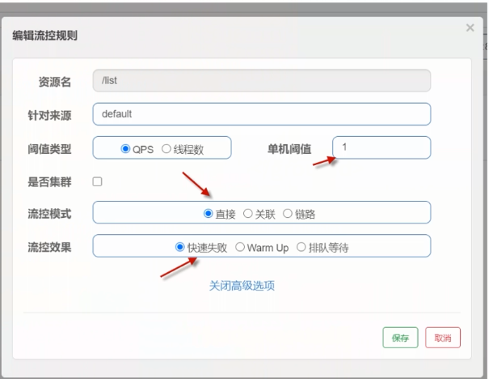

* 如果使用了actuator,可以访问:ip:port/actuator/sentinel查看限流规则


## 熔断持久化


* 需要使用`@SentinelResource`注解对方法进行修饰

* 配置同流控规则,只是配置内容不同

  ```json
  [
      {
          "resource": "/hello",
          "limitApp": "default",
          "grade": 0,
          "count": 100,
          "timeWindow": 5,
          "minRequestAmount": 1,
          "slowRatioThreshold": false
      }
  ]
  ```

  


# 比较Hystrix

* 功能:Sentinel->信号量隔离,并发线程数限流;Hystrix->线程池隔离,信号量隔离
* 熔断降级策略:Sentinel->基于响应时间,异常比例,异常数;Hystrix->基于异常比例
* 实时统计实现:Sentinel->滑动窗口(LeapArray);Hystrix->滑动窗口(基于RxJava)
* 动态规则配置:Sentinel->支持多种数据源;Hystrix->支持多种数据源
* 扩展性:Sentinel->多个扩展点;Hystrix->插件形式
* 基于注解的支持:都支持
* 限流:Sentinel->基于QPS支持基于调用关系的限流;Hystrix->有限的支持
* 流量整形:Sentinel->支持预热模式,匀速器模式,预热排队模式;Hystrix->不支持
* 系统自适应保护:Sentinel->支持;Hystrix->不支持
* 控制台:Sentinel->可配置队则,查看秒级监控,机器发现等;Hystrix->简单的监控查看

