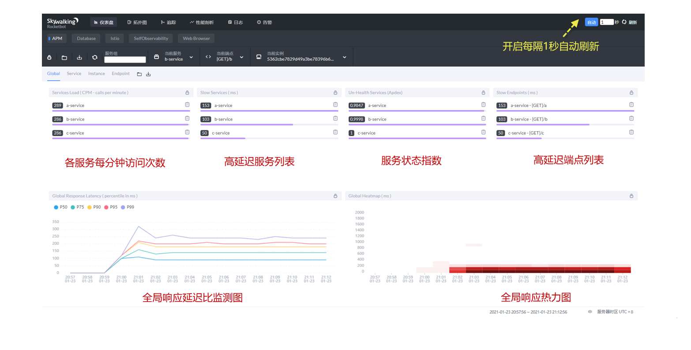
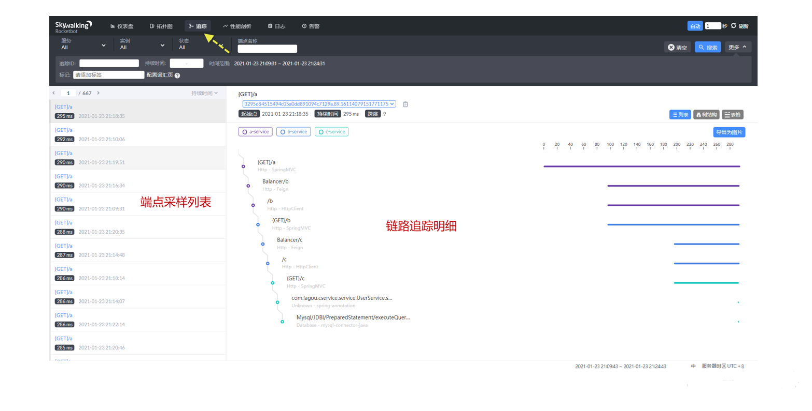
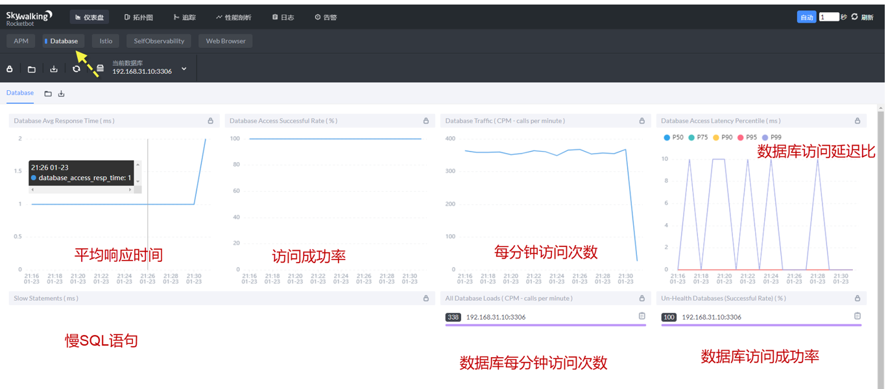

# SkyWalking


# 概述


* SkyWalking采用客户端与服务端架构模式,服务端用于接收来自 Java Agent 客户端发来的链路跟踪与指标数据,汇总统计后由 SkyWalking UI 负责展现
* SkyWalking 服务端同时支持 gRPC 与 HTTP 两种上报方式.gRPC 默认监听服务器 11800 端口,HTTP 默认监听 12800 端口,而 SKyWalking UI 应用则默认监听 8080 端口
* 在存储层面,SkyWalking 底层支持 ElasticSearch,MySQL,H2等多种数据源,官方优先推荐使用ES


# 安装


* 安装启动ElasticSearch,ES默认监听9200,9300端口,9200对外提供服务,9300内部通讯

* [下载](https://skywalking.apache.org/downloads/)解压,根据ES版本下载不同版本

* 在SkyWalking目录config中找到application.yml,指定数据源

  ```yaml
  storage:
    # SkyWalking默认h2数据源,修改为es
    # selector: ${SW_STORAGE:h2}
    selector: ${SW_STORAGE:elasticsearch7}
    elasticsearch: #ES6配置 
      ...
    elasticsearch7: #ES7配置
      nameSpace: ${SW_NAMESPACE:""}
      clusterNodes: ${SW_STORAGE_ES_CLUSTER_NODES:localhost:9200}
      protocol: ${SW_STORAGE_ES_HTTP_PROTOCOL:"http"}
  ```

* 运行`startup.sh`启动程序

* 启动之后会产生2个Java进程:

  * Skywalking-Collector:数据收集服务,默认监听 11800(gRPC)与 12800(HTTP)端口
  * Skywalking-Webapp:SkyWalking UI,用于展示数据,默认监听 8080 端口

* Web访问localhost:8080,如果看到首页,说明配置成功


# Java Agent


* Java Agent 就是 Java 提供的一种外挂技术,允许在开发时在通过启动增加 javaagent 参数来外挂一些额外的程序

* Java Agent扩展类有严格的规范,必须创建名为 premain 的方法,该方法将在目标应用 main 方法前执行

  ```java
  public class SimpleAgent {
      public static void premain(String agentArgs, Instrumentation inst) {
          System.out.println("=========开始执行premain============");
      }
  }
  ```

* 要完成 Java Agent,还需要提供正确的 MANIFEST.MF,以便 JVM 能够选择正确的类.在 META-INF 目录下找到MANIFEST.MF 文件,添加如下

  ```
  Manifest-Version: 1.0
  // premain所在类
  Premain-Class: com.wy.agent.SimpleAgent
  ```

* 将这个类打包,假设应用为 test.jar,在 test.jar 启动时需要在额外附加 javaagent 参数

  ```java
  java -javaagent:agent.jar -jar test.jar
  ```


# 使用


* 假设现在A调用B,B调用C

* 在SkyWalking的agent目录下存在skywalking-agent.jar,启动应用时需要指定该Jar的路径

* 生产环境启动,命令如下:

  ```shell
  # A服务启动命令
  java -javaagent:skywalking-agent.jar -Dskywalking.agent.service_name=a-service -Dskywalking.collector.backend_service=192.168.1.150:11800 -Dskywalking.logging.file_name=a-service-api.log -jar a-service.jar
  
  # B服务启动命令
  java -javaagent:skywalking-agent.jar -Dskywalking.agent.service_name=b-service -Dskywalking.collector.backend_service=192.168.1.150:11800 -Dskywalking.logging.file_name=b-service-api.log -jar b-service.jar
  
  # C服务启动命令
  java -javaagent:skywalking-agent.jar -Dskywalking.agent.service_name=c-service -Dskywalking.collector.backend_service=192.168.1.150:11800 -Dskywalking.logging.file_name=c-service-api.log -jar c-service.jar
  ```

* Eclipse启动需要在VM OPTIONS中添加参数

  ```shell
  -javaagent:skywalking-agent.jar -Dskywalking.agent.service_name=a-service
  ```

* skywalking.agent.service_name:指定在 SkyWalking 上报数据时的服务名

* skywalking.collector.backend_service:指定 SkyWalking 服务端的通信IP与端口

* 
  skywalking.logging.file_name:指定 agent 生成的上报日志文件名,日志文件保存 agent 的 logs 目录中


# 界面




* 访问http://192.168.1.150:8080/,默认显示全局的应用性能,其中比较重要的是服务状态指数与高延迟端点列表两项

* 服务状态指数越接近 1 代表该服务运行状况越好,而高延迟端点列表则将处理延迟高的 API 端点列出,这可能是重点排查与优化的对象

* 除了全局监控外,SkyWalking 链路追踪的展示也非常友好,点击拓扑按钮可以查看访问拓扑图

* 点击链路可以展示服务间的 API 调用关系与执行时间,调用状态清晰列出,而且因为 SkyWalking 是方法层面上的扩展,会提供更加详细的方法间的调用过程

  

* SkyWalking 基于 Java Agent 对数据库的运行指标也进行收集,点击database进入数据库指标监控

  

