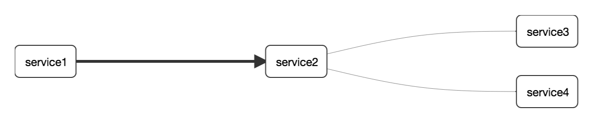
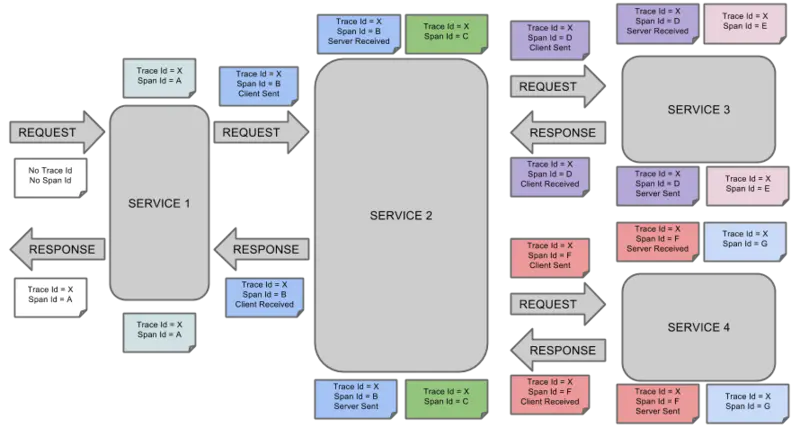
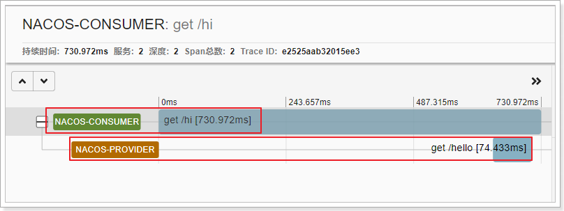
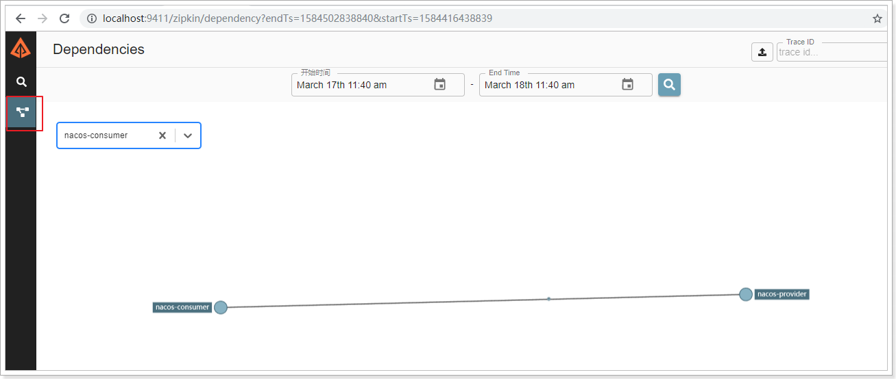

# Sleuth


# 概述

* 分布式系统链路追踪,通常和zipkin一起使用
* 它有助于收集解决微服务架构中的延迟问题所需的时序数据,并管理这些数据的收集和查找
* ZipkinUI提供了一个依赖关系图,显示了每个应用程序通过的跟踪请求数
* 如果要解决延迟问题或错误,可以根据应用程序,跟踪长度,注释或时间戳对所有跟踪进行筛选或排序
* 选择跟踪后,可以看到每个跨度所需的总跟踪时间百分比,从而可以识别有问题的应用程序
* 可以追踪10种类型的组件:async,Hystrix,messaging,websocket,rxjava,scheduling,web,Spring  MVC Controller,Servlet,webclient,Spring RestTemplate,Feign,Zuul


# 核心






上图表示一请求链路,一条链路通过TraceId唯一标识,`Span`标识发起的请求信息,各`Span`通过`parent id` 关联起来


## Span

* 跨度,基本工作单元,发送一个远程请求就会产生一个span
* span通过一个64位ID唯一标识,trace以另一个64位ID表示
* 包含其他数据信息,比如描述,摘要,时间戳事件,关键值注释(tags),span的ID,span父ID,进度ID(通常是IP)
* span在不断的启动和停止,同时记录了时间信息.当创建了一个span,必须在未来的某个时刻停止
* 初始化span被称为rootspan,该 span的id和trace的ID相等


## Trace

* 一系列spans组成的一个树状结构
* trace也用一个64位的 ID唯一标识,trace中的所有 span都共享该 trace的 ID
* 发送一个请求需要调用多个微服务,每调用一个微服务都会产生一个span,这些span组成一个trace


## Annotation

* 用来记录一个事件的存在,一些核心annotations用来定义请求的开始和结束


### CS

- Client Sent,客户端发送.客户端发起一个请求,这个annotion描述了这个span的开始


### SR

- Server Received,服务器端接收,服务端获得请求并准备处理它.sr减去cs时间戳便可得到网络延迟


### SS

- Server Sent,服务器端发送,表明请求处理的完成.ss减去sr时间戳便可得到服务端处理请求的时间


### CR

- Client Received,客户端接收,表明span的结束,客户端成功接收到服务端的回复.cr减去cs时间戳便可得到客户端从服务端获取回复的所有所需时间


# 使用

* 服务提供者和消费者都需要添加spring-cloud-sleuth的依赖

* 打开debug日志

  ```properties
  logging.level.org.springframework.cloud.openfeign=debug
  logging.level.org.springframework.cloud.sleuth=debug
  ```

* 发起调用即可在控制台看到链路信息

  ```
  # 依次是服务名,链路编号(一条链路只有一个),链路基本单元,是否输出到其他服务(如zipkin)
  DEBUD [service-name,tranceid,spanid,false]
  ```

* 使用zipkin之后会自动依赖sleuth


# Zipkin


* Sleuth数据的可视化界面

* [下载](https://search.maven.org/remote_content?g=io.zipkin&a=zipkin-server&v=LATEST&c=exec)zipkin的运行程序,设置端口

* 启动服务java -jar zipkin-server-*exec.jar,默认端口是9411

* 浏览器访问http://localhost:9411

* 项目中添加zipkin的依赖,会自动依赖sleuth

* 项目配置文件中配置zipkin服务地址

  ```properties
  spring.zipkin.base-url=http://localhost:9411
  # 关闭服务发现,否则springcloud会把zipkin的url当服务名称
  spring.zipkin.discoveryClientEnabled=false
  # 设置传输数据的方式
  spring.zipkin.sender.type=web
  # 设置抽样采集率为100%,0.1就是10%
  spring.sleuth.sampler.probability=1
  ```

* zipkin的数据默认是存放在内存中,可以根据业务需求进行持久化:如mysql,es,cassandra等

* 访问http://localhost:18080/hi,查看Zipkin页面






## 概述


* Zipkin分为两端,一个是 Zipkin服务端,一个是 Zipkin客户端,客户端也就是微服务的应用
* 客户端会配置服务端的 URL 地址,一旦发生服务间的调用的时候,会被配置在微服务里面的 Sleuth 的监听器监听,并生成相应的 Trace 和 Span 信息发送给服务端


## 核心


### Collector


* 收集器组件,它主要用于处理从外部系统发送过来的跟踪信息,将这些信息转换为Zipkin内部处理的 Span 格式,以支持后续的存储,分析,展示等功能


### Storage


* 存储组件,它主要对处理收集器接收到的跟踪信息,默认会将这些信息存储在内存中,也可以修改此存储策略,通过使用其他存储组件将跟踪信息存储到数据库中


### RESTful API


* API 组件,主要用来提供外部访问接口.比如给客户端展示跟踪信息,或外接系统访问以实现监控等


### Web UI


* UI 组件,基于API组件实现的上层应用.通过UI组件用户可以方便而有直观地查询和分析跟踪信息  


# Docker

* docker run -d -p 9411:9411 openzipkin/zipkin