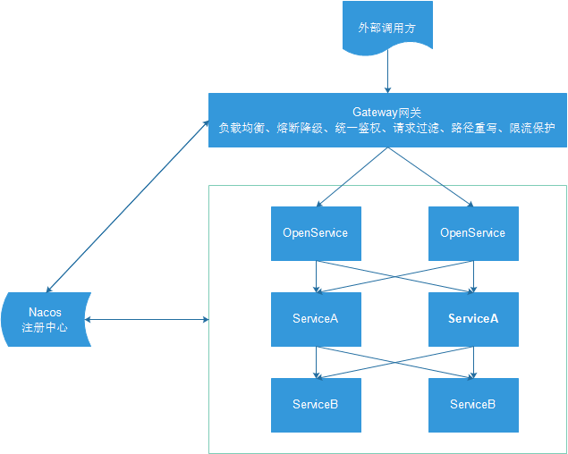
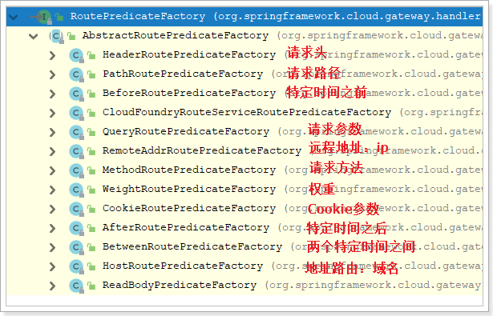
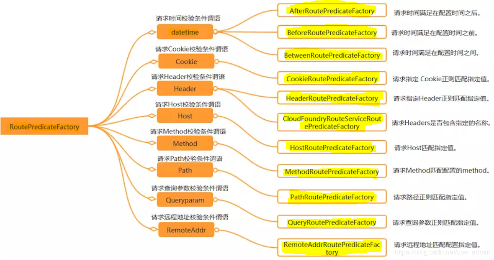
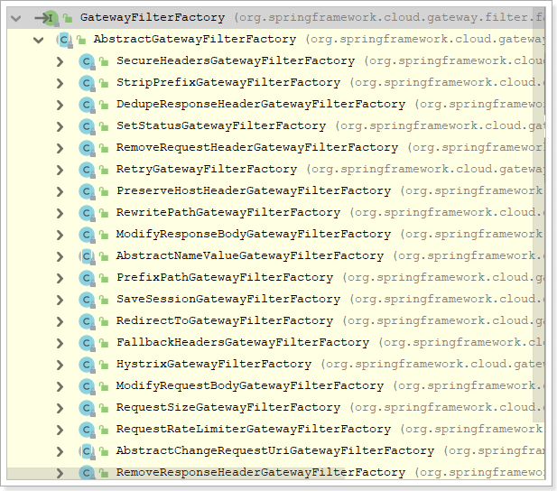
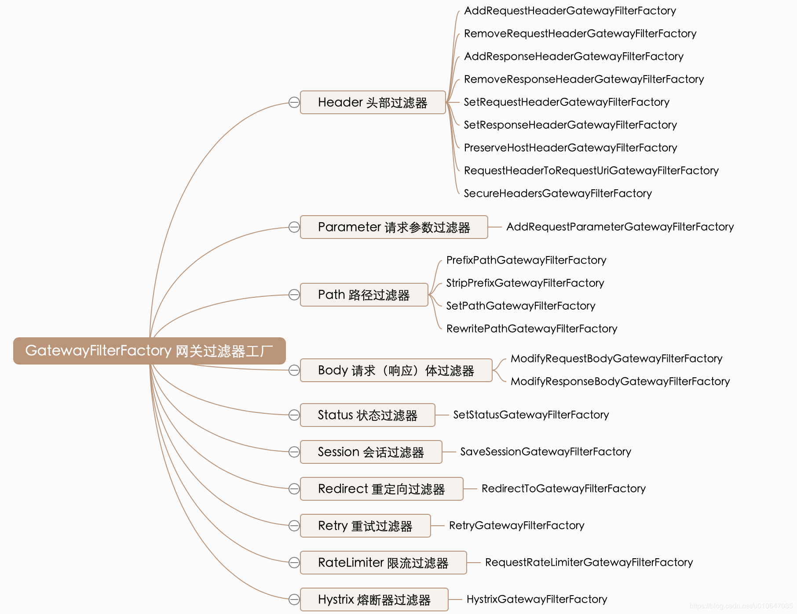

# Gateway


# 概述

* SpringCloudGateway[官方文档](https://cloud.spring.io/spring-cloud-static/spring-cloud-gateway/2.1.0.RELEASE/single/spring-cloud-gateway.html)
* 比较流行的网关有Zuul,Spring-Gateway
* API网关不会破坏服务无状态特点,可以直接复用既有接口
* API网关是介于客户端和服务器端之间的中间层,所有的外部请求都会先经过 API 网关这一层
* API的实现方面更多的考虑业务逻辑,而安全,性能,监控可以交由API网关处理,这样既提高业务灵活性又不缺安全性

 


# 编写路由规则

```yml
# application.yml
spring:
  cloud:
    gateway:
      routes:
        - id: gateway-consumer
          uri: http://127.0.0.1:18080
          predicates:
            - Path=/hi
        - id: gateway-provider
          uri: http://127.0.0.1:18070
          predicates:
            - Path=/hello
```


# 路由规则详解

* 在application.yml中编写路由规则,该参数是spring.cloud.gateway.routes.是一个集合

- Route:路由网关的基本构建块,由以下组成:
  - id:标识符,可被其他路由引用,唯一
  - uri:需要路由的服务地址,可以是ip:port,也可以是服务名,用服务名可以添加lb:前缀负载均衡
  - predicates:断言,如果断言为true,则匹配该路由
  - filter:集合和过滤器
- Predicate:一个函数式断言,允许开发人员匹配来自HTTP请求的任何内容,例如请求头或参数
- Filter:可以在发送下游请求之前或之后修改请求和响应
- 路由根据断言进行匹配,匹配成功就会转发请求给URI,在转发请求之前或者之后可以添加过滤器


# 断言工厂

* SpringCloudGateway包含许多内置的Route,Predicate工厂,所有这些断言都匹配HTTP请求的不同属性
* 多路由断言工厂通过and组合
* 官方提供的路由工厂

 

* 断言工厂的配置方式,参照[官方文档](https://cloud.spring.io/spring-cloud-static/spring-cloud-gateway/2.1.0.RELEASE/single/spring-cloud-gateway.html)的Route Predicate Factories



* 以下路由匹配以/foo或者/bar开头的路径,转发到example.org,例如/foo/1或/foo/bar或/bar/baz

```yml
spring:
  cloud:
    gateway:
      routes:
      - id: host_route
        uri: http://example.org
        predicates:
        - Path=/foo/{segment},/bar/{segment}
```


# 过滤器工厂

* 路由过滤器允许以某种方式修改传入的HTTP请求或HTTP响应,路径过滤器的范围限定为特定路由
* Spring Cloud Gateway包含许多内置的GatewayFilter工厂

 

* 过滤器工厂的配置方式,参照[官方文档](https://cloud.spring.io/spring-cloud-static/spring-cloud-gateway/2.1.0.RELEASE/single/spring-cloud-gateway.html)的GatewayFilter Factories
* 过滤器有20多个实现类,根据过滤器工厂的用途来划分,可以分为以下几种:
  * Header
  * Parameter
  * Path
  * Body
  * Status
  * Session
  * Redirect
  * Retry
  * RateLimiter
  * Hystrix



* 重点掌握PrefixPath GatewayFilter Factory

  ```yaml
  spring:
    cloud:
      gateway:
        routes:
        - id: rewritepath_route
          uri: http://example.org
          predicates:
          - Path=/foo/**
          filters: 
          - RewritePath=/foo/(?<segment>.*),/$\{segment}
  ```

* 上面的配置中,所有的/foo开始的路径都会命中配置的router,并执行过滤器的逻辑

* 在本案例中配置了RewritePath过滤器工厂,此工厂将/foo/(?.*)重写为{segment},然后转发到http://example.org.比如请求ip:port/foo/forezp,此时请求会转发到http://example.org/forezp

* 在开发中由于所有微服务的访问都要经过网关,为了区分不同的微服务,通常会在路径前加上一个标识,例如:访问服务提供方http://localhost:18090/provider/hello,访问服务消费方:http://localhost:18090/consumer/hi,如果不重写地址,直接转发的话,转发后的路径为:http://localhost:18070/provider/hello和http://localhost:18080/consumer/hi明显多了一个provider或者consumer,导致转发失败

```yaml
server:
  port: 18090
spring:
  cloud:
    gateway:
      routes:
        - id: gateway-consumer
          uri: http://127.0.0.1:18080
          predicates:
            - Path=/consumer/**
          filters:
            - RewritePath=/consumer/(?<segment>.*),/$\{segment}
        - id: gateway-provider
          uri: http://127.0.0.1:18070
          predicates:
            - Path=/provider/**
          filters:
            - RewritePath=/provider/(?<segment>.*),/$\{segment}
```


# Java配置路由

* 参见[官方文档](https://cloud.spring.io/spring-cloud-static/spring-cloud-gateway/2.1.0.RELEASE/single/spring-cloud-gateway.html#_fluent_java_routes_api)
* 代码如下:

```java
@Bean
public RouteLocator customRouteLocator(RouteLocatorBuilder builder, ThrottleGatewayFilterFactory throttle) {
    return builder.routes()
        .route(r -> r.host("**.abc.org").and().path("/image/png")
               .filters(f ->
                        f.addResponseHeader("X-TestHeader", "foobar"))
               .uri("http://httpbin.org:80")
              )
        .route(r -> r.path("/image/webp")
               .filters(f ->
                        f.addResponseHeader("X-AnotherHeader", "baz"))
               .uri("http://httpbin.org:80")
              )
        .route(r -> r.order(-1)
               .host("**.throttle.org").and().path("/get")
               .filters(f -> f.filter(throttle.apply(1,
                                                     1,
                                                     10,
                                                     TimeUnit.SECONDS)))
               .uri("http://httpbin.org:80")
              )
        .build();
}
```

