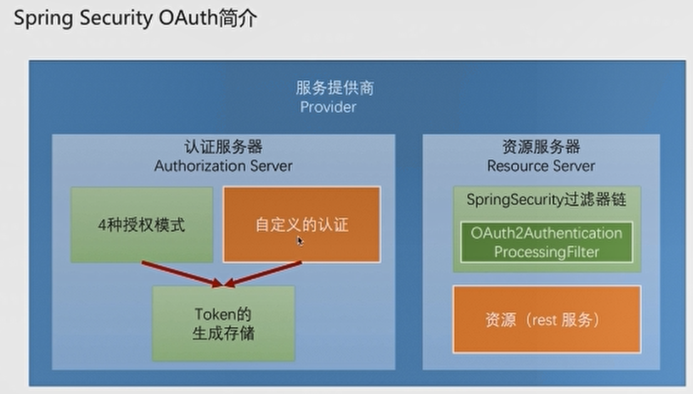
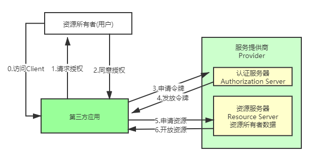
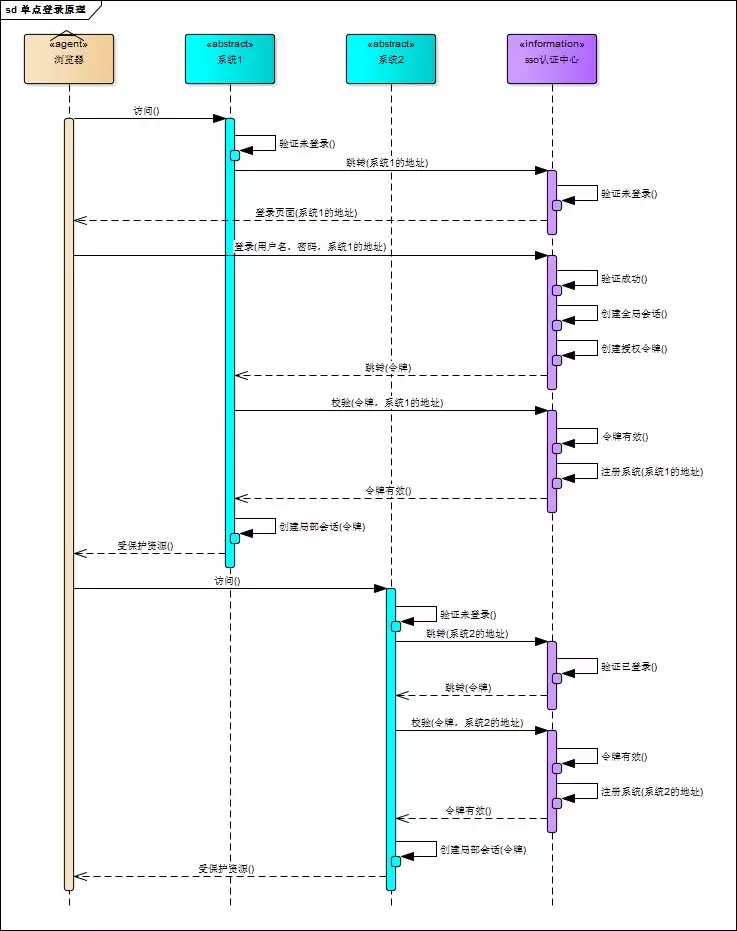
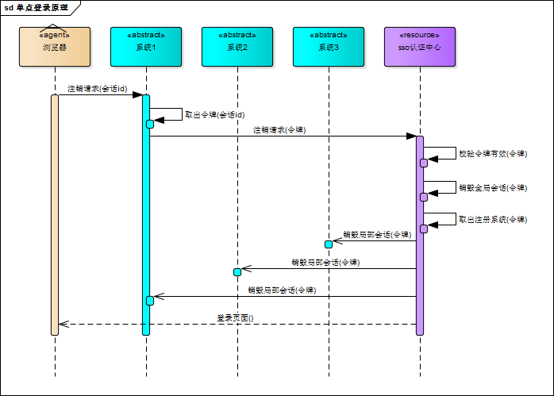
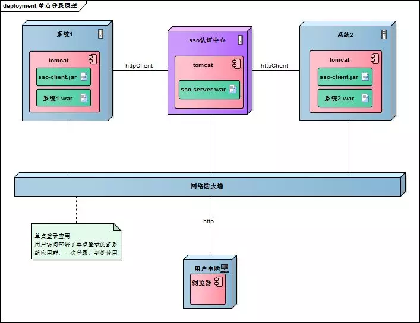

# Security


# Tomcat

* TomcatServletWebServerFactory#configureSession方法会指定session的超时时间,最少不能低于1min


# Social

* 1.OAuth2的授权模式下,需要先从授权服务器获得授权码code,发放code之前需要先把用户引到到授权页面,若没有登录,用户需要先登录,登录之后再授权
* 2.用户同意授权后,程序会再次往授权服务器发送请求获得accesstoken,而OAuth2Template类的createRestTemplate方法只会处理3种请求头,有可能授权服务器给的请求头不符合这情况,此时会报错,跳到默认的错误页SocialAuthenticationFilter#DEFAULT_FAILURE_URL.该情况下需要重写createRestTemplate方法,见QqTemplate


# OAuth2


## 概述

* OAuth2[官网](https://oauth.net/2/)->OAuth2.0 Framework->Table of Contents->4.Obtaining Authorization可查看OAuth2相关信息
* OAuth2启动时会打印相关可访问url日志,需开启日志打印级别为trace,同时需要指定打印日志级别的包
  * logging.level.org.springframework.security.oauth2=trace
* 主要用于第三方应用从服务提供商获取资源所有者(通常是用户)资源,而不需要用户在第三方应用注册


## 角色



* 资源所有者:通常是用户
* 第三方应用:需要使用资源所有者资源的应用
* 服务提供商:拥有资源所有者相关资源的平台
  * 认证服务器:对资源所有者进行认证,由OAuth2相关的4种协议进行验证
  * 资源服务器:当资源所有者认证通过后,第三方应用可从资源服务器获得用户资源


## 认证以及资源服务器

* 直接类上添加@Configuration和@EnableAuthorizationServer,加入spring上下文即可,同时会将OAuth2的4种认证模式都会实现
* 直接类上添加@Configuration和@EnableResourceServer,加入spring上下文即可实现OAuth2资源服务器,认证服务器的注解和资源服务器的资源可以放在一个类上
* 当服务被当做资源服务器时,/oauth/authorize接口将不能再被调用,此时除了/oauth/token请求之外的所有请求都必须在请求头的Authentication中带上token,且Authentication的模式为bearer

* 若access_token没有失效,多次登录的access_token将会是一样的,只是失效时间在减少


## 授权码模式



* 第三方登录固定流程,该方式为原始方式,使用Social更快捷
* 手机和后台服务也使用该方式,每次自动使用refresh_token获取新的access_token
* /oauth/authorize:获得授权码code,接口地址固定,不可配置,get或post请求都可
	* 源码:AuthorizationEndpoint
	* response_type:4种认证模式中的一种,code是授权码认证模式,固定写死,可在OAuth2官网查看
	* client_id:进行授权时由服务器给客户端的标识,若不配置,在控制台会自动生成一个随机uuid
	* redirect_uri:客户端验证通过之后取得授权码code的页面跳转地址,系统内置了http://example.com,也可以自定义,在配置文件中进行配置security.oauth2.client.registered-redirect-uri
	* scope:取得什么权限,可自定义
* 向认证服务器发送请求时,会检查第三方需要使用的用户是否登录,若自定义了登录方式,那么程序会报错.
* 若没有自定义登录方式,则会跳出登录框,用户登录之后接口继续执行,若成功,会在当前页面让用户选择是否同意授权,不管用户是否同意,都会跳转到redirect_uri指向的url,若同意则授权码code将会直接拼在url后面.若不同意,不会带上code
* /oauth/token:获得access_token,地址不可变,post
  * 源码:TokenEndpoint.该接口不用在本地系统中登录,可直接调用,但是需要用到上一步取得的code,code有时效
  * 发送请求时,请求头中需添加验证:Authentication->Basic Auth->oauth2服务器发放的client_id和client_secret
  * 其他参数:
    * grant_type:授权模式下固定为authorization_code
    * code:1中最后跳转网页得到的code
    * client_id:同/oauth/authorize中的参数
    * redirect_uri:同/oauth/authorize中的参数
    * scope:同/oauth/authorize中的参数
  * 成功结果集中参数:access_token,token_type,refresh_token,expires_in,scope


## 用户名密码模式

* 第三方登录固定流程,该方式为原始方式,使用Social更快捷
* 该模式下用户在授权资源服务器的信息都将被第三方所知晓,因为要传递用户名和密码,最好是第三方自己的前端和本公司其他服务之间调用才采用该模式
* /oauth/token:获得access_token,地址不可变,post
  * 和授权码模式不同的是,可以直接跳到第2步,且不用在授权资源服务器登录
  * 发送请求时,请求头中需添加验证:Authentication->Basic Auth->oauth2服务器发放的client_id和client_secret
  * 其他参数:
    * grant_type:用户名密码模式下固定为password
    * username:用户的用户名,非第三方服务的client_id
    * password:用户密码,非第三方服务的client_secret
    * scope:请求需要的权限
  * 成功结果集中参数:access_token,token_type,refresh_token,expires_in,scope


## 客户端模式

* 客户端直接使用在授权服务器注册时的clientid和secret去授权服务器进行验证
* 验证通过后,授权服务器返回token给客户端
* 客户端使用token访问资源


## 简化模式

* 不常用


# JWT


## 概述

* JWT:json web token,基于json,方便解析,可以在令牌中自定义丰富的内容,容易扩展
* 通过非对称加密算法及数字签名技术,JWT可以防篡改,安全性高
* JWT由Header,Payload,Signature组成,每部分中间用点(.)分割


## 组成

### Header

* 包含令牌类型(固定为JWT)及使用的算法(如HMAC SHA256,RSA等)

```json
{
	"alg":"HS256",
	"type":"JWT"
}
```

* 将上面的内容进行Base64编码之后得到令牌的第一部分


### Payload

* 存放有效信息的字段,也是一个json对象.包含已注册信息(registeredclaims),公开数据(publicclaims),私有数据(privateclaims)
* 注册信息中常用的有iss(发行者),exp(到期时间),sub(主题),aud(受众)等,公开和私有数据不能和注册信息重复
* 将数据进行Base64编码之后得到令牌的第二部分


### Signature

* 签名,防篡改
* 将前2个部分用点(.)连接起来,再将字符串用Header中指定的算法加密得到第三部分的字符串
  * HS256(Base64(header).Base64(payload),signature),得到第三部分字符串
* 将3个部分用点(.)连接起来得到最终的字符串
  * Base64(header).Base64(payload).HS256(Base64(header).Base64(payload),signature)


# SSO

* SpringSecurity已经实现了单点登录,以下为通用实现原理


## 单点登录




* 用户访问系统1的受保护资源,系统1发现用户未登录,跳转至sso认证中心,并将自己的地址作为参数
* sso认证中心发现用户未登录,将用户引导至登录页面
* 用户输入用户名密码提交登录申请
* sso认证中心校验用户信息,创建用户与sso认证中心之间的会话,称为全局会话,同时创建授权令牌
* sso认证中心带着令牌跳转会最初的请求地址(系统1)
* 系统1拿到令牌,去sso认证中心校验令牌是否有效
* sso认证中心校验令牌,返回有效,注册系统1
* 系统1使用该令牌创建与用户的会话,称为局部会话,返回受保护资源
* 用户访问系统2的受保护资源
* 系统2发现用户未登录,跳转至sso认证中心,并将自己的地址作为参数
* sso认证中心发现用户已登录,跳转回系统2的地址,并附上令牌
* 系统2拿到令牌,去sso认证中心校验令牌是否有效
* sso认证中心校验令牌,返回有效,注册系统2
* 系统2使用该令牌创建与用户的局部会话,返回受保护资源
* 用户登录成功之后,会与sso认证中心及各个子系统建立会话
  * 用户与sso认证中心建立的会话称为全局会话
  * 用户与各个子系统建立的会话称为局部会话
  * 局部会话建立之后,用户访问子系统受保护资源将不再通过sso认证中心
  * 全局会话与局部会话有如下约束关系
    * 局部会话存在,全局会话一定存在
    * 全局会话存在,局部会话不一定存在
    * 全局会话销毁,局部会话必须销毁


## 单点注销





* 在一个子系统中注销,所有子系统的会话都将被销毁
* 用户向系统1发起注销请求
* 系统1根据用户与系统1建立的会话id拿到令牌,向sso认证中心发起注销请求
* sso认证中心校验令牌有效,销毁全局会话,同时取出所有用此令牌注册的系统地址
* sso认证中心向所有注册系统发起注销请求
* 各注册系统接收sso认证中心的注销请求,销毁局部会话
* sso认证中心引导用户至登录页面


## 部署





* 单点登录涉及sso认证中心与众子系统,子系统与sso认证中心需要通信以交换令牌、校验令牌及发起注销请求,因而子系统必须集成sso的客户端,sso认证中心则是sso服务端,整个单点登录过程实质是sso客户端与服务端通信的过程
* sso认证中心与sso客户端通信方式有多种,可以直接使用httpClient,或者web service、rpc、restful