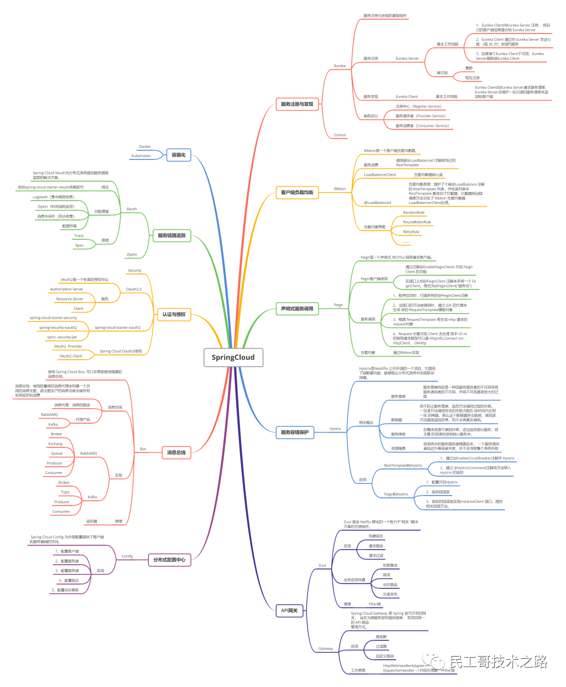
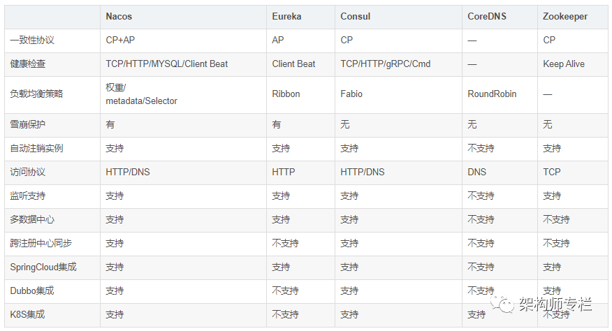
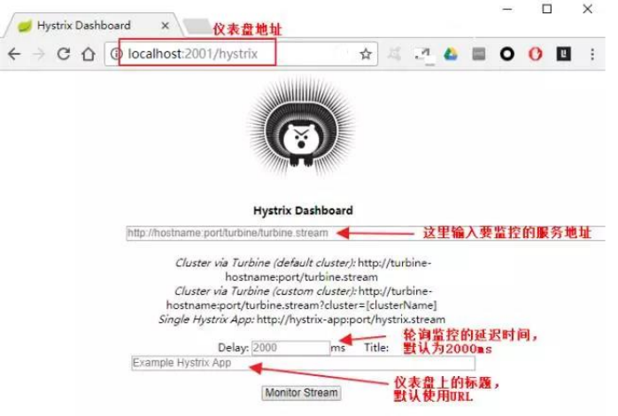
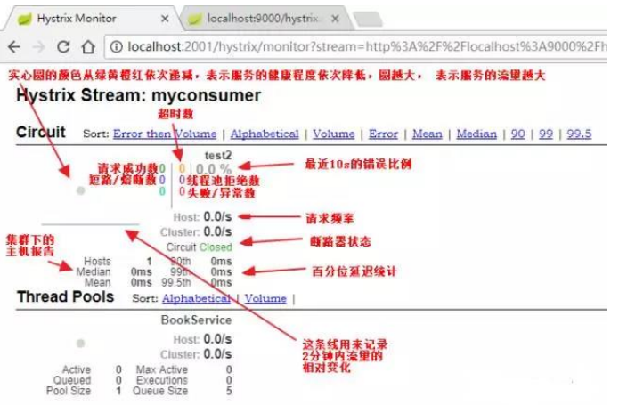
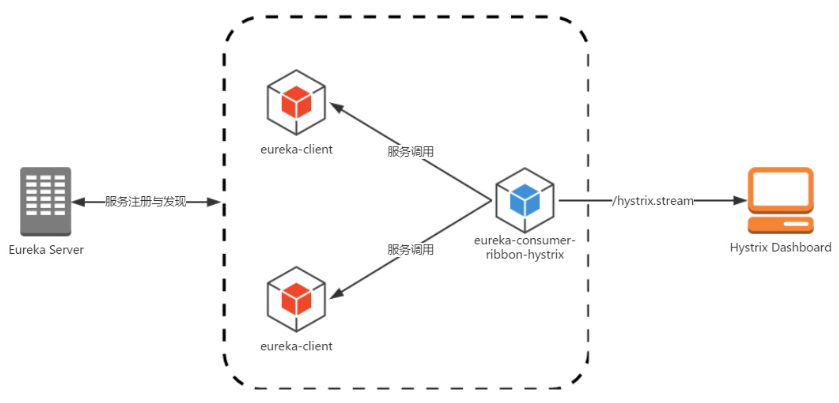
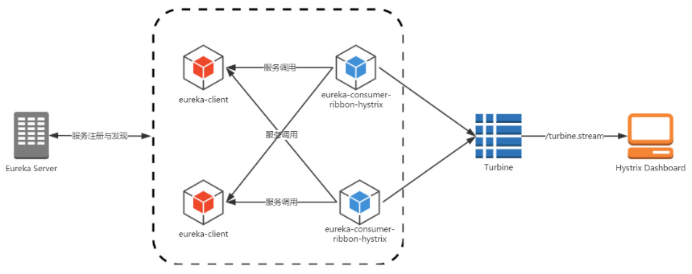

# SpringCloud


# 分布式

1. 测试容易
2. 可伸缩性强,可靠性强
3. 跨语言更灵活
4. 团队容易协作
5. 系统迭代容易
6. 维护成本高,部署量多
7. 接口兼容多版本
8. 分布式系统的复杂性
9. 分布式事务


# 微服务设计原则

1. 尽量不要A服务中的sql连接查询到B服务中的表等情况,这样在A服务与B服务进行垂直拆库时会报错
2. 服务子系统间避免出席那环状的依赖调用
3. 服务子系统间的依赖关系链不要过长
4. 尽量避免分布式事务
5. 单一职责原则
6. 服务自治原则
7. 轻量级通信原则
8. 接口明确原则


# 版本号

* BUILD-XXX,SNAP:开发版本
* GA:稳定版,基本可以使用
* PRE(M1,M2):里程碑版,主要是修复了GA版本的一些bug
* RC:候选发布版,基本定型,处于最终发行前的一个观察期,只对一些高级bug进行修复
* SR:正式发布版


# 各种监控

* server:当开启了server服务端的时候,可在网页上打开ip:port直接查看相关信息
* actuator:需添加spring-boot-starter-actuator包,在浏览器上查看的方式是ip:port/actuator,需要相关配置,各url含义
  * actuator:为其他端点提供"发现页面",要求Spring HATEOAS 在 classpath 路径上
  * actuator/auditevents:陈列当前应用程序的审计事件信息
  * actuator/autoconfig:展示自动配置信息并且显示所有自动配置候选人
  * actuator/beans:显示应用程序中所有 Spring bean 的完整列表
  * actuator/configprops:显示所有配置信息
  * actuator/dump:dump所有线程
  * actuator/env:陈列所有的环境变量
  * actuator/flyway:Shows any Flyway database migrations that have been applied
  * actuator/health:显示应用程序运行状况信息
  * actuator/info:显示应用信息
  * actuator/loggers:显示和修改应用程序中的loggers配置
  * actuator/liquibase:显示已经应用的任何Liquibase数据库迁移
  * actuator/metrics:显示当前应用程序的指标信息
  * actuator/mappings:显示所有@RequestMapping的url整理列表
  * actuator/shutdown:关闭应用,默认情况下不启用
  * actuator/trace:显示跟踪信息,默认最后100个HTTP请求

>2.0版本访问actuator相关url地址时,若需要在控制台看到相关可访问url,需要重新指定日志级别
	logging.level.org.springframework.boot.actuate=trace
	若是同时使用了spring-security,则同时需要开启spring-security的配置,否则访问需要权限
	spring.security.filter.dispatcher-types= include

* spring-boot-admin:actuator的web版本

* hystrix:断路器接口信息,查看方式ip:port/hystrix,填写相关信息
* druid:ip:port/druid,若配置了loginusername和loginpassword,则登录该网站的时候需要用户名和密码
* swagger2:ip/port/swagger-ui.html#/;swagger2生成的在线api文档
* springbootadmin:spring可视化监控报表,非spring官方组件


# 负载均衡

* 服务端负载均衡:如Nginx,客户端请求到达负载均衡器(Nginx),由Nginx发送请求到多个服务器
* 客户端负载均衡:如Ribbon,自身作为客户端和负载均衡器,向其他服务器发送请求
* 轮训:按一定的顺序轮换获取服务器地址发送请求
* 随机:随机获取服务器地址发送请求
* Hash:通过hash算法获取服务器地址发送请求


# Javaagent

直接对底层字节码文件修改,在类加载时动态拦截并重新修改class字节码,插入监听指令


# Javassist

直接对底层字节码文件修改,在类加载时动态拦截并重新修改class字节码,插入监听指令


# Swagger2

在线文档生成,访问地址为ip:port/swagger-ui.html#/

```java
<!-- 因为一些版本bug,需要添加更高版本的jar包 -->
<dependency>
    <groupId>io.springfox</groupId>
    <artifactId>springfox-swagger2</artifactId>
    <version>2.9.2</version>
    <exclusions>
        <exclusion>
            <groupId>io.springfox</groupId>
            <artifactId>springfox-schema</artifactId>
        </exclusion>
        <exclusion>
            <groupId>io.springfox</groupId>
            <artifactId>springfox-spring-web</artifactId>
        </exclusion>
    </exclusions>
</dependency>
<dependency>
    <groupId>io.springfox</groupId>
    <artifactId>springfox-swagger-ui</artifactId>
    <version>2.9.2</version>
</dependency>
<dependency>
    <groupId>io.springfox</groupId>
    <artifactId>springfox-schema</artifactId>
    <version>2.9.2</version>
</dependency>
```


# Jenkins

持续继承,自动化部署,需要先安装git,maven


# 令牌桶算法

* 算法中维护一个队列,该队列的容量固定,可以以一个恒定的速率往队列中放令牌
* 当队列中的令牌满了时,新的令牌被丢弃.没满就继续放
* 当有请求时,先删除一个令牌桶的令牌.如果删除成功,则继续运行.如果删除失败,说明没有令牌,不继续运行


# Springboot


## 样例下载

1. spring需要先在官网上下载依赖以及相关的配置,如果已经有过相同的代码,则不需要再下载[样例下载地址](https://start.spring.io/)
2. 在下载样例的网页上,选择依赖的时候,可以点击下方的switch to the full version来查看spring关联的主流依赖,也可直接搜索
3. 下载解压后直接导入到开发工具中
4. 直接在工具中使用springboot的maven镜像


## 目录结构

1. src/mian/java:主要的代码书写资源文件夹,源码目录
2. src/main/resouces:资源配置文件存放目录
   1. static:默认静态资源存放目录,如html.js等文件.可在配置文件中修改地址
   2. templates:模版配置文件存放目录,freemarker使用
   3. 其他配置文件,如日志文件,mybatis的mapper文件
3. src/test/java:测试目录


## 配置文件加载

1. 默认是加载application.yml,找不到application.yml会报错
2. 若在resources目录下有bootstrap.yml,那么先加载bootstrap.yml
3. 若有多个配置文件,可直接在application-后面加字符即可,如application-dev.yml
4. 在application中配置其他配置文件是否加载,参数为spring.profiles.active,该参数的类型为list,值为application-的后缀,如加载application-dev.yml,只需要写dev即可
5. 配置文件加载顺序:如将项目打成jar包,则先加载项目.jar同层目录的config目录中的配置文件->jar包中的resources目录下的config目录中的配置文件->resources目录中的配置文件


## Jar运行

1. 直接运行

   ```shell
   # 直接以项目中默认的配置运行
   java -jar xxx.jar
   ```

2. 加配置参数

   ```shell
   # 加上配置文件中的参数运行,需要以--开头,值则是配置文件的值
   # 生成环境运行,prod为applicaiton-prod.yml
   java -jar xxx.jar --spring.profiles.active=prod
   # linux后台运行,&表示后台运行,nohup会在当前目录产生一个日志文件
   nohup java -jar xxx.jar --spring.profiles.active=prod &
   ```


# MySQL时区错误

* 在url后加上serverTimezone=GMT或serverTimezone=GMT%2B8(加8个时区)或serverTimezone=Asia/ShangHai
* 修改mysql配置文件my.ini,在mysqld节点加上default-time-zone='+08:00',重启mysql
* 进入mysql的控制台,直接sql语句set global time_zone='+8:00'


# 接口幂等性

* 用于对于同一操作发起的一次请求或多次请求的结果是相同的,不会因为多次点击而产生副作用,例如支付,银行业务等
* token机制:服务端提供发送token的接口
  * 分析哪些业务是存在幂等性的,这些业务就必须在执行之前,先去获取token,服务器会把token保存到缓存中
  * 之后调用业务接口请求时,把token携带过去,一般放在请求头中
  * 服务器判断token是否存在于缓存中,存在则表示第一次请求,然后删除token
  * 如果token不存在,表示是重复操作,直接返回重复标记给客户端
  * 若先删除token,可能会出现业务确实没有执行,重试还是之前的token,业务不能继续
  * 后删除token可能存在服务异常,没有删除缓存中的token,仍然会请求2次业务
  * 若对幂等性要求不高,可以先删除token,客户端业务调用失败,可以给提示,让客户端重新获取token,进行二次提交
  * token的获取,比较,删除必须都是原子性才能完全保证幂等性.若缓存使用的redis,可以使用set方式设置值,删除时用lua脚本,详见redis官网的set方法,非setnx
* 数据库悲观锁:select 1 from tablename where id=1 for update;这种查询方式会进行锁行,同时id字段必须是主键或索引字段,否则可能造成锁表
* 数据库乐观锁:更新某个字段的状态值,更新成功表示执行正确的操作,更新失败表示已经执行
* 业务层分布式锁:处理数据之前需要先判断数据是否被处理过
* 数据库的各种唯一约束:如主键约束,但是必须保证在分布式下全局唯一
* redis set防重:计算数据的MD5放入redis的set集合中,每次处理数据查看MD5是否存在
* 全局请求唯一id:接口被调用时,生成一个唯一id,redis将数据保存到set中,存在即处理过


# SpringCloud


## 组件




## 注册中心




# SpringCloudHystrix


## Hystrix Dashborad






# SpringCloudTurbine


将Hystrix进行集群监控


## Hystrix




## Turbine




# 大数据高并发架构


* CDN镜像
* 负载均衡
* 静态化
* 静态内容(图片)与动态内容服务器分离
* 缓存
* 数据队列
* 数据库集群
* 库表水平垂直拆分
* NoSQL分布式数据引擎及MapReduce
* 虚拟化云计算体系


## CDN


* 本地Cache加速提高了站点(尤其含有大量图片和静态页面站 点)的访问速度,并大大提高以上性质站点的稳定性
* 镜像服务消除了不同运营商之间互联的瓶颈造成的影响,实现了 跨运营商的网络加速,保证不同网络中的用户都能得到良好的访问 质量
* 远程加速远程访问用户根据DNS负载均衡技术智能自动选择Cache服务器,选择最快的Cache服务器,加快远程访问的速度
* 带宽优化自动生成服务器的远程Mirror(镜像)cache服务器,远程用户访问时从cache服务器上读取数据,减少远程访问的带宽、 分担网络流量、减轻原站点WEB服务器负载等功能
* 集群抗攻击广泛分布的CDN节点加上节点之间的智能冗于机制,可以有效地预防黑客入侵及降低各种DDoS攻击对网站的影响,同时保证较好的服务质量


## 负载均衡


## 静态化


## 静态内容服务器分离
